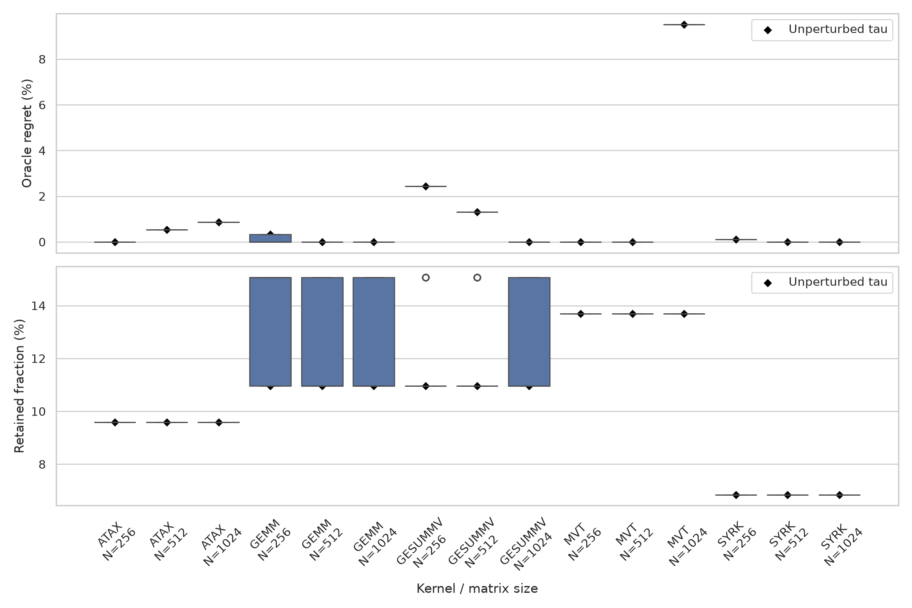
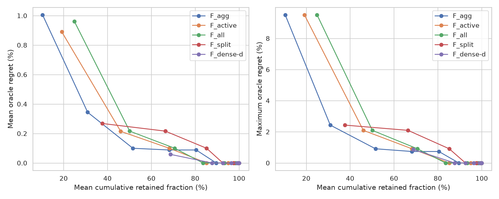

# RELAY layout score/runtime experiment

All scores, runtimes, and ranks are ascending costs; lower is better. The displayed score uses `weighted-normalized-excess`.

Runs and XORs are separate address-code generation costs. They are included in the Pareto frontier but are not folded into the scalar locality score or score rank.

Runtime rank is the raw rank of the exact sample median. Score rank is the raw rank of the exact modeled score. Timing variation does not change either rank or any table value.

The variation-aware rank metric uses each layout's observed minimum-to-maximum sample interval. An overlapping competitor can appear on either side, producing a plausible runtime-rank range. A score rank is counted accurate when it lies inside that range. This is a conservative observed-sample check, not a confidence interval.

Matching runtime samples were seeded from `/g/g16/dnicho/record-replay/relay/results/layout_ranking_five_kernel_n256_measured.json`, `/g/g16/dnicho/record-replay/relay/results/layout_ranking_five_kernel_n512_measured.json`, `/g/g16/dnicho/record-replay/relay/results/layout_ranking_five_kernel_n1024_measured.json`; only newly added layouts were benchmarked in this run.

## Summary

| Kernel | N | Layouts | Pareto layouts | Variation-aware rank accuracy | Mean rank error |
| --- | --- | --- | --- | --- | --- |
| ATAX | 256 | 73 | 7 | 0.274 | 8.870 |
| ATAX | 512 | 73 | 7 | 0.247 | 8.548 |
| ATAX | 1024 | 73 | 7 | 0.164 | 11.349 |
| GEMM | 256 | 73 | 8 | 0.466 | 8.062 |
| GEMM | 512 | 73 | 8 | 0.233 | 11.295 |
| GEMM | 1024 | 73 | 8 | 0.959 | 0.315 |
| GESUMMV | 256 | 73 | 8 | 0.301 | 12.514 |
| GESUMMV | 512 | 73 | 8 | 0.151 | 14.541 |
| GESUMMV | 1024 | 73 | 8 | 0.068 | 14.021 |
| MVT | 256 | 73 | 10 | 0.288 | 10.425 |
| MVT | 512 | 73 | 10 | 0.233 | 11.438 |
| MVT | 1024 | 73 | 10 | 0.247 | 11.247 |
| SYRK | 256 | 73 | 5 | 0.438 | 5.897 |
| SYRK | 512 | 73 | 5 | 0.534 | 3.014 |
| SYRK | 1024 | 73 | 5 | 0.918 | 0.370 |

## Frontier candidate-generation scorecard

The frontier is evaluated as a retained candidate set. Oracle regret is the best frontier median runtime divided by the best evaluated median runtime in the layout family, minus one. Runtime is not used to construct the frontier.

| Metric | Mean | Median | Minimum | Maximum |
| --- | --- | --- | --- | --- |
| Oracle regret | 1.005400% | 0.000000% | 0.000000% | 9.512018% |
| Retained fraction | 10.411% | 10.959% | 6.849% | 13.699% |
| Frontier size | 7.600 | 8.000 | 5 | 10 |

Exact-winner coverage is 8/15 (53.333%). A uniformly random subset with each frontier's size would cover 1.562 instances in expectation; its Poisson-binomial probability of at least the observed number of exact hits is 4.18243e-05.

### Retained fraction versus oracle regret

| Kernel | N | K/L | Retained | Measured optimum | Optimum ms | Best frontier | Frontier ms | Regret |
| --- | --- | --- | --- | --- | --- | --- | --- | --- |
| ATAX | 256 | 7/73 | 9.589% | `tile8x8_canonical_jjiiij` | 0.058907 | `tile8x8_canonical_jjiiij` | 0.058907 | 0.000000% |
| ATAX | 512 | 7/73 | 9.589% | `tile8x8_canonical_iijjji` | 0.117081 | `tile8x8_canonical_jjiiij` | 0.117707 | 0.534673% |
| ATAX | 1024 | 7/73 | 9.589% | `tile8x16_canonical_iijjjji` | 0.235013 | `tile8x8_canonical_jjiiij` | 0.237066 | 0.873569% |
| GEMM | 256 | 8/73 | 10.959% | `tile32_row_major` | 0.065614 | `tile32x8_row_major` | 0.065827 | 0.324626% |
| GEMM | 512 | 8/73 | 10.959% | `tile16x8_row_major` | 0.258575 | `tile16x8_row_major` | 0.258575 | 0.000000% |
| GEMM | 1024 | 8/73 | 10.959% | `tile8x16_canonical_jjjijii` | 1.389796 | `tile8x16_canonical_jjjijii` | 1.389796 | 0.000000% |
| GESUMMV | 256 | 8/73 | 10.959% | `tile8x16_canonical_ijijjji` | 0.031787 | `tile32x8_row_major`, `tile8x8_canonical_iijjji` | 0.032560 | 2.431812% |
| GESUMMV | 512 | 8/73 | 10.959% | `tile8x16_canonical_ijijjji` | 0.061427 | `tile8x8_canonical_iijjji` | 0.062227 | 1.302359% |
| GESUMMV | 1024 | 8/73 | 10.959% | `tile16x8_row_major` | 0.129881 | `tile16x8_row_major` | 0.129881 | 0.000000% |
| MVT | 256 | 10/73 | 13.699% | `tile8x8_canonical_jjiiij` | 0.034533 | `tile8x8_canonical_jjiiij` | 0.034533 | 0.000000% |
| MVT | 512 | 10/73 | 13.699% | `tile8x8_canonical_iijjji` | 0.066414 | `tile8x8_canonical_iijjji` | 0.066414 | 0.000000% |
| MVT | 1024 | 10/73 | 13.699% | `tile8x16_canonical_iijjjji` | 0.132054 | `tile8x8_canonical_iijjji` | 0.144615 | 9.512018% |
| SYRK | 256 | 5/73 | 6.849% | `tile8x8_canonical_jjiiji` | 0.065720 | `tile8x8_canonical_iijjji` | 0.065787 | 0.101948% |
| SYRK | 512 | 5/73 | 6.849% | `tile8x16_column_major` | 0.258561 | `tile8x16_column_major` | 0.258561 | 0.000000% |
| SYRK | 1024 | 5/73 | 6.849% | `tile8x16_canonical_iijjjji` | 1.437492 | `tile8x16_canonical_iijjjji` | 1.437492 | 0.000000% |

### Epsilon-optimal coverage, purity, and enrichment

An epsilon-optimal layout has median runtime no greater than `(1 + epsilon)` times the measured optimum. Purity is the epsilon-optimal fraction of the frontier; enrichment divides that purity by the epsilon-optimal fraction of the full layout set.

| Epsilon | Covered | Coverage | Random coverage | Mean purity | Median purity | Mean enrichment | Median enrichment |
| --- | --- | --- | --- | --- | --- | --- | --- |
| 0.00% | 8/15 | 53.333% | 10.411% | 7.452% | 10.000% | 5.440x | 7.300x |
| 0.25% | 9/15 | 60.000% | 18.237% | 14.119% | 10.000% | 5.308x | 4.562x |
| 0.50% | 10/15 | 66.667% | 28.332% | 23.619% | 12.500% | 4.663x | 2.852x |
| 1.00% | 12/15 | 80.000% | 42.507% | 33.190% | 14.286% | 3.981x | 3.476x |
| 2.00% | 13/15 | 86.667% | 60.252% | 37.310% | 25.000% | 2.423x | 2.028x |
| 5.00% | 14/15 | 93.333% | 84.760% | 62.190% | 71.429% | 2.102x | 2.086x |

### Top-k scalar-score regret

For an exact candidate budget `k`, layouts are ordered by the selected scalar score and then by layout name to break exact ties deterministically. The reported regret uses the fastest measured layout among those `k` candidates.

| k | Median regret | Mean regret | Maximum regret |
| --- | --- | --- | --- |
| 1 | 5.259837% | 6.689706% | 17.609463% |
| 2 | 3.255897% | 5.381569% | 17.609463% |
| 4 | 2.431812% | 4.457520% | 17.609463% |
| 8 | 1.358073% | 3.881996% | 16.683229% |
| 16 | 0.182593% | 3.014952% | 13.742106% |
| 73 | 0.000000% | 0.000000% | 0.000000% |

### Tau-weight robustness

Each trial independently multiplies every nonzero tau by one of `0.5, 0.8, 0.9, 1, 1.1, 1.2, 1.5`, rebuilds the five-cost frontier, and evaluates its regret and retained fraction.

| Kernel | N | Median regret | Mean regret | Max regret | Median retained | Mean retained |
| --- | --- | --- | --- | --- | --- | --- |
| ATAX | 256 | 0.000000% | 0.000000% | 0.000000% | 9.589% | 9.589% |
| ATAX | 512 | 0.534673% | 0.534673% | 0.534673% | 9.589% | 9.589% |
| ATAX | 1024 | 0.873569% | 0.873569% | 0.873569% | 9.589% | 9.589% |
| GEMM | 256 | 0.000000% | 0.159777% | 0.324626% | 15.068% | 13.046% |
| GEMM | 512 | 0.000000% | 0.000000% | 0.000000% | 10.959% | 12.500% |
| GEMM | 1024 | 0.000000% | 0.000000% | 0.000000% | 10.959% | 12.821% |
| GESUMMV | 256 | 2.431812% | 2.431812% | 2.431812% | 10.959% | 11.922% |
| GESUMMV | 512 | 1.302359% | 1.302359% | 1.302359% | 10.959% | 11.890% |
| GESUMMV | 1024 | 0.000000% | 0.000000% | 0.000000% | 10.959% | 12.018% |
| MVT | 256 | 0.000000% | 0.000000% | 0.000000% | 13.699% | 13.699% |
| MVT | 512 | 0.000000% | 0.000000% | 0.000000% | 13.699% | 13.699% |
| MVT | 1024 | 9.512018% | 9.512018% | 9.512018% | 13.699% | 13.699% |
| SYRK | 256 | 0.101948% | 0.101948% | 0.101948% | 6.849% | 6.849% |
| SYRK | 512 | 0.000000% | 0.000000% | 0.000000% | 6.849% | 6.849% |
| SYRK | 1024 | 0.000000% | 0.000000% | 0.000000% | 6.849% | 6.849% |

## Fine-locality-gated frontier scorecard

For each delta, candidates first satisfy `Q_fine <= (1 + delta) Q_fine*`; the eligible set is then Pareto-filtered over `(J_peak, J_area, runs, XORs)`.

| Delta | Exact winners | Median regret | Mean regret | Max regret | Mean retained |
| --- | --- | --- | --- | --- | --- |
| 0% | 6/15 | 0.324626% | 3.667780% | 22.318122% | 5.753% |
| 1% | 6/15 | 0.324626% | 3.667780% | 22.318122% | 5.753% |
| 5% | 6/15 | 0.324626% | 3.667780% | 22.318122% | 5.753% |
| 10% | 6/15 | 0.324626% | 3.667780% | 22.318122% | 5.753% |

## Frontier information ladder

This ladder tests where candidate information is lost. `F_agg` is the five-coordinate frontier; `F_active` retains every nonzero-tau component; `F_all` also retains zero-weight diagnostic components; `F_split` additionally separates arrays, stages, row streams, and transpose streams where edge provenance permits; `F_dense-d` uses every existing target edge family at every feasible quotient dimension. Runtime is not used to construct any frontier.

| Representation | Exact winners | Within 1% | Median regret | Mean regret | Max regret | Mean retained | Median alias spread | Mean alias spread | Max alias spread | Median-order violations / dominance pairs | Confirmed violations / dominance pairs |
| --- | --- | --- | --- | --- | --- | --- | --- | --- | --- | --- | --- |
| `F_agg` | 8/15 | 12/15 | 0.000000% | 1.005400% | 9.512018% | 10.411% | 1.660% | 4.678% | 50.926% | 4388/14669 (29.9%) | 3257/14669 (22.2%) |
| `F_active` | 11/15 | 12/15 | 0.000000% | 0.889876% | 9.512018% | 19.178% | 1.660% | 4.678% | 50.926% | 3328/11001 (30.3%) | 2315/11001 (21.0%) |
| `F_all` | 9/15 | 12/15 | 0.000000% | 0.960436% | 9.512018% | 24.932% | 1.411% | 3.427% | 50.926% | 2135/6924 (30.8%) | 1409/6924 (20.3%) |
| `F_split` | 11/15 | 13/15 | 0.000000% | 0.268064% | 2.431812% | 37.626% | 1.411% | 3.088% | 50.926% | 1153/3103 (37.2%) | 681/3103 (21.9%) |
| `F_dense-d` | 14/15 | 15/15 | 0.000000% | 0.058238% | 0.873569% | 68.767% | 1.370% | 2.823% | 31.817% | 540/2108 (25.6%) | 366/2108 (17.4%) |

A confirmed dominance violation means a score-dominated layout's maximum observed timing sample is below its analytical dominator's minimum sample. Alias spread groups layouts by exact equality of the representation's complete vector.

### Cumulative Pareto depth

Depth one is the ordinary frontier. Each subsequent depth removes the preceding nondominated layer and recomputes the frontier. The candidate set at depth `L` is the union of layers one through `L`.

| Representation | Depth L | Mean retained | Mean regret | Max regret | Within 1% |
| --- | --- | --- | --- | --- | --- |
| `F_agg` | 1 | 10.411% | 1.005400% | 9.512018% | 12/15 |
| `F_agg` | 2 | 30.959% | 0.344248% | 2.431812% | 13/15 |
| `F_agg` | 3 | 51.598% | 0.099786% | 0.911651% | 15/15 |
| `F_agg` | 13 | 100.000% | 0.000000% | 0.000000% | 15/15 |
| `F_active` | 1 | 19.178% | 0.889876% | 9.512018% | 12/15 |
| `F_active` | 2 | 46.027% | 0.214900% | 2.095196% | 13/15 |
| `F_active` | 3 | 68.219% | 0.099786% | 0.911651% | 15/15 |
| `F_active` | 8 | 100.000% | 0.000000% | 0.000000% | 15/15 |
| `F_all` | 1 | 24.932% | 0.960436% | 9.512018% | 12/15 |
| `F_all` | 2 | 50.137% | 0.216219% | 2.095196% | 13/15 |
| `F_all` | 3 | 70.685% | 0.099786% | 0.911651% | 15/15 |
| `F_all` | 8 | 100.000% | 0.000000% | 0.000000% | 15/15 |
| `F_split` | 1 | 37.626% | 0.268064% | 2.431812% | 13/15 |
| `F_split` | 2 | 66.393% | 0.216219% | 2.095196% | 13/15 |
| `F_split` | 3 | 85.205% | 0.099786% | 0.911651% | 15/15 |
| `F_split` | 8 | 100.000% | 0.000000% | 0.000000% | 15/15 |
| `F_dense-d` | 1 | 68.767% | 0.058238% | 0.873569% | 15/15 |
| `F_dense-d` | 2 | 87.671% | 0.000000% | 0.000000% | 15/15 |
| `F_dense-d` | 3 | 92.603% | 0.000000% | 0.000000% | 15/15 |
| `F_dense-d` | 7 | 100.000% | 0.000000% | 0.000000% | 15/15 |

### Missed-winner dominance certificates

For every missed empirical winner, each row lists one layout that dominates it in the selected representation. Component entries are `e_dominator - e_winner`; `*` marks a nonzero-tau component. Negative entries show where the dominator is better.

| Representation | Kernel | N | Measured winner | Analytical dominator | Dominator runtime penalty | All component excess deltas |
| --- | --- | --- | --- | --- | --- | --- |
| `F_agg` | ATAX | 512 | `tile8x8_canonical_iijjji` | `tile8x8_canonical_jjiiij` | 0.534673% | wave_load.64B=+0; stage1_wave_load.64B*=+2; output_store.64B=+0; wave_lane_group.lane8.64B=+0; wave_lane_group.lane16.128B*=+0; wave_lane_group.lane32.256B=+0; wave_lane_group.lane64.512B=+0; stage1_wave_neighborhood.256B*=-4; lane_reuse.128B.window16=+0; wave_neighborhood.512B=+0; workgroup_step_panel.1024B=+0; wave_phase.4096B*=+0 |
| `F_agg` | ATAX | 512 | `tile8x8_canonical_iijjji` | `tile8x16_canonical_jjiiijj` | 4.247487% | wave_load.64B=+0; stage1_wave_load.64B*=+2; output_store.64B=+0; wave_lane_group.lane8.64B=+0; wave_lane_group.lane16.128B*=+0; wave_lane_group.lane32.256B=+0; wave_lane_group.lane64.512B=+0; stage1_wave_neighborhood.256B*=-4; lane_reuse.128B.window16=+0; wave_neighborhood.512B=+0; workgroup_step_panel.1024B=+0; wave_phase.4096B*=+0 |
| `F_agg` | ATAX | 512 | `tile8x8_canonical_iijjji` | `tile8x8_canonical_jiiijj` | 7.640010% | wave_load.64B=+0; stage1_wave_load.64B*=+0; output_store.64B=+0; wave_lane_group.lane8.64B=+0; wave_lane_group.lane16.128B*=+1; wave_lane_group.lane32.256B=+0; wave_lane_group.lane64.512B=+0; stage1_wave_neighborhood.256B*=-4; lane_reuse.128B.window16=+1; wave_neighborhood.512B=+0; workgroup_step_panel.1024B=+0; wave_phase.4096B*=+0 |
| `F_agg` | ATAX | 512 | `tile8x8_canonical_iijjji` | `tile8x16_canonical_jiiijjj` | 8.483870% | wave_load.64B=+0; stage1_wave_load.64B*=+0; output_store.64B=+0; wave_lane_group.lane8.64B=+0; wave_lane_group.lane16.128B*=+1; wave_lane_group.lane32.256B=+0; wave_lane_group.lane64.512B=+0; stage1_wave_neighborhood.256B*=-4; lane_reuse.128B.window16=+1; wave_neighborhood.512B=+0; workgroup_step_panel.1024B=+0; wave_phase.4096B*=+0 |
| `F_agg` | ATAX | 1024 | `tile8x16_canonical_iijjjji` | `tile8x8_canonical_jjiiij` | 0.873569% | wave_load.64B=+0; stage1_wave_load.64B*=+2; output_store.64B=+0; wave_lane_group.lane8.64B=+0; wave_lane_group.lane16.128B*=+0; wave_lane_group.lane32.256B=+0; wave_lane_group.lane64.512B=-2; stage1_wave_neighborhood.256B*=-4; lane_reuse.128B.window16=+0; wave_neighborhood.512B=-2; workgroup_step_panel.1024B=+0; wave_phase.4096B*=+0 |
| `F_agg` | ATAX | 1024 | `tile8x16_canonical_iijjjji` | `tile8x16_canonical_jjiiijj` | 1.271845% | wave_load.64B=+0; stage1_wave_load.64B*=+2; output_store.64B=+0; wave_lane_group.lane8.64B=+0; wave_lane_group.lane16.128B*=+0; wave_lane_group.lane32.256B=+0; wave_lane_group.lane64.512B=-2; stage1_wave_neighborhood.256B*=-4; lane_reuse.128B.window16=+0; wave_neighborhood.512B=-2; workgroup_step_panel.1024B=+0; wave_phase.4096B*=+0 |
| `F_agg` | ATAX | 1024 | `tile8x16_canonical_iijjjji` | `tile8x16_canonical_jiiijjj` | 14.371120% | wave_load.64B=+0; stage1_wave_load.64B*=+0; output_store.64B=+0; wave_lane_group.lane8.64B=+0; wave_lane_group.lane16.128B*=+1; wave_lane_group.lane32.256B=+0; wave_lane_group.lane64.512B=-2; stage1_wave_neighborhood.256B*=-4; lane_reuse.128B.window16=+1; wave_neighborhood.512B=-2; workgroup_step_panel.1024B=+0; wave_phase.4096B*=+0 |
| `F_agg` | ATAX | 1024 | `tile8x16_canonical_iijjjji` | `tile8x8_canonical_jiiijj` | 17.180326% | wave_load.64B=+0; stage1_wave_load.64B*=+0; output_store.64B=+0; wave_lane_group.lane8.64B=+0; wave_lane_group.lane16.128B*=+1; wave_lane_group.lane32.256B=+0; wave_lane_group.lane64.512B=-2; stage1_wave_neighborhood.256B*=-4; lane_reuse.128B.window16=+1; wave_neighborhood.512B=-2; workgroup_step_panel.1024B=+0; wave_phase.4096B*=+0 |
| `F_agg` | GEMM | 256 | `tile32_row_major` | `tile32x8_row_major` | 0.324626% | wave_load.64B*=+0; output_store.64B=+0; B.wave_lane_group.lane8.64B*=+0; B.wave_lane_group.lane16.128B*=+1; B.wave_lane_group.lane32.256B=+3; B.wave_lane_group.lane64.512B=+3; lane_reuse.128B.window16*=-3.5; wave_neighborhood.512B*=+1.5; workgroup_k_panel.256B=-10.5; wave_k_window.4096B=+0.5; wave_inner_phase.32768B=+0 |
| `F_agg` | GEMM | 256 | `tile32_row_major` | `tile16x8_row_major` | 0.365776% | wave_load.64B*=+0; output_store.64B=+0; B.wave_lane_group.lane8.64B*=+0; B.wave_lane_group.lane16.128B*=+1; B.wave_lane_group.lane32.256B=+3; B.wave_lane_group.lane64.512B=+3; lane_reuse.128B.window16*=-3.5; wave_neighborhood.512B*=+1.5; workgroup_k_panel.256B=-10.5; wave_k_window.4096B=+0; wave_inner_phase.32768B=+2.33333 |
| `F_agg` | GEMM | 256 | `tile32_row_major` | `tile8_row_major` | 0.487701% | wave_load.64B*=+0; output_store.64B=+0; B.wave_lane_group.lane8.64B*=+0; B.wave_lane_group.lane16.128B*=+1; B.wave_lane_group.lane32.256B=+3; B.wave_lane_group.lane64.512B=+3; lane_reuse.128B.window16*=-3.5; wave_neighborhood.512B*=+1.5; workgroup_k_panel.256B=-10.5; wave_k_window.4096B=+0.5; wave_inner_phase.32768B=+2.33333 |
| `F_agg` | GESUMMV | 256 | `tile8x16_canonical_ijijjji` | `tile8x8_canonical_ijijji` | 0.585145% | wave_load.64B=+0; output_store.64B=+0; wave_lane_group.lane8.64B=+0; wave_lane_group.lane16.128B=+0; wave_lane_group.lane32.256B=+0; wave_lane_group.lane64.512B*=-8; lane_reuse.128B.window16*=+0; wave_neighborhood.512B*=-8; workgroup_step_panel.1024B=+0; wave_phase.4096B*=+0 |
| `F_agg` | GESUMMV | 256 | `tile8x16_canonical_ijijjji` | `tile8x16_canonical_iijjjji` | 2.095196% | wave_load.64B=+0; output_store.64B=+0; wave_lane_group.lane8.64B=+0; wave_lane_group.lane16.128B=+0; wave_lane_group.lane32.256B=+0; wave_lane_group.lane64.512B*=+0; lane_reuse.128B.window16*=+0; wave_neighborhood.512B*=+0; workgroup_step_panel.1024B=+0; wave_phase.4096B*=+0 |
| `F_agg` | GESUMMV | 256 | `tile8x16_canonical_ijijjji` | `tile8x8_canonical_iijjji` | 2.431812% | wave_load.64B=+0; output_store.64B=+0; wave_lane_group.lane8.64B=+0; wave_lane_group.lane16.128B=+0; wave_lane_group.lane32.256B=+0; wave_lane_group.lane64.512B*=-8; lane_reuse.128B.window16*=+0; wave_neighborhood.512B*=-8; workgroup_step_panel.1024B=+0; wave_phase.4096B*=+0 |
| `F_agg` | GESUMMV | 256 | `tile8x16_canonical_ijijjji` | `tile8x16_canonical_jiijjji` | 3.312675% | wave_load.64B=+0; output_store.64B=+0; wave_lane_group.lane8.64B=+0; wave_lane_group.lane16.128B=+0; wave_lane_group.lane32.256B=+0; wave_lane_group.lane64.512B*=+0; lane_reuse.128B.window16*=+0; wave_neighborhood.512B*=+0; workgroup_step_panel.1024B=+0; wave_phase.4096B*=+0 |
| `F_agg` | GESUMMV | 256 | `tile8x16_canonical_ijijjji` | `tile8x8_canonical_jiijji` | 3.649291% | wave_load.64B=+0; output_store.64B=+0; wave_lane_group.lane8.64B=+0; wave_lane_group.lane16.128B=+0; wave_lane_group.lane32.256B=+0; wave_lane_group.lane64.512B*=-8; lane_reuse.128B.window16*=+0; wave_neighborhood.512B*=-8; workgroup_step_panel.1024B=+0; wave_phase.4096B*=+0 |
| `F_agg` | GESUMMV | 256 | `tile8x16_canonical_ijijjji` | `tile8x16_canonical_iijjjij` | 4.740932% | wave_load.64B=+0; output_store.64B=+0; wave_lane_group.lane8.64B=+0; wave_lane_group.lane16.128B=+0; wave_lane_group.lane32.256B=+0; wave_lane_group.lane64.512B*=-8; lane_reuse.128B.window16*=+0; wave_neighborhood.512B*=-8; workgroup_step_panel.1024B=+0; wave_phase.4096B*=+0 |
| `F_agg` | GESUMMV | 256 | `tile8x16_canonical_ijijjji` | `tile8x8_canonical_iijjij` | 5.241136% | wave_load.64B=+0; output_store.64B=+0; wave_lane_group.lane8.64B=+0; wave_lane_group.lane16.128B=+0; wave_lane_group.lane32.256B=-4; wave_lane_group.lane64.512B*=-8; lane_reuse.128B.window16*=+0; wave_neighborhood.512B*=-8; workgroup_step_panel.1024B=+0; wave_phase.4096B*=+0 |
| `F_agg` | GESUMMV | 256 | `tile8x16_canonical_ijijjji` | `tile8x16_canonical_iijjijj` | 7.298581% | wave_load.64B=+0; output_store.64B=+0; wave_lane_group.lane8.64B=+0; wave_lane_group.lane16.128B=+0; wave_lane_group.lane32.256B=-4; wave_lane_group.lane64.512B*=-8; lane_reuse.128B.window16*=+0; wave_neighborhood.512B*=-8; workgroup_step_panel.1024B=+0; wave_phase.4096B*=+0 |
| `F_agg` | GESUMMV | 256 | `tile8x16_canonical_ijijjji` | `tile8x16_canonical_jiijjij` | 7.757888% | wave_load.64B=+0; output_store.64B=+0; wave_lane_group.lane8.64B=+0; wave_lane_group.lane16.128B=+0; wave_lane_group.lane32.256B=+0; wave_lane_group.lane64.512B*=-8; lane_reuse.128B.window16*=+0; wave_neighborhood.512B*=-8; workgroup_step_panel.1024B=+0; wave_phase.4096B*=+0 |
| `F_agg` | GESUMMV | 256 | `tile8x16_canonical_ijijjji` | `tile8x8_canonical_jiijij` | 8.220342% | wave_load.64B=+0; output_store.64B=+0; wave_lane_group.lane8.64B=+0; wave_lane_group.lane16.128B=+0; wave_lane_group.lane32.256B=-4; wave_lane_group.lane64.512B*=-8; lane_reuse.128B.window16*=+0; wave_neighborhood.512B*=-8; workgroup_step_panel.1024B=+0; wave_phase.4096B*=+0 |
| `F_agg` | GESUMMV | 256 | `tile8x16_canonical_ijijjji` | `tile8_column_major` | 9.437820% | wave_load.64B=-1; output_store.64B=+0; wave_lane_group.lane8.64B=-1; wave_lane_group.lane16.128B=-2; wave_lane_group.lane32.256B=-4; wave_lane_group.lane64.512B*=-8; lane_reuse.128B.window16*=+4; wave_neighborhood.512B*=-8; workgroup_step_panel.1024B=+0; wave_phase.4096B*=+0 |
| `F_agg` | GESUMMV | 256 | `tile8x16_canonical_ijijjji` | `tile8x16_canonical_jiijijj` | 9.771290% | wave_load.64B=+0; output_store.64B=+0; wave_lane_group.lane8.64B=+0; wave_lane_group.lane16.128B=+0; wave_lane_group.lane32.256B=-4; wave_lane_group.lane64.512B*=-8; lane_reuse.128B.window16*=+0; wave_neighborhood.512B*=-8; workgroup_step_panel.1024B=+0; wave_phase.4096B*=+0 |
| `F_agg` | GESUMMV | 256 | `tile8x16_canonical_ijijjji` | `tile8x32_column_major` | 11.032812% | wave_load.64B=-1; output_store.64B=+0; wave_lane_group.lane8.64B=-1; wave_lane_group.lane16.128B=-2; wave_lane_group.lane32.256B=-4; wave_lane_group.lane64.512B*=-8; lane_reuse.128B.window16*=+4; wave_neighborhood.512B*=-8; workgroup_step_panel.1024B=+0; wave_phase.4096B*=+0 |
| `F_agg` | GESUMMV | 256 | `tile8x16_canonical_ijijjji` | `tile8x16_column_major` | 11.199547% | wave_load.64B=-1; output_store.64B=+0; wave_lane_group.lane8.64B=-1; wave_lane_group.lane16.128B=-2; wave_lane_group.lane32.256B=-4; wave_lane_group.lane64.512B*=-8; lane_reuse.128B.window16*=+4; wave_neighborhood.512B*=-8; workgroup_step_panel.1024B=+0; wave_phase.4096B*=+0 |
| `F_agg` | GESUMMV | 256 | `tile8x16_canonical_ijijjji` | `tile8x8_canonical_iijijj` | 11.702897% | wave_load.64B=+0; output_store.64B=+0; wave_lane_group.lane8.64B=+0; wave_lane_group.lane16.128B=-2; wave_lane_group.lane32.256B=-4; wave_lane_group.lane64.512B*=-8; lane_reuse.128B.window16*=+4; wave_neighborhood.512B*=-8; workgroup_step_panel.1024B=+0; wave_phase.4096B*=+0 |
| `F_agg` | GESUMMV | 256 | `tile8x16_canonical_ijijjji` | `tile8x8_canonical_ijiijj` | 12.291188% | wave_load.64B=+0; output_store.64B=+0; wave_lane_group.lane8.64B=+0; wave_lane_group.lane16.128B=-2; wave_lane_group.lane32.256B=-4; wave_lane_group.lane64.512B*=-8; lane_reuse.128B.window16*=+4; wave_neighborhood.512B*=-8; workgroup_step_panel.1024B=+0; wave_phase.4096B*=+0 |
| `F_agg` | GESUMMV | 256 | `tile8x16_canonical_ijijjji` | `tile8x16_canonical_jiiijjj` | 13.212949% | wave_load.64B=+0; output_store.64B=+0; wave_lane_group.lane8.64B=+0; wave_lane_group.lane16.128B=-2; wave_lane_group.lane32.256B=-4; wave_lane_group.lane64.512B*=-8; lane_reuse.128B.window16*=+4; wave_neighborhood.512B*=-8; workgroup_step_panel.1024B=+0; wave_phase.4096B*=+0 |
| `F_agg` | GESUMMV | 256 | `tile8x16_canonical_ijijjji` | `tile8x8_canonical_jiiijj` | 13.590462% | wave_load.64B=+0; output_store.64B=+0; wave_lane_group.lane8.64B=+0; wave_lane_group.lane16.128B=-2; wave_lane_group.lane32.256B=-4; wave_lane_group.lane64.512B*=-8; lane_reuse.128B.window16*=+4; wave_neighborhood.512B*=-8; workgroup_step_panel.1024B=+0; wave_phase.4096B*=+0 |
| `F_agg` | GESUMMV | 256 | `tile8x16_canonical_ijijjji` | `tile8x16_canonical_ijiijjj` | 14.008872% | wave_load.64B=+0; output_store.64B=+0; wave_lane_group.lane8.64B=+0; wave_lane_group.lane16.128B=-2; wave_lane_group.lane32.256B=-4; wave_lane_group.lane64.512B*=-8; lane_reuse.128B.window16*=+4; wave_neighborhood.512B*=-8; workgroup_step_panel.1024B=+0; wave_phase.4096B*=+0 |
| `F_agg` | GESUMMV | 256 | `tile8x16_canonical_ijijjji` | `tile8x16_canonical_iijijjj` | 14.304590% | wave_load.64B=+0; output_store.64B=+0; wave_lane_group.lane8.64B=+0; wave_lane_group.lane16.128B=-2; wave_lane_group.lane32.256B=-4; wave_lane_group.lane64.512B*=-8; lane_reuse.128B.window16*=+4; wave_neighborhood.512B*=-8; workgroup_step_panel.1024B=+0; wave_phase.4096B*=+0 |
| `F_agg` | GESUMMV | 256 | `tile8x16_canonical_ijijjji` | `tile32x16_column_major` | 24.705068% | wave_load.64B=-1; output_store.64B=+0; wave_lane_group.lane8.64B=-1; wave_lane_group.lane16.128B=-3; wave_lane_group.lane32.256B=-7; wave_lane_group.lane64.512B*=-14; lane_reuse.128B.window16*=+12; wave_neighborhood.512B*=-14; workgroup_step_panel.1024B=-12; wave_phase.4096B*=+0 |
| `F_agg` | GESUMMV | 256 | `tile8x16_canonical_ijijjji` | `tile32x8_column_major` | 24.790008% | wave_load.64B=-1; output_store.64B=+0; wave_lane_group.lane8.64B=-1; wave_lane_group.lane16.128B=-3; wave_lane_group.lane32.256B=-7; wave_lane_group.lane64.512B*=-14; lane_reuse.128B.window16*=+12; wave_neighborhood.512B*=-14; workgroup_step_panel.1024B=-12; wave_phase.4096B*=+0 |
| `F_agg` | GESUMMV | 256 | `tile8x16_canonical_ijijjji` | `tile16x32_column_major` | 25.208419% | wave_load.64B=-1; output_store.64B=+0; wave_lane_group.lane8.64B=-1; wave_lane_group.lane16.128B=-3; wave_lane_group.lane32.256B=-6; wave_lane_group.lane64.512B*=-12; lane_reuse.128B.window16*=+12; wave_neighborhood.512B*=-12; workgroup_step_panel.1024B=-8; wave_phase.4096B*=+0 |
| `F_agg` | GESUMMV | 256 | `tile8x16_canonical_ijijjji` | `tile32_column_major` | 25.460094% | wave_load.64B=-1; output_store.64B=+0; wave_lane_group.lane8.64B=-1; wave_lane_group.lane16.128B=-3; wave_lane_group.lane32.256B=-7; wave_lane_group.lane64.512B*=-14; lane_reuse.128B.window16*=+12; wave_neighborhood.512B*=-14; workgroup_step_panel.1024B=-12; wave_phase.4096B*=+0 |
| `F_agg` | GESUMMV | 256 | `tile8x16_canonical_ijijjji` | `tile16_column_major` | 25.963444% | wave_load.64B=-1; output_store.64B=+0; wave_lane_group.lane8.64B=-1; wave_lane_group.lane16.128B=-3; wave_lane_group.lane32.256B=-6; wave_lane_group.lane64.512B*=-12; lane_reuse.128B.window16*=+12; wave_neighborhood.512B*=-12; workgroup_step_panel.1024B=-8; wave_phase.4096B*=+0 |
| `F_agg` | GESUMMV | 256 | `tile8x16_canonical_ijijjji` | `tile16x8_column_major` | 27.221820% | wave_load.64B=-1; output_store.64B=+0; wave_lane_group.lane8.64B=-1; wave_lane_group.lane16.128B=-3; wave_lane_group.lane32.256B=-6; wave_lane_group.lane64.512B*=-12; lane_reuse.128B.window16*=+12; wave_neighborhood.512B*=-12; workgroup_step_panel.1024B=-8; wave_phase.4096B*=+0 |
| `F_agg` | GESUMMV | 512 | `tile8x16_canonical_ijijjji` | `tile8x8_canonical_ijijji` | 0.911651% | wave_load.64B=+0; output_store.64B=+0; wave_lane_group.lane8.64B=+0; wave_lane_group.lane16.128B=+0; wave_lane_group.lane32.256B=+0; wave_lane_group.lane64.512B*=-8; lane_reuse.128B.window16*=+0; wave_neighborhood.512B*=-8; workgroup_step_panel.1024B=+0; wave_phase.4096B*=+0 |
| `F_agg` | GESUMMV | 512 | `tile8x16_canonical_ijijjji` | `tile8x16_canonical_iijjjji` | 1.107005% | wave_load.64B=+0; output_store.64B=+0; wave_lane_group.lane8.64B=+0; wave_lane_group.lane16.128B=+0; wave_lane_group.lane32.256B=+0; wave_lane_group.lane64.512B*=+0; lane_reuse.128B.window16*=+0; wave_neighborhood.512B*=+0; workgroup_step_panel.1024B=+0; wave_phase.4096B*=+0 |
| `F_agg` | GESUMMV | 512 | `tile8x16_canonical_ijijjji` | `tile8x8_canonical_iijjji` | 1.302359% | wave_load.64B=+0; output_store.64B=+0; wave_lane_group.lane8.64B=+0; wave_lane_group.lane16.128B=+0; wave_lane_group.lane32.256B=+0; wave_lane_group.lane64.512B*=-8; lane_reuse.128B.window16*=+0; wave_neighborhood.512B*=-8; workgroup_step_panel.1024B=+0; wave_phase.4096B*=+0 |
| `F_agg` | GESUMMV | 512 | `tile8x16_canonical_ijijjji` | `tile8x16_canonical_jiijjji` | 2.865190% | wave_load.64B=+0; output_store.64B=+0; wave_lane_group.lane8.64B=+0; wave_lane_group.lane16.128B=+0; wave_lane_group.lane32.256B=+0; wave_lane_group.lane64.512B*=+0; lane_reuse.128B.window16*=+0; wave_neighborhood.512B*=+0; workgroup_step_panel.1024B=+0; wave_phase.4096B*=+0 |
| `F_agg` | GESUMMV | 512 | `tile8x16_canonical_ijijjji` | `tile8x8_canonical_iijjij` | 4.035685% | wave_load.64B=+0; output_store.64B=+0; wave_lane_group.lane8.64B=+0; wave_lane_group.lane16.128B=+0; wave_lane_group.lane32.256B=-4; wave_lane_group.lane64.512B*=-8; lane_reuse.128B.window16*=+0; wave_neighborhood.512B*=-8; workgroup_step_panel.1024B=+0; wave_phase.4096B*=+0 |
| `F_agg` | GESUMMV | 512 | `tile8x16_canonical_ijijjji` | `tile8x8_canonical_jiijji` | 4.385694% | wave_load.64B=+0; output_store.64B=+0; wave_lane_group.lane8.64B=+0; wave_lane_group.lane16.128B=+0; wave_lane_group.lane32.256B=+0; wave_lane_group.lane64.512B*=-8; lane_reuse.128B.window16*=+0; wave_neighborhood.512B*=-8; workgroup_step_panel.1024B=+0; wave_phase.4096B*=+0 |
| `F_agg` | GESUMMV | 512 | `tile8x16_canonical_ijijjji` | `tile8x16_canonical_iijjijj` | 5.772706% | wave_load.64B=+0; output_store.64B=+0; wave_lane_group.lane8.64B=+0; wave_lane_group.lane16.128B=+0; wave_lane_group.lane32.256B=-4; wave_lane_group.lane64.512B*=-8; lane_reuse.128B.window16*=+0; wave_neighborhood.512B*=-8; workgroup_step_panel.1024B=+0; wave_phase.4096B*=+0 |
| `F_agg` | GESUMMV | 512 | `tile8x16_canonical_ijijjji` | `tile8x16_canonical_iijjjij` | 6.077132% | wave_load.64B=+0; output_store.64B=+0; wave_lane_group.lane8.64B=+0; wave_lane_group.lane16.128B=+0; wave_lane_group.lane32.256B=+0; wave_lane_group.lane64.512B*=-8; lane_reuse.128B.window16*=+0; wave_neighborhood.512B*=-8; workgroup_step_panel.1024B=+0; wave_phase.4096B*=+0 |
| `F_agg` | GESUMMV | 512 | `tile8x16_canonical_ijijjji` | `tile8x8_canonical_jiijij` | 7.358328% | wave_load.64B=+0; output_store.64B=+0; wave_lane_group.lane8.64B=+0; wave_lane_group.lane16.128B=+0; wave_lane_group.lane32.256B=-4; wave_lane_group.lane64.512B*=-8; lane_reuse.128B.window16*=+0; wave_neighborhood.512B*=-8; workgroup_step_panel.1024B=+0; wave_phase.4096B*=+0 |
| `F_agg` | GESUMMV | 512 | `tile8x16_canonical_ijijjji` | `tile8x16_canonical_jiijjij` | 8.703013% | wave_load.64B=+0; output_store.64B=+0; wave_lane_group.lane8.64B=+0; wave_lane_group.lane16.128B=+0; wave_lane_group.lane32.256B=+0; wave_lane_group.lane64.512B*=-8; lane_reuse.128B.window16*=+0; wave_neighborhood.512B*=-8; workgroup_step_panel.1024B=+0; wave_phase.4096B*=+0 |
| `F_agg` | GESUMMV | 512 | `tile8x16_canonical_ijijjji` | `tile8x16_canonical_jiijijj` | 10.549107% | wave_load.64B=+0; output_store.64B=+0; wave_lane_group.lane8.64B=+0; wave_lane_group.lane16.128B=+0; wave_lane_group.lane32.256B=-4; wave_lane_group.lane64.512B*=-8; lane_reuse.128B.window16*=+0; wave_neighborhood.512B*=-8; workgroup_step_panel.1024B=+0; wave_phase.4096B*=+0 |
| `F_agg` | GESUMMV | 512 | `tile8x16_canonical_ijijjji` | `tile8x32_column_major` | 11.221450% | wave_load.64B=-1; output_store.64B=+0; wave_lane_group.lane8.64B=-1; wave_lane_group.lane16.128B=-2; wave_lane_group.lane32.256B=-4; wave_lane_group.lane64.512B*=-8; lane_reuse.128B.window16*=+4; wave_neighborhood.512B*=-8; workgroup_step_panel.1024B=+0; wave_phase.4096B*=+0 |
| `F_agg` | GESUMMV | 512 | `tile8x16_canonical_ijijjji` | `tile8x16_column_major` | 11.569831% | wave_load.64B=-1; output_store.64B=+0; wave_lane_group.lane8.64B=-1; wave_lane_group.lane16.128B=-2; wave_lane_group.lane32.256B=-4; wave_lane_group.lane64.512B*=-8; lane_reuse.128B.window16*=+4; wave_neighborhood.512B*=-8; workgroup_step_panel.1024B=+0; wave_phase.4096B*=+0 |
| `F_agg` | GESUMMV | 512 | `tile8x16_canonical_ijijjji` | `tile8_column_major` | 12.089146% | wave_load.64B=-1; output_store.64B=+0; wave_lane_group.lane8.64B=-1; wave_lane_group.lane16.128B=-2; wave_lane_group.lane32.256B=-4; wave_lane_group.lane64.512B*=-8; lane_reuse.128B.window16*=+4; wave_neighborhood.512B*=-8; workgroup_step_panel.1024B=+0; wave_phase.4096B*=+0 |
| `F_agg` | GESUMMV | 512 | `tile8x16_canonical_ijijjji` | `tile8x16_canonical_jiiijjj` | 12.849398% | wave_load.64B=+0; output_store.64B=+0; wave_lane_group.lane8.64B=+0; wave_lane_group.lane16.128B=-2; wave_lane_group.lane32.256B=-4; wave_lane_group.lane64.512B*=-8; lane_reuse.128B.window16*=+4; wave_neighborhood.512B*=-8; workgroup_step_panel.1024B=+0; wave_phase.4096B*=+0 |
| `F_agg` | GESUMMV | 512 | `tile8x16_canonical_ijijjji` | `tile8x8_canonical_jiiijj` | 12.893353% | wave_load.64B=+0; output_store.64B=+0; wave_lane_group.lane8.64B=+0; wave_lane_group.lane16.128B=-2; wave_lane_group.lane32.256B=-4; wave_lane_group.lane64.512B*=-8; lane_reuse.128B.window16*=+4; wave_neighborhood.512B*=-8; workgroup_step_panel.1024B=+0; wave_phase.4096B*=+0 |
| `F_agg` | GESUMMV | 512 | `tile8x16_canonical_ijijjji` | `tile8x16_canonical_iijijjj` | 14.000358% | wave_load.64B=+0; output_store.64B=+0; wave_lane_group.lane8.64B=+0; wave_lane_group.lane16.128B=-2; wave_lane_group.lane32.256B=-4; wave_lane_group.lane64.512B*=-8; lane_reuse.128B.window16*=+4; wave_neighborhood.512B*=-8; workgroup_step_panel.1024B=+0; wave_phase.4096B*=+0 |
| `F_agg` | GESUMMV | 512 | `tile8x16_canonical_ijijjji` | `tile8x8_canonical_iijijj` | 15.237599% | wave_load.64B=+0; output_store.64B=+0; wave_lane_group.lane8.64B=+0; wave_lane_group.lane16.128B=-2; wave_lane_group.lane32.256B=-4; wave_lane_group.lane64.512B*=-8; lane_reuse.128B.window16*=+4; wave_neighborhood.512B*=-8; workgroup_step_panel.1024B=+0; wave_phase.4096B*=+0 |
| `F_agg` | GESUMMV | 512 | `tile8x16_canonical_ijijjji` | `tile8x8_canonical_ijiijj` | 15.628307% | wave_load.64B=+0; output_store.64B=+0; wave_lane_group.lane8.64B=+0; wave_lane_group.lane16.128B=-2; wave_lane_group.lane32.256B=-4; wave_lane_group.lane64.512B*=-8; lane_reuse.128B.window16*=+4; wave_neighborhood.512B*=-8; workgroup_step_panel.1024B=+0; wave_phase.4096B*=+0 |
| `F_agg` | GESUMMV | 512 | `tile8x16_canonical_ijijjji` | `tile8x16_canonical_ijiijjj` | 16.649031% | wave_load.64B=+0; output_store.64B=+0; wave_lane_group.lane8.64B=+0; wave_lane_group.lane16.128B=-2; wave_lane_group.lane32.256B=-4; wave_lane_group.lane64.512B*=-8; lane_reuse.128B.window16*=+4; wave_neighborhood.512B*=-8; workgroup_step_panel.1024B=+0; wave_phase.4096B*=+0 |
| `F_agg` | GESUMMV | 512 | `tile8x16_canonical_ijijjji` | `tile32x16_column_major` | 27.196510% | wave_load.64B=-1; output_store.64B=+0; wave_lane_group.lane8.64B=-1; wave_lane_group.lane16.128B=-3; wave_lane_group.lane32.256B=-7; wave_lane_group.lane64.512B*=-14; lane_reuse.128B.window16*=+12; wave_neighborhood.512B*=-14; workgroup_step_panel.1024B=-12; wave_phase.4096B*=+0 |
| `F_agg` | GESUMMV | 512 | `tile8x16_canonical_ijijjji` | `tile32x8_column_major` | 27.198138% | wave_load.64B=-1; output_store.64B=+0; wave_lane_group.lane8.64B=-1; wave_lane_group.lane16.128B=-3; wave_lane_group.lane32.256B=-7; wave_lane_group.lane64.512B*=-14; lane_reuse.128B.window16*=+12; wave_neighborhood.512B*=-14; workgroup_step_panel.1024B=-12; wave_phase.4096B*=+0 |
| `F_agg` | GESUMMV | 512 | `tile8x16_canonical_ijijjji` | `tile16_column_major` | 27.393491% | wave_load.64B=-1; output_store.64B=+0; wave_lane_group.lane8.64B=-1; wave_lane_group.lane16.128B=-3; wave_lane_group.lane32.256B=-6; wave_lane_group.lane64.512B*=-12; lane_reuse.128B.window16*=+12; wave_neighborhood.512B*=-12; workgroup_step_panel.1024B=-8; wave_phase.4096B*=+0 |
| `F_agg` | GESUMMV | 512 | `tile8x16_canonical_ijijjji` | `tile16x8_column_major` | 28.456542% | wave_load.64B=-1; output_store.64B=+0; wave_lane_group.lane8.64B=-1; wave_lane_group.lane16.128B=-3; wave_lane_group.lane32.256B=-6; wave_lane_group.lane64.512B*=-12; lane_reuse.128B.window16*=+12; wave_neighborhood.512B*=-12; workgroup_step_panel.1024B=-8; wave_phase.4096B*=+0 |
| `F_agg` | GESUMMV | 512 | `tile8x16_canonical_ijijjji` | `tile16x32_column_major` | 32.059192% | wave_load.64B=-1; output_store.64B=+0; wave_lane_group.lane8.64B=-1; wave_lane_group.lane16.128B=-3; wave_lane_group.lane32.256B=-6; wave_lane_group.lane64.512B*=-12; lane_reuse.128B.window16*=+12; wave_neighborhood.512B*=-12; workgroup_step_panel.1024B=-8; wave_phase.4096B*=+0 |
| `F_agg` | GESUMMV | 512 | `tile8x16_canonical_ijijjji` | `tile32_column_major` | 32.928517% | wave_load.64B=-1; output_store.64B=+0; wave_lane_group.lane8.64B=-1; wave_lane_group.lane16.128B=-3; wave_lane_group.lane32.256B=-7; wave_lane_group.lane64.512B*=-14; lane_reuse.128B.window16*=+12; wave_neighborhood.512B*=-14; workgroup_step_panel.1024B=-12; wave_phase.4096B*=+0 |
| `F_agg` | MVT | 1024 | `tile8x16_canonical_iijjjji` | `tile8x8_canonical_iijjji` | 9.512018% | wave_load.64B=+0; output_store.64B=+0; A.wave_lane_group.lane8.64B=+0; A.wave_lane_group.lane16.128B=+0; A.wave_lane_group.lane32.256B=+0; A.wave_lane_group.lane64.512B*=-2; row_lane_stream.128B.window16=+0; transpose_lane_stream.128B.window16=+0; wave_neighborhood.512B*=-2; transpose_wave_neighborhood.1024B*=+0; transpose_wave_neighborhood.4096B*=+0; transpose_wave_neighborhood.8192B*=+0; workgroup_step_cross.2048B=+0; wave_pattern_window.4096B=+0; wave_pattern_phase.32768B=+0 |
| `F_agg` | MVT | 1024 | `tile8x16_canonical_iijjjji` | `tile8x8_canonical_jjiiij` | 12.338892% | wave_load.64B=+0; output_store.64B=+0; A.wave_lane_group.lane8.64B=+0; A.wave_lane_group.lane16.128B=+0; A.wave_lane_group.lane32.256B=+0; A.wave_lane_group.lane64.512B*=-2; row_lane_stream.128B.window16=+0; transpose_lane_stream.128B.window16=+0; wave_neighborhood.512B*=-2; transpose_wave_neighborhood.1024B*=+0; transpose_wave_neighborhood.4096B*=+0; transpose_wave_neighborhood.8192B*=+0; workgroup_step_cross.2048B=+0; wave_pattern_window.4096B=+0; wave_pattern_phase.32768B=+0 |
| `F_agg` | MVT | 1024 | `tile8x16_canonical_iijjjji` | `tile8x8_canonical_jiiijj` | 15.256637% | wave_load.64B=+0; output_store.64B=+0; A.wave_lane_group.lane8.64B=+0; A.wave_lane_group.lane16.128B=+1; A.wave_lane_group.lane32.256B=+0; A.wave_lane_group.lane64.512B*=-2; row_lane_stream.128B.window16=+4; transpose_lane_stream.128B.window16=-2; wave_neighborhood.512B*=-2; transpose_wave_neighborhood.1024B*=+0; transpose_wave_neighborhood.4096B*=+0; transpose_wave_neighborhood.8192B*=+0; workgroup_step_cross.2048B=+0; wave_pattern_window.4096B=+0; wave_pattern_phase.32768B=+0 |
| `F_agg` | MVT | 1024 | `tile8x16_canonical_iijjjji` | `tile8x8_canonical_ijjjii` | 21.395035% | wave_load.64B=+0; output_store.64B=+0; A.wave_lane_group.lane8.64B=+0; A.wave_lane_group.lane16.128B=+1; A.wave_lane_group.lane32.256B=+0; A.wave_lane_group.lane64.512B*=-2; row_lane_stream.128B.window16=-2; transpose_lane_stream.128B.window16=+4; wave_neighborhood.512B*=-2; transpose_wave_neighborhood.1024B*=+0; transpose_wave_neighborhood.4096B*=+0; transpose_wave_neighborhood.8192B*=+0; workgroup_step_cross.2048B=+0; wave_pattern_window.4096B=+0; wave_pattern_phase.32768B=+0 |
| `F_agg` | MVT | 1024 | `tile8x16_canonical_iijjjji` | `tile8x16_canonical_jjiiijj` | 22.203038% | wave_load.64B=+0; output_store.64B=+0; A.wave_lane_group.lane8.64B=+0; A.wave_lane_group.lane16.128B=+0; A.wave_lane_group.lane32.256B=+0; A.wave_lane_group.lane64.512B*=-2; row_lane_stream.128B.window16=+0; transpose_lane_stream.128B.window16=+0; wave_neighborhood.512B*=-2; transpose_wave_neighborhood.1024B*=+0; transpose_wave_neighborhood.4096B*=+0; transpose_wave_neighborhood.8192B*=+0; workgroup_step_cross.2048B=+0; wave_pattern_window.4096B=+0; wave_pattern_phase.32768B=+0 |
| `F_agg` | MVT | 1024 | `tile8x16_canonical_iijjjji` | `tile8x16_canonical_jiiijjj` | 42.770382% | wave_load.64B=+0; output_store.64B=+0; A.wave_lane_group.lane8.64B=+0; A.wave_lane_group.lane16.128B=+1; A.wave_lane_group.lane32.256B=+0; A.wave_lane_group.lane64.512B*=-2; row_lane_stream.128B.window16=+4; transpose_lane_stream.128B.window16=-2; wave_neighborhood.512B*=-2; transpose_wave_neighborhood.1024B*=+0; transpose_wave_neighborhood.4096B*=+0; transpose_wave_neighborhood.8192B*=+0; workgroup_step_cross.2048B=+0; wave_pattern_window.4096B=+0; wave_pattern_phase.32768B=+0 |
| `F_agg` | SYRK | 256 | `tile8x8_canonical_jjiiji` | `tile8x16_canonical_jiijjji` | 0.021302% | wave_load.64B*=-1.58385; output_store.64B=+1; A.row_j_lane_group.lane8.64B*=-2; A.row_j_lane_group.lane16.128B*=+0; A.row_j_lane_group.lane32.256B=+0; A.row_j_lane_group.lane64.512B=+4; A.paired_row_reuse.128B.window16*=+0; A.wave_neighborhood.512B=+2; A.workgroup_k_column.256B=+0; A.wave_k_window.4096B=+0; A.wave_inner_phase.32768B*=+0 |
| `F_agg` | SYRK | 256 | `tile8x8_canonical_jjiiji` | `tile8x8_canonical_iijjji` | 0.101948% | wave_load.64B*=-1.58385; output_store.64B=+1; A.row_j_lane_group.lane8.64B*=-2; A.row_j_lane_group.lane16.128B*=+0; A.row_j_lane_group.lane32.256B=+0; A.row_j_lane_group.lane64.512B=+0; A.paired_row_reuse.128B.window16*=+0; A.wave_neighborhood.512B=+0; A.workgroup_k_column.256B=+0; A.wave_k_window.4096B=+0; A.wave_inner_phase.32768B*=+0 |
| `F_agg` | SYRK | 256 | `tile8x8_canonical_jjiiji` | `tile8x16_canonical_jjiiijj` | 0.141509% | wave_load.64B*=+0; output_store.64B=+0; A.row_j_lane_group.lane8.64B*=+0; A.row_j_lane_group.lane16.128B*=+0; A.row_j_lane_group.lane32.256B=-4; A.row_j_lane_group.lane64.512B=+0; A.paired_row_reuse.128B.window16*=+0; A.wave_neighborhood.512B=+0; A.workgroup_k_column.256B=-4; A.wave_k_window.4096B=+0; A.wave_inner_phase.32768B*=+0 |
| `F_agg` | SYRK | 256 | `tile8x8_canonical_jjiiji` | `tile8x8_canonical_jjiiij` | 0.162812% | wave_load.64B*=+0; output_store.64B=+0; A.row_j_lane_group.lane8.64B*=+0; A.row_j_lane_group.lane16.128B*=+0; A.row_j_lane_group.lane32.256B=-4; A.row_j_lane_group.lane64.512B=+0; A.paired_row_reuse.128B.window16*=+0; A.wave_neighborhood.512B=+0; A.workgroup_k_column.256B=-4; A.wave_k_window.4096B=+0; A.wave_inner_phase.32768B*=+0 |
| `F_agg` | SYRK | 256 | `tile8x8_canonical_jjiiji` | `tile8x16_canonical_iijjjij` | 0.223676% | wave_load.64B*=-1.58385; output_store.64B=+1; A.row_j_lane_group.lane8.64B*=-2; A.row_j_lane_group.lane16.128B*=+0; A.row_j_lane_group.lane32.256B=+0; A.row_j_lane_group.lane64.512B=+0; A.paired_row_reuse.128B.window16*=+0; A.wave_neighborhood.512B=+0; A.workgroup_k_column.256B=+0; A.wave_k_window.4096B=+0; A.wave_inner_phase.32768B*=+0 |
| `F_agg` | SYRK | 256 | `tile8x8_canonical_jjiiji` | `tile8x16_canonical_iijjjji` | 0.243457% | wave_load.64B*=-1.58385; output_store.64B=+1; A.row_j_lane_group.lane8.64B*=-2; A.row_j_lane_group.lane16.128B*=+0; A.row_j_lane_group.lane32.256B=+0; A.row_j_lane_group.lane64.512B=+4; A.paired_row_reuse.128B.window16*=+0; A.wave_neighborhood.512B=+2; A.workgroup_k_column.256B=+0; A.wave_k_window.4096B=+0; A.wave_inner_phase.32768B*=+0 |
| `F_agg` | SYRK | 256 | `tile8x8_canonical_jjiiji` | `tile8x16_canonical_iijjijj` | 0.345405% | wave_load.64B*=-1.58385; output_store.64B=+1; A.row_j_lane_group.lane8.64B*=-2; A.row_j_lane_group.lane16.128B*=+0; A.row_j_lane_group.lane32.256B=-4; A.row_j_lane_group.lane64.512B=+0; A.paired_row_reuse.128B.window16*=+0; A.wave_neighborhood.512B=+0; A.workgroup_k_column.256B=-4; A.wave_k_window.4096B=+0; A.wave_inner_phase.32768B*=+0 |
| `F_agg` | SYRK | 256 | `tile8x8_canonical_jjiiji` | `tile8x8_canonical_iijjij` | 0.467133% | wave_load.64B*=-1.58385; output_store.64B=+1; A.row_j_lane_group.lane8.64B*=-2; A.row_j_lane_group.lane16.128B*=+0; A.row_j_lane_group.lane32.256B=-4; A.row_j_lane_group.lane64.512B=+0; A.paired_row_reuse.128B.window16*=+0; A.wave_neighborhood.512B=+0; A.workgroup_k_column.256B=-4; A.wave_k_window.4096B=+0; A.wave_inner_phase.32768B*=+0 |
| `F_agg` | SYRK | 256 | `tile8x8_canonical_jjiiji` | `tile8x8_canonical_jiijji` | 0.488436% | wave_load.64B*=-1.58385; output_store.64B=+1; A.row_j_lane_group.lane8.64B*=-2; A.row_j_lane_group.lane16.128B*=+0; A.row_j_lane_group.lane32.256B=+0; A.row_j_lane_group.lane64.512B=+0; A.paired_row_reuse.128B.window16*=+0; A.wave_neighborhood.512B=+0; A.workgroup_k_column.256B=+0; A.wave_k_window.4096B=+0; A.wave_inner_phase.32768B*=+0 |
| `F_active` | GESUMMV | 256 | `tile8x16_canonical_ijijjji` | `tile8x8_canonical_ijijji` | 0.585145% | wave_load.64B=+0; output_store.64B=+0; wave_lane_group.lane8.64B=+0; wave_lane_group.lane16.128B=+0; wave_lane_group.lane32.256B=+0; wave_lane_group.lane64.512B*=-8; lane_reuse.128B.window16*=+0; wave_neighborhood.512B*=-8; workgroup_step_panel.1024B=+0; wave_phase.4096B*=+0 |
| `F_active` | GESUMMV | 256 | `tile8x16_canonical_ijijjji` | `tile8x16_canonical_iijjjji` | 2.095196% | wave_load.64B=+0; output_store.64B=+0; wave_lane_group.lane8.64B=+0; wave_lane_group.lane16.128B=+0; wave_lane_group.lane32.256B=+0; wave_lane_group.lane64.512B*=+0; lane_reuse.128B.window16*=+0; wave_neighborhood.512B*=+0; workgroup_step_panel.1024B=+0; wave_phase.4096B*=+0 |
| `F_active` | GESUMMV | 256 | `tile8x16_canonical_ijijjji` | `tile8x8_canonical_iijjji` | 2.431812% | wave_load.64B=+0; output_store.64B=+0; wave_lane_group.lane8.64B=+0; wave_lane_group.lane16.128B=+0; wave_lane_group.lane32.256B=+0; wave_lane_group.lane64.512B*=-8; lane_reuse.128B.window16*=+0; wave_neighborhood.512B*=-8; workgroup_step_panel.1024B=+0; wave_phase.4096B*=+0 |
| `F_active` | GESUMMV | 256 | `tile8x16_canonical_ijijjji` | `tile8x16_canonical_jiijjji` | 3.312675% | wave_load.64B=+0; output_store.64B=+0; wave_lane_group.lane8.64B=+0; wave_lane_group.lane16.128B=+0; wave_lane_group.lane32.256B=+0; wave_lane_group.lane64.512B*=+0; lane_reuse.128B.window16*=+0; wave_neighborhood.512B*=+0; workgroup_step_panel.1024B=+0; wave_phase.4096B*=+0 |
| `F_active` | GESUMMV | 256 | `tile8x16_canonical_ijijjji` | `tile8x8_canonical_jiijji` | 3.649291% | wave_load.64B=+0; output_store.64B=+0; wave_lane_group.lane8.64B=+0; wave_lane_group.lane16.128B=+0; wave_lane_group.lane32.256B=+0; wave_lane_group.lane64.512B*=-8; lane_reuse.128B.window16*=+0; wave_neighborhood.512B*=-8; workgroup_step_panel.1024B=+0; wave_phase.4096B*=+0 |
| `F_active` | GESUMMV | 256 | `tile8x16_canonical_ijijjji` | `tile8x16_canonical_iijjjij` | 4.740932% | wave_load.64B=+0; output_store.64B=+0; wave_lane_group.lane8.64B=+0; wave_lane_group.lane16.128B=+0; wave_lane_group.lane32.256B=+0; wave_lane_group.lane64.512B*=-8; lane_reuse.128B.window16*=+0; wave_neighborhood.512B*=-8; workgroup_step_panel.1024B=+0; wave_phase.4096B*=+0 |
| `F_active` | GESUMMV | 256 | `tile8x16_canonical_ijijjji` | `tile8x8_canonical_iijjij` | 5.241136% | wave_load.64B=+0; output_store.64B=+0; wave_lane_group.lane8.64B=+0; wave_lane_group.lane16.128B=+0; wave_lane_group.lane32.256B=-4; wave_lane_group.lane64.512B*=-8; lane_reuse.128B.window16*=+0; wave_neighborhood.512B*=-8; workgroup_step_panel.1024B=+0; wave_phase.4096B*=+0 |
| `F_active` | GESUMMV | 256 | `tile8x16_canonical_ijijjji` | `tile8x16_canonical_iijjijj` | 7.298581% | wave_load.64B=+0; output_store.64B=+0; wave_lane_group.lane8.64B=+0; wave_lane_group.lane16.128B=+0; wave_lane_group.lane32.256B=-4; wave_lane_group.lane64.512B*=-8; lane_reuse.128B.window16*=+0; wave_neighborhood.512B*=-8; workgroup_step_panel.1024B=+0; wave_phase.4096B*=+0 |
| `F_active` | GESUMMV | 256 | `tile8x16_canonical_ijijjji` | `tile8x16_canonical_jiijjij` | 7.757888% | wave_load.64B=+0; output_store.64B=+0; wave_lane_group.lane8.64B=+0; wave_lane_group.lane16.128B=+0; wave_lane_group.lane32.256B=+0; wave_lane_group.lane64.512B*=-8; lane_reuse.128B.window16*=+0; wave_neighborhood.512B*=-8; workgroup_step_panel.1024B=+0; wave_phase.4096B*=+0 |
| `F_active` | GESUMMV | 256 | `tile8x16_canonical_ijijjji` | `tile8x8_canonical_jiijij` | 8.220342% | wave_load.64B=+0; output_store.64B=+0; wave_lane_group.lane8.64B=+0; wave_lane_group.lane16.128B=+0; wave_lane_group.lane32.256B=-4; wave_lane_group.lane64.512B*=-8; lane_reuse.128B.window16*=+0; wave_neighborhood.512B*=-8; workgroup_step_panel.1024B=+0; wave_phase.4096B*=+0 |
| `F_active` | GESUMMV | 256 | `tile8x16_canonical_ijijjji` | `tile8x16_canonical_jiijijj` | 9.771290% | wave_load.64B=+0; output_store.64B=+0; wave_lane_group.lane8.64B=+0; wave_lane_group.lane16.128B=+0; wave_lane_group.lane32.256B=-4; wave_lane_group.lane64.512B*=-8; lane_reuse.128B.window16*=+0; wave_neighborhood.512B*=-8; workgroup_step_panel.1024B=+0; wave_phase.4096B*=+0 |
| `F_active` | GESUMMV | 512 | `tile8x16_canonical_ijijjji` | `tile8x8_canonical_ijijji` | 0.911651% | wave_load.64B=+0; output_store.64B=+0; wave_lane_group.lane8.64B=+0; wave_lane_group.lane16.128B=+0; wave_lane_group.lane32.256B=+0; wave_lane_group.lane64.512B*=-8; lane_reuse.128B.window16*=+0; wave_neighborhood.512B*=-8; workgroup_step_panel.1024B=+0; wave_phase.4096B*=+0 |
| `F_active` | GESUMMV | 512 | `tile8x16_canonical_ijijjji` | `tile8x16_canonical_iijjjji` | 1.107005% | wave_load.64B=+0; output_store.64B=+0; wave_lane_group.lane8.64B=+0; wave_lane_group.lane16.128B=+0; wave_lane_group.lane32.256B=+0; wave_lane_group.lane64.512B*=+0; lane_reuse.128B.window16*=+0; wave_neighborhood.512B*=+0; workgroup_step_panel.1024B=+0; wave_phase.4096B*=+0 |
| `F_active` | GESUMMV | 512 | `tile8x16_canonical_ijijjji` | `tile8x8_canonical_iijjji` | 1.302359% | wave_load.64B=+0; output_store.64B=+0; wave_lane_group.lane8.64B=+0; wave_lane_group.lane16.128B=+0; wave_lane_group.lane32.256B=+0; wave_lane_group.lane64.512B*=-8; lane_reuse.128B.window16*=+0; wave_neighborhood.512B*=-8; workgroup_step_panel.1024B=+0; wave_phase.4096B*=+0 |
| `F_active` | GESUMMV | 512 | `tile8x16_canonical_ijijjji` | `tile8x16_canonical_jiijjji` | 2.865190% | wave_load.64B=+0; output_store.64B=+0; wave_lane_group.lane8.64B=+0; wave_lane_group.lane16.128B=+0; wave_lane_group.lane32.256B=+0; wave_lane_group.lane64.512B*=+0; lane_reuse.128B.window16*=+0; wave_neighborhood.512B*=+0; workgroup_step_panel.1024B=+0; wave_phase.4096B*=+0 |
| `F_active` | GESUMMV | 512 | `tile8x16_canonical_ijijjji` | `tile8x8_canonical_iijjij` | 4.035685% | wave_load.64B=+0; output_store.64B=+0; wave_lane_group.lane8.64B=+0; wave_lane_group.lane16.128B=+0; wave_lane_group.lane32.256B=-4; wave_lane_group.lane64.512B*=-8; lane_reuse.128B.window16*=+0; wave_neighborhood.512B*=-8; workgroup_step_panel.1024B=+0; wave_phase.4096B*=+0 |
| `F_active` | GESUMMV | 512 | `tile8x16_canonical_ijijjji` | `tile8x8_canonical_jiijji` | 4.385694% | wave_load.64B=+0; output_store.64B=+0; wave_lane_group.lane8.64B=+0; wave_lane_group.lane16.128B=+0; wave_lane_group.lane32.256B=+0; wave_lane_group.lane64.512B*=-8; lane_reuse.128B.window16*=+0; wave_neighborhood.512B*=-8; workgroup_step_panel.1024B=+0; wave_phase.4096B*=+0 |
| `F_active` | GESUMMV | 512 | `tile8x16_canonical_ijijjji` | `tile8x16_canonical_iijjijj` | 5.772706% | wave_load.64B=+0; output_store.64B=+0; wave_lane_group.lane8.64B=+0; wave_lane_group.lane16.128B=+0; wave_lane_group.lane32.256B=-4; wave_lane_group.lane64.512B*=-8; lane_reuse.128B.window16*=+0; wave_neighborhood.512B*=-8; workgroup_step_panel.1024B=+0; wave_phase.4096B*=+0 |
| `F_active` | GESUMMV | 512 | `tile8x16_canonical_ijijjji` | `tile8x16_canonical_iijjjij` | 6.077132% | wave_load.64B=+0; output_store.64B=+0; wave_lane_group.lane8.64B=+0; wave_lane_group.lane16.128B=+0; wave_lane_group.lane32.256B=+0; wave_lane_group.lane64.512B*=-8; lane_reuse.128B.window16*=+0; wave_neighborhood.512B*=-8; workgroup_step_panel.1024B=+0; wave_phase.4096B*=+0 |
| `F_active` | GESUMMV | 512 | `tile8x16_canonical_ijijjji` | `tile8x8_canonical_jiijij` | 7.358328% | wave_load.64B=+0; output_store.64B=+0; wave_lane_group.lane8.64B=+0; wave_lane_group.lane16.128B=+0; wave_lane_group.lane32.256B=-4; wave_lane_group.lane64.512B*=-8; lane_reuse.128B.window16*=+0; wave_neighborhood.512B*=-8; workgroup_step_panel.1024B=+0; wave_phase.4096B*=+0 |
| `F_active` | GESUMMV | 512 | `tile8x16_canonical_ijijjji` | `tile8x16_canonical_jiijjij` | 8.703013% | wave_load.64B=+0; output_store.64B=+0; wave_lane_group.lane8.64B=+0; wave_lane_group.lane16.128B=+0; wave_lane_group.lane32.256B=+0; wave_lane_group.lane64.512B*=-8; lane_reuse.128B.window16*=+0; wave_neighborhood.512B*=-8; workgroup_step_panel.1024B=+0; wave_phase.4096B*=+0 |
| `F_active` | GESUMMV | 512 | `tile8x16_canonical_ijijjji` | `tile8x16_canonical_jiijijj` | 10.549107% | wave_load.64B=+0; output_store.64B=+0; wave_lane_group.lane8.64B=+0; wave_lane_group.lane16.128B=+0; wave_lane_group.lane32.256B=-4; wave_lane_group.lane64.512B*=-8; lane_reuse.128B.window16*=+0; wave_neighborhood.512B*=-8; workgroup_step_panel.1024B=+0; wave_phase.4096B*=+0 |
| `F_active` | MVT | 1024 | `tile8x16_canonical_iijjjji` | `tile8x8_canonical_iijjji` | 9.512018% | wave_load.64B=+0; output_store.64B=+0; A.wave_lane_group.lane8.64B=+0; A.wave_lane_group.lane16.128B=+0; A.wave_lane_group.lane32.256B=+0; A.wave_lane_group.lane64.512B*=-2; row_lane_stream.128B.window16=+0; transpose_lane_stream.128B.window16=+0; wave_neighborhood.512B*=-2; transpose_wave_neighborhood.1024B*=+0; transpose_wave_neighborhood.4096B*=+0; transpose_wave_neighborhood.8192B*=+0; workgroup_step_cross.2048B=+0; wave_pattern_window.4096B=+0; wave_pattern_phase.32768B=+0 |
| `F_active` | MVT | 1024 | `tile8x16_canonical_iijjjji` | `tile8x8_canonical_jjiiij` | 12.338892% | wave_load.64B=+0; output_store.64B=+0; A.wave_lane_group.lane8.64B=+0; A.wave_lane_group.lane16.128B=+0; A.wave_lane_group.lane32.256B=+0; A.wave_lane_group.lane64.512B*=-2; row_lane_stream.128B.window16=+0; transpose_lane_stream.128B.window16=+0; wave_neighborhood.512B*=-2; transpose_wave_neighborhood.1024B*=+0; transpose_wave_neighborhood.4096B*=+0; transpose_wave_neighborhood.8192B*=+0; workgroup_step_cross.2048B=+0; wave_pattern_window.4096B=+0; wave_pattern_phase.32768B=+0 |
| `F_active` | MVT | 1024 | `tile8x16_canonical_iijjjji` | `tile8x8_canonical_jiiijj` | 15.256637% | wave_load.64B=+0; output_store.64B=+0; A.wave_lane_group.lane8.64B=+0; A.wave_lane_group.lane16.128B=+1; A.wave_lane_group.lane32.256B=+0; A.wave_lane_group.lane64.512B*=-2; row_lane_stream.128B.window16=+4; transpose_lane_stream.128B.window16=-2; wave_neighborhood.512B*=-2; transpose_wave_neighborhood.1024B*=+0; transpose_wave_neighborhood.4096B*=+0; transpose_wave_neighborhood.8192B*=+0; workgroup_step_cross.2048B=+0; wave_pattern_window.4096B=+0; wave_pattern_phase.32768B=+0 |
| `F_active` | MVT | 1024 | `tile8x16_canonical_iijjjji` | `tile8x8_canonical_ijjjii` | 21.395035% | wave_load.64B=+0; output_store.64B=+0; A.wave_lane_group.lane8.64B=+0; A.wave_lane_group.lane16.128B=+1; A.wave_lane_group.lane32.256B=+0; A.wave_lane_group.lane64.512B*=-2; row_lane_stream.128B.window16=-2; transpose_lane_stream.128B.window16=+4; wave_neighborhood.512B*=-2; transpose_wave_neighborhood.1024B*=+0; transpose_wave_neighborhood.4096B*=+0; transpose_wave_neighborhood.8192B*=+0; workgroup_step_cross.2048B=+0; wave_pattern_window.4096B=+0; wave_pattern_phase.32768B=+0 |
| `F_active` | MVT | 1024 | `tile8x16_canonical_iijjjji` | `tile8x16_canonical_jjiiijj` | 22.203038% | wave_load.64B=+0; output_store.64B=+0; A.wave_lane_group.lane8.64B=+0; A.wave_lane_group.lane16.128B=+0; A.wave_lane_group.lane32.256B=+0; A.wave_lane_group.lane64.512B*=-2; row_lane_stream.128B.window16=+0; transpose_lane_stream.128B.window16=+0; wave_neighborhood.512B*=-2; transpose_wave_neighborhood.1024B*=+0; transpose_wave_neighborhood.4096B*=+0; transpose_wave_neighborhood.8192B*=+0; workgroup_step_cross.2048B=+0; wave_pattern_window.4096B=+0; wave_pattern_phase.32768B=+0 |
| `F_active` | MVT | 1024 | `tile8x16_canonical_iijjjji` | `tile8x16_canonical_jiiijjj` | 42.770382% | wave_load.64B=+0; output_store.64B=+0; A.wave_lane_group.lane8.64B=+0; A.wave_lane_group.lane16.128B=+1; A.wave_lane_group.lane32.256B=+0; A.wave_lane_group.lane64.512B*=-2; row_lane_stream.128B.window16=+4; transpose_lane_stream.128B.window16=-2; wave_neighborhood.512B*=-2; transpose_wave_neighborhood.1024B*=+0; transpose_wave_neighborhood.4096B*=+0; transpose_wave_neighborhood.8192B*=+0; workgroup_step_cross.2048B=+0; wave_pattern_window.4096B=+0; wave_pattern_phase.32768B=+0 |
| `F_active` | SYRK | 256 | `tile8x8_canonical_jjiiji` | `tile8x16_canonical_jiijjji` | 0.021302% | wave_load.64B*=-1.58385; output_store.64B=+1; A.row_j_lane_group.lane8.64B*=-2; A.row_j_lane_group.lane16.128B*=+0; A.row_j_lane_group.lane32.256B=+0; A.row_j_lane_group.lane64.512B=+4; A.paired_row_reuse.128B.window16*=+0; A.wave_neighborhood.512B=+2; A.workgroup_k_column.256B=+0; A.wave_k_window.4096B=+0; A.wave_inner_phase.32768B*=+0 |
| `F_active` | SYRK | 256 | `tile8x8_canonical_jjiiji` | `tile8x8_canonical_iijjji` | 0.101948% | wave_load.64B*=-1.58385; output_store.64B=+1; A.row_j_lane_group.lane8.64B*=-2; A.row_j_lane_group.lane16.128B*=+0; A.row_j_lane_group.lane32.256B=+0; A.row_j_lane_group.lane64.512B=+0; A.paired_row_reuse.128B.window16*=+0; A.wave_neighborhood.512B=+0; A.workgroup_k_column.256B=+0; A.wave_k_window.4096B=+0; A.wave_inner_phase.32768B*=+0 |
| `F_active` | SYRK | 256 | `tile8x8_canonical_jjiiji` | `tile8x16_canonical_jjiiijj` | 0.141509% | wave_load.64B*=+0; output_store.64B=+0; A.row_j_lane_group.lane8.64B*=+0; A.row_j_lane_group.lane16.128B*=+0; A.row_j_lane_group.lane32.256B=-4; A.row_j_lane_group.lane64.512B=+0; A.paired_row_reuse.128B.window16*=+0; A.wave_neighborhood.512B=+0; A.workgroup_k_column.256B=-4; A.wave_k_window.4096B=+0; A.wave_inner_phase.32768B*=+0 |
| `F_active` | SYRK | 256 | `tile8x8_canonical_jjiiji` | `tile8x8_canonical_jjiiij` | 0.162812% | wave_load.64B*=+0; output_store.64B=+0; A.row_j_lane_group.lane8.64B*=+0; A.row_j_lane_group.lane16.128B*=+0; A.row_j_lane_group.lane32.256B=-4; A.row_j_lane_group.lane64.512B=+0; A.paired_row_reuse.128B.window16*=+0; A.wave_neighborhood.512B=+0; A.workgroup_k_column.256B=-4; A.wave_k_window.4096B=+0; A.wave_inner_phase.32768B*=+0 |
| `F_active` | SYRK | 256 | `tile8x8_canonical_jjiiji` | `tile8x16_canonical_iijjjij` | 0.223676% | wave_load.64B*=-1.58385; output_store.64B=+1; A.row_j_lane_group.lane8.64B*=-2; A.row_j_lane_group.lane16.128B*=+0; A.row_j_lane_group.lane32.256B=+0; A.row_j_lane_group.lane64.512B=+0; A.paired_row_reuse.128B.window16*=+0; A.wave_neighborhood.512B=+0; A.workgroup_k_column.256B=+0; A.wave_k_window.4096B=+0; A.wave_inner_phase.32768B*=+0 |
| `F_active` | SYRK | 256 | `tile8x8_canonical_jjiiji` | `tile8x16_canonical_iijjjji` | 0.243457% | wave_load.64B*=-1.58385; output_store.64B=+1; A.row_j_lane_group.lane8.64B*=-2; A.row_j_lane_group.lane16.128B*=+0; A.row_j_lane_group.lane32.256B=+0; A.row_j_lane_group.lane64.512B=+4; A.paired_row_reuse.128B.window16*=+0; A.wave_neighborhood.512B=+2; A.workgroup_k_column.256B=+0; A.wave_k_window.4096B=+0; A.wave_inner_phase.32768B*=+0 |
| `F_active` | SYRK | 256 | `tile8x8_canonical_jjiiji` | `tile8x16_canonical_iijjijj` | 0.345405% | wave_load.64B*=-1.58385; output_store.64B=+1; A.row_j_lane_group.lane8.64B*=-2; A.row_j_lane_group.lane16.128B*=+0; A.row_j_lane_group.lane32.256B=-4; A.row_j_lane_group.lane64.512B=+0; A.paired_row_reuse.128B.window16*=+0; A.wave_neighborhood.512B=+0; A.workgroup_k_column.256B=-4; A.wave_k_window.4096B=+0; A.wave_inner_phase.32768B*=+0 |
| `F_active` | SYRK | 256 | `tile8x8_canonical_jjiiji` | `tile8x8_canonical_iijjij` | 0.467133% | wave_load.64B*=-1.58385; output_store.64B=+1; A.row_j_lane_group.lane8.64B*=-2; A.row_j_lane_group.lane16.128B*=+0; A.row_j_lane_group.lane32.256B=-4; A.row_j_lane_group.lane64.512B=+0; A.paired_row_reuse.128B.window16*=+0; A.wave_neighborhood.512B=+0; A.workgroup_k_column.256B=-4; A.wave_k_window.4096B=+0; A.wave_inner_phase.32768B*=+0 |
| `F_active` | SYRK | 256 | `tile8x8_canonical_jjiiji` | `tile8x8_canonical_jiijji` | 0.488436% | wave_load.64B*=-1.58385; output_store.64B=+1; A.row_j_lane_group.lane8.64B*=-2; A.row_j_lane_group.lane16.128B*=+0; A.row_j_lane_group.lane32.256B=+0; A.row_j_lane_group.lane64.512B=+0; A.paired_row_reuse.128B.window16*=+0; A.wave_neighborhood.512B=+0; A.workgroup_k_column.256B=+0; A.wave_k_window.4096B=+0; A.wave_inner_phase.32768B*=+0 |
| `F_all` | ATAX | 1024 | `tile8x16_canonical_iijjjji` | `tile8x8_canonical_iijjji` | 7.109819% | wave_load.64B=+0; stage1_wave_load.64B*=+0; output_store.64B=+0; wave_lane_group.lane8.64B=+0; wave_lane_group.lane16.128B*=+0; wave_lane_group.lane32.256B=+0; wave_lane_group.lane64.512B=-2; stage1_wave_neighborhood.256B*=+0; lane_reuse.128B.window16=+0; wave_neighborhood.512B=-2; workgroup_step_panel.1024B=+0; wave_phase.4096B*=+0 |
| `F_all` | GESUMMV | 256 | `tile8x16_canonical_ijijjji` | `tile8x8_canonical_ijijji` | 0.585145% | wave_load.64B=+0; output_store.64B=+0; wave_lane_group.lane8.64B=+0; wave_lane_group.lane16.128B=+0; wave_lane_group.lane32.256B=+0; wave_lane_group.lane64.512B*=-8; lane_reuse.128B.window16*=+0; wave_neighborhood.512B*=-8; workgroup_step_panel.1024B=+0; wave_phase.4096B*=+0 |
| `F_all` | GESUMMV | 256 | `tile8x16_canonical_ijijjji` | `tile8x16_canonical_iijjjji` | 2.095196% | wave_load.64B=+0; output_store.64B=+0; wave_lane_group.lane8.64B=+0; wave_lane_group.lane16.128B=+0; wave_lane_group.lane32.256B=+0; wave_lane_group.lane64.512B*=+0; lane_reuse.128B.window16*=+0; wave_neighborhood.512B*=+0; workgroup_step_panel.1024B=+0; wave_phase.4096B*=+0 |
| `F_all` | GESUMMV | 256 | `tile8x16_canonical_ijijjji` | `tile8x8_canonical_iijjji` | 2.431812% | wave_load.64B=+0; output_store.64B=+0; wave_lane_group.lane8.64B=+0; wave_lane_group.lane16.128B=+0; wave_lane_group.lane32.256B=+0; wave_lane_group.lane64.512B*=-8; lane_reuse.128B.window16*=+0; wave_neighborhood.512B*=-8; workgroup_step_panel.1024B=+0; wave_phase.4096B*=+0 |
| `F_all` | GESUMMV | 256 | `tile8x16_canonical_ijijjji` | `tile8x16_canonical_jiijjji` | 3.312675% | wave_load.64B=+0; output_store.64B=+0; wave_lane_group.lane8.64B=+0; wave_lane_group.lane16.128B=+0; wave_lane_group.lane32.256B=+0; wave_lane_group.lane64.512B*=+0; lane_reuse.128B.window16*=+0; wave_neighborhood.512B*=+0; workgroup_step_panel.1024B=+0; wave_phase.4096B*=+0 |
| `F_all` | GESUMMV | 256 | `tile8x16_canonical_ijijjji` | `tile8x8_canonical_jiijji` | 3.649291% | wave_load.64B=+0; output_store.64B=+0; wave_lane_group.lane8.64B=+0; wave_lane_group.lane16.128B=+0; wave_lane_group.lane32.256B=+0; wave_lane_group.lane64.512B*=-8; lane_reuse.128B.window16*=+0; wave_neighborhood.512B*=-8; workgroup_step_panel.1024B=+0; wave_phase.4096B*=+0 |
| `F_all` | GESUMMV | 256 | `tile8x16_canonical_ijijjji` | `tile8x16_canonical_iijjjij` | 4.740932% | wave_load.64B=+0; output_store.64B=+0; wave_lane_group.lane8.64B=+0; wave_lane_group.lane16.128B=+0; wave_lane_group.lane32.256B=+0; wave_lane_group.lane64.512B*=-8; lane_reuse.128B.window16*=+0; wave_neighborhood.512B*=-8; workgroup_step_panel.1024B=+0; wave_phase.4096B*=+0 |
| `F_all` | GESUMMV | 256 | `tile8x16_canonical_ijijjji` | `tile8x8_canonical_iijjij` | 5.241136% | wave_load.64B=+0; output_store.64B=+0; wave_lane_group.lane8.64B=+0; wave_lane_group.lane16.128B=+0; wave_lane_group.lane32.256B=-4; wave_lane_group.lane64.512B*=-8; lane_reuse.128B.window16*=+0; wave_neighborhood.512B*=-8; workgroup_step_panel.1024B=+0; wave_phase.4096B*=+0 |
| `F_all` | GESUMMV | 256 | `tile8x16_canonical_ijijjji` | `tile8x16_canonical_iijjijj` | 7.298581% | wave_load.64B=+0; output_store.64B=+0; wave_lane_group.lane8.64B=+0; wave_lane_group.lane16.128B=+0; wave_lane_group.lane32.256B=-4; wave_lane_group.lane64.512B*=-8; lane_reuse.128B.window16*=+0; wave_neighborhood.512B*=-8; workgroup_step_panel.1024B=+0; wave_phase.4096B*=+0 |
| `F_all` | GESUMMV | 256 | `tile8x16_canonical_ijijjji` | `tile8x16_canonical_jiijjij` | 7.757888% | wave_load.64B=+0; output_store.64B=+0; wave_lane_group.lane8.64B=+0; wave_lane_group.lane16.128B=+0; wave_lane_group.lane32.256B=+0; wave_lane_group.lane64.512B*=-8; lane_reuse.128B.window16*=+0; wave_neighborhood.512B*=-8; workgroup_step_panel.1024B=+0; wave_phase.4096B*=+0 |
| `F_all` | GESUMMV | 256 | `tile8x16_canonical_ijijjji` | `tile8x8_canonical_jiijij` | 8.220342% | wave_load.64B=+0; output_store.64B=+0; wave_lane_group.lane8.64B=+0; wave_lane_group.lane16.128B=+0; wave_lane_group.lane32.256B=-4; wave_lane_group.lane64.512B*=-8; lane_reuse.128B.window16*=+0; wave_neighborhood.512B*=-8; workgroup_step_panel.1024B=+0; wave_phase.4096B*=+0 |
| `F_all` | GESUMMV | 256 | `tile8x16_canonical_ijijjji` | `tile8x16_canonical_jiijijj` | 9.771290% | wave_load.64B=+0; output_store.64B=+0; wave_lane_group.lane8.64B=+0; wave_lane_group.lane16.128B=+0; wave_lane_group.lane32.256B=-4; wave_lane_group.lane64.512B*=-8; lane_reuse.128B.window16*=+0; wave_neighborhood.512B*=-8; workgroup_step_panel.1024B=+0; wave_phase.4096B*=+0 |
| `F_all` | GESUMMV | 512 | `tile8x16_canonical_ijijjji` | `tile8x8_canonical_ijijji` | 0.911651% | wave_load.64B=+0; output_store.64B=+0; wave_lane_group.lane8.64B=+0; wave_lane_group.lane16.128B=+0; wave_lane_group.lane32.256B=+0; wave_lane_group.lane64.512B*=-8; lane_reuse.128B.window16*=+0; wave_neighborhood.512B*=-8; workgroup_step_panel.1024B=+0; wave_phase.4096B*=+0 |
| `F_all` | GESUMMV | 512 | `tile8x16_canonical_ijijjji` | `tile8x16_canonical_iijjjji` | 1.107005% | wave_load.64B=+0; output_store.64B=+0; wave_lane_group.lane8.64B=+0; wave_lane_group.lane16.128B=+0; wave_lane_group.lane32.256B=+0; wave_lane_group.lane64.512B*=+0; lane_reuse.128B.window16*=+0; wave_neighborhood.512B*=+0; workgroup_step_panel.1024B=+0; wave_phase.4096B*=+0 |
| `F_all` | GESUMMV | 512 | `tile8x16_canonical_ijijjji` | `tile8x8_canonical_iijjji` | 1.302359% | wave_load.64B=+0; output_store.64B=+0; wave_lane_group.lane8.64B=+0; wave_lane_group.lane16.128B=+0; wave_lane_group.lane32.256B=+0; wave_lane_group.lane64.512B*=-8; lane_reuse.128B.window16*=+0; wave_neighborhood.512B*=-8; workgroup_step_panel.1024B=+0; wave_phase.4096B*=+0 |
| `F_all` | GESUMMV | 512 | `tile8x16_canonical_ijijjji` | `tile8x16_canonical_jiijjji` | 2.865190% | wave_load.64B=+0; output_store.64B=+0; wave_lane_group.lane8.64B=+0; wave_lane_group.lane16.128B=+0; wave_lane_group.lane32.256B=+0; wave_lane_group.lane64.512B*=+0; lane_reuse.128B.window16*=+0; wave_neighborhood.512B*=+0; workgroup_step_panel.1024B=+0; wave_phase.4096B*=+0 |
| `F_all` | GESUMMV | 512 | `tile8x16_canonical_ijijjji` | `tile8x8_canonical_iijjij` | 4.035685% | wave_load.64B=+0; output_store.64B=+0; wave_lane_group.lane8.64B=+0; wave_lane_group.lane16.128B=+0; wave_lane_group.lane32.256B=-4; wave_lane_group.lane64.512B*=-8; lane_reuse.128B.window16*=+0; wave_neighborhood.512B*=-8; workgroup_step_panel.1024B=+0; wave_phase.4096B*=+0 |
| `F_all` | GESUMMV | 512 | `tile8x16_canonical_ijijjji` | `tile8x8_canonical_jiijji` | 4.385694% | wave_load.64B=+0; output_store.64B=+0; wave_lane_group.lane8.64B=+0; wave_lane_group.lane16.128B=+0; wave_lane_group.lane32.256B=+0; wave_lane_group.lane64.512B*=-8; lane_reuse.128B.window16*=+0; wave_neighborhood.512B*=-8; workgroup_step_panel.1024B=+0; wave_phase.4096B*=+0 |
| `F_all` | GESUMMV | 512 | `tile8x16_canonical_ijijjji` | `tile8x16_canonical_iijjijj` | 5.772706% | wave_load.64B=+0; output_store.64B=+0; wave_lane_group.lane8.64B=+0; wave_lane_group.lane16.128B=+0; wave_lane_group.lane32.256B=-4; wave_lane_group.lane64.512B*=-8; lane_reuse.128B.window16*=+0; wave_neighborhood.512B*=-8; workgroup_step_panel.1024B=+0; wave_phase.4096B*=+0 |
| `F_all` | GESUMMV | 512 | `tile8x16_canonical_ijijjji` | `tile8x16_canonical_iijjjij` | 6.077132% | wave_load.64B=+0; output_store.64B=+0; wave_lane_group.lane8.64B=+0; wave_lane_group.lane16.128B=+0; wave_lane_group.lane32.256B=+0; wave_lane_group.lane64.512B*=-8; lane_reuse.128B.window16*=+0; wave_neighborhood.512B*=-8; workgroup_step_panel.1024B=+0; wave_phase.4096B*=+0 |
| `F_all` | GESUMMV | 512 | `tile8x16_canonical_ijijjji` | `tile8x8_canonical_jiijij` | 7.358328% | wave_load.64B=+0; output_store.64B=+0; wave_lane_group.lane8.64B=+0; wave_lane_group.lane16.128B=+0; wave_lane_group.lane32.256B=-4; wave_lane_group.lane64.512B*=-8; lane_reuse.128B.window16*=+0; wave_neighborhood.512B*=-8; workgroup_step_panel.1024B=+0; wave_phase.4096B*=+0 |
| `F_all` | GESUMMV | 512 | `tile8x16_canonical_ijijjji` | `tile8x16_canonical_jiijjij` | 8.703013% | wave_load.64B=+0; output_store.64B=+0; wave_lane_group.lane8.64B=+0; wave_lane_group.lane16.128B=+0; wave_lane_group.lane32.256B=+0; wave_lane_group.lane64.512B*=-8; lane_reuse.128B.window16*=+0; wave_neighborhood.512B*=-8; workgroup_step_panel.1024B=+0; wave_phase.4096B*=+0 |
| `F_all` | GESUMMV | 512 | `tile8x16_canonical_ijijjji` | `tile8x16_canonical_jiijijj` | 10.549107% | wave_load.64B=+0; output_store.64B=+0; wave_lane_group.lane8.64B=+0; wave_lane_group.lane16.128B=+0; wave_lane_group.lane32.256B=-4; wave_lane_group.lane64.512B*=-8; lane_reuse.128B.window16*=+0; wave_neighborhood.512B*=-8; workgroup_step_panel.1024B=+0; wave_phase.4096B*=+0 |
| `F_all` | MVT | 1024 | `tile8x16_canonical_iijjjji` | `tile8x8_canonical_iijjji` | 9.512018% | wave_load.64B=+0; output_store.64B=+0; A.wave_lane_group.lane8.64B=+0; A.wave_lane_group.lane16.128B=+0; A.wave_lane_group.lane32.256B=+0; A.wave_lane_group.lane64.512B*=-2; row_lane_stream.128B.window16=+0; transpose_lane_stream.128B.window16=+0; wave_neighborhood.512B*=-2; transpose_wave_neighborhood.1024B*=+0; transpose_wave_neighborhood.4096B*=+0; transpose_wave_neighborhood.8192B*=+0; workgroup_step_cross.2048B=+0; wave_pattern_window.4096B=+0; wave_pattern_phase.32768B=+0 |
| `F_all` | MVT | 1024 | `tile8x16_canonical_iijjjji` | `tile8x8_canonical_jjiiij` | 12.338892% | wave_load.64B=+0; output_store.64B=+0; A.wave_lane_group.lane8.64B=+0; A.wave_lane_group.lane16.128B=+0; A.wave_lane_group.lane32.256B=+0; A.wave_lane_group.lane64.512B*=-2; row_lane_stream.128B.window16=+0; transpose_lane_stream.128B.window16=+0; wave_neighborhood.512B*=-2; transpose_wave_neighborhood.1024B*=+0; transpose_wave_neighborhood.4096B*=+0; transpose_wave_neighborhood.8192B*=+0; workgroup_step_cross.2048B=+0; wave_pattern_window.4096B=+0; wave_pattern_phase.32768B=+0 |
| `F_all` | MVT | 1024 | `tile8x16_canonical_iijjjji` | `tile8x16_canonical_jjiiijj` | 22.203038% | wave_load.64B=+0; output_store.64B=+0; A.wave_lane_group.lane8.64B=+0; A.wave_lane_group.lane16.128B=+0; A.wave_lane_group.lane32.256B=+0; A.wave_lane_group.lane64.512B*=-2; row_lane_stream.128B.window16=+0; transpose_lane_stream.128B.window16=+0; wave_neighborhood.512B*=-2; transpose_wave_neighborhood.1024B*=+0; transpose_wave_neighborhood.4096B*=+0; transpose_wave_neighborhood.8192B*=+0; workgroup_step_cross.2048B=+0; wave_pattern_window.4096B=+0; wave_pattern_phase.32768B=+0 |
| `F_all` | SYRK | 256 | `tile8x8_canonical_jjiiji` | `tile8x16_canonical_jjiiijj` | 0.141509% | wave_load.64B*=+0; output_store.64B=+0; A.row_j_lane_group.lane8.64B*=+0; A.row_j_lane_group.lane16.128B*=+0; A.row_j_lane_group.lane32.256B=-4; A.row_j_lane_group.lane64.512B=+0; A.paired_row_reuse.128B.window16*=+0; A.wave_neighborhood.512B=+0; A.workgroup_k_column.256B=-4; A.wave_k_window.4096B=+0; A.wave_inner_phase.32768B*=+0 |
| `F_all` | SYRK | 256 | `tile8x8_canonical_jjiiji` | `tile8x8_canonical_ijjiij` | 0.143031% | wave_load.64B*=+0; output_store.64B=+0; A.row_j_lane_group.lane8.64B*=+0; A.row_j_lane_group.lane16.128B*=+0; A.row_j_lane_group.lane32.256B=-4; A.row_j_lane_group.lane64.512B=+0; A.paired_row_reuse.128B.window16*=+0; A.wave_neighborhood.512B=+0; A.workgroup_k_column.256B=-4; A.wave_k_window.4096B=+0; A.wave_inner_phase.32768B*=+0 |
| `F_all` | SYRK | 256 | `tile8x8_canonical_jjiiji` | `tile8x8_canonical_jjiiij` | 0.162812% | wave_load.64B*=+0; output_store.64B=+0; A.row_j_lane_group.lane8.64B*=+0; A.row_j_lane_group.lane16.128B*=+0; A.row_j_lane_group.lane32.256B=-4; A.row_j_lane_group.lane64.512B=+0; A.paired_row_reuse.128B.window16*=+0; A.wave_neighborhood.512B=+0; A.workgroup_k_column.256B=-4; A.wave_k_window.4096B=+0; A.wave_inner_phase.32768B*=+0 |
| `F_all` | SYRK | 256 | `tile8x8_canonical_jjiiji` | `tile8x16_canonical_ijjiijj` | 0.426050% | wave_load.64B*=+0; output_store.64B=+0; A.row_j_lane_group.lane8.64B*=+0; A.row_j_lane_group.lane16.128B*=+0; A.row_j_lane_group.lane32.256B=-4; A.row_j_lane_group.lane64.512B=+0; A.paired_row_reuse.128B.window16*=+0; A.wave_neighborhood.512B=+0; A.workgroup_k_column.256B=-4; A.wave_k_window.4096B=+0; A.wave_inner_phase.32768B*=+0 |
| `F_all` | SYRK | 1024 | `tile8x16_canonical_iijjjji` | `tile8x8_canonical_iijjji` | 0.245706% | wave_load.64B*=+0; output_store.64B=+0; A.row_j_lane_group.lane8.64B*=+0; A.row_j_lane_group.lane16.128B*=+0; A.row_j_lane_group.lane32.256B=+0; A.row_j_lane_group.lane64.512B=-4; A.paired_row_reuse.128B.window16*=+0; A.wave_neighborhood.512B=-2; A.workgroup_k_column.256B=+0; A.wave_k_window.4096B=+0; A.wave_inner_phase.32768B*=+0 |
| `F_split` | GESUMMV | 256 | `tile8x16_canonical_ijijjji` | `tile8x8_canonical_ijijji` | 0.585145% | wave_load.64B=+0; output_store.64B=+0; wave_lane_group.lane8.64B=+0; wave_lane_group.lane16.128B=+0; wave_lane_group.lane32.256B=+0; wave_lane_group.lane64.512B*=-8; lane_reuse.128B.window16*=+0; wave_neighborhood.512B*=-8; workgroup_step_panel.1024B=+0; wave_phase.4096B*=+0 |
| `F_split` | GESUMMV | 256 | `tile8x16_canonical_ijijjji` | `tile8x16_canonical_iijjjji` | 2.095196% | wave_load.64B=+0; output_store.64B=+0; wave_lane_group.lane8.64B=+0; wave_lane_group.lane16.128B=+0; wave_lane_group.lane32.256B=+0; wave_lane_group.lane64.512B*=+0; lane_reuse.128B.window16*=+0; wave_neighborhood.512B*=+0; workgroup_step_panel.1024B=+0; wave_phase.4096B*=+0 |
| `F_split` | GESUMMV | 256 | `tile8x16_canonical_ijijjji` | `tile8x8_canonical_iijjji` | 2.431812% | wave_load.64B=+0; output_store.64B=+0; wave_lane_group.lane8.64B=+0; wave_lane_group.lane16.128B=+0; wave_lane_group.lane32.256B=+0; wave_lane_group.lane64.512B*=-8; lane_reuse.128B.window16*=+0; wave_neighborhood.512B*=-8; workgroup_step_panel.1024B=+0; wave_phase.4096B*=+0 |
| `F_split` | GESUMMV | 256 | `tile8x16_canonical_ijijjji` | `tile8x16_canonical_jiijjji` | 3.312675% | wave_load.64B=+0; output_store.64B=+0; wave_lane_group.lane8.64B=+0; wave_lane_group.lane16.128B=+0; wave_lane_group.lane32.256B=+0; wave_lane_group.lane64.512B*=+0; lane_reuse.128B.window16*=+0; wave_neighborhood.512B*=+0; workgroup_step_panel.1024B=+0; wave_phase.4096B*=+0 |
| `F_split` | GESUMMV | 256 | `tile8x16_canonical_ijijjji` | `tile8x8_canonical_jiijji` | 3.649291% | wave_load.64B=+0; output_store.64B=+0; wave_lane_group.lane8.64B=+0; wave_lane_group.lane16.128B=+0; wave_lane_group.lane32.256B=+0; wave_lane_group.lane64.512B*=-8; lane_reuse.128B.window16*=+0; wave_neighborhood.512B*=-8; workgroup_step_panel.1024B=+0; wave_phase.4096B*=+0 |
| `F_split` | GESUMMV | 256 | `tile8x16_canonical_ijijjji` | `tile8x16_canonical_iijjjij` | 4.740932% | wave_load.64B=+0; output_store.64B=+0; wave_lane_group.lane8.64B=+0; wave_lane_group.lane16.128B=+0; wave_lane_group.lane32.256B=+0; wave_lane_group.lane64.512B*=-8; lane_reuse.128B.window16*=+0; wave_neighborhood.512B*=-8; workgroup_step_panel.1024B=+0; wave_phase.4096B*=+0 |
| `F_split` | GESUMMV | 256 | `tile8x16_canonical_ijijjji` | `tile8x8_canonical_iijjij` | 5.241136% | wave_load.64B=+0; output_store.64B=+0; wave_lane_group.lane8.64B=+0; wave_lane_group.lane16.128B=+0; wave_lane_group.lane32.256B=-4; wave_lane_group.lane64.512B*=-8; lane_reuse.128B.window16*=+0; wave_neighborhood.512B*=-8; workgroup_step_panel.1024B=+0; wave_phase.4096B*=+0 |
| `F_split` | GESUMMV | 256 | `tile8x16_canonical_ijijjji` | `tile8x16_canonical_iijjijj` | 7.298581% | wave_load.64B=+0; output_store.64B=+0; wave_lane_group.lane8.64B=+0; wave_lane_group.lane16.128B=+0; wave_lane_group.lane32.256B=-4; wave_lane_group.lane64.512B*=-8; lane_reuse.128B.window16*=+0; wave_neighborhood.512B*=-8; workgroup_step_panel.1024B=+0; wave_phase.4096B*=+0 |
| `F_split` | GESUMMV | 256 | `tile8x16_canonical_ijijjji` | `tile8x16_canonical_jiijjij` | 7.757888% | wave_load.64B=+0; output_store.64B=+0; wave_lane_group.lane8.64B=+0; wave_lane_group.lane16.128B=+0; wave_lane_group.lane32.256B=+0; wave_lane_group.lane64.512B*=-8; lane_reuse.128B.window16*=+0; wave_neighborhood.512B*=-8; workgroup_step_panel.1024B=+0; wave_phase.4096B*=+0 |
| `F_split` | GESUMMV | 256 | `tile8x16_canonical_ijijjji` | `tile8x8_canonical_jiijij` | 8.220342% | wave_load.64B=+0; output_store.64B=+0; wave_lane_group.lane8.64B=+0; wave_lane_group.lane16.128B=+0; wave_lane_group.lane32.256B=-4; wave_lane_group.lane64.512B*=-8; lane_reuse.128B.window16*=+0; wave_neighborhood.512B*=-8; workgroup_step_panel.1024B=+0; wave_phase.4096B*=+0 |
| `F_split` | GESUMMV | 256 | `tile8x16_canonical_ijijjji` | `tile8x16_canonical_jiijijj` | 9.771290% | wave_load.64B=+0; output_store.64B=+0; wave_lane_group.lane8.64B=+0; wave_lane_group.lane16.128B=+0; wave_lane_group.lane32.256B=-4; wave_lane_group.lane64.512B*=-8; lane_reuse.128B.window16*=+0; wave_neighborhood.512B*=-8; workgroup_step_panel.1024B=+0; wave_phase.4096B*=+0 |
| `F_split` | GESUMMV | 512 | `tile8x16_canonical_ijijjji` | `tile8x8_canonical_ijijji` | 0.911651% | wave_load.64B=+0; output_store.64B=+0; wave_lane_group.lane8.64B=+0; wave_lane_group.lane16.128B=+0; wave_lane_group.lane32.256B=+0; wave_lane_group.lane64.512B*=-8; lane_reuse.128B.window16*=+0; wave_neighborhood.512B*=-8; workgroup_step_panel.1024B=+0; wave_phase.4096B*=+0 |
| `F_split` | GESUMMV | 512 | `tile8x16_canonical_ijijjji` | `tile8x16_canonical_iijjjji` | 1.107005% | wave_load.64B=+0; output_store.64B=+0; wave_lane_group.lane8.64B=+0; wave_lane_group.lane16.128B=+0; wave_lane_group.lane32.256B=+0; wave_lane_group.lane64.512B*=+0; lane_reuse.128B.window16*=+0; wave_neighborhood.512B*=+0; workgroup_step_panel.1024B=+0; wave_phase.4096B*=+0 |
| `F_split` | GESUMMV | 512 | `tile8x16_canonical_ijijjji` | `tile8x8_canonical_iijjji` | 1.302359% | wave_load.64B=+0; output_store.64B=+0; wave_lane_group.lane8.64B=+0; wave_lane_group.lane16.128B=+0; wave_lane_group.lane32.256B=+0; wave_lane_group.lane64.512B*=-8; lane_reuse.128B.window16*=+0; wave_neighborhood.512B*=-8; workgroup_step_panel.1024B=+0; wave_phase.4096B*=+0 |
| `F_split` | GESUMMV | 512 | `tile8x16_canonical_ijijjji` | `tile8x16_canonical_jiijjji` | 2.865190% | wave_load.64B=+0; output_store.64B=+0; wave_lane_group.lane8.64B=+0; wave_lane_group.lane16.128B=+0; wave_lane_group.lane32.256B=+0; wave_lane_group.lane64.512B*=+0; lane_reuse.128B.window16*=+0; wave_neighborhood.512B*=+0; workgroup_step_panel.1024B=+0; wave_phase.4096B*=+0 |
| `F_split` | GESUMMV | 512 | `tile8x16_canonical_ijijjji` | `tile8x8_canonical_iijjij` | 4.035685% | wave_load.64B=+0; output_store.64B=+0; wave_lane_group.lane8.64B=+0; wave_lane_group.lane16.128B=+0; wave_lane_group.lane32.256B=-4; wave_lane_group.lane64.512B*=-8; lane_reuse.128B.window16*=+0; wave_neighborhood.512B*=-8; workgroup_step_panel.1024B=+0; wave_phase.4096B*=+0 |
| `F_split` | GESUMMV | 512 | `tile8x16_canonical_ijijjji` | `tile8x8_canonical_jiijji` | 4.385694% | wave_load.64B=+0; output_store.64B=+0; wave_lane_group.lane8.64B=+0; wave_lane_group.lane16.128B=+0; wave_lane_group.lane32.256B=+0; wave_lane_group.lane64.512B*=-8; lane_reuse.128B.window16*=+0; wave_neighborhood.512B*=-8; workgroup_step_panel.1024B=+0; wave_phase.4096B*=+0 |
| `F_split` | GESUMMV | 512 | `tile8x16_canonical_ijijjji` | `tile8x16_canonical_iijjijj` | 5.772706% | wave_load.64B=+0; output_store.64B=+0; wave_lane_group.lane8.64B=+0; wave_lane_group.lane16.128B=+0; wave_lane_group.lane32.256B=-4; wave_lane_group.lane64.512B*=-8; lane_reuse.128B.window16*=+0; wave_neighborhood.512B*=-8; workgroup_step_panel.1024B=+0; wave_phase.4096B*=+0 |
| `F_split` | GESUMMV | 512 | `tile8x16_canonical_ijijjji` | `tile8x16_canonical_iijjjij` | 6.077132% | wave_load.64B=+0; output_store.64B=+0; wave_lane_group.lane8.64B=+0; wave_lane_group.lane16.128B=+0; wave_lane_group.lane32.256B=+0; wave_lane_group.lane64.512B*=-8; lane_reuse.128B.window16*=+0; wave_neighborhood.512B*=-8; workgroup_step_panel.1024B=+0; wave_phase.4096B*=+0 |
| `F_split` | GESUMMV | 512 | `tile8x16_canonical_ijijjji` | `tile8x8_canonical_jiijij` | 7.358328% | wave_load.64B=+0; output_store.64B=+0; wave_lane_group.lane8.64B=+0; wave_lane_group.lane16.128B=+0; wave_lane_group.lane32.256B=-4; wave_lane_group.lane64.512B*=-8; lane_reuse.128B.window16*=+0; wave_neighborhood.512B*=-8; workgroup_step_panel.1024B=+0; wave_phase.4096B*=+0 |
| `F_split` | GESUMMV | 512 | `tile8x16_canonical_ijijjji` | `tile8x16_canonical_jiijjij` | 8.703013% | wave_load.64B=+0; output_store.64B=+0; wave_lane_group.lane8.64B=+0; wave_lane_group.lane16.128B=+0; wave_lane_group.lane32.256B=+0; wave_lane_group.lane64.512B*=-8; lane_reuse.128B.window16*=+0; wave_neighborhood.512B*=-8; workgroup_step_panel.1024B=+0; wave_phase.4096B*=+0 |
| `F_split` | GESUMMV | 512 | `tile8x16_canonical_ijijjji` | `tile8x16_canonical_jiijijj` | 10.549107% | wave_load.64B=+0; output_store.64B=+0; wave_lane_group.lane8.64B=+0; wave_lane_group.lane16.128B=+0; wave_lane_group.lane32.256B=-4; wave_lane_group.lane64.512B*=-8; lane_reuse.128B.window16*=+0; wave_neighborhood.512B*=-8; workgroup_step_panel.1024B=+0; wave_phase.4096B*=+0 |
| `F_split` | SYRK | 256 | `tile8x8_canonical_jjiiji` | `tile8x16_canonical_jjiiijj` | 0.141509% | wave_load.64B*=+0; output_store.64B=+0; A.row_j_lane_group.lane8.64B*=+0; A.row_j_lane_group.lane16.128B*=+0; A.row_j_lane_group.lane32.256B=-4; A.row_j_lane_group.lane64.512B=+0; A.paired_row_reuse.128B.window16*=+0; A.wave_neighborhood.512B=+0; A.workgroup_k_column.256B=-4; A.wave_k_window.4096B=+0; A.wave_inner_phase.32768B*=+0 |
| `F_split` | SYRK | 256 | `tile8x8_canonical_jjiiji` | `tile8x8_canonical_ijjiij` | 0.143031% | wave_load.64B*=+0; output_store.64B=+0; A.row_j_lane_group.lane8.64B*=+0; A.row_j_lane_group.lane16.128B*=+0; A.row_j_lane_group.lane32.256B=-4; A.row_j_lane_group.lane64.512B=+0; A.paired_row_reuse.128B.window16*=+0; A.wave_neighborhood.512B=+0; A.workgroup_k_column.256B=-4; A.wave_k_window.4096B=+0; A.wave_inner_phase.32768B*=+0 |
| `F_split` | SYRK | 256 | `tile8x8_canonical_jjiiji` | `tile8x8_canonical_jjiiij` | 0.162812% | wave_load.64B*=+0; output_store.64B=+0; A.row_j_lane_group.lane8.64B*=+0; A.row_j_lane_group.lane16.128B*=+0; A.row_j_lane_group.lane32.256B=-4; A.row_j_lane_group.lane64.512B=+0; A.paired_row_reuse.128B.window16*=+0; A.wave_neighborhood.512B=+0; A.workgroup_k_column.256B=-4; A.wave_k_window.4096B=+0; A.wave_inner_phase.32768B*=+0 |
| `F_split` | SYRK | 256 | `tile8x8_canonical_jjiiji` | `tile8x16_canonical_ijjiijj` | 0.426050% | wave_load.64B*=+0; output_store.64B=+0; A.row_j_lane_group.lane8.64B*=+0; A.row_j_lane_group.lane16.128B*=+0; A.row_j_lane_group.lane32.256B=-4; A.row_j_lane_group.lane64.512B=+0; A.paired_row_reuse.128B.window16*=+0; A.wave_neighborhood.512B=+0; A.workgroup_k_column.256B=-4; A.wave_k_window.4096B=+0; A.wave_inner_phase.32768B*=+0 |
| `F_split` | SYRK | 1024 | `tile8x16_canonical_iijjjji` | `tile8x8_canonical_iijjji` | 0.245706% | wave_load.64B*=+0; output_store.64B=+0; A.row_j_lane_group.lane8.64B*=+0; A.row_j_lane_group.lane16.128B*=+0; A.row_j_lane_group.lane32.256B=+0; A.row_j_lane_group.lane64.512B=-4; A.paired_row_reuse.128B.window16*=+0; A.wave_neighborhood.512B=-2; A.workgroup_k_column.256B=+0; A.wave_k_window.4096B=+0; A.wave_inner_phase.32768B*=+0 |
| `F_dense-d` | ATAX | 1024 | `tile8x16_canonical_iijjjji` | `tile8x8_canonical_iijjji` | 7.109819% | wave_load.64B=+0; stage1_wave_load.64B*=+0; output_store.64B=+0; wave_lane_group.lane8.64B=+0; wave_lane_group.lane16.128B*=+0; wave_lane_group.lane32.256B=+0; wave_lane_group.lane64.512B=-2; stage1_wave_neighborhood.256B*=+0; lane_reuse.128B.window16=+0; wave_neighborhood.512B=-2; workgroup_step_panel.1024B=+0; wave_phase.4096B*=+0 |

## ATAX — N=256

Workgroup: `128`.

### Objective model

`grounded` scopes come from traced memory instructions. `hypothesis` scopes encode proposed reuse or cache-locality neighborhoods.

| Objective | Provenance | Region B | Tau | Meaning |
| --- | --- | --- | --- | --- |
| `wave_load.64B` | grounded | 64 | 0 | logical A addresses issued by one traced wave load in either pass |
| `stage1_wave_load.64B` | grounded | 64 | 0.25 | logical A addresses issued by one traced first-stage wave load |
| `output_store.64B` | grounded | 64 | 0 | logical addresses issued by the tmp and y wave stores |
| `wave_lane_group.lane8.64B` | hypothesis | 64 | 0 | contiguous groups of 8 lanes |
| `wave_lane_group.lane16.128B` | hypothesis | 128 | 4 | contiguous groups of 16 lanes |
| `wave_lane_group.lane32.256B` | hypothesis | 256 | 0 | contiguous groups of 32 lanes |
| `wave_lane_group.lane64.512B` | hypothesis | 512 | 0 | contiguous groups of 64 lanes |
| `stage1_wave_neighborhood.256B` | hypothesis | 256 | 1 | first-stage A wave values in a 256-byte neighborhood; the stage asymmetry is an empirically calibrated cache hypothesis |
| `lane_reuse.128B.window16` | hypothesis | 128 | 0 | sixteen consecutive reduction values used by one lane in either pass |
| `wave_neighborhood.512B` | hypothesis | 512 | 0 | one wave's A values in a broader locality region |
| `workgroup_step_panel.1024B` | hypothesis | 1024 | 0 | A row or column panel shared by all waves at one reduction step |
| `wave_phase.4096B` | hypothesis | 4096 | 2 | one wave's complete row-wise or column-wise A pass in a cache-scale region |

### Score Pareto frontier

This is the exact non-dominated set over the notes-aligned locality vector plus separate codegen run and XOR costs. Runtime is not a Pareto objective.

| Layout | Q fine | J peak | J area | Runs | XORs |
| --- | --- | --- | --- | --- | --- |
| `tile8x16_canonical_iijjijj` | 24576 | 3 | 15.25 | 4 | 0 |
| `tile8x8_canonical_iijjij` | 24576 | 3 | 15.25 | 4 | 0 |
| `tile8x16_canonical_jjiiijj` | 24576 | 3 | 15.75 | 3 | 0 |
| `tile8x8_canonical_jjiiij` | 24576 | 3 | 15.75 | 3 | 0 |
| `tile8_column_major` | 36864 | 4 | 19 | 2 | 0 |
| `tile8x16_column_major` | 36864 | 4 | 19 | 2 | 0 |
| `tile8x32_column_major` | 36864 | 4 | 19 | 2 | 0 |

### Fine-locality-gated frontiers

| Delta | Q fine limit | Eligible | Frontier size | Members | Regret |
| --- | --- | --- | --- | --- | --- |
| 0% | 24576 | 50 | 4 | `tile8x16_canonical_iijjijj`, `tile8x8_canonical_iijjij`, `tile8x16_canonical_jjiiijj`, `tile8x8_canonical_jjiiij` | 0.000000% |
| 1% | 24821.8 | 50 | 4 | `tile8x16_canonical_iijjijj`, `tile8x8_canonical_iijjij`, `tile8x16_canonical_jjiiijj`, `tile8x8_canonical_jjiiij` | 0.000000% |
| 5% | 25804.8 | 50 | 4 | `tile8x16_canonical_iijjijj`, `tile8x8_canonical_iijjij`, `tile8x16_canonical_jjiiijj`, `tile8x8_canonical_jjiiij` | 0.000000% |
| 10% | 27033.6 | 50 | 4 | `tile8x16_canonical_iijjijj`, `tile8x8_canonical_iijjij`, `tile8x16_canonical_jjiiijj`, `tile8x8_canonical_jjiiij` | 0.000000% |

### Runtime spread within score-equivalent groups

Score equality is exact across every coordinate. Spread is `max(median runtime) / min(median runtime) - 1`; singleton groups are excluded from the summaries.

| Vector | Groups | Non-singletons | Layouts in non-singletons | Median spread | Mean spread | Max spread |
| --- | --- | --- | --- | --- | --- | --- |
| Main five-cost | 35 | 24 | 62 | 2.714118% | 2.717881% | 6.453180% |
| Gated delta=0% | 24 | 18 | 44 | 2.714118% | 2.754750% | 6.453180% |
| Gated delta=1% | 24 | 18 | 44 | 2.714118% | 2.754750% | 6.453180% |
| Gated delta=5% | 24 | 18 | 44 | 2.714118% | 2.754750% | 6.453180% |
| Gated delta=10% | 24 | 18 | 44 | 2.714118% | 2.754750% | 6.453180% |

### Layout ranks

| Score rank | Runtime rank | Layout | Word (low→high) | Score | Runs | XORs | Median ms | Mean ms | SD ms | Observed range ms | GFLOP/s | Rank delta |
| --- | --- | --- | --- | --- | --- | --- | --- | --- | --- | --- | --- | --- |
| 3.5 | 28 | `tile8x16_canonical_iijjijj` | `iijjijj` | 15.25 | 4 | 0 | 0.063080 | 0.063083 | 0.000081 | 0.062960–0.063214 | 4.16 | -24.5 |
| 3.5 | 32 | `tile8x16_canonical_ijijijj` | `ijijijj` | 15.25 | 6 | 0 | 0.063560 | 0.063728 | 0.000370 | 0.063334–0.064294 | 4.12 | -28.5 |
| 3.5 | 29 | `tile8x16_canonical_jiijijj` | `jiijijj` | 15.25 | 5 | 0 | 0.063173 | 0.063155 | 0.000181 | 0.062827–0.063373 | 4.15 | -25.5 |
| 3.5 | 11 | `tile8x8_canonical_iijjij` | `iijjij` | 15.25 | 4 | 0 | 0.061200 | 0.061250 | 0.000196 | 0.061026–0.061613 | 4.28 | -7.5 |
| 3.5 | 4 | `tile8x8_canonical_ijijij` | `ijijij` | 15.25 | 6 | 0 | 0.059707 | 0.059677 | 0.000143 | 0.059453–0.059854 | 4.39 | -0.5 |
| 3.5 | 24 | `tile8x8_canonical_jiijij` | `jiijij` | 15.25 | 5 | 0 | 0.062600 | 0.062744 | 0.000283 | 0.062533–0.063293 | 4.19 | -20.5 |
| 9.5 | 36 | `tile8x16_canonical_ijjiijj` | `ijjiijj` | 15.75 | 4 | 0 | 0.063827 | 0.063846 | 0.000306 | 0.063427–0.064374 | 4.11 | -26.5 |
| 9.5 | 39 | `tile8x16_canonical_jijiijj` | `jijiijj` | 15.75 | 5 | 0 | 0.064134 | 0.064171 | 0.000174 | 0.064000–0.064493 | 4.09 | -29.5 |
| 9.5 | 12 | `tile8x16_canonical_jjiiijj` | `jjiiijj` | 15.75 | 3 | 0 | 0.061266 | 0.061232 | 0.000153 | 0.060960–0.061413 | 4.28 | -2.5 |
| 9.5 | 21 | `tile8x8_canonical_ijjiij` | `ijjiij` | 15.75 | 4 | 0 | 0.062227 | 0.062325 | 0.000264 | 0.062000–0.062760 | 4.21 | -11.5 |
| 9.5 | 16 | `tile8x8_canonical_jijiij` | `jijiij` | 15.75 | 5 | 0 | 0.061507 | 0.061419 | 0.000345 | 0.060827–0.061841 | 4.26 | -6.5 |
| 9.5 | 1 | `tile8x8_canonical_jjiiij` | `jjiiij` | 15.75 | 3 | 0 | 0.058907 | 0.058912 | 0.000153 | 0.058747–0.059133 | 4.45 | +8.5 |
| 14 | 6 | `tile8_column_major` | `iiijjj` | 19 | 2 | 0 | 0.060094 | 0.060048 | 0.000178 | 0.059827–0.060253 | 4.36 | +8.0 |
| 14 | 14 | `tile8x16_column_major` | `iiijjjj` | 19 | 2 | 0 | 0.061453 | 0.061683 | 0.000344 | 0.061347–0.062160 | 4.27 | +0.0 |
| 14 | 7 | `tile8x32_column_major` | `iiijjjjj` | 19 | 2 | 0 | 0.060281 | 0.060235 | 0.000300 | 0.059894–0.060694 | 4.35 | +7.0 |
| 23 | 45.5 | `tile8x16_canonical_iijijjj` | `iijijjj` | 19.25 | 4 | 0 | 0.065147 | 0.065075 | 0.000183 | 0.064747–0.065294 | 4.02 | -22.5 |
| 23 | 23 | `tile8x16_canonical_iijjjij` | `iijjjij` | 19.25 | 4 | 0 | 0.062534 | 0.062438 | 0.000298 | 0.062027–0.062867 | 4.19 | +0.0 |
| 23 | 2 | `tile8x16_canonical_iijjjji` | `iijjjji` | 19.25 | 3 | 0 | 0.059641 | 0.059582 | 0.000214 | 0.059240–0.059854 | 4.40 | +21.0 |
| 23 | 57 | `tile8x16_canonical_ijiijjj` | `ijiijjj` | 19.25 | 4 | 0 | 0.067573 | 0.067621 | 0.000220 | 0.067400–0.068040 | 3.88 | -34.0 |
| 23 | 3 | `tile8x16_canonical_ijijjij` | `ijijjij` | 19.25 | 6 | 0 | 0.059680 | 0.059704 | 0.000233 | 0.059347–0.060067 | 4.39 | +20.0 |
| 23 | 22 | `tile8x16_canonical_ijijjji` | `ijijjji` | 19.25 | 5 | 0 | 0.062294 | 0.062272 | 0.000091 | 0.062107–0.062387 | 4.21 | +1.0 |
| 23 | 35 | `tile8x16_canonical_jiiijjj` | `jiiijjj` | 19.25 | 3 | 0 | 0.063734 | 0.063803 | 0.000327 | 0.063334–0.064227 | 4.11 | -12.0 |
| 23 | 13 | `tile8x16_canonical_jiijjij` | `jiijjij` | 19.25 | 5 | 0 | 0.061347 | 0.061302 | 0.000221 | 0.060880–0.061494 | 4.27 | +10.0 |
| 23 | 42 | `tile8x16_canonical_jiijjji` | `jiijjji` | 19.25 | 4 | 0 | 0.064587 | 0.064611 | 0.000101 | 0.064480–0.064747 | 4.06 | -19.0 |
| 23 | 37 | `tile8x8_canonical_iijijj` | `iijijj` | 19.25 | 4 | 0 | 0.063853 | 0.063880 | 0.000206 | 0.063547–0.064147 | 4.11 | -14.0 |
| 23 | 5 | `tile8x8_canonical_iijjji` | `iijjji` | 19.25 | 3 | 0 | 0.059880 | 0.059942 | 0.000250 | 0.059667–0.060267 | 4.38 | +18.0 |
| 23 | 45.5 | `tile8x8_canonical_ijiijj` | `ijiijj` | 19.25 | 4 | 0 | 0.065147 | 0.065145 | 0.000126 | 0.065000–0.065361 | 4.02 | -22.5 |
| 23 | 8 | `tile8x8_canonical_ijijji` | `ijijji` | 19.25 | 5 | 0 | 0.060720 | 0.060691 | 0.000198 | 0.060373–0.060947 | 4.32 | +15.0 |
| 23 | 30 | `tile8x8_canonical_jiiijj` | `jiiijj` | 19.25 | 3 | 0 | 0.063174 | 0.063248 | 0.000125 | 0.063134–0.063454 | 4.15 | -7.0 |
| 23 | 25 | `tile8x8_canonical_jiijji` | `jiijji` | 19.25 | 4 | 0 | 0.062760 | 0.062661 | 0.000294 | 0.062174–0.062973 | 4.18 | -2.0 |
| 36 | 44 | `tile16_interleaved` | `jijijiji` | 19.75 | 8 | 0 | 0.065080 | 0.065041 | 0.000151 | 0.064814–0.065201 | 4.03 | -8.0 |
| 36 | 64 | `tile32_interleaved` | `jijijijiji` | 19.75 | 10 | 0 | 0.071561 | 0.071550 | 0.000188 | 0.071307–0.071827 | 3.66 | -28.0 |
| 36 | 9 | `tile8x16_canonical_ijjijij` | `ijjijij` | 19.75 | 6 | 0 | 0.060787 | 0.060862 | 0.000220 | 0.060560–0.061187 | 4.31 | +27.0 |
| 36 | 38 | `tile8x16_canonical_ijjijji` | `ijjijji` | 19.75 | 5 | 0 | 0.063987 | 0.064048 | 0.000232 | 0.063747–0.064440 | 4.10 | -2.0 |
| 36 | 18 | `tile8x16_canonical_jijijij` | `jijijij` | 19.75 | 7 | 0 | 0.061680 | 0.061728 | 0.000143 | 0.061560–0.061987 | 4.25 | +18.0 |
| 36 | 17 | `tile8x16_canonical_jijijji` | `jijijji` | 19.75 | 6 | 0 | 0.061560 | 0.061550 | 0.000045 | 0.061467–0.061600 | 4.26 | +19.0 |
| 36 | 19 | `tile8x16_canonical_jjiijij` | `jjiijij` | 19.75 | 5 | 0 | 0.061693 | 0.061648 | 0.000194 | 0.061360–0.061853 | 4.25 | +17.0 |
| 36 | 10 | `tile8x16_canonical_jjiijji` | `jjiijji` | 19.75 | 4 | 0 | 0.061107 | 0.061075 | 0.000143 | 0.060867–0.061280 | 4.29 | +26.0 |
| 36 | 34 | `tile8x8_canonical_ijjiji` | `ijjiji` | 19.75 | 5 | 0 | 0.063653 | 0.063688 | 0.000127 | 0.063547–0.063920 | 4.12 | +2.0 |
| 36 | 15 | `tile8x8_canonical_jijiji` | `jijiji` | 19.75 | 6 | 0 | 0.061467 | 0.061491 | 0.000176 | 0.061200–0.061694 | 4.26 | +21.0 |
| 36 | 27 | `tile8x8_canonical_jjiiji` | `jjiiji` | 19.75 | 4 | 0 | 0.062840 | 0.062560 | 0.000467 | 0.061827–0.063053 | 4.17 | +9.0 |
| 46 | 58 | `tile8x16_canonical_ijjjiij` | `ijjjiij` | 23.75 | 4 | 0 | 0.067667 | 0.067733 | 0.000387 | 0.067387–0.068467 | 3.87 | -12.0 |
| 46 | 52 | `tile8x16_canonical_ijjjiji` | `ijjjiji` | 23.75 | 5 | 0 | 0.066000 | 0.065976 | 0.000293 | 0.065427–0.066227 | 3.97 | -6.0 |
| 46 | 48 | `tile8x16_canonical_jijjiij` | `jijjiij` | 23.75 | 5 | 0 | 0.065387 | 0.065457 | 0.000470 | 0.064841–0.066174 | 4.01 | -2.0 |
| 46 | 31 | `tile8x16_canonical_jijjiji` | `jijjiji` | 23.75 | 6 | 0 | 0.063320 | 0.063320 | 0.000358 | 0.062827–0.063747 | 4.14 | +15.0 |
| 46 | 49 | `tile8x16_canonical_jjijiij` | `jjijiij` | 23.75 | 5 | 0 | 0.065413 | 0.065389 | 0.000208 | 0.065133–0.065653 | 4.01 | -3.0 |
| 46 | 51 | `tile8x16_canonical_jjijiji` | `jjijiji` | 23.75 | 6 | 0 | 0.065774 | 0.065501 | 0.000730 | 0.064680–0.066573 | 3.99 | -5.0 |
| 46 | 33 | `tile8x8_canonical_ijjjii` | `ijjjii` | 23.75 | 3 | 0 | 0.063614 | 0.063574 | 0.000310 | 0.063187–0.064080 | 4.12 | +13.0 |
| 46 | 54 | `tile8x8_canonical_jijjii` | `jijjii` | 23.75 | 4 | 0 | 0.066307 | 0.066326 | 0.000148 | 0.066147–0.066574 | 3.95 | -8.0 |
| 46 | 55 | `tile8x8_canonical_jjijii` | `jjijii` | 23.75 | 4 | 0 | 0.066627 | 0.066677 | 0.000167 | 0.066493–0.066893 | 3.93 | -9.0 |
| 53 | 20 | `tile16x8_row_major` | `jjjiiii` | 24.75 | 2 | 0 | 0.062107 | 0.062096 | 0.000216 | 0.061827–0.062347 | 4.22 | +33.0 |
| 53 | 26 | `tile32x8_row_major` | `jjjiiiii` | 24.75 | 2 | 0 | 0.062761 | 0.062787 | 0.000127 | 0.062627–0.063001 | 4.18 | +27.0 |
| 53 | 40 | `tile8_row_major` | `jjjiii` | 24.75 | 2 | 0 | 0.064413 | 0.064299 | 0.000163 | 0.064040–0.064440 | 4.07 | +13.0 |
| 53 | 50 | `tile8x16_canonical_jjjiiij` | `jjjiiij` | 24.75 | 3 | 0 | 0.065640 | 0.065734 | 0.000208 | 0.065601–0.066147 | 3.99 | +3.0 |
| 53 | 47 | `tile8x16_canonical_jjjiiji` | `jjjiiji` | 24.75 | 4 | 0 | 0.065307 | 0.065155 | 0.000344 | 0.064587–0.065533 | 4.01 | +6.0 |
| 57 | 63 | `tile32_column_major` | `iiiiijjjjj` | 30 | 2 | 0 | 0.071201 | 0.071192 | 0.000241 | 0.070854–0.071587 | 3.68 | -6.0 |
| 57 | 59 | `tile32x16_column_major` | `iiiiijjjj` | 30 | 2 | 0 | 0.070534 | 0.070539 | 0.000229 | 0.070254–0.070934 | 3.72 | -2.0 |
| 57 | 65 | `tile32x8_column_major` | `iiiiijjj` | 30 | 2 | 0 | 0.071667 | 0.071569 | 0.000229 | 0.071121–0.071747 | 3.66 | -8.0 |
| 60 | 60 | `tile16_column_major` | `iiiijjjj` | 31 | 2 | 0 | 0.070600 | 0.070467 | 0.000374 | 0.069894–0.070987 | 3.71 | +0.0 |
| 60 | 69 | `tile16x32_column_major` | `iiiijjjjj` | 31 | 2 | 0 | 0.072720 | 0.072584 | 0.000370 | 0.072054–0.073027 | 3.60 | -9.0 |
| 60 | 61 | `tile16x8_column_major` | `iiiijjj` | 31 | 2 | 0 | 0.071187 | 0.070680 | 0.000876 | 0.069454–0.071587 | 3.68 | -1.0 |
| 63 | 56 | `tile8x16_canonical_ijjjjii` | `ijjjjii` | 31.75 | 3 | 0 | 0.067027 | 0.066947 | 0.000260 | 0.066534–0.067240 | 3.91 | +7.0 |
| 63 | 41 | `tile8x16_canonical_jijjjii` | `jijjjii` | 31.75 | 4 | 0 | 0.064547 | 0.064592 | 0.000316 | 0.064094–0.065053 | 4.06 | +22.0 |
| 63 | 43 | `tile8x16_canonical_jjijjii` | `jjijjii` | 31.75 | 4 | 0 | 0.064947 | 0.064942 | 0.000251 | 0.064480–0.065174 | 4.04 | +20.0 |
| 65 | 53 | `tile8x16_canonical_jjjijii` | `jjjijii` | 32.75 | 4 | 0 | 0.066254 | 0.066267 | 0.000285 | 0.065961–0.066747 | 3.96 | +12.0 |
| 66 | 72 | `column_major` | `iiiiiiiijjjjjjjj` | 33 | 2 | 0 | 0.084480 | 0.084475 | 0.000516 | 0.083614–0.085001 | 3.10 | -6.0 |
| 68 | 68 | `tile16_row_major` | `jjjjiiii` | 46.75 | 2 | 0 | 0.072467 | 0.072347 | 0.000296 | 0.071987–0.072680 | 3.62 | +0.0 |
| 68 | 71 | `tile32x16_row_major` | `jjjjiiiii` | 46.75 | 2 | 0 | 0.073294 | 0.073174 | 0.000380 | 0.072427–0.073467 | 3.58 | -3.0 |
| 68 | 66 | `tile8x16_row_major` | `jjjjiii` | 46.75 | 2 | 0 | 0.071707 | 0.071422 | 0.000361 | 0.070960–0.071734 | 3.66 | +2.0 |
| 71 | 62 | `tile16x32_row_major` | `jjjjjiiii` | 62.75 | 2 | 0 | 0.071200 | 0.070787 | 0.000840 | 0.069693–0.071827 | 3.68 | +9.0 |
| 71 | 67 | `tile32_row_major` | `jjjjjiiiii` | 62.75 | 2 | 0 | 0.072120 | 0.071952 | 0.000613 | 0.071040–0.072574 | 3.63 | +4.0 |
| 71 | 70 | `tile8x32_row_major` | `jjjjjiii` | 62.75 | 2 | 0 | 0.073227 | 0.073056 | 0.000469 | 0.072334–0.073667 | 3.58 | +1.0 |
| 73 | 73 | `row_major` | `jjjjjjjjiiiiiiii` | 65.75 | 2 | 0 | 0.086108 | 0.086417 | 0.001080 | 0.085094–0.087827 | 3.04 | +0.0 |

### Variation-aware metrics

| Score mode | Ranks within variation | Accuracy | Mean rank error | Max rank error |
| --- | --- | --- | --- | --- |
| `weighted-region-count` | 20/73 | 0.274 | 7.582 | 34.000 |
| `peak-normalized-excess` | 9/73 | 0.123 | 11.007 | 40.000 |
| `weighted-normalized-excess` (selected) | 20/73 | 0.274 | 8.870 | 34.000 |

## ATAX — N=512

Workgroup: `128`.

### Objective model

`grounded` scopes come from traced memory instructions. `hypothesis` scopes encode proposed reuse or cache-locality neighborhoods.

| Objective | Provenance | Region B | Tau | Meaning |
| --- | --- | --- | --- | --- |
| `wave_load.64B` | grounded | 64 | 0 | logical A addresses issued by one traced wave load in either pass |
| `stage1_wave_load.64B` | grounded | 64 | 0.25 | logical A addresses issued by one traced first-stage wave load |
| `output_store.64B` | grounded | 64 | 0 | logical addresses issued by the tmp and y wave stores |
| `wave_lane_group.lane8.64B` | hypothesis | 64 | 0 | contiguous groups of 8 lanes |
| `wave_lane_group.lane16.128B` | hypothesis | 128 | 4 | contiguous groups of 16 lanes |
| `wave_lane_group.lane32.256B` | hypothesis | 256 | 0 | contiguous groups of 32 lanes |
| `wave_lane_group.lane64.512B` | hypothesis | 512 | 0 | contiguous groups of 64 lanes |
| `stage1_wave_neighborhood.256B` | hypothesis | 256 | 1 | first-stage A wave values in a 256-byte neighborhood; the stage asymmetry is an empirically calibrated cache hypothesis |
| `lane_reuse.128B.window16` | hypothesis | 128 | 0 | sixteen consecutive reduction values used by one lane in either pass |
| `wave_neighborhood.512B` | hypothesis | 512 | 0 | one wave's A values in a broader locality region |
| `workgroup_step_panel.1024B` | hypothesis | 1024 | 0 | A row or column panel shared by all waves at one reduction step |
| `wave_phase.4096B` | hypothesis | 4096 | 2 | one wave's complete row-wise or column-wise A pass in a cache-scale region |

### Score Pareto frontier

This is the exact non-dominated set over the notes-aligned locality vector plus separate codegen run and XOR costs. Runtime is not a Pareto objective.

| Layout | Q fine | J peak | J area | Runs | XORs |
| --- | --- | --- | --- | --- | --- |
| `tile8x16_canonical_iijjijj` | 49152 | 3 | 15.25 | 4 | 0 |
| `tile8x8_canonical_iijjij` | 49152 | 3 | 15.25 | 4 | 0 |
| `tile8x16_canonical_jjiiijj` | 49152 | 3 | 15.75 | 3 | 0 |
| `tile8x8_canonical_jjiiij` | 49152 | 3 | 15.75 | 3 | 0 |
| `tile8_column_major` | 73728 | 4 | 19 | 2 | 0 |
| `tile8x16_column_major` | 73728 | 4 | 19 | 2 | 0 |
| `tile8x32_column_major` | 73728 | 4 | 19 | 2 | 0 |

### Fine-locality-gated frontiers

| Delta | Q fine limit | Eligible | Frontier size | Members | Regret |
| --- | --- | --- | --- | --- | --- |
| 0% | 49152 | 50 | 4 | `tile8x16_canonical_iijjijj`, `tile8x8_canonical_iijjij`, `tile8x16_canonical_jjiiijj`, `tile8x8_canonical_jjiiij` | 0.534673% |
| 1% | 49643.5 | 50 | 4 | `tile8x16_canonical_iijjijj`, `tile8x8_canonical_iijjij`, `tile8x16_canonical_jjiiijj`, `tile8x8_canonical_jjiiij` | 0.534673% |
| 5% | 51609.6 | 50 | 4 | `tile8x16_canonical_iijjijj`, `tile8x8_canonical_iijjij`, `tile8x16_canonical_jjiiijj`, `tile8x8_canonical_jjiiij` | 0.534673% |
| 10% | 54067.2 | 50 | 4 | `tile8x16_canonical_iijjijj`, `tile8x8_canonical_iijjij`, `tile8x16_canonical_jjiiijj`, `tile8x8_canonical_jjiiij` | 0.534673% |

### Runtime spread within score-equivalent groups

Score equality is exact across every coordinate. Spread is `max(median runtime) / min(median runtime) - 1`; singleton groups are excluded from the summaries.

| Vector | Groups | Non-singletons | Layouts in non-singletons | Median spread | Mean spread | Max spread |
| --- | --- | --- | --- | --- | --- | --- |
| Main five-cost | 35 | 24 | 62 | 1.260578% | 1.722149% | 4.520569% |
| Gated delta=0% | 24 | 18 | 44 | 1.234095% | 1.667027% | 4.520569% |
| Gated delta=1% | 24 | 18 | 44 | 1.234095% | 1.667027% | 4.520569% |
| Gated delta=5% | 24 | 18 | 44 | 1.234095% | 1.667027% | 4.520569% |
| Gated delta=10% | 24 | 18 | 44 | 1.234095% | 1.667027% | 4.520569% |

### Layout ranks

| Score rank | Runtime rank | Layout | Word (low→high) | Score | Runs | XORs | Median ms | Mean ms | SD ms | Observed range ms | GFLOP/s | Rank delta |
| --- | --- | --- | --- | --- | --- | --- | --- | --- | --- | --- | --- | --- |
| 3.5 | 27 | `tile8x16_canonical_iijjijj` | `iijjijj` | 15.25 | 4 | 0 | 0.123266 | 0.123304 | 0.000202 | 0.123093–0.123600 | 8.51 | -23.5 |
| 3.5 | 35 | `tile8x16_canonical_ijijijj` | `ijijijj` | 15.25 | 6 | 0 | 0.124854 | 0.124979 | 0.000577 | 0.124267–0.125947 | 8.40 | -31.5 |
| 3.5 | 15 | `tile8x16_canonical_jiijijj` | `jiijijj` | 15.25 | 5 | 0 | 0.121387 | 0.121427 | 0.000332 | 0.121014–0.121960 | 8.64 | -11.5 |
| 3.5 | 31 | `tile8x8_canonical_iijjij` | `iijjij` | 15.25 | 4 | 0 | 0.124134 | 0.124136 | 0.000357 | 0.123600–0.124640 | 8.45 | -27.5 |
| 3.5 | 5 | `tile8x8_canonical_ijijij` | `ijijij` | 15.25 | 6 | 0 | 0.119454 | 0.119372 | 0.000272 | 0.118948–0.119708 | 8.78 | -1.5 |
| 3.5 | 26 | `tile8x8_canonical_jiijij` | `jiijij` | 15.25 | 5 | 0 | 0.123041 | 0.122979 | 0.000283 | 0.122654–0.123347 | 8.52 | -22.5 |
| 9.5 | 32 | `tile8x16_canonical_ijjiijj` | `ijjiijj` | 15.75 | 4 | 0 | 0.124148 | 0.124126 | 0.000103 | 0.123934–0.124228 | 8.45 | -22.5 |
| 9.5 | 10 | `tile8x16_canonical_jijiijj` | `jijiijj` | 15.75 | 5 | 0 | 0.120027 | 0.120241 | 0.000516 | 0.119694–0.120947 | 8.74 | -0.5 |
| 9.5 | 21 | `tile8x16_canonical_jjiiijj` | `jjiiijj` | 15.75 | 3 | 0 | 0.122054 | 0.121918 | 0.000275 | 0.121494–0.122241 | 8.59 | -11.5 |
| 9.5 | 23 | `tile8x8_canonical_ijjiij` | `ijjiij` | 15.75 | 4 | 0 | 0.122187 | 0.122262 | 0.000236 | 0.121934–0.122614 | 8.58 | -13.5 |
| 9.5 | 6 | `tile8x8_canonical_jijiij` | `jijiij` | 15.75 | 5 | 0 | 0.119548 | 0.119548 | 0.000304 | 0.119161–0.119961 | 8.77 | +3.5 |
| 9.5 | 3 | `tile8x8_canonical_jjiiij` | `jjiiij` | 15.75 | 3 | 0 | 0.117707 | 0.117787 | 0.000563 | 0.117014–0.118587 | 8.91 | +6.5 |
| 14 | 8 | `tile8_column_major` | `iiijjj` | 19 | 2 | 0 | 0.119854 | 0.119830 | 0.000296 | 0.119280–0.120120 | 8.75 | +6.0 |
| 14 | 11 | `tile8x16_column_major` | `iiijjjj` | 19 | 2 | 0 | 0.120081 | 0.120209 | 0.000388 | 0.119801–0.120947 | 8.73 | +3.0 |
| 14 | 12 | `tile8x32_column_major` | `iiijjjjj` | 19 | 2 | 0 | 0.121187 | 0.121168 | 0.000451 | 0.120507–0.121787 | 8.65 | +2.0 |
| 23 | 48 | `tile8x16_canonical_iijijjj` | `iijijjj` | 19.25 | 4 | 0 | 0.129654 | 0.129502 | 0.000545 | 0.128441–0.129987 | 8.09 | -25.0 |
| 23 | 19 | `tile8x16_canonical_iijjjij` | `iijjjij` | 19.25 | 4 | 0 | 0.121801 | 0.121753 | 0.000258 | 0.121348–0.122054 | 8.61 | +4.0 |
| 23 | 2 | `tile8x16_canonical_iijjjji` | `iijjjji` | 19.25 | 3 | 0 | 0.117400 | 0.117497 | 0.000290 | 0.117107–0.117974 | 8.93 | +21.0 |
| 23 | 57 | `tile8x16_canonical_ijiijjj` | `ijiijjj` | 19.25 | 4 | 0 | 0.131601 | 0.131822 | 0.000349 | 0.131468–0.132388 | 7.97 | -34.0 |
| 23 | 7 | `tile8x16_canonical_ijijjij` | `ijijjij` | 19.25 | 6 | 0 | 0.119694 | 0.119657 | 0.000257 | 0.119254–0.120027 | 8.76 | +16.0 |
| 23 | 33 | `tile8x16_canonical_ijijjji` | `ijijjji` | 19.25 | 5 | 0 | 0.124227 | 0.124083 | 0.000257 | 0.123600–0.124294 | 8.44 | -10.0 |
| 23 | 40 | `tile8x16_canonical_jiiijjj` | `jiiijjj` | 19.25 | 3 | 0 | 0.127014 | 0.126699 | 0.000441 | 0.126134–0.127107 | 8.26 | -17.0 |
| 23 | 9 | `tile8x16_canonical_jiijjij` | `jiijjij` | 19.25 | 5 | 0 | 0.119987 | 0.120126 | 0.000253 | 0.119827–0.120507 | 8.74 | +14.0 |
| 23 | 24 | `tile8x16_canonical_jiijjji` | `jiijjji` | 19.25 | 4 | 0 | 0.122428 | 0.122422 | 0.000281 | 0.122001–0.122774 | 8.56 | -1.0 |
| 23 | 43 | `tile8x8_canonical_iijijj` | `iijijj` | 19.25 | 4 | 0 | 0.128081 | 0.128124 | 0.000270 | 0.127801–0.128441 | 8.19 | -20.0 |
| 23 | 1 | `tile8x8_canonical_iijjji` | `iijjji` | 19.25 | 3 | 0 | 0.117081 | 0.117118 | 0.000350 | 0.116534–0.117587 | 8.96 | +22.0 |
| 23 | 42 | `tile8x8_canonical_ijiijj` | `ijiijj` | 19.25 | 4 | 0 | 0.127988 | 0.128166 | 0.000328 | 0.127801–0.128588 | 8.19 | -19.0 |
| 23 | 13 | `tile8x8_canonical_ijijji` | `ijijji` | 19.25 | 5 | 0 | 0.121214 | 0.121560 | 0.000484 | 0.121147–0.122347 | 8.65 | +10.0 |
| 23 | 37 | `tile8x8_canonical_jiiijj` | `jiiijj` | 19.25 | 3 | 0 | 0.126026 | 0.125866 | 0.000300 | 0.125346–0.126160 | 8.32 | -14.0 |
| 23 | 22 | `tile8x8_canonical_jiijji` | `jiijji` | 19.25 | 4 | 0 | 0.122093 | 0.122059 | 0.000356 | 0.121667–0.122653 | 8.59 | +1.0 |
| 36 | 55 | `tile16_interleaved` | `jijijiji` | 19.75 | 8 | 0 | 0.130707 | 0.130694 | 0.000149 | 0.130480–0.130854 | 8.02 | -19.0 |
| 36 | 61 | `tile32_interleaved` | `jijijijiji` | 19.75 | 10 | 0 | 0.139947 | 0.140038 | 0.000312 | 0.139720–0.140627 | 7.49 | -25.0 |
| 36 | 17 | `tile8x16_canonical_ijjijij` | `ijjijij` | 19.75 | 6 | 0 | 0.121520 | 0.121472 | 0.000205 | 0.121146–0.121773 | 8.63 | +19.0 |
| 36 | 30 | `tile8x16_canonical_ijjijji` | `ijjijji` | 19.75 | 5 | 0 | 0.124054 | 0.124169 | 0.000307 | 0.123908–0.124761 | 8.45 | +6.0 |
| 36 | 29 | `tile8x16_canonical_jijijij` | `jijijij` | 19.75 | 7 | 0 | 0.123414 | 0.123414 | 0.000130 | 0.123281–0.123641 | 8.50 | +7.0 |
| 36 | 4 | `tile8x16_canonical_jijijji` | `jijijji` | 19.75 | 6 | 0 | 0.119053 | 0.118933 | 0.000311 | 0.118427–0.119227 | 8.81 | +32.0 |
| 36 | 28 | `tile8x16_canonical_jjiijij` | `jjiijij` | 19.75 | 5 | 0 | 0.123267 | 0.123248 | 0.000179 | 0.123000–0.123440 | 8.51 | +8.0 |
| 36 | 16 | `tile8x16_canonical_jjiijji` | `jjiijji` | 19.75 | 4 | 0 | 0.121441 | 0.121480 | 0.000355 | 0.120907–0.121894 | 8.63 | +20.0 |
| 36 | 14 | `tile8x8_canonical_ijjiji` | `ijjiji` | 19.75 | 5 | 0 | 0.121321 | 0.121358 | 0.000166 | 0.121187–0.121667 | 8.64 | +22.0 |
| 36 | 18 | `tile8x8_canonical_jijiji` | `jijiji` | 19.75 | 6 | 0 | 0.121601 | 0.121561 | 0.000298 | 0.121094–0.121908 | 8.62 | +18.0 |
| 36 | 25 | `tile8x8_canonical_jjiiji` | `jjiiji` | 19.75 | 4 | 0 | 0.122521 | 0.122355 | 0.000319 | 0.121734–0.122587 | 8.56 | +11.0 |
| 46 | 47 | `tile8x16_canonical_ijjjiij` | `ijjjiij` | 23.75 | 4 | 0 | 0.129160 | 0.129256 | 0.000252 | 0.128973–0.129720 | 8.12 | -1.0 |
| 46 | 45 | `tile8x16_canonical_ijjjiji` | `ijjjiji` | 23.75 | 5 | 0 | 0.128310 | 0.128222 | 0.000400 | 0.127590–0.128750 | 8.17 | +1.0 |
| 46 | 56 | `tile8x16_canonical_jijjiij` | `jijjiij` | 23.75 | 5 | 0 | 0.131508 | 0.131374 | 0.000344 | 0.130774–0.131788 | 7.97 | -10.0 |
| 46 | 38 | `tile8x16_canonical_jijjiji` | `jijjiji` | 23.75 | 6 | 0 | 0.126387 | 0.126371 | 0.000269 | 0.125973–0.126814 | 8.30 | +8.0 |
| 46 | 41 | `tile8x16_canonical_jjijiij` | `jjijiij` | 23.75 | 5 | 0 | 0.127801 | 0.127851 | 0.000145 | 0.127747–0.128134 | 8.20 | +5.0 |
| 46 | 39 | `tile8x16_canonical_jjijiji` | `jjijiji` | 23.75 | 6 | 0 | 0.126920 | 0.126917 | 0.000156 | 0.126693–0.127107 | 8.26 | +7.0 |
| 46 | 44 | `tile8x8_canonical_ijjjii` | `ijjjii` | 23.75 | 3 | 0 | 0.128147 | 0.128216 | 0.000311 | 0.127720–0.128587 | 8.18 | +2.0 |
| 46 | 50 | `tile8x8_canonical_jijjii` | `jijjii` | 23.75 | 4 | 0 | 0.129708 | 0.129665 | 0.000107 | 0.129481–0.129774 | 8.08 | -4.0 |
| 46 | 54 | `tile8x8_canonical_jjijii` | `jjijii` | 23.75 | 4 | 0 | 0.130588 | 0.130425 | 0.000390 | 0.129655–0.130708 | 8.03 | -8.0 |
| 53 | 34 | `tile16x8_row_major` | `jjjiiii` | 24.75 | 2 | 0 | 0.124427 | 0.124336 | 0.000512 | 0.123387–0.124867 | 8.43 | +19.0 |
| 53 | 36 | `tile32x8_row_major` | `jjjiiiii` | 24.75 | 2 | 0 | 0.125801 | 0.125782 | 0.000235 | 0.125347–0.126040 | 8.34 | +17.0 |
| 53 | 20 | `tile8_row_major` | `jjjiii` | 24.75 | 2 | 0 | 0.121960 | 0.122064 | 0.000368 | 0.121600–0.122574 | 8.60 | +33.0 |
| 53 | 46 | `tile8x16_canonical_jjjiiij` | `jjjiiij` | 24.75 | 3 | 0 | 0.129121 | 0.128961 | 0.000305 | 0.128387–0.129201 | 8.12 | +7.0 |
| 53 | 53 | `tile8x16_canonical_jjjiiji` | `jjjiiji` | 24.75 | 4 | 0 | 0.130361 | 0.130105 | 0.000382 | 0.129601–0.130481 | 8.04 | +0.0 |
| 57 | 63 | `tile32_column_major` | `iiiiijjjjj` | 30 | 2 | 0 | 0.140494 | 0.140547 | 0.000635 | 0.139613–0.141387 | 7.46 | -6.0 |
| 57 | 67 | `tile32x16_column_major` | `iiiiijjjj` | 30 | 2 | 0 | 0.142014 | 0.141905 | 0.000554 | 0.140934–0.142547 | 7.38 | -10.0 |
| 57 | 64 | `tile32x8_column_major` | `iiiiijjj` | 30 | 2 | 0 | 0.140560 | 0.140390 | 0.000416 | 0.139720–0.140827 | 7.46 | -7.0 |
| 60 | 60 | `tile16_column_major` | `iiiijjjj` | 31 | 2 | 0 | 0.138040 | 0.137918 | 0.000246 | 0.137534–0.138200 | 7.60 | +0.0 |
| 60 | 59 | `tile16x32_column_major` | `iiiijjjjj` | 31 | 2 | 0 | 0.137748 | 0.137694 | 0.000369 | 0.137067–0.138214 | 7.61 | +1.0 |
| 60 | 65 | `tile16x8_column_major` | `iiiijjj` | 31 | 2 | 0 | 0.140667 | 0.140589 | 0.000295 | 0.140067–0.140880 | 7.45 | -5.0 |
| 63 | 52 | `tile8x16_canonical_ijjjjii` | `ijjjjii` | 31.75 | 3 | 0 | 0.129841 | 0.130030 | 0.000263 | 0.129787–0.130414 | 8.08 | +11.0 |
| 63 | 49 | `tile8x16_canonical_jijjjii` | `jijjjii` | 31.75 | 4 | 0 | 0.129707 | 0.129851 | 0.000278 | 0.129654–0.130388 | 8.08 | +14.0 |
| 63 | 51 | `tile8x16_canonical_jjijjii` | `jjijjii` | 31.75 | 4 | 0 | 0.129814 | 0.129956 | 0.000376 | 0.129494–0.130614 | 8.08 | +12.0 |
| 65 | 58 | `tile8x16_canonical_jjjijii` | `jjjijii` | 32.75 | 4 | 0 | 0.131721 | 0.131707 | 0.000579 | 0.130894–0.132601 | 7.96 | +7.0 |
| 66 | 72 | `column_major` | `iiiiiiiiijjjjjjjjj` | 37 | 2 | 0 | 0.166880 | 0.167451 | 0.000914 | 0.166534–0.169014 | 6.28 | -6.0 |
| 68 | 71 | `tile16_row_major` | `jjjjiiii` | 46.75 | 2 | 0 | 0.143841 | 0.143992 | 0.000522 | 0.143214–0.144600 | 7.29 | -3.0 |
| 68 | 62 | `tile32x16_row_major` | `jjjjiiiii` | 46.75 | 2 | 0 | 0.140054 | 0.140006 | 0.000540 | 0.139041–0.140708 | 7.49 | +6.0 |
| 68 | 69 | `tile8x16_row_major` | `jjjjiii` | 46.75 | 2 | 0 | 0.143027 | 0.142982 | 0.000322 | 0.142400–0.143347 | 7.33 | -1.0 |
| 71 | 66 | `tile16x32_row_major` | `jjjjjiiii` | 62.75 | 2 | 0 | 0.141640 | 0.141736 | 0.000417 | 0.141307–0.142467 | 7.40 | +5.0 |
| 71 | 70 | `tile32_row_major` | `jjjjjiiiii` | 62.75 | 2 | 0 | 0.143281 | 0.143534 | 0.000567 | 0.142814–0.144267 | 7.32 | +1.0 |
| 71 | 68 | `tile8x32_row_major` | `jjjjjiii` | 62.75 | 2 | 0 | 0.143001 | 0.142907 | 0.000911 | 0.141507–0.144121 | 7.33 | +3.0 |
| 73 | 73 | `row_major` | `jjjjjjjjjiiiiiiiii` | 69.75 | 2 | 0 | 0.169107 | 0.169094 | 0.000436 | 0.168521–0.169574 | 6.20 | +0.0 |

### Variation-aware metrics

| Score mode | Ranks within variation | Accuracy | Mean rank error | Max rank error |
| --- | --- | --- | --- | --- |
| `weighted-region-count` | 21/73 | 0.288 | 6.877 | 34.000 |
| `peak-normalized-excess` | 9/73 | 0.123 | 10.815 | 39.000 |
| `weighted-normalized-excess` (selected) | 18/73 | 0.247 | 8.548 | 33.000 |

## ATAX — N=1024

Workgroup: `128`.

### Objective model

`grounded` scopes come from traced memory instructions. `hypothesis` scopes encode proposed reuse or cache-locality neighborhoods.

| Objective | Provenance | Region B | Tau | Meaning |
| --- | --- | --- | --- | --- |
| `wave_load.64B` | grounded | 64 | 0 | logical A addresses issued by one traced wave load in either pass |
| `stage1_wave_load.64B` | grounded | 64 | 0.25 | logical A addresses issued by one traced first-stage wave load |
| `output_store.64B` | grounded | 64 | 0 | logical addresses issued by the tmp and y wave stores |
| `wave_lane_group.lane8.64B` | hypothesis | 64 | 0 | contiguous groups of 8 lanes |
| `wave_lane_group.lane16.128B` | hypothesis | 128 | 4 | contiguous groups of 16 lanes |
| `wave_lane_group.lane32.256B` | hypothesis | 256 | 0 | contiguous groups of 32 lanes |
| `wave_lane_group.lane64.512B` | hypothesis | 512 | 0 | contiguous groups of 64 lanes |
| `stage1_wave_neighborhood.256B` | hypothesis | 256 | 1 | first-stage A wave values in a 256-byte neighborhood; the stage asymmetry is an empirically calibrated cache hypothesis |
| `lane_reuse.128B.window16` | hypothesis | 128 | 0 | sixteen consecutive reduction values used by one lane in either pass |
| `wave_neighborhood.512B` | hypothesis | 512 | 0 | one wave's A values in a broader locality region |
| `workgroup_step_panel.1024B` | hypothesis | 1024 | 0 | A row or column panel shared by all waves at one reduction step |
| `wave_phase.4096B` | hypothesis | 4096 | 2 | one wave's complete row-wise or column-wise A pass in a cache-scale region |

### Score Pareto frontier

This is the exact non-dominated set over the notes-aligned locality vector plus separate codegen run and XOR costs. Runtime is not a Pareto objective.

| Layout | Q fine | J peak | J area | Runs | XORs |
| --- | --- | --- | --- | --- | --- |
| `tile8x16_canonical_iijjijj` | 98304 | 3 | 15.25 | 4 | 0 |
| `tile8x8_canonical_iijjij` | 98304 | 3 | 15.25 | 4 | 0 |
| `tile8x16_canonical_jjiiijj` | 98304 | 3 | 15.75 | 3 | 0 |
| `tile8x8_canonical_jjiiij` | 98304 | 3 | 15.75 | 3 | 0 |
| `tile8_column_major` | 147456 | 4 | 19 | 2 | 0 |
| `tile8x16_column_major` | 147456 | 4 | 19 | 2 | 0 |
| `tile8x32_column_major` | 147456 | 4 | 19 | 2 | 0 |

### Fine-locality-gated frontiers

| Delta | Q fine limit | Eligible | Frontier size | Members | Regret |
| --- | --- | --- | --- | --- | --- |
| 0% | 98304 | 50 | 4 | `tile8x16_canonical_iijjijj`, `tile8x8_canonical_iijjij`, `tile8x16_canonical_jjiiijj`, `tile8x8_canonical_jjiiij` | 0.873569% |
| 1% | 99287 | 50 | 4 | `tile8x16_canonical_iijjijj`, `tile8x8_canonical_iijjij`, `tile8x16_canonical_jjiiijj`, `tile8x8_canonical_jjiiij` | 0.873569% |
| 5% | 103219 | 50 | 4 | `tile8x16_canonical_iijjijj`, `tile8x8_canonical_iijjij`, `tile8x16_canonical_jjiiijj`, `tile8x8_canonical_jjiiij` | 0.873569% |
| 10% | 108134 | 50 | 4 | `tile8x16_canonical_iijjijj`, `tile8x8_canonical_iijjij`, `tile8x16_canonical_jjiiijj`, `tile8x8_canonical_jjiiij` | 0.873569% |

### Runtime spread within score-equivalent groups

Score equality is exact across every coordinate. Spread is `max(median runtime) / min(median runtime) - 1`; singleton groups are excluded from the summaries.

| Vector | Groups | Non-singletons | Layouts in non-singletons | Median spread | Mean spread | Max spread |
| --- | --- | --- | --- | --- | --- | --- |
| Main five-cost | 35 | 24 | 62 | 3.250937% | 9.243400% | 50.925634% |
| Gated delta=0% | 24 | 18 | 44 | 2.961616% | 3.941659% | 9.695378% |
| Gated delta=1% | 24 | 18 | 44 | 2.961616% | 3.941659% | 9.695378% |
| Gated delta=5% | 24 | 18 | 44 | 2.961616% | 3.941659% | 9.695378% |
| Gated delta=10% | 24 | 18 | 44 | 2.961616% | 3.941659% | 9.695378% |

### Layout ranks

| Score rank | Runtime rank | Layout | Word (low→high) | Score | Runs | XORs | Median ms | Mean ms | SD ms | Observed range ms | GFLOP/s | Rank delta |
| --- | --- | --- | --- | --- | --- | --- | --- | --- | --- | --- | --- | --- |
| 3.5 | 40 | `tile8x16_canonical_iijjijj` | `iijjijj` | 15.25 | 4 | 0 | 0.258135 | 0.258780 | 0.000945 | 0.257935–0.259961 | 16.25 | -36.5 |
| 3.5 | 8 | `tile8x16_canonical_ijijijj` | `ijijijj` | 15.25 | 6 | 0 | 0.240813 | 0.240904 | 0.000230 | 0.240667–0.241293 | 17.42 | -4.5 |
| 3.5 | 25 | `tile8x16_canonical_jiijijj` | `jiijijj` | 15.25 | 5 | 0 | 0.249960 | 0.249600 | 0.000776 | 0.248253–0.250307 | 16.78 | -21.5 |
| 3.5 | 10 | `tile8x8_canonical_iijjij` | `iijjij` | 15.25 | 4 | 0 | 0.242334 | 0.242323 | 0.000520 | 0.241467–0.243107 | 17.31 | -6.5 |
| 3.5 | 4 | `tile8x8_canonical_ijijij` | `ijijij` | 15.25 | 6 | 0 | 0.238549 | 0.238423 | 0.000408 | 0.237695–0.238869 | 17.58 | -0.5 |
| 3.5 | 32 | `tile8x8_canonical_jiijij` | `jiijij` | 15.25 | 5 | 0 | 0.254548 | 0.254518 | 0.000391 | 0.253961–0.255081 | 16.48 | -28.5 |
| 9.5 | 22 | `tile8x16_canonical_ijjiijj` | `ijjiijj` | 15.75 | 4 | 0 | 0.248507 | 0.248283 | 0.000646 | 0.247400–0.249053 | 16.88 | -12.5 |
| 9.5 | 31 | `tile8x16_canonical_jijiijj` | `jijiijj` | 15.75 | 5 | 0 | 0.252854 | 0.252723 | 0.000342 | 0.252214–0.253187 | 16.59 | -21.5 |
| 9.5 | 3 | `tile8x16_canonical_jjiiijj` | `jjiiijj` | 15.75 | 3 | 0 | 0.238002 | 0.238023 | 0.000592 | 0.237122–0.238962 | 17.62 | +6.5 |
| 9.5 | 13 | `tile8x8_canonical_ijjiij` | `ijjiij` | 15.75 | 4 | 0 | 0.243454 | 0.243700 | 0.000571 | 0.242894–0.244361 | 17.23 | -3.5 |
| 9.5 | 5 | `tile8x8_canonical_jijiij` | `jijiij` | 15.75 | 5 | 0 | 0.238681 | 0.238636 | 0.000269 | 0.238281–0.239081 | 17.57 | +4.5 |
| 9.5 | 2 | `tile8x8_canonical_jjiiij` | `jjiiij` | 15.75 | 3 | 0 | 0.237066 | 0.237048 | 0.000449 | 0.236240–0.237506 | 17.69 | +7.5 |
| 14 | 9 | `tile8_column_major` | `iiijjj` | 19 | 2 | 0 | 0.242176 | 0.241888 | 0.000925 | 0.240149–0.242709 | 17.32 | +5.0 |
| 14 | 15.5 | `tile8x16_column_major` | `iiijjjj` | 19 | 2 | 0 | 0.244162 | 0.244175 | 0.000717 | 0.243442–0.245468 | 17.18 | -1.5 |
| 14 | 17 | `tile8x32_column_major` | `iiijjjjj` | 19 | 2 | 0 | 0.244309 | 0.244312 | 0.000772 | 0.242989–0.245349 | 17.17 | -3.0 |
| 23 | 53 | `tile8x16_canonical_iijijjj` | `iijijjj` | 19.25 | 4 | 0 | 0.273815 | 0.273711 | 0.000938 | 0.272508–0.274734 | 15.32 | -30.0 |
| 23 | 27 | `tile8x16_canonical_iijjjij` | `iijjjij` | 19.25 | 4 | 0 | 0.250428 | 0.250414 | 0.000495 | 0.249721–0.251214 | 16.75 | -4.0 |
| 23 | 1 | `tile8x16_canonical_iijjjji` | `iijjjji` | 19.25 | 3 | 0 | 0.235013 | 0.234995 | 0.000224 | 0.234653–0.235346 | 17.85 | +22.0 |
| 23 | 46 | `tile8x16_canonical_ijiijjj` | `ijiijjj` | 19.25 | 4 | 0 | 0.260093 | 0.260194 | 0.000714 | 0.259213–0.261173 | 16.13 | -23.0 |
| 23 | 30 | `tile8x16_canonical_ijijjij` | `ijijjij` | 19.25 | 6 | 0 | 0.252827 | 0.252729 | 0.000957 | 0.251027–0.253787 | 16.59 | -7.0 |
| 23 | 7 | `tile8x16_canonical_ijijjji` | `ijijjji` | 19.25 | 5 | 0 | 0.239987 | 0.240352 | 0.000507 | 0.239907–0.241173 | 17.48 | +16.0 |
| 23 | 51 | `tile8x16_canonical_jiiijjj` | `jiiijjj` | 19.25 | 3 | 0 | 0.268787 | 0.269176 | 0.001501 | 0.267040–0.271480 | 15.60 | -28.0 |
| 23 | 42.5 | `tile8x16_canonical_jiijjij` | `jiijjij` | 19.25 | 5 | 0 | 0.259333 | 0.259826 | 0.000899 | 0.258880–0.261293 | 16.17 | -19.5 |
| 23 | 18 | `tile8x16_canonical_jiijjji` | `jiijjji` | 19.25 | 4 | 0 | 0.244815 | 0.244764 | 0.000337 | 0.244228–0.245215 | 17.13 | +5.0 |
| 23 | 58 | `tile8x8_canonical_iijijj` | `iijijj` | 19.25 | 4 | 0 | 0.285310 | 0.285005 | 0.001925 | 0.281363–0.286656 | 14.70 | -35.0 |
| 23 | 28 | `tile8x8_canonical_iijjji` | `iijjji` | 19.25 | 3 | 0 | 0.251722 | 0.251714 | 0.000503 | 0.250842–0.252402 | 16.66 | -5.0 |
| 23 | 52 | `tile8x8_canonical_ijiijj` | `ijiijj` | 19.25 | 4 | 0 | 0.270493 | 0.270946 | 0.000938 | 0.269800–0.272266 | 15.51 | -29.0 |
| 23 | 21 | `tile8x8_canonical_ijijji` | `ijijji` | 19.25 | 5 | 0 | 0.247387 | 0.247872 | 0.000784 | 0.247066–0.249120 | 16.95 | +2.0 |
| 23 | 54 | `tile8x8_canonical_jiiijj` | `jiiijj` | 19.25 | 3 | 0 | 0.275389 | 0.275106 | 0.000924 | 0.273655–0.276442 | 15.23 | -31.0 |
| 23 | 24 | `tile8x8_canonical_jiijji` | `jiijji` | 19.25 | 4 | 0 | 0.249281 | 0.249307 | 0.000153 | 0.249054–0.249467 | 16.83 | -1.0 |
| 36 | 61 | `tile16_interleaved` | `jijijiji` | 19.75 | 8 | 0 | 0.295173 | 0.295114 | 0.000290 | 0.294573–0.295400 | 14.21 | -25.0 |
| 36 | 62 | `tile32_interleaved` | `jijijijiji` | 19.75 | 10 | 0 | 0.312400 | 0.311989 | 0.000570 | 0.311173–0.312520 | 13.43 | -26.0 |
| 36 | 6 | `tile8x16_canonical_ijjijij` | `ijjijij` | 19.75 | 6 | 0 | 0.238829 | 0.238823 | 0.000293 | 0.238322–0.239229 | 17.56 | +30.0 |
| 36 | 23 | `tile8x16_canonical_ijjijji` | `ijjijji` | 19.75 | 5 | 0 | 0.249121 | 0.249540 | 0.001067 | 0.248361–0.251174 | 16.84 | +13.0 |
| 36 | 48 | `tile8x16_canonical_jijijij` | `jijijij` | 19.75 | 7 | 0 | 0.264509 | 0.264611 | 0.000721 | 0.263589–0.265776 | 15.86 | -12.0 |
| 36 | 33 | `tile8x16_canonical_jijijji` | `jijijji` | 19.75 | 6 | 0 | 0.254586 | 0.254936 | 0.001301 | 0.253533–0.256706 | 16.47 | +3.0 |
| 36 | 38 | `tile8x16_canonical_jjiijij` | `jjiijij` | 19.75 | 5 | 0 | 0.257802 | 0.257908 | 0.000445 | 0.257242–0.258402 | 16.27 | -2.0 |
| 36 | 15.5 | `tile8x16_canonical_jjiijji` | `jjiijji` | 19.75 | 4 | 0 | 0.244162 | 0.244128 | 0.000699 | 0.242922–0.244922 | 17.18 | +20.5 |
| 36 | 11 | `tile8x8_canonical_ijjiji` | `ijjiji` | 19.75 | 5 | 0 | 0.243096 | 0.242994 | 0.000172 | 0.242709–0.243149 | 17.25 | +25.0 |
| 36 | 19 | `tile8x8_canonical_jijiji` | `jijiji` | 19.75 | 6 | 0 | 0.245360 | 0.245536 | 0.000862 | 0.244307–0.246760 | 17.09 | +17.0 |
| 36 | 12 | `tile8x8_canonical_jjiiji` | `jjiiji` | 19.75 | 4 | 0 | 0.243294 | 0.243142 | 0.000402 | 0.242374–0.243534 | 17.24 | +24.0 |
| 46 | 45 | `tile8x16_canonical_ijjjiij` | `ijjjiij` | 23.75 | 4 | 0 | 0.259948 | 0.259706 | 0.000435 | 0.258882–0.260069 | 16.14 | +1.0 |
| 46 | 36 | `tile8x16_canonical_ijjjiji` | `ijjjiji` | 23.75 | 5 | 0 | 0.257402 | 0.257572 | 0.000534 | 0.257042–0.258602 | 16.29 | +10.0 |
| 46 | 34 | `tile8x16_canonical_jijjiij` | `jijjiij` | 23.75 | 5 | 0 | 0.256521 | 0.256347 | 0.000659 | 0.255081–0.256987 | 16.35 | +12.0 |
| 46 | 29 | `tile8x16_canonical_jijjiji` | `jijjiji` | 23.75 | 6 | 0 | 0.252040 | 0.252115 | 0.000882 | 0.250987–0.253347 | 16.64 | +17.0 |
| 46 | 50 | `tile8x16_canonical_jjijiij` | `jjijiij` | 23.75 | 5 | 0 | 0.265428 | 0.265172 | 0.000852 | 0.263841–0.266148 | 15.80 | -4.0 |
| 46 | 42.5 | `tile8x16_canonical_jjijiji` | `jjijiji` | 23.75 | 6 | 0 | 0.259333 | 0.259842 | 0.001085 | 0.258520–0.261387 | 16.17 | +3.5 |
| 46 | 20 | `tile8x8_canonical_ijjjii` | `ijjjii` | 23.75 | 3 | 0 | 0.247294 | 0.247393 | 0.000407 | 0.247001–0.248174 | 16.96 | +26.0 |
| 46 | 44 | `tile8x8_canonical_jijjii` | `jijjii` | 23.75 | 4 | 0 | 0.259456 | 0.259514 | 0.001327 | 0.257203–0.261109 | 16.17 | +2.0 |
| 46 | 47 | `tile8x8_canonical_jjijii` | `jjijii` | 23.75 | 4 | 0 | 0.262626 | 0.262730 | 0.000733 | 0.261733–0.263839 | 15.97 | -1.0 |
| 53 | 63 | `tile16x8_row_major` | `jjjiiii` | 24.75 | 2 | 0 | 0.312989 | 0.312962 | 0.000438 | 0.312296–0.313589 | 13.40 | -10.0 |
| 53 | 64 | `tile32x8_row_major` | `jjjiiiii` | 24.75 | 2 | 0 | 0.316362 | 0.316353 | 0.000854 | 0.315321–0.317482 | 13.26 | -11.0 |
| 53 | 14 | `tile8_row_major` | `jjjiii` | 24.75 | 2 | 0 | 0.244122 | 0.244122 | 0.000394 | 0.243429–0.244602 | 17.18 | +39.0 |
| 53 | 26 | `tile8x16_canonical_jjjiiij` | `jjjiiij` | 24.75 | 3 | 0 | 0.250027 | 0.249715 | 0.000878 | 0.247987–0.250440 | 16.78 | +27.0 |
| 53 | 39 | `tile8x16_canonical_jjjiiji` | `jjjiiji` | 24.75 | 4 | 0 | 0.258107 | 0.257768 | 0.001019 | 0.256120–0.258867 | 16.25 | +14.0 |
| 57 | 65 | `tile32_column_major` | `iiiiijjjjj` | 30 | 2 | 0 | 0.327560 | 0.327046 | 0.001679 | 0.324867–0.328960 | 12.80 | -8.0 |
| 57 | 66 | `tile32x16_column_major` | `iiiiijjjj` | 30 | 2 | 0 | 0.330922 | 0.330671 | 0.001082 | 0.329295–0.332082 | 12.67 | -9.0 |
| 57 | 67 | `tile32x8_column_major` | `iiiiijjj` | 30 | 2 | 0 | 0.332189 | 0.331800 | 0.001233 | 0.330149–0.333629 | 12.63 | -10.0 |
| 60 | 56 | `tile16_column_major` | `iiiijjjj` | 31 | 2 | 0 | 0.282176 | 0.282466 | 0.001291 | 0.280989–0.284882 | 14.86 | +4.0 |
| 60 | 68 | `tile16x32_column_major` | `iiiijjjjj` | 31 | 2 | 0 | 0.338562 | 0.339189 | 0.001904 | 0.336696–0.341496 | 12.39 | -8.0 |
| 60 | 55 | `tile16x8_column_major` | `iiiijjj` | 31 | 2 | 0 | 0.280761 | 0.280980 | 0.000423 | 0.280535–0.281681 | 14.94 | +5.0 |
| 63 | 41 | `tile8x16_canonical_ijjjjii` | `ijjjjii` | 31.75 | 3 | 0 | 0.258680 | 0.258672 | 0.000310 | 0.258160–0.259027 | 16.21 | +22.0 |
| 63 | 35 | `tile8x16_canonical_jijjjii` | `jijjjii` | 31.75 | 4 | 0 | 0.257027 | 0.256883 | 0.000703 | 0.255826–0.257627 | 16.32 | +28.0 |
| 63 | 49 | `tile8x16_canonical_jjijjii` | `jjijjii` | 31.75 | 4 | 0 | 0.264814 | 0.265084 | 0.000498 | 0.264601–0.265868 | 15.84 | +14.0 |
| 65 | 37 | `tile8x16_canonical_jjjijii` | `jjjijii` | 32.75 | 4 | 0 | 0.257748 | 0.257484 | 0.000514 | 0.256694–0.258028 | 16.27 | +28.0 |
| 66 | 72 | `column_major` | `iiiiiiiiiijjjjjjjjjj` | 37 | 2 | 0 | 0.431041 | 0.430881 | 0.002193 | 0.427641–0.433975 | 9.73 | -6.0 |
| 68 | 57 | `tile16_row_major` | `jjjjiiii` | 46.75 | 2 | 0 | 0.282455 | 0.282305 | 0.001415 | 0.280455–0.284561 | 14.85 | +11.0 |
| 68 | 70 | `tile32x16_row_major` | `jjjjiiiii` | 46.75 | 2 | 0 | 0.426297 | 0.426329 | 0.002354 | 0.422844–0.429484 | 9.84 | -2.0 |
| 68 | 59 | `tile8x16_row_major` | `jjjjiii` | 46.75 | 2 | 0 | 0.286656 | 0.286038 | 0.002063 | 0.282696–0.288963 | 14.63 | +9.0 |
| 71 | 71 | `tile16x32_row_major` | `jjjjjiiii` | 62.75 | 2 | 0 | 0.429444 | 0.429262 | 0.001176 | 0.427817–0.431164 | 9.77 | +0.0 |
| 71 | 69 | `tile32_row_major` | `jjjjjiiiii` | 62.75 | 2 | 0 | 0.409109 | 0.408818 | 0.001453 | 0.406975–0.410469 | 10.25 | +2.0 |
| 71 | 60 | `tile8x32_row_major` | `jjjjjiii` | 62.75 | 2 | 0 | 0.291162 | 0.291071 | 0.001919 | 0.288402–0.293682 | 14.41 | +11.0 |
| 73 | 73 | `row_major` | `jjjjjjjjjjiiiiiiiiii` | 69.75 | 2 | 0 | 0.431442 | 0.431234 | 0.001440 | 0.428655–0.432682 | 9.72 | +0.0 |

### Variation-aware metrics

| Score mode | Ranks within variation | Accuracy | Mean rank error | Max rank error |
| --- | --- | --- | --- | --- |
| `weighted-region-count` | 8/73 | 0.110 | 10.432 | 35.000 |
| `peak-normalized-excess` | 10/73 | 0.137 | 12.651 | 38.000 |
| `weighted-normalized-excess` (selected) | 12/73 | 0.164 | 11.349 | 34.000 |

## GEMM — N=256

Workgroup: `[32, 32, 1]`.

### Objective model

`grounded` scopes come from traced memory instructions. `hypothesis` scopes encode proposed reuse or cache-locality neighborhoods.

| Objective | Provenance | Region B | Tau | Meaning |
| --- | --- | --- | --- | --- |
| `wave_load.64B` | grounded | 64 | 4 | logical addresses issued by one traced wave load |
| `output_store.64B` | grounded | 64 | 0 | logical addresses issued by the traced C wave store |
| `B.wave_lane_group.lane8.64B` | hypothesis | 64 | 2 | contiguous groups of 8 lanes |
| `B.wave_lane_group.lane16.128B` | hypothesis | 128 | 2 | contiguous groups of 16 lanes |
| `B.wave_lane_group.lane32.256B` | hypothesis | 256 | 0 | contiguous groups of 32 lanes |
| `B.wave_lane_group.lane64.512B` | hypothesis | 512 | 0 | contiguous groups of 64 lanes |
| `lane_reuse.128B.window16` | hypothesis | 128 | 1 | sixteen consecutive k-loop values used by one lane; a temporal-reuse neighborhood hypothesis |
| `wave_neighborhood.512B` | hypothesis | 512 | 1 | one inner-loop wave load at a broader locality scale |
| `workgroup_k_panel.256B` | hypothesis | 256 | 0 | unique A or B values reused across a workgroup at one k step |
| `wave_k_window.4096B` | hypothesis | 4096 | 0 | sixteen consecutive A/B load pairs in a cache-scale region |
| `wave_inner_phase.32768B` | hypothesis | 32768 | 0 | one wave's complete k-loop working set in a broad cache-scale region |

### Score Pareto frontier

This is the exact non-dominated set over the notes-aligned locality vector plus separate codegen run and XOR costs. Runtime is not a Pareto objective.

| Layout | Q fine | J peak | J area | Runs | XORs |
| --- | --- | --- | --- | --- | --- |
| `tile8x16_canonical_jjjiiji` | 24704 | 4 | 7.29503 | 12 | 0 |
| `tile8x16_canonical_jjjijii` | 24704 | 4 | 7.29503 | 12 | 0 |
| `tile16x8_row_major` | 24704 | 4 | 8.29503 | 6 | 0 |
| `tile32x8_row_major` | 24704 | 4 | 8.29503 | 6 | 0 |
| `tile8_row_major` | 24704 | 4 | 8.29503 | 6 | 0 |
| `tile8x16_canonical_jjiijji` | 36992 | 3 | 14.6801 | 12 | 0 |
| `tile8x16_canonical_jjiiijj` | 36992 | 3 | 15.6801 | 9 | 0 |
| `tile8x8_canonical_jjiiij` | 36992 | 3 | 15.6801 | 9 | 0 |

### Fine-locality-gated frontiers

| Delta | Q fine limit | Eligible | Frontier size | Members | Regret |
| --- | --- | --- | --- | --- | --- |
| 0% | 24704 | 13 | 5 | `tile8x16_canonical_jjjiiji`, `tile8x16_canonical_jjjijii`, `tile16x8_row_major`, `tile32x8_row_major`, `tile8_row_major` | 0.324626% |
| 1% | 24951 | 13 | 5 | `tile8x16_canonical_jjjiiji`, `tile8x16_canonical_jjjijii`, `tile16x8_row_major`, `tile32x8_row_major`, `tile8_row_major` | 0.324626% |
| 5% | 25939.2 | 13 | 5 | `tile8x16_canonical_jjjiiji`, `tile8x16_canonical_jjjijii`, `tile16x8_row_major`, `tile32x8_row_major`, `tile8_row_major` | 0.324626% |
| 10% | 27174.4 | 13 | 5 | `tile8x16_canonical_jjjiiji`, `tile8x16_canonical_jjjijii`, `tile16x8_row_major`, `tile32x8_row_major`, `tile8_row_major` | 0.324626% |

### Runtime spread within score-equivalent groups

Score equality is exact across every coordinate. Spread is `max(median runtime) / min(median runtime) - 1`; singleton groups are excluded from the summaries.

| Vector | Groups | Non-singletons | Layouts in non-singletons | Median spread | Mean spread | Max spread |
| --- | --- | --- | --- | --- | --- | --- |
| Main five-cost | 35 | 20 | 58 | 0.337399% | 0.733233% | 2.765961% |
| Gated delta=0% | 5 | 4 | 12 | 0.266760% | 0.280702% | 0.426738% |
| Gated delta=1% | 5 | 4 | 12 | 0.266760% | 0.280702% | 0.426738% |
| Gated delta=5% | 5 | 4 | 12 | 0.266760% | 0.280702% | 0.426738% |
| Gated delta=10% | 5 | 4 | 12 | 0.266760% | 0.280702% | 0.426738% |

### Layout ranks

| Score rank | Runtime rank | Layout | Word (low→high) | Score | Runs | XORs | Median ms | Mean ms | SD ms | Observed range ms | GFLOP/s | Rank delta |
| --- | --- | --- | --- | --- | --- | --- | --- | --- | --- | --- | --- | --- |
| 1.5 | 33 | `tile8x16_canonical_jjjiiji` | `jjjiiji` | 7.29503 | 12 | 0 | 0.068734 | 0.068694 | 0.000158 | 0.068427–0.068907 | 488.18 | -31.5 |
| 1.5 | 31 | `tile8x16_canonical_jjjijii` | `jjjijii` | 7.29503 | 12 | 0 | 0.068507 | 0.068459 | 0.000096 | 0.068320–0.068573 | 489.80 | -29.5 |
| 6 | 11.5 | `tile16x32_row_major` | `jjjjjiiii` | 8.29503 | 6 | 0 | 0.065894 | 0.065894 | 0.000037 | 0.065854–0.065947 | 509.22 | -5.5 |
| 6 | 9 | `tile16x8_row_major` | `jjjiiii` | 8.29503 | 6 | 0 | 0.065854 | 0.065867 | 0.000066 | 0.065787–0.065987 | 509.53 | -3.0 |
| 6 | 1 | `tile32_row_major` | `jjjjjiiiii` | 8.29503 | 6 | 0 | 0.065614 | 0.065630 | 0.000047 | 0.065587–0.065720 | 511.39 | +5.0 |
| 6 | 6 | `tile32x8_row_major` | `jjjiiiii` | 8.29503 | 6 | 0 | 0.065827 | 0.065979 | 0.000338 | 0.065774–0.066653 | 509.74 | +0.0 |
| 6 | 16 | `tile8_row_major` | `jjjiii` | 8.29503 | 6 | 0 | 0.065934 | 0.065920 | 0.000043 | 0.065867–0.065987 | 508.91 | -10.0 |
| 6 | 15 | `tile8x16_canonical_jjjiiij` | `jjjiiij` | 8.29503 | 9 | 0 | 0.065933 | 0.066040 | 0.000193 | 0.065867–0.066400 | 508.91 | -9.0 |
| 6 | 3.5 | `tile8x32_row_major` | `jjjjjiii` | 8.29503 | 6 | 0 | 0.065734 | 0.065769 | 0.000083 | 0.065681–0.065880 | 510.46 | +2.5 |
| 11.5 | 14 | `row_major` | `jjjjjjjjiiiiiiii` | 8.79503 | 6 | 0 | 0.065920 | 0.065910 | 0.000013 | 0.065894–0.065920 | 509.01 | -2.5 |
| 11.5 | 5 | `tile16_row_major` | `jjjjiiii` | 8.79503 | 6 | 0 | 0.065787 | 0.065758 | 0.000060 | 0.065667–0.065827 | 510.04 | +6.5 |
| 11.5 | 13 | `tile32x16_row_major` | `jjjjiiiii` | 8.79503 | 6 | 0 | 0.065907 | 0.065878 | 0.000129 | 0.065694–0.066054 | 509.12 | -1.5 |
| 11.5 | 9 | `tile8x16_row_major` | `jjjjiii` | 8.79503 | 6 | 0 | 0.065854 | 0.065998 | 0.000267 | 0.065814–0.066520 | 509.53 | +2.5 |
| 16.5 | 52 | `tile8x16_canonical_ijjjiji` | `ijjjiji` | 11.6801 | 15 | 0 | 0.071347 | 0.071368 | 0.000082 | 0.071254–0.071481 | 470.30 | -35.5 |
| 16.5 | 2 | `tile8x16_canonical_ijjjjii` | `ijjjjii` | 11.6801 | 9 | 0 | 0.065667 | 0.065675 | 0.000030 | 0.065654–0.065734 | 510.98 | +14.5 |
| 16.5 | 54 | `tile8x16_canonical_jijjiji` | `jijjiji` | 11.6801 | 18 | 0 | 0.072027 | 0.072054 | 0.000082 | 0.071947–0.072174 | 465.86 | -37.5 |
| 16.5 | 25 | `tile8x16_canonical_jijjjii` | `jijjjii` | 11.6801 | 12 | 0 | 0.067747 | 0.067787 | 0.000185 | 0.067573–0.068107 | 495.29 | -8.5 |
| 16.5 | 53 | `tile8x16_canonical_jjijiji` | `jjijiji` | 11.6801 | 18 | 0 | 0.071840 | 0.072075 | 0.000445 | 0.071734–0.072947 | 467.07 | -36.5 |
| 16.5 | 29 | `tile8x16_canonical_jjijjii` | `jjijjii` | 11.6801 | 12 | 0 | 0.068267 | 0.068275 | 0.000044 | 0.068240–0.068361 | 491.52 | -12.5 |
| 22.5 | 26 | `tile8x16_canonical_ijjjiij` | `ijjjiij` | 12.6801 | 12 | 0 | 0.067760 | 0.067683 | 0.000194 | 0.067400–0.067933 | 495.20 | -3.5 |
| 22.5 | 35 | `tile8x16_canonical_jijjiij` | `jijjiij` | 12.6801 | 15 | 0 | 0.069347 | 0.069347 | 0.000119 | 0.069147–0.069480 | 483.86 | -12.5 |
| 22.5 | 50 | `tile8x16_canonical_jjijiij` | `jjijiij` | 12.6801 | 15 | 0 | 0.070293 | 0.070307 | 0.000105 | 0.070213–0.070507 | 477.35 | -27.5 |
| 22.5 | 17 | `tile8x8_canonical_ijjjii` | `ijjjii` | 12.6801 | 9 | 0 | 0.065974 | 0.065971 | 0.000024 | 0.065947–0.066014 | 508.60 | +5.5 |
| 22.5 | 19 | `tile8x8_canonical_jijjii` | `jijjii` | 12.6801 | 12 | 0 | 0.066200 | 0.066195 | 0.000020 | 0.066160–0.066214 | 506.86 | +3.5 |
| 22.5 | 20 | `tile8x8_canonical_jjijii` | `jjijii` | 12.6801 | 12 | 0 | 0.066573 | 0.066656 | 0.000442 | 0.066147–0.067480 | 504.02 | +2.5 |
| 27 | 40 | `tile8x16_canonical_ijjijji` | `ijjijji` | 14.6801 | 15 | 0 | 0.069841 | 0.069827 | 0.000069 | 0.069734–0.069934 | 480.44 | -13.0 |
| 27 | 46 | `tile8x16_canonical_jijijji` | `jijijji` | 14.6801 | 18 | 0 | 0.069933 | 0.070037 | 0.000161 | 0.069893–0.070293 | 479.81 | -19.0 |
| 27 | 28 | `tile8x16_canonical_jjiijji` | `jjiijji` | 14.6801 | 12 | 0 | 0.068027 | 0.067963 | 0.000199 | 0.067573–0.068120 | 493.25 | -1.0 |
| 35.5 | 56 | `tile16_interleaved` | `jijijiji` | 15.6801 | 24 | 0 | 0.085947 | 0.085947 | 0.000125 | 0.085734–0.086120 | 390.41 | -20.5 |
| 35.5 | 66 | `tile32_interleaved` | `jijijijiji` | 15.6801 | 30 | 0 | 0.102734 | 0.102800 | 0.000231 | 0.102613–0.103253 | 326.62 | -30.5 |
| 35.5 | 30 | `tile8x16_canonical_ijjiijj` | `ijjiijj` | 15.6801 | 12 | 0 | 0.068360 | 0.068432 | 0.000151 | 0.068293–0.068720 | 490.85 | +5.5 |
| 35.5 | 44 | `tile8x16_canonical_ijjijij` | `ijjijij` | 15.6801 | 18 | 0 | 0.069881 | 0.069920 | 0.000082 | 0.069854–0.070080 | 480.17 | -8.5 |
| 35.5 | 47 | `tile8x16_canonical_jijiijj` | `jijiijj` | 15.6801 | 15 | 0 | 0.069934 | 0.069963 | 0.000107 | 0.069827–0.070147 | 479.80 | -11.5 |
| 35.5 | 55 | `tile8x16_canonical_jijijij` | `jijijij` | 15.6801 | 21 | 0 | 0.073654 | 0.073627 | 0.000193 | 0.073347–0.073921 | 455.57 | -19.5 |
| 35.5 | 7 | `tile8x16_canonical_jjiiijj` | `jjiiijj` | 15.6801 | 9 | 0 | 0.065853 | 0.065845 | 0.000011 | 0.065826–0.065853 | 509.53 | +28.5 |
| 35.5 | 34 | `tile8x16_canonical_jjiijij` | `jjiijij` | 15.6801 | 15 | 0 | 0.069187 | 0.069313 | 0.000269 | 0.069094–0.069841 | 484.98 | +1.5 |
| 35.5 | 21 | `tile8x8_canonical_ijjiij` | `ijjiij` | 15.6801 | 12 | 0 | 0.066800 | 0.066853 | 0.000222 | 0.066560–0.067187 | 502.31 | +14.5 |
| 35.5 | 36 | `tile8x8_canonical_ijjiji` | `ijjiji` | 15.6801 | 15 | 0 | 0.069360 | 0.069451 | 0.000202 | 0.069333–0.069854 | 483.77 | -0.5 |
| 35.5 | 39 | `tile8x8_canonical_jijiij` | `jijiij` | 15.6801 | 15 | 0 | 0.069747 | 0.069736 | 0.000098 | 0.069574–0.069880 | 481.09 | -3.5 |
| 35.5 | 51 | `tile8x8_canonical_jijiji` | `jijiji` | 15.6801 | 18 | 0 | 0.070427 | 0.070371 | 0.000129 | 0.070174–0.070507 | 476.44 | -15.5 |
| 35.5 | 9 | `tile8x8_canonical_jjiiij` | `jjiiij` | 15.6801 | 9 | 0 | 0.065854 | 0.065845 | 0.000030 | 0.065787–0.065867 | 509.53 | +26.5 |
| 35.5 | 22 | `tile8x8_canonical_jjiiji` | `jjiiji` | 15.6801 | 12 | 0 | 0.066813 | 0.069013 | 0.004684 | 0.066333–0.078374 | 502.21 | +13.5 |
| 44 | 11.5 | `tile8x16_canonical_iijjjji` | `iijjjji` | 25.0652 | 9 | 0 | 0.065894 | 0.065902 | 0.000105 | 0.065774–0.066067 | 509.22 | +32.5 |
| 44 | 41 | `tile8x16_canonical_ijijjji` | `ijijjji` | 25.0652 | 15 | 0 | 0.069853 | 0.070042 | 0.000487 | 0.069560–0.070973 | 480.36 | +3.0 |
| 44 | 32 | `tile8x16_canonical_jiijjji` | `jiijjji` | 25.0652 | 12 | 0 | 0.068547 | 0.068539 | 0.000036 | 0.068481–0.068587 | 489.51 | +12.0 |
| 51.5 | 24 | `tile8x16_canonical_iijjijj` | `iijjijj` | 26.0652 | 12 | 0 | 0.067627 | 0.067435 | 0.000406 | 0.066814–0.067921 | 496.17 | +27.5 |
| 51.5 | 27 | `tile8x16_canonical_iijjjij` | `iijjjij` | 26.0652 | 12 | 0 | 0.067880 | 0.067587 | 0.000614 | 0.066587–0.068320 | 494.32 | +24.5 |
| 51.5 | 42.5 | `tile8x16_canonical_ijijijj` | `ijijijj` | 26.0652 | 18 | 0 | 0.069880 | 0.069936 | 0.000123 | 0.069800–0.070120 | 480.17 | +9.0 |
| 51.5 | 48 | `tile8x16_canonical_ijijjij` | `ijijjij` | 26.0652 | 18 | 0 | 0.070080 | 0.070093 | 0.000108 | 0.069987–0.070294 | 478.80 | +3.5 |
| 51.5 | 42.5 | `tile8x16_canonical_jiijijj` | `jiijijj` | 26.0652 | 15 | 0 | 0.069880 | 0.069947 | 0.000095 | 0.069867–0.070094 | 480.17 | +9.0 |
| 51.5 | 45 | `tile8x16_canonical_jiijjij` | `jiijjij` | 26.0652 | 15 | 0 | 0.069920 | 0.069976 | 0.000109 | 0.069867–0.070133 | 479.90 | +6.5 |
| 51.5 | 18 | `tile8x8_canonical_iijjij` | `iijjij` | 26.0652 | 12 | 0 | 0.066053 | 0.066045 | 0.000082 | 0.065933–0.066173 | 507.99 | +33.5 |
| 51.5 | 3.5 | `tile8x8_canonical_iijjji` | `iijjji` | 26.0652 | 9 | 0 | 0.065734 | 0.065742 | 0.000023 | 0.065707–0.065774 | 510.46 | +48.0 |
| 51.5 | 49 | `tile8x8_canonical_ijijij` | `ijijij` | 26.0652 | 18 | 0 | 0.070120 | 0.070131 | 0.000120 | 0.069960–0.070320 | 478.53 | +2.5 |
| 51.5 | 37 | `tile8x8_canonical_ijijji` | `ijijji` | 26.0652 | 15 | 0 | 0.069387 | 0.069379 | 0.000206 | 0.069027–0.069667 | 483.58 | +14.5 |
| 51.5 | 38 | `tile8x8_canonical_jiijij` | `jiijij` | 26.0652 | 15 | 0 | 0.069667 | 0.069737 | 0.000162 | 0.069547–0.069961 | 481.64 | +13.5 |
| 51.5 | 23 | `tile8x8_canonical_jiijji` | `jiijji` | 26.0652 | 12 | 0 | 0.066827 | 0.066761 | 0.000212 | 0.066414–0.067041 | 502.11 | +28.5 |
| 60.5 | 64 | `tile8x16_canonical_iijijjj` | `iijijjj` | 35.0652 | 12 | 0 | 0.097094 | 0.097110 | 0.000058 | 0.097040–0.097201 | 345.59 | -3.5 |
| 60.5 | 65 | `tile8x16_canonical_ijiijjj` | `ijiijjj` | 35.0652 | 12 | 0 | 0.097120 | 0.097126 | 0.000030 | 0.097094–0.097160 | 345.49 | -4.5 |
| 60.5 | 58 | `tile8x16_canonical_jiiijjj` | `jiiijjj` | 35.0652 | 9 | 0 | 0.096760 | 0.096773 | 0.000028 | 0.096746–0.096827 | 346.78 | +2.5 |
| 60.5 | 62.5 | `tile8x8_canonical_iijijj` | `iijijj` | 35.0652 | 12 | 0 | 0.097067 | 0.097064 | 0.000076 | 0.096947–0.097174 | 345.68 | -2.0 |
| 60.5 | 59 | `tile8x8_canonical_ijiijj` | `ijiijj` | 35.0652 | 12 | 0 | 0.096814 | 0.096822 | 0.000052 | 0.096761–0.096894 | 346.59 | +1.5 |
| 60.5 | 57 | `tile8x8_canonical_jiiijj` | `jiiijj` | 35.0652 | 9 | 0 | 0.096654 | 0.096774 | 0.000296 | 0.096547–0.097361 | 347.16 | +3.5 |
| 65 | 61 | `tile8_column_major` | `iiijjj` | 55.8354 | 6 | 0 | 0.097014 | 0.097038 | 0.000039 | 0.097000–0.097107 | 345.87 | +4.0 |
| 65 | 60 | `tile8x16_column_major` | `iiijjjj` | 55.8354 | 6 | 0 | 0.096881 | 0.096945 | 0.000127 | 0.096787–0.097121 | 346.35 | +5.0 |
| 65 | 62.5 | `tile8x32_column_major` | `iiijjjjj` | 55.8354 | 6 | 0 | 0.097067 | 0.097150 | 0.000204 | 0.096948–0.097534 | 345.68 | +2.5 |
| 68 | 69 | `tile16_column_major` | `iiiijjjj` | 77.3354 | 6 | 0 | 0.159668 | 0.159673 | 0.000046 | 0.159601–0.159735 | 210.15 | -1.0 |
| 68 | 67 | `tile16x32_column_major` | `iiiijjjjj` | 77.3354 | 6 | 0 | 0.159588 | 0.159604 | 0.000037 | 0.159562–0.159655 | 210.26 | +1.0 |
| 68 | 68 | `tile16x8_column_major` | `iiiijjj` | 77.3354 | 6 | 0 | 0.159627 | 0.159681 | 0.000159 | 0.159494–0.159974 | 210.20 | +0.0 |
| 71 | 71 | `tile32_column_major` | `iiiiijjjjj` | 81.3354 | 6 | 0 | 0.159814 | 0.159822 | 0.000034 | 0.159774–0.159867 | 209.96 | +0.0 |
| 71 | 70 | `tile32x16_column_major` | `iiiiijjjj` | 81.3354 | 6 | 0 | 0.159787 | 0.159742 | 0.000066 | 0.159628–0.159801 | 209.99 | +1.0 |
| 71 | 72 | `tile32x8_column_major` | `iiiiijjj` | 81.3354 | 6 | 0 | 0.159867 | 0.159872 | 0.000056 | 0.159814–0.159974 | 209.89 | -1.0 |
| 73 | 73 | `column_major` | `iiiiiiiijjjjjjjj` | 89.3354 | 6 | 0 | 0.169321 | 0.169337 | 0.000098 | 0.169201–0.169508 | 198.17 | +0.0 |

### Variation-aware metrics

| Score mode | Ranks within variation | Accuracy | Mean rank error | Max rank error |
| --- | --- | --- | --- | --- |
| `weighted-region-count` | 31/73 | 0.425 | 8.130 | 43.500 |
| `peak-normalized-excess` | 8/73 | 0.110 | 15.500 | 57.000 |
| `weighted-normalized-excess` (selected) | 34/73 | 0.466 | 8.062 | 43.500 |

## GEMM — N=512

Workgroup: `[32, 32, 1]`.

### Objective model

`grounded` scopes come from traced memory instructions. `hypothesis` scopes encode proposed reuse or cache-locality neighborhoods.

| Objective | Provenance | Region B | Tau | Meaning |
| --- | --- | --- | --- | --- |
| `wave_load.64B` | grounded | 64 | 4 | logical addresses issued by one traced wave load |
| `output_store.64B` | grounded | 64 | 0 | logical addresses issued by the traced C wave store |
| `B.wave_lane_group.lane8.64B` | hypothesis | 64 | 2 | contiguous groups of 8 lanes |
| `B.wave_lane_group.lane16.128B` | hypothesis | 128 | 2 | contiguous groups of 16 lanes |
| `B.wave_lane_group.lane32.256B` | hypothesis | 256 | 0 | contiguous groups of 32 lanes |
| `B.wave_lane_group.lane64.512B` | hypothesis | 512 | 0 | contiguous groups of 64 lanes |
| `lane_reuse.128B.window16` | hypothesis | 128 | 1 | sixteen consecutive k-loop values used by one lane; a temporal-reuse neighborhood hypothesis |
| `wave_neighborhood.512B` | hypothesis | 512 | 1 | one inner-loop wave load at a broader locality scale |
| `workgroup_k_panel.256B` | hypothesis | 256 | 0 | unique A or B values reused across a workgroup at one k step |
| `wave_k_window.4096B` | hypothesis | 4096 | 0 | sixteen consecutive A/B load pairs in a cache-scale region |
| `wave_inner_phase.32768B` | hypothesis | 32768 | 0 | one wave's complete k-loop working set in a broad cache-scale region |

### Score Pareto frontier

This is the exact non-dominated set over the notes-aligned locality vector plus separate codegen run and XOR costs. Runtime is not a Pareto objective.

| Layout | Q fine | J peak | J area | Runs | XORs |
| --- | --- | --- | --- | --- | --- |
| `tile8x16_canonical_jjjiiji` | 49280 | 4 | 7.29751 | 12 | 0 |
| `tile8x16_canonical_jjjijii` | 49280 | 4 | 7.29751 | 12 | 0 |
| `tile16x8_row_major` | 49280 | 4 | 8.29751 | 6 | 0 |
| `tile32x8_row_major` | 49280 | 4 | 8.29751 | 6 | 0 |
| `tile8_row_major` | 49280 | 4 | 8.29751 | 6 | 0 |
| `tile8x16_canonical_jjiijji` | 73856 | 3 | 14.69 | 12 | 0 |
| `tile8x16_canonical_jjiiijj` | 73856 | 3 | 15.69 | 9 | 0 |
| `tile8x8_canonical_jjiiij` | 73856 | 3 | 15.69 | 9 | 0 |

### Fine-locality-gated frontiers

| Delta | Q fine limit | Eligible | Frontier size | Members | Regret |
| --- | --- | --- | --- | --- | --- |
| 0% | 49280 | 13 | 5 | `tile8x16_canonical_jjjiiji`, `tile8x16_canonical_jjjijii`, `tile16x8_row_major`, `tile32x8_row_major`, `tile8_row_major` | 0.000000% |
| 1% | 49772.8 | 13 | 5 | `tile8x16_canonical_jjjiiji`, `tile8x16_canonical_jjjijii`, `tile16x8_row_major`, `tile32x8_row_major`, `tile8_row_major` | 0.000000% |
| 5% | 51744 | 13 | 5 | `tile8x16_canonical_jjjiiji`, `tile8x16_canonical_jjjijii`, `tile16x8_row_major`, `tile32x8_row_major`, `tile8_row_major` | 0.000000% |
| 10% | 54208 | 13 | 5 | `tile8x16_canonical_jjjiiji`, `tile8x16_canonical_jjjijii`, `tile16x8_row_major`, `tile32x8_row_major`, `tile8_row_major` | 0.000000% |

### Runtime spread within score-equivalent groups

Score equality is exact across every coordinate. Spread is `max(median runtime) / min(median runtime) - 1`; singleton groups are excluded from the summaries.

| Vector | Groups | Non-singletons | Layouts in non-singletons | Median spread | Mean spread | Max spread |
| --- | --- | --- | --- | --- | --- | --- |
| Main five-cost | 35 | 20 | 58 | 1.097943% | 3.732030% | 23.487107% |
| Gated delta=0% | 5 | 4 | 12 | 15.416586% | 13.599564% | 23.487107% |
| Gated delta=1% | 5 | 4 | 12 | 15.416586% | 13.599564% | 23.487107% |
| Gated delta=5% | 5 | 4 | 12 | 15.416586% | 13.599564% | 23.487107% |
| Gated delta=10% | 5 | 4 | 12 | 15.416586% | 13.599564% | 23.487107% |

### Layout ranks

| Score rank | Runtime rank | Layout | Word (low→high) | Score | Runs | XORs | Median ms | Mean ms | SD ms | Observed range ms | GFLOP/s | Rank delta |
| --- | --- | --- | --- | --- | --- | --- | --- | --- | --- | --- | --- | --- |
| 1.5 | 29 | `tile8x16_canonical_jjjiiji` | `jjjiiji` | 7.29751 | 12 | 0 | 0.270800 | 0.270717 | 0.000408 | 0.270013–0.271186 | 991.27 | -27.5 |
| 1.5 | 27 | `tile8x16_canonical_jjjijii` | `jjjijii` | 7.29751 | 12 | 0 | 0.270589 | 0.270631 | 0.000265 | 0.270229–0.270989 | 992.04 | -25.5 |
| 6 | 2 | `tile16x32_row_major` | `jjjjjiiii` | 8.29751 | 6 | 0 | 0.258882 | 0.258890 | 0.000029 | 0.258855–0.258935 | 1036.90 | +4.0 |
| 6 | 1 | `tile16x8_row_major` | `jjjiiii` | 8.29751 | 6 | 0 | 0.258575 | 0.258564 | 0.000113 | 0.258375–0.258722 | 1038.13 | +5.0 |
| 6 | 50 | `tile32_row_major` | `jjjjjiiiii` | 8.29751 | 6 | 0 | 0.286815 | 0.288943 | 0.006566 | 0.280775–0.299401 | 935.92 | -44.0 |
| 6 | 55 | `tile32x8_row_major` | `jjjiiiii` | 8.29751 | 6 | 0 | 0.310402 | 0.310488 | 0.000875 | 0.309136–0.311709 | 864.80 | -49.0 |
| 6 | 6 | `tile8_row_major` | `jjjiii` | 8.29751 | 6 | 0 | 0.259868 | 0.260020 | 0.000451 | 0.259468–0.260815 | 1032.97 | +0.0 |
| 6 | 19 | `tile8x16_canonical_jjjiiij` | `jjjiiij` | 8.29751 | 9 | 0 | 0.266067 | 0.266107 | 0.001511 | 0.263960–0.268200 | 1008.90 | -13.0 |
| 6 | 7 | `tile8x32_row_major` | `jjjjjiii` | 8.29751 | 6 | 0 | 0.260121 | 0.260038 | 0.000585 | 0.259321–0.260975 | 1031.96 | -1.0 |
| 11.5 | 56 | `row_major` | `jjjjjjjjjiiiiiiiii` | 8.79751 | 6 | 0 | 0.320228 | 0.320247 | 0.000727 | 0.319188–0.321375 | 838.26 | -44.5 |
| 11.5 | 3 | `tile16_row_major` | `jjjjiiii` | 8.79751 | 6 | 0 | 0.259321 | 0.259340 | 0.000095 | 0.259241–0.259481 | 1035.15 | +8.5 |
| 11.5 | 53 | `tile32x16_row_major` | `jjjjiiiii` | 8.79751 | 6 | 0 | 0.290041 | 0.289761 | 0.001881 | 0.286841–0.292308 | 925.51 | -41.5 |
| 11.5 | 4 | `tile8x16_row_major` | `jjjjiii` | 8.79751 | 6 | 0 | 0.259720 | 0.259934 | 0.000352 | 0.259627–0.260574 | 1033.56 | +7.5 |
| 16.5 | 40 | `tile8x16_canonical_ijjjiji` | `ijjjiji` | 11.69 | 15 | 0 | 0.277080 | 0.277000 | 0.000523 | 0.276053–0.277600 | 968.80 | -23.5 |
| 16.5 | 10 | `tile8x16_canonical_ijjjjii` | `ijjjjii` | 11.69 | 9 | 0 | 0.260895 | 0.260980 | 0.000365 | 0.260442–0.261562 | 1028.90 | +6.5 |
| 16.5 | 51 | `tile8x16_canonical_jijjiji` | `jijjiji` | 11.69 | 18 | 0 | 0.287175 | 0.287210 | 0.000404 | 0.286628–0.287895 | 934.75 | -34.5 |
| 16.5 | 25 | `tile8x16_canonical_jijjjii` | `jijjjii` | 11.69 | 12 | 0 | 0.268922 | 0.268927 | 0.000553 | 0.268069–0.269549 | 998.19 | -8.5 |
| 16.5 | 49 | `tile8x16_canonical_jjijiji` | `jjijiji` | 11.69 | 18 | 0 | 0.286787 | 0.286886 | 0.000378 | 0.286521–0.287614 | 936.01 | -32.5 |
| 16.5 | 30 | `tile8x16_canonical_jjijjii` | `jjijjii` | 11.69 | 12 | 0 | 0.271122 | 0.271130 | 0.000298 | 0.270668–0.271455 | 990.09 | -13.5 |
| 22.5 | 26 | `tile8x16_canonical_ijjjiij` | `ijjjiij` | 12.69 | 12 | 0 | 0.268988 | 0.269164 | 0.000893 | 0.268428–0.270868 | 997.95 | -3.5 |
| 22.5 | 24 | `tile8x16_canonical_jijjiij` | `jijjiij` | 12.69 | 15 | 0 | 0.268695 | 0.268508 | 0.002083 | 0.265881–0.271402 | 999.03 | -1.5 |
| 22.5 | 37 | `tile8x16_canonical_jjijiij` | `jjijiij` | 12.69 | 15 | 0 | 0.273016 | 0.272965 | 0.000337 | 0.272536–0.273509 | 983.22 | -14.5 |
| 22.5 | 11 | `tile8x8_canonical_ijjjii` | `ijjjii` | 12.69 | 9 | 0 | 0.261082 | 0.261482 | 0.001004 | 0.260122–0.262909 | 1028.17 | +11.5 |
| 22.5 | 12 | `tile8x8_canonical_jijjii` | `jijjii` | 12.69 | 12 | 0 | 0.262602 | 0.262610 | 0.000081 | 0.262509–0.262709 | 1022.21 | +10.5 |
| 22.5 | 16 | `tile8x8_canonical_jjijii` | `jjijii` | 12.69 | 12 | 0 | 0.263387 | 0.263304 | 0.000244 | 0.262867–0.263547 | 1019.17 | +6.5 |
| 27 | 39 | `tile8x16_canonical_ijjijji` | `ijjijji` | 14.69 | 15 | 0 | 0.274374 | 0.275350 | 0.001772 | 0.274214–0.278854 | 978.36 | -12.0 |
| 27 | 43 | `tile8x16_canonical_jijijji` | `jijijji` | 14.69 | 18 | 0 | 0.283413 | 0.283461 | 0.000296 | 0.283000–0.283826 | 947.15 | -16.0 |
| 27 | 22 | `tile8x16_canonical_jjiijji` | `jjiijji` | 14.69 | 12 | 0 | 0.267654 | 0.267625 | 0.000269 | 0.267294–0.267974 | 1002.92 | +5.0 |
| 35.5 | 54 | `tile16_interleaved` | `jijijiji` | 15.69 | 24 | 0 | 0.303495 | 0.303719 | 0.000448 | 0.303375–0.304575 | 884.48 | -18.5 |
| 35.5 | 57 | `tile32_interleaved` | `jijijijiji` | 15.69 | 30 | 0 | 0.379027 | 0.379024 | 0.000538 | 0.378240–0.379854 | 708.22 | -21.5 |
| 35.5 | 28 | `tile8x16_canonical_ijjiijj` | `ijjiijj` | 15.69 | 12 | 0 | 0.270775 | 0.270898 | 0.000378 | 0.270442–0.271349 | 991.36 | +7.5 |
| 35.5 | 45 | `tile8x16_canonical_ijjijij` | `ijjijij` | 15.69 | 18 | 0 | 0.283750 | 0.283712 | 0.000431 | 0.283069–0.284403 | 946.03 | -9.5 |
| 35.5 | 36 | `tile8x16_canonical_jijiijj` | `jijiijj` | 15.69 | 15 | 0 | 0.272720 | 0.273144 | 0.000837 | 0.272467–0.274747 | 984.29 | -0.5 |
| 35.5 | 52 | `tile8x16_canonical_jijijij` | `jijijij` | 15.69 | 21 | 0 | 0.287281 | 0.287041 | 0.000431 | 0.286227–0.287387 | 934.40 | -16.5 |
| 35.5 | 18 | `tile8x16_canonical_jjiiijj` | `jjiiijj` | 15.69 | 9 | 0 | 0.263855 | 0.264303 | 0.000842 | 0.263642–0.265935 | 1017.36 | +17.5 |
| 35.5 | 20 | `tile8x16_canonical_jjiijij` | `jjiijij` | 15.69 | 15 | 0 | 0.266427 | 0.267227 | 0.002140 | 0.265054–0.271281 | 1007.54 | +15.5 |
| 35.5 | 15 | `tile8x8_canonical_ijjiij` | `ijjiij` | 15.69 | 12 | 0 | 0.263361 | 0.263248 | 0.000569 | 0.262574–0.264054 | 1019.27 | +20.5 |
| 35.5 | 42 | `tile8x8_canonical_ijjiji` | `ijjiji` | 15.69 | 15 | 0 | 0.279841 | 0.279889 | 0.000878 | 0.278588–0.281241 | 959.24 | -6.5 |
| 35.5 | 32 | `tile8x8_canonical_jijiij` | `jijiij` | 15.69 | 15 | 0 | 0.271613 | 0.271608 | 0.000217 | 0.271320–0.271853 | 988.30 | +3.5 |
| 35.5 | 46 | `tile8x8_canonical_jijiji` | `jijiji` | 15.69 | 18 | 0 | 0.284202 | 0.284386 | 0.000414 | 0.283962–0.285122 | 944.52 | -10.5 |
| 35.5 | 8 | `tile8x8_canonical_jjiiij` | `jjiiij` | 15.69 | 9 | 0 | 0.260269 | 0.260445 | 0.000516 | 0.259975–0.261442 | 1031.38 | +27.5 |
| 35.5 | 13 | `tile8x8_canonical_jjiiji` | `jjiiji` | 15.69 | 12 | 0 | 0.263095 | 0.262949 | 0.000329 | 0.262349–0.263242 | 1020.30 | +22.5 |
| 44 | 9 | `tile8x16_canonical_iijjjji` | `iijjjji` | 25.0826 | 9 | 0 | 0.260788 | 0.260718 | 0.000941 | 0.259694–0.262161 | 1029.33 | +35.0 |
| 44 | 38 | `tile8x16_canonical_ijijjji` | `ijijjji` | 25.0826 | 15 | 0 | 0.274160 | 0.274011 | 0.000596 | 0.272960–0.274787 | 979.12 | +6.0 |
| 44 | 33 | `tile8x16_canonical_jiijjji` | `jiijjji` | 25.0826 | 12 | 0 | 0.272189 | 0.272312 | 0.001002 | 0.271083–0.274002 | 986.21 | +11.0 |
| 51.5 | 23 | `tile8x16_canonical_iijjijj` | `iijjijj` | 26.0826 | 12 | 0 | 0.268414 | 0.268694 | 0.000905 | 0.267694–0.270401 | 1000.08 | +28.5 |
| 51.5 | 21 | `tile8x16_canonical_iijjjij` | `iijjjij` | 26.0826 | 12 | 0 | 0.267122 | 0.267088 | 0.000239 | 0.266763–0.267443 | 1004.92 | +30.5 |
| 51.5 | 47 | `tile8x16_canonical_ijijijj` | `ijijijj` | 26.0826 | 18 | 0 | 0.284399 | 0.284773 | 0.000833 | 0.284079–0.286386 | 943.87 | +4.5 |
| 51.5 | 44 | `tile8x16_canonical_ijijjij` | `ijijjij` | 26.0826 | 18 | 0 | 0.283469 | 0.283672 | 0.000436 | 0.283296–0.284523 | 946.96 | +7.5 |
| 51.5 | 34 | `tile8x16_canonical_jiijijj` | `jiijijj` | 26.0826 | 15 | 0 | 0.272226 | 0.272367 | 0.000701 | 0.271666–0.273706 | 986.08 | +17.5 |
| 51.5 | 35 | `tile8x16_canonical_jiijjij` | `jiijjij` | 26.0826 | 15 | 0 | 0.272362 | 0.272282 | 0.000211 | 0.271922–0.272549 | 985.58 | +16.5 |
| 51.5 | 14 | `tile8x8_canonical_iijjij` | `iijjij` | 26.0826 | 12 | 0 | 0.263269 | 0.263930 | 0.001332 | 0.262336–0.266136 | 1019.62 | +37.5 |
| 51.5 | 5 | `tile8x8_canonical_iijjji` | `iijjji` | 26.0826 | 9 | 0 | 0.259856 | 0.260096 | 0.000361 | 0.259763–0.260562 | 1033.02 | +46.5 |
| 51.5 | 48 | `tile8x8_canonical_ijijij` | `ijijij` | 26.0826 | 18 | 0 | 0.284641 | 0.284833 | 0.000416 | 0.284427–0.285534 | 943.07 | +3.5 |
| 51.5 | 41 | `tile8x8_canonical_ijijji` | `ijijji` | 26.0826 | 15 | 0 | 0.278574 | 0.278686 | 0.000888 | 0.277680–0.280240 | 963.61 | +10.5 |
| 51.5 | 31 | `tile8x8_canonical_jiijij` | `jiijij` | 26.0826 | 15 | 0 | 0.271601 | 0.271518 | 0.000237 | 0.271121–0.271801 | 988.35 | +20.5 |
| 51.5 | 17 | `tile8x8_canonical_jiijji` | `jiijji` | 26.0826 | 12 | 0 | 0.263549 | 0.263647 | 0.000168 | 0.263495–0.263922 | 1018.54 | +34.5 |
| 60.5 | 64 | `tile8x16_canonical_iijijjj` | `iijijjj` | 35.0826 | 12 | 0 | 0.383976 | 0.384066 | 0.000179 | 0.383922–0.384416 | 699.09 | -3.5 |
| 60.5 | 59 | `tile8x16_canonical_ijiijjj` | `ijiijjj` | 35.0826 | 12 | 0 | 0.382723 | 0.382728 | 0.000082 | 0.382643–0.382857 | 701.38 | +1.5 |
| 60.5 | 60 | `tile8x16_canonical_jiiijjj` | `jiiijjj` | 35.0826 | 9 | 0 | 0.382816 | 0.382854 | 0.000095 | 0.382776–0.383030 | 701.21 | +0.5 |
| 60.5 | 58 | `tile8x8_canonical_iijijj` | `iijijj` | 35.0826 | 12 | 0 | 0.382616 | 0.382773 | 0.000282 | 0.382536–0.383296 | 701.58 | +2.5 |
| 60.5 | 62.5 | `tile8x8_canonical_ijiijj` | `ijiijj` | 35.0826 | 12 | 0 | 0.383174 | 0.383171 | 0.000023 | 0.383134–0.383201 | 700.56 | -2.0 |
| 60.5 | 61 | `tile8x8_canonical_jiiijj` | `jiiijj` | 35.0826 | 9 | 0 | 0.383121 | 0.383137 | 0.000087 | 0.383028–0.383294 | 700.65 | -0.5 |
| 65 | 66 | `tile8_column_major` | `iiijjj` | 55.8676 | 6 | 0 | 0.384174 | 0.384183 | 0.000071 | 0.384068–0.384281 | 698.73 | -1.0 |
| 65 | 62.5 | `tile8x16_column_major` | `iiijjjj` | 55.8676 | 6 | 0 | 0.383174 | 0.383134 | 0.000096 | 0.383014–0.383255 | 700.56 | +2.5 |
| 65 | 65 | `tile8x32_column_major` | `iiijjjjj` | 55.8676 | 6 | 0 | 0.384081 | 0.384038 | 0.000074 | 0.383895–0.384094 | 698.90 | +0.0 |
| 68 | 67 | `tile16_column_major` | `iiiijjjj` | 77.3676 | 6 | 0 | 0.632856 | 0.632822 | 0.000197 | 0.632550–0.633043 | 424.16 | +1.0 |
| 68 | 68 | `tile16x32_column_major` | `iiiijjjjj` | 77.3676 | 6 | 0 | 0.632881 | 0.632812 | 0.000250 | 0.632362–0.633122 | 424.15 | +0.0 |
| 68 | 69 | `tile16x8_column_major` | `iiiijjj` | 77.3676 | 6 | 0 | 0.633216 | 0.633123 | 0.000260 | 0.632683–0.633403 | 423.92 | -1.0 |
| 71 | 70 | `tile32_column_major` | `iiiiijjjjj` | 81.3676 | 6 | 0 | 0.634718 | 0.634715 | 0.000051 | 0.634625–0.634784 | 422.92 | +1.0 |
| 71 | 71 | `tile32x16_column_major` | `iiiiijjjj` | 81.3676 | 6 | 0 | 0.635002 | 0.635039 | 0.000073 | 0.634975–0.635175 | 422.73 | +0.0 |
| 71 | 72 | `tile32x8_column_major` | `iiiiijjj` | 81.3676 | 6 | 0 | 0.635162 | 0.635098 | 0.000150 | 0.634855–0.635295 | 422.63 | -1.0 |
| 73 | 73 | `column_major` | `iiiiiiiiijjjjjjjjj` | 89.3676 | 6 | 0 | 0.646683 | 0.647165 | 0.000999 | 0.645976–0.648376 | 415.10 | +0.0 |

### Variation-aware metrics

| Score mode | Ranks within variation | Accuracy | Mean rank error | Max rank error |
| --- | --- | --- | --- | --- |
| `weighted-region-count` | 17/73 | 0.233 | 11.315 | 50.500 |
| `peak-normalized-excess` | 5/73 | 0.068 | 14.603 | 61.000 |
| `weighted-normalized-excess` (selected) | 17/73 | 0.233 | 11.295 | 49.000 |

## GEMM — N=1024

Workgroup: `[32, 32, 1]`.

### Objective model

`grounded` scopes come from traced memory instructions. `hypothesis` scopes encode proposed reuse or cache-locality neighborhoods.

| Objective | Provenance | Region B | Tau | Meaning |
| --- | --- | --- | --- | --- |
| `wave_load.64B` | grounded | 64 | 4 | logical addresses issued by one traced wave load |
| `output_store.64B` | grounded | 64 | 0 | logical addresses issued by the traced C wave store |
| `B.wave_lane_group.lane8.64B` | hypothesis | 64 | 2 | contiguous groups of 8 lanes |
| `B.wave_lane_group.lane16.128B` | hypothesis | 128 | 2 | contiguous groups of 16 lanes |
| `B.wave_lane_group.lane32.256B` | hypothesis | 256 | 0 | contiguous groups of 32 lanes |
| `B.wave_lane_group.lane64.512B` | hypothesis | 512 | 0 | contiguous groups of 64 lanes |
| `lane_reuse.128B.window16` | hypothesis | 128 | 1 | sixteen consecutive k-loop values used by one lane; a temporal-reuse neighborhood hypothesis |
| `wave_neighborhood.512B` | hypothesis | 512 | 1 | one inner-loop wave load at a broader locality scale |
| `workgroup_k_panel.256B` | hypothesis | 256 | 0 | unique A or B values reused across a workgroup at one k step |
| `wave_k_window.4096B` | hypothesis | 4096 | 0 | sixteen consecutive A/B load pairs in a cache-scale region |
| `wave_inner_phase.32768B` | hypothesis | 32768 | 0 | one wave's complete k-loop working set in a broad cache-scale region |

### Score Pareto frontier

This is the exact non-dominated set over the notes-aligned locality vector plus separate codegen run and XOR costs. Runtime is not a Pareto objective.

| Layout | Q fine | J peak | J area | Runs | XORs |
| --- | --- | --- | --- | --- | --- |
| `tile8x16_canonical_jjjiiji` | 98432 | 4 | 7.29875 | 12 | 0 |
| `tile8x16_canonical_jjjijii` | 98432 | 4 | 7.29875 | 12 | 0 |
| `tile16x8_row_major` | 98432 | 4 | 8.29875 | 6 | 0 |
| `tile32x8_row_major` | 98432 | 4 | 8.29875 | 6 | 0 |
| `tile8_row_major` | 98432 | 4 | 8.29875 | 6 | 0 |
| `tile8x16_canonical_jjiijji` | 147584 | 3 | 14.695 | 12 | 0 |
| `tile8x16_canonical_jjiiijj` | 147584 | 3 | 15.695 | 9 | 0 |
| `tile8x8_canonical_jjiiij` | 147584 | 3 | 15.695 | 9 | 0 |

### Fine-locality-gated frontiers

| Delta | Q fine limit | Eligible | Frontier size | Members | Regret |
| --- | --- | --- | --- | --- | --- |
| 0% | 98432 | 13 | 5 | `tile8x16_canonical_jjjiiji`, `tile8x16_canonical_jjjijii`, `tile16x8_row_major`, `tile32x8_row_major`, `tile8_row_major` | 0.000000% |
| 1% | 99416.3 | 13 | 5 | `tile8x16_canonical_jjjiiji`, `tile8x16_canonical_jjjijii`, `tile16x8_row_major`, `tile32x8_row_major`, `tile8_row_major` | 0.000000% |
| 5% | 103354 | 13 | 5 | `tile8x16_canonical_jjjiiji`, `tile8x16_canonical_jjjijii`, `tile16x8_row_major`, `tile32x8_row_major`, `tile8_row_major` | 0.000000% |
| 10% | 108275 | 13 | 5 | `tile8x16_canonical_jjjiiji`, `tile8x16_canonical_jjjijii`, `tile16x8_row_major`, `tile32x8_row_major`, `tile8_row_major` | 0.000000% |

### Runtime spread within score-equivalent groups

Score equality is exact across every coordinate. Spread is `max(median runtime) / min(median runtime) - 1`; singleton groups are excluded from the summaries.

| Vector | Groups | Non-singletons | Layouts in non-singletons | Median spread | Mean spread | Max spread |
| --- | --- | --- | --- | --- | --- | --- |
| Main five-cost | 35 | 20 | 58 | 1.362817% | 2.152942% | 12.774437% |
| Gated delta=0% | 5 | 4 | 12 | 1.165286% | 1.929043% | 5.259837% |
| Gated delta=1% | 5 | 4 | 12 | 1.165286% | 1.929043% | 5.259837% |
| Gated delta=5% | 5 | 4 | 12 | 1.165286% | 1.929043% | 5.259837% |
| Gated delta=10% | 5 | 4 | 12 | 1.165286% | 1.929043% | 5.259837% |

### Layout ranks

| Score rank | Runtime rank | Layout | Word (low→high) | Score | Runs | XORs | Median ms | Mean ms | SD ms | Observed range ms | GFLOP/s | Rank delta |
| --- | --- | --- | --- | --- | --- | --- | --- | --- | --- | --- | --- | --- |
| 1.5 | 42 | `tile8x16_canonical_jjjiiji` | `jjjiiji` | 7.29875 | 12 | 0 | 1.462897 | 1.472884 | 0.032882 | 1.436630–1.528897 | 1467.97 | -40.5 |
| 1.5 | 1 | `tile8x16_canonical_jjjijii` | `jjjijii` | 7.29875 | 12 | 0 | 1.389796 | 1.400957 | 0.025896 | 1.380237–1.450504 | 1545.18 | +0.5 |
| 6 | 49 | `tile16x32_row_major` | `jjjjjiiii` | 8.29875 | 6 | 0 | 1.500441 | 1.527058 | 0.047914 | 1.476628–1.611349 | 1431.23 | -43.0 |
| 6 | 47 | `tile16x8_row_major` | `jjjiiii` | 8.29875 | 6 | 0 | 1.479598 | 1.481179 | 0.040568 | 1.420117–1.547945 | 1451.40 | -41.0 |
| 6 | 51 | `tile32_row_major` | `jjjjjiiiii` | 8.29875 | 6 | 0 | 1.502328 | 1.527725 | 0.055677 | 1.470861–1.622008 | 1429.44 | -45.0 |
| 6 | 46 | `tile32x8_row_major` | `jjjiiiii` | 8.29875 | 6 | 0 | 1.474665 | 1.485404 | 0.041822 | 1.442372–1.559080 | 1456.25 | -40.0 |
| 6 | 45 | `tile8_row_major` | `jjjiii` | 8.29875 | 6 | 0 | 1.470879 | 1.478437 | 0.042057 | 1.420892–1.551853 | 1460.00 | -39.0 |
| 6 | 33 | `tile8x16_canonical_jjjiiij` | `jjjiiij` | 8.29875 | 9 | 0 | 1.443685 | 1.461299 | 0.031500 | 1.435139–1.518605 | 1487.50 | -27.0 |
| 6 | 50 | `tile8x32_row_major` | `jjjjjiii` | 8.29875 | 6 | 0 | 1.502222 | 1.512731 | 0.046112 | 1.475715–1.601662 | 1429.54 | -44.0 |
| 11.5 | 56 | `row_major` | `jjjjjjjjjjiiiiiiiiii` | 8.79875 | 6 | 0 | 1.542228 | 1.533806 | 0.048121 | 1.461774–1.602282 | 1392.46 | -44.5 |
| 11.5 | 53 | `tile16_row_major` | `jjjjiiii` | 8.79875 | 6 | 0 | 1.516713 | 1.519966 | 0.053702 | 1.426339–1.584047 | 1415.88 | -41.5 |
| 11.5 | 52 | `tile32x16_row_major` | `jjjjiiiii` | 8.79875 | 6 | 0 | 1.515885 | 1.514610 | 0.064313 | 1.413138–1.603965 | 1416.65 | -40.5 |
| 11.5 | 55 | `tile8x16_row_major` | `jjjjiii` | 8.79875 | 6 | 0 | 1.534253 | 1.530496 | 0.051328 | 1.440439–1.597880 | 1399.69 | -43.5 |
| 16.5 | 31 | `tile8x16_canonical_ijjjiji` | `ijjjiji` | 11.695 | 15 | 0 | 1.441985 | 1.449625 | 0.026875 | 1.419359–1.497252 | 1489.25 | -14.5 |
| 16.5 | 30 | `tile8x16_canonical_ijjjjii` | `ijjjjii` | 11.695 | 9 | 0 | 1.441590 | 1.461272 | 0.049426 | 1.414283–1.555456 | 1489.66 | -13.5 |
| 16.5 | 26 | `tile8x16_canonical_jijjiji` | `jijjiji` | 11.695 | 18 | 0 | 1.435190 | 1.448494 | 0.026874 | 1.423456–1.499710 | 1496.31 | -9.5 |
| 16.5 | 8 | `tile8x16_canonical_jijjjii` | `jijjjii` | 11.695 | 12 | 0 | 1.413983 | 1.425660 | 0.031071 | 1.397010–1.483650 | 1518.75 | +8.5 |
| 16.5 | 10 | `tile8x16_canonical_jjijiji` | `jjijiji` | 11.695 | 18 | 0 | 1.420290 | 1.430666 | 0.026218 | 1.407517–1.477917 | 1512.00 | +6.5 |
| 16.5 | 18.5 | `tile8x16_canonical_jjijjii` | `jjijjii` | 11.695 | 12 | 0 | 1.425799 | 1.435036 | 0.029312 | 1.410385–1.490546 | 1506.16 | -2.0 |
| 22.5 | 35 | `tile8x16_canonical_ijjjiij` | `ijjjiij` | 12.695 | 12 | 0 | 1.447727 | 1.454132 | 0.033061 | 1.422660–1.516087 | 1483.35 | -12.5 |
| 22.5 | 39 | `tile8x16_canonical_jijjiij` | `jijjiij` | 12.695 | 15 | 0 | 1.452853 | 1.462213 | 0.051508 | 1.411719–1.560507 | 1478.11 | -16.5 |
| 22.5 | 6 | `tile8x16_canonical_jjijiij` | `jjijiij` | 12.695 | 15 | 0 | 1.410865 | 1.420428 | 0.022205 | 1.397118–1.461372 | 1522.10 | +16.5 |
| 22.5 | 48 | `tile8x8_canonical_ijjjii` | `ijjjii` | 12.695 | 9 | 0 | 1.486561 | 1.496750 | 0.040603 | 1.455174–1.567108 | 1444.60 | -25.5 |
| 22.5 | 28 | `tile8x8_canonical_jijjii` | `jijjii` | 12.695 | 12 | 0 | 1.438931 | 1.459204 | 0.056373 | 1.415891–1.569679 | 1492.42 | -5.5 |
| 22.5 | 21 | `tile8x8_canonical_jjijii` | `jjijii` | 12.695 | 12 | 0 | 1.429478 | 1.450673 | 0.048436 | 1.409825–1.545092 | 1502.28 | +1.5 |
| 27 | 4 | `tile8x16_canonical_ijjijji` | `ijjijji` | 14.695 | 15 | 0 | 1.403006 | 1.418585 | 0.030204 | 1.390433–1.475033 | 1530.63 | +23.0 |
| 27 | 12 | `tile8x16_canonical_jijijji` | `jijijji` | 14.695 | 18 | 0 | 1.422498 | 1.432964 | 0.030216 | 1.407017–1.490991 | 1509.66 | +15.0 |
| 27 | 9 | `tile8x16_canonical_jjiijji` | `jjiijji` | 14.695 | 12 | 0 | 1.417541 | 1.430858 | 0.038568 | 1.396434–1.504048 | 1514.94 | +18.0 |
| 35.5 | 54 | `tile16_interleaved` | `jijijiji` | 15.695 | 24 | 0 | 1.531586 | 1.546013 | 0.032645 | 1.513640–1.605440 | 1402.13 | -18.5 |
| 35.5 | 57 | `tile32_interleaved` | `jijijijiji` | 15.695 | 30 | 0 | 1.789896 | 1.797234 | 0.019603 | 1.780616–1.834816 | 1199.78 | -21.5 |
| 35.5 | 29 | `tile8x16_canonical_ijjiijj` | `ijjiijj` | 15.695 | 12 | 0 | 1.439392 | 1.447955 | 0.033656 | 1.417686–1.512126 | 1491.94 | +6.5 |
| 35.5 | 24 | `tile8x16_canonical_ijjijij` | `ijjijij` | 15.695 | 18 | 0 | 1.433009 | 1.445398 | 0.029158 | 1.416289–1.496342 | 1498.58 | +11.5 |
| 35.5 | 27 | `tile8x16_canonical_jijiijj` | `jijiijj` | 15.695 | 15 | 0 | 1.436440 | 1.453232 | 0.036176 | 1.421413–1.519907 | 1495.00 | +8.5 |
| 35.5 | 25 | `tile8x16_canonical_jijijij` | `jijijij` | 15.695 | 21 | 0 | 1.434149 | 1.446637 | 0.026930 | 1.421682–1.497469 | 1497.39 | +10.5 |
| 35.5 | 34 | `tile8x16_canonical_jjiiijj` | `jjiiijj` | 15.695 | 9 | 0 | 1.445511 | 1.458922 | 0.033739 | 1.421978–1.517951 | 1485.62 | +1.5 |
| 35.5 | 41 | `tile8x16_canonical_jjiijij` | `jjiijij` | 15.695 | 15 | 0 | 1.455820 | 1.462463 | 0.044580 | 1.420313–1.546874 | 1475.10 | -5.5 |
| 35.5 | 20 | `tile8x8_canonical_ijjiij` | `ijjiij` | 15.695 | 12 | 0 | 1.425866 | 1.444823 | 0.042451 | 1.401599–1.522853 | 1506.09 | +15.5 |
| 35.5 | 2 | `tile8x8_canonical_ijjiji` | `ijjiji` | 15.695 | 15 | 0 | 1.400397 | 1.412824 | 0.028056 | 1.386423–1.463464 | 1533.48 | +33.5 |
| 35.5 | 37 | `tile8x8_canonical_jijiij` | `jijiij` | 15.695 | 15 | 0 | 1.449470 | 1.472833 | 0.043526 | 1.426523–1.549244 | 1481.56 | -1.5 |
| 35.5 | 38 | `tile8x8_canonical_jijiji` | `jijiji` | 15.695 | 18 | 0 | 1.451276 | 1.459625 | 0.033608 | 1.427569–1.518729 | 1479.72 | -2.5 |
| 35.5 | 44 | `tile8x8_canonical_jjiiij` | `jjiiij` | 15.695 | 9 | 0 | 1.469507 | 1.476947 | 0.047613 | 1.417320–1.562520 | 1461.36 | -8.5 |
| 35.5 | 5 | `tile8x8_canonical_jjiiji` | `jjiiji` | 15.695 | 12 | 0 | 1.403227 | 1.421464 | 0.042403 | 1.385213–1.504054 | 1530.39 | +30.5 |
| 44 | 40 | `tile8x16_canonical_iijjjji` | `iijjjji` | 25.0913 | 9 | 0 | 1.453893 | 1.466029 | 0.035749 | 1.421906–1.527279 | 1477.06 | +4.0 |
| 44 | 22 | `tile8x16_canonical_ijijjji` | `ijijjji` | 25.0913 | 15 | 0 | 1.429767 | 1.445346 | 0.030287 | 1.412714–1.498021 | 1501.98 | +22.0 |
| 44 | 16 | `tile8x16_canonical_jiijjji` | `jiijjji` | 25.0913 | 12 | 0 | 1.425658 | 1.438196 | 0.031614 | 1.410244–1.496858 | 1506.31 | +28.0 |
| 51.5 | 23 | `tile8x16_canonical_iijjijj` | `iijjijj` | 26.0913 | 12 | 0 | 1.430626 | 1.434740 | 0.032034 | 1.402892–1.494466 | 1501.08 | +28.5 |
| 51.5 | 3 | `tile8x16_canonical_iijjjij` | `iijjjij` | 26.0913 | 12 | 0 | 1.402160 | 1.407557 | 0.027598 | 1.376093–1.457587 | 1531.55 | +48.5 |
| 51.5 | 15 | `tile8x16_canonical_ijijijj` | `ijijijj` | 26.0913 | 18 | 0 | 1.424421 | 1.440419 | 0.031597 | 1.414928–1.500048 | 1507.62 | +36.5 |
| 51.5 | 14 | `tile8x16_canonical_ijijjij` | `ijijjij` | 26.0913 | 18 | 0 | 1.423808 | 1.435989 | 0.024397 | 1.415928–1.480568 | 1508.27 | +37.5 |
| 51.5 | 11 | `tile8x16_canonical_jiijijj` | `jiijijj` | 26.0913 | 15 | 0 | 1.422416 | 1.442432 | 0.037266 | 1.411949–1.511723 | 1509.74 | +40.5 |
| 51.5 | 32 | `tile8x16_canonical_jiijjij` | `jiijjij` | 26.0913 | 15 | 0 | 1.443027 | 1.453976 | 0.034093 | 1.418733–1.515374 | 1488.18 | +19.5 |
| 51.5 | 7 | `tile8x8_canonical_iijjij` | `iijjij` | 26.0913 | 12 | 0 | 1.413515 | 1.429798 | 0.042868 | 1.389915–1.512262 | 1519.25 | +44.5 |
| 51.5 | 43 | `tile8x8_canonical_iijjji` | `iijjji` | 26.0913 | 9 | 0 | 1.463553 | 1.475567 | 0.032612 | 1.434154–1.529060 | 1467.31 | +8.5 |
| 51.5 | 36 | `tile8x8_canonical_ijijij` | `ijijij` | 26.0913 | 18 | 0 | 1.449179 | 1.462681 | 0.029969 | 1.426859–1.512566 | 1481.86 | +15.5 |
| 51.5 | 18.5 | `tile8x8_canonical_ijijji` | `ijijji` | 26.0913 | 15 | 0 | 1.425799 | 1.441066 | 0.030209 | 1.414412–1.494880 | 1506.16 | +33.0 |
| 51.5 | 17 | `tile8x8_canonical_jiijij` | `jiijij` | 26.0913 | 15 | 0 | 1.425726 | 1.437073 | 0.034542 | 1.403726–1.501886 | 1506.24 | +34.5 |
| 51.5 | 13 | `tile8x8_canonical_jiijji` | `jiijji` | 26.0913 | 12 | 0 | 1.423680 | 1.443499 | 0.036186 | 1.414373–1.512774 | 1508.40 | +38.5 |
| 60.5 | 64 | `tile8x16_canonical_iijijjj` | `iijijjj` | 35.0913 | 12 | 0 | 1.940309 | 1.943341 | 0.012544 | 1.930042–1.967229 | 1106.77 | -3.5 |
| 60.5 | 61 | `tile8x16_canonical_ijiijjj` | `ijiijjj` | 35.0913 | 12 | 0 | 1.926374 | 1.928206 | 0.007566 | 1.920134–1.941894 | 1114.78 | -0.5 |
| 60.5 | 59 | `tile8x16_canonical_jiiijjj` | `jiiijjj` | 35.0913 | 9 | 0 | 1.924287 | 1.926983 | 0.004974 | 1.924087–1.936873 | 1115.99 | +1.5 |
| 60.5 | 62 | `tile8x8_canonical_iijijj` | `iijijj` | 35.0913 | 12 | 0 | 1.931916 | 1.938076 | 0.013021 | 1.928182–1.963169 | 1111.58 | -1.5 |
| 60.5 | 58 | `tile8x8_canonical_ijiijj` | `ijiijj` | 35.0913 | 12 | 0 | 1.920691 | 1.923393 | 0.006221 | 1.918692–1.935598 | 1118.08 | +2.5 |
| 60.5 | 63 | `tile8x8_canonical_jiiijj` | `jiiijj` | 35.0913 | 9 | 0 | 1.936048 | 1.936912 | 0.006935 | 1.928888–1.949515 | 1109.21 | -2.5 |
| 65 | 60 | `tile8_column_major` | `iiijjj` | 55.8838 | 6 | 0 | 1.924484 | 1.973996 | 0.096457 | 1.921084–2.166579 | 1115.88 | +5.0 |
| 65 | 65 | `tile8x16_column_major` | `iiijjjj` | 55.8838 | 6 | 0 | 2.043809 | 2.023654 | 0.052272 | 1.920569–2.066262 | 1050.73 | +0.0 |
| 65 | 66 | `tile8x32_column_major` | `iiijjjjj` | 55.8838 | 6 | 0 | 2.170326 | 2.190654 | 0.090148 | 2.042871–2.287100 | 989.48 | -1.0 |
| 68 | 69 | `tile16_column_major` | `iiiijjjj` | 77.3838 | 6 | 0 | 3.164535 | 3.164623 | 0.000439 | 3.164001–3.165282 | 678.61 | -1.0 |
| 68 | 67 | `tile16x32_column_major` | `iiiijjjjj` | 77.3838 | 6 | 0 | 3.164165 | 3.164122 | 0.000192 | 3.163884–3.164391 | 678.69 | +1.0 |
| 68 | 68 | `tile16x8_column_major` | `iiiijjj` | 77.3838 | 6 | 0 | 3.164506 | 3.164498 | 0.000291 | 3.164026–3.164866 | 678.62 | +0.0 |
| 71 | 72 | `tile32_column_major` | `iiiiijjjjj` | 81.3838 | 6 | 0 | 3.166775 | 3.166772 | 0.000266 | 3.166401–3.167108 | 678.13 | -1.0 |
| 71 | 71 | `tile32x16_column_major` | `iiiiijjjj` | 81.3838 | 6 | 0 | 3.165083 | 3.165110 | 0.000355 | 3.164643–3.165736 | 678.49 | +0.0 |
| 71 | 70 | `tile32x8_column_major` | `iiiiijjj` | 81.3838 | 6 | 0 | 3.165010 | 3.164954 | 0.000307 | 3.164543–3.165436 | 678.51 | +1.0 |
| 73 | 73 | `column_major` | `iiiiiiiiiijjjjjjjjjj` | 89.3838 | 6 | 0 | 3.449688 | 3.453203 | 0.013007 | 3.437101–3.476128 | 622.52 | +0.0 |

### Variation-aware metrics

| Score mode | Ranks within variation | Accuracy | Mean rank error | Max rank error |
| --- | --- | --- | --- | --- |
| `weighted-region-count` | 70/73 | 0.959 | 0.315 | 21.500 |
| `peak-normalized-excess` | 53/73 | 0.726 | 1.877 | 40.500 |
| `weighted-normalized-excess` (selected) | 70/73 | 0.959 | 0.315 | 21.500 |

## GESUMMV — N=256

Workgroup: `128`.

### Objective model

`grounded` scopes come from traced memory instructions. `hypothesis` scopes encode proposed reuse or cache-locality neighborhoods.

| Objective | Provenance | Region B | Tau | Meaning |
| --- | --- | --- | --- | --- |
| `wave_load.64B` | grounded | 64 | 0 | logical addresses issued by one traced wave load |
| `output_store.64B` | grounded | 64 | 0 | logical addresses issued by the traced wave store |
| `wave_lane_group.lane8.64B` | hypothesis | 64 | 0 | contiguous groups of 8 lanes |
| `wave_lane_group.lane16.128B` | hypothesis | 128 | 0 | contiguous groups of 16 lanes |
| `wave_lane_group.lane32.256B` | hypothesis | 256 | 0 | contiguous groups of 32 lanes |
| `wave_lane_group.lane64.512B` | hypothesis | 512 | 0.5 | contiguous groups of 64 lanes |
| `lane_reuse.128B.window16` | hypothesis | 128 | 1 | sixteen consecutive inner-loop values used by one lane; a temporal-reuse neighborhood hypothesis |
| `wave_neighborhood.512B` | hypothesis | 512 | 0.5 | one wave's 64 FP64 matrix values in a broader locality region |
| `workgroup_step_panel.1024B` | hypothesis | 1024 | 0 | the 128-row A or B panel used by both waves at one loop step |
| `wave_phase.4096B` | hypothesis | 4096 | 4 | one wave's complete matrix-read phase in a cache-scale region |

### Score Pareto frontier

This is the exact non-dominated set over the notes-aligned locality vector plus separate codegen run and XOR costs. Runtime is not a Pareto objective.

| Layout | Q fine | J peak | J area | Runs | XORs |
| --- | --- | --- | --- | --- | --- |
| `tile8_column_major` | 8192 | 7 | 14 | 4 | 0 |
| `tile8x16_column_major` | 8192 | 7 | 14 | 4 | 0 |
| `tile8x32_column_major` | 8192 | 7 | 14 | 4 | 0 |
| `tile8x8_canonical_iijjji` | 16384 | 7 | 10 | 6 | 0 |
| `tile8x8_canonical_ijjjii` | 32768 | 7 | 8 | 6 | 0 |
| `tile16x8_row_major` | 65536 | 7 | 8 | 4 | 0 |
| `tile32x8_row_major` | 65536 | 7 | 8 | 4 | 0 |
| `tile8_row_major` | 65536 | 7 | 8 | 4 | 0 |

### Fine-locality-gated frontiers

| Delta | Q fine limit | Eligible | Frontier size | Members | Regret |
| --- | --- | --- | --- | --- | --- |
| 0% | 8192 | 10 | 3 | `tile8_column_major`, `tile8x16_column_major`, `tile8x32_column_major` | 9.437820% |
| 1% | 8273.92 | 10 | 3 | `tile8_column_major`, `tile8x16_column_major`, `tile8x32_column_major` | 9.437820% |
| 5% | 8601.6 | 10 | 3 | `tile8_column_major`, `tile8x16_column_major`, `tile8x32_column_major` | 9.437820% |
| 10% | 9011.2 | 10 | 3 | `tile8_column_major`, `tile8x16_column_major`, `tile8x32_column_major` | 9.437820% |

### Runtime spread within score-equivalent groups

Score equality is exact across every coordinate. Spread is `max(median runtime) / min(median runtime) - 1`; singleton groups are excluded from the summaries.

| Vector | Groups | Non-singletons | Layouts in non-singletons | Median spread | Mean spread | Max spread |
| --- | --- | --- | --- | --- | --- | --- |
| Main five-cost | 36 | 20 | 57 | 1.975393% | 2.680185% | 9.132706% |
| Gated delta=0% | 4 | 3 | 9 | 1.608040% | 1.274429% | 1.609797% |
| Gated delta=1% | 4 | 3 | 9 | 1.608040% | 1.274429% | 1.609797% |
| Gated delta=5% | 4 | 3 | 9 | 1.608040% | 1.274429% | 1.609797% |
| Gated delta=10% | 4 | 3 | 9 | 1.608040% | 1.274429% | 1.609797% |

### Layout ranks

| Score rank | Runtime rank | Layout | Word (low→high) | Score | Runs | XORs | Median ms | Mean ms | SD ms | Observed range ms | GFLOP/s | Rank delta |
| --- | --- | --- | --- | --- | --- | --- | --- | --- | --- | --- | --- | --- |
| 5.5 | 21.5 | `tile16x8_row_major` | `jjjiiii` | 8 | 4 | 0 | 0.033787 | 0.033824 | 0.000102 | 0.033733–0.034014 | 7.78 | -16.0 |
| 5.5 | 7.5 | `tile32x8_row_major` | `jjjiiiii` | 8 | 4 | 0 | 0.032560 | 0.032525 | 0.000285 | 0.032080–0.032894 | 8.07 | -2.0 |
| 5.5 | 19 | `tile8_row_major` | `jjjiii` | 8 | 4 | 0 | 0.033587 | 0.033643 | 0.000167 | 0.033467–0.033907 | 7.83 | -13.5 |
| 5.5 | 48 | `tile8x16_canonical_ijjjiij` | `ijjjiij` | 8 | 8 | 0 | 0.035907 | 0.035936 | 0.000119 | 0.035760–0.036094 | 7.32 | -42.5 |
| 5.5 | 58 | `tile8x16_canonical_jijjiij` | `jijjiij` | 8 | 10 | 0 | 0.036840 | 0.036907 | 0.000265 | 0.036667–0.037400 | 7.14 | -52.5 |
| 5.5 | 57 | `tile8x16_canonical_jjijiij` | `jjijiij` | 8 | 10 | 0 | 0.036720 | 0.036728 | 0.000143 | 0.036520–0.036947 | 7.16 | -51.5 |
| 5.5 | 50 | `tile8x16_canonical_jjjiiij` | `jjjiiij` | 8 | 6 | 0 | 0.036014 | 0.035963 | 0.000132 | 0.035720–0.036080 | 7.30 | -44.5 |
| 5.5 | 38 | `tile8x8_canonical_ijjjii` | `ijjjii` | 8 | 6 | 0 | 0.034894 | 0.035189 | 0.000545 | 0.034574–0.036067 | 7.53 | -32.5 |
| 5.5 | 42 | `tile8x8_canonical_jijjii` | `jijjii` | 8 | 8 | 0 | 0.035334 | 0.035309 | 0.000054 | 0.035227–0.035373 | 7.44 | -36.5 |
| 5.5 | 46 | `tile8x8_canonical_jjijii` | `jjijii` | 8 | 8 | 0 | 0.035588 | 0.035534 | 0.000080 | 0.035401–0.035601 | 7.39 | -40.5 |
| 23.5 | 29 | `tile16_interleaved` | `jijijiji` | 10 | 16 | 0 | 0.034293 | 0.034320 | 0.000110 | 0.034173–0.034454 | 7.67 | -5.5 |
| 23.5 | 59 | `tile32_interleaved` | `jijijijiji` | 10 | 20 | 0 | 0.038547 | 0.038736 | 0.000280 | 0.038480–0.039147 | 6.82 | -35.5 |
| 23.5 | 27 | `tile8x16_canonical_iijjijj` | `iijjijj` | 10 | 8 | 0 | 0.034107 | 0.034107 | 0.000146 | 0.033893–0.034347 | 7.71 | -3.5 |
| 23.5 | 14 | `tile8x16_canonical_iijjjij` | `iijjjij` | 10 | 8 | 0 | 0.033294 | 0.033344 | 0.000195 | 0.033120–0.033707 | 7.90 | +9.5 |
| 23.5 | 20 | `tile8x16_canonical_ijijijj` | `ijijijj` | 10 | 12 | 0 | 0.033747 | 0.033749 | 0.000131 | 0.033520–0.033907 | 7.79 | +3.5 |
| 23.5 | 23 | `tile8x16_canonical_ijijjij` | `ijijjij` | 10 | 12 | 0 | 0.033840 | 0.033885 | 0.000099 | 0.033760–0.034027 | 7.77 | +0.5 |
| 23.5 | 21.5 | `tile8x16_canonical_ijjiijj` | `ijjiijj` | 10 | 8 | 0 | 0.033787 | 0.033774 | 0.000130 | 0.033587–0.033960 | 7.78 | +2.0 |
| 23.5 | 25 | `tile8x16_canonical_ijjijij` | `ijjijij` | 10 | 12 | 0 | 0.034040 | 0.034059 | 0.000104 | 0.033920–0.034214 | 7.72 | -1.5 |
| 23.5 | 37 | `tile8x16_canonical_jiijijj` | `jiijijj` | 10 | 10 | 0 | 0.034893 | 0.034816 | 0.000212 | 0.034400–0.034987 | 7.53 | -13.5 |
| 23.5 | 28 | `tile8x16_canonical_jiijjij` | `jiijjij` | 10 | 10 | 0 | 0.034253 | 0.034269 | 0.000207 | 0.033920–0.034533 | 7.68 | -4.5 |
| 23.5 | 39 | `tile8x16_canonical_jijiijj` | `jijiijj` | 10 | 10 | 0 | 0.034907 | 0.034851 | 0.000182 | 0.034600–0.035080 | 7.53 | -15.5 |
| 23.5 | 26 | `tile8x16_canonical_jijijij` | `jijijij` | 10 | 14 | 0 | 0.034080 | 0.034013 | 0.000097 | 0.033840–0.034093 | 7.71 | -2.5 |
| 23.5 | 16 | `tile8x16_canonical_jjiiijj` | `jjiiijj` | 10 | 6 | 0 | 0.033467 | 0.033517 | 0.000145 | 0.033373–0.033734 | 7.86 | +7.5 |
| 23.5 | 32 | `tile8x16_canonical_jjiijij` | `jjiijij` | 10 | 10 | 0 | 0.034534 | 0.034614 | 0.000134 | 0.034507–0.034853 | 7.61 | -8.5 |
| 23.5 | 15 | `tile8x8_canonical_iijjij` | `iijjij` | 10 | 8 | 0 | 0.033453 | 0.033440 | 0.000140 | 0.033253–0.033640 | 7.86 | +8.5 |
| 23.5 | 7.5 | `tile8x8_canonical_iijjji` | `iijjji` | 10 | 6 | 0 | 0.032560 | 0.032507 | 0.000179 | 0.032214–0.032693 | 8.07 | +16.0 |
| 23.5 | 24 | `tile8x8_canonical_ijijij` | `ijijij` | 10 | 12 | 0 | 0.033920 | 0.033859 | 0.000098 | 0.033680–0.033933 | 7.75 | -0.5 |
| 23.5 | 3 | `tile8x8_canonical_ijijji` | `ijijji` | 10 | 10 | 0 | 0.031973 | 0.032013 | 0.000121 | 0.031907–0.032240 | 8.22 | +20.5 |
| 23.5 | 18 | `tile8x8_canonical_ijjiij` | `ijjiij` | 10 | 8 | 0 | 0.033534 | 0.033550 | 0.000109 | 0.033413–0.033720 | 7.84 | +5.5 |
| 23.5 | 4 | `tile8x8_canonical_ijjiji` | `ijjiji` | 10 | 10 | 0 | 0.032094 | 0.032099 | 0.000099 | 0.031934–0.032200 | 8.19 | +19.5 |
| 23.5 | 31 | `tile8x8_canonical_jiijij` | `jiijij` | 10 | 10 | 0 | 0.034400 | 0.034368 | 0.000144 | 0.034120–0.034560 | 7.64 | -7.5 |
| 23.5 | 12 | `tile8x8_canonical_jiijji` | `jiijji` | 10 | 8 | 0 | 0.032947 | 0.032910 | 0.000149 | 0.032694–0.033120 | 7.98 | +11.5 |
| 23.5 | 33 | `tile8x8_canonical_jijiij` | `jijiij` | 10 | 10 | 0 | 0.034547 | 0.034579 | 0.000351 | 0.034174–0.035214 | 7.61 | -9.5 |
| 23.5 | 5 | `tile8x8_canonical_jijiji` | `jijiji` | 10 | 12 | 0 | 0.032400 | 0.032424 | 0.000063 | 0.032373–0.032546 | 8.11 | +18.5 |
| 23.5 | 17 | `tile8x8_canonical_jjiiij` | `jjiiij` | 10 | 6 | 0 | 0.033480 | 0.033445 | 0.000175 | 0.033160–0.033627 | 7.85 | +6.5 |
| 23.5 | 11 | `tile8x8_canonical_jjiiji` | `jjiiji` | 10 | 8 | 0 | 0.032894 | 0.032883 | 0.000049 | 0.032814–0.032947 | 7.99 | +12.5 |
| 41 | 34.5 | `tile8_column_major` | `iiijjj` | 14 | 4 | 0 | 0.034787 | 0.034787 | 0.000117 | 0.034587–0.034947 | 7.56 | +6.5 |
| 41 | 54 | `tile8x16_canonical_iijijjj` | `iijijjj` | 14 | 8 | 0 | 0.036334 | 0.036416 | 0.000193 | 0.036160–0.036720 | 7.24 | -13.0 |
| 41 | 52 | `tile8x16_canonical_ijiijjj` | `ijiijjj` | 14 | 8 | 0 | 0.036240 | 0.036381 | 0.000247 | 0.036107–0.036747 | 7.25 | -11.0 |
| 41 | 49 | `tile8x16_canonical_jiiijjj` | `jiiijjj` | 14 | 6 | 0 | 0.035987 | 0.036038 | 0.000123 | 0.035880–0.036213 | 7.31 | -8.0 |
| 41 | 43 | `tile8x16_column_major` | `iiijjjj` | 14 | 4 | 0 | 0.035347 | 0.035389 | 0.000316 | 0.035107–0.035987 | 7.44 | -2.0 |
| 41 | 41 | `tile8x32_column_major` | `iiijjjjj` | 14 | 4 | 0 | 0.035294 | 0.035358 | 0.000161 | 0.035214–0.035667 | 7.45 | +0.0 |
| 41 | 44 | `tile8x8_canonical_iijijj` | `iijijj` | 14 | 8 | 0 | 0.035507 | 0.035598 | 0.000249 | 0.035334–0.036040 | 7.40 | -3.0 |
| 41 | 47 | `tile8x8_canonical_ijiijj` | `ijiijj` | 14 | 8 | 0 | 0.035694 | 0.035734 | 0.000276 | 0.035294–0.036067 | 7.37 | -6.0 |
| 41 | 51 | `tile8x8_canonical_jiiijj` | `jiiijj` | 14 | 6 | 0 | 0.036107 | 0.035998 | 0.000188 | 0.035720–0.036200 | 7.28 | -10.0 |
| 47 | 61 | `tile16_row_major` | `jjjjiiii` | 15 | 4 | 0 | 0.039560 | 0.039659 | 0.000161 | 0.039480–0.039853 | 6.65 | -14.0 |
| 47 | 60 | `tile32x16_row_major` | `jjjjiiiii` | 15 | 4 | 0 | 0.039294 | 0.039288 | 0.000074 | 0.039187–0.039387 | 6.69 | -13.0 |
| 47 | 67 | `tile8x16_row_major` | `jjjjiii` | 15 | 4 | 0 | 0.040387 | 0.040296 | 0.000171 | 0.040014–0.040454 | 6.51 | -20.0 |
| 54 | 65 | `tile32_column_major` | `iiiiijjjjj` | 16 | 4 | 0 | 0.039880 | 0.039776 | 0.000209 | 0.039373–0.039947 | 6.59 | -11.0 |
| 54 | 62 | `tile32x16_column_major` | `iiiiijjjj` | 16 | 4 | 0 | 0.039640 | 0.039736 | 0.000200 | 0.039520–0.040054 | 6.63 | -8.0 |
| 54 | 63 | `tile32x8_column_major` | `iiiiijjj` | 16 | 4 | 0 | 0.039667 | 0.039803 | 0.000217 | 0.039587–0.040080 | 6.63 | -9.0 |
| 54 | 30 | `tile8x16_canonical_ijjjiji` | `ijjjiji` | 16 | 10 | 0 | 0.034373 | 0.034376 | 0.000068 | 0.034280–0.034480 | 7.65 | +24.0 |
| 54 | 36 | `tile8x16_canonical_ijjjjii` | `ijjjjii` | 16 | 6 | 0 | 0.034867 | 0.034829 | 0.000065 | 0.034734–0.034907 | 7.54 | +18.0 |
| 54 | 40 | `tile8x16_canonical_jijjiji` | `jijjiji` | 16 | 12 | 0 | 0.035040 | 0.035134 | 0.000280 | 0.034840–0.035667 | 7.50 | +14.0 |
| 54 | 53 | `tile8x16_canonical_jijjjii` | `jijjjii` | 16 | 8 | 0 | 0.036280 | 0.036240 | 0.000101 | 0.036120–0.036360 | 7.25 | +1.0 |
| 54 | 34.5 | `tile8x16_canonical_jjijiji` | `jjijiji` | 16 | 12 | 0 | 0.034787 | 0.034765 | 0.000119 | 0.034560–0.034893 | 7.56 | +19.5 |
| 54 | 56 | `tile8x16_canonical_jjijjii` | `jjijjii` | 16 | 8 | 0 | 0.036507 | 0.036483 | 0.000047 | 0.036413–0.036533 | 7.20 | -2.0 |
| 54 | 45 | `tile8x16_canonical_jjjiiji` | `jjjiiji` | 16 | 8 | 0 | 0.035573 | 0.035643 | 0.000233 | 0.035360–0.036053 | 7.39 | +9.0 |
| 54 | 55 | `tile8x16_canonical_jjjijii` | `jjjijii` | 16 | 8 | 0 | 0.036427 | 0.036398 | 0.000165 | 0.036107–0.036600 | 7.22 | -1.0 |
| 64 | 66 | `tile16_column_major` | `iiiijjjj` | 18 | 4 | 0 | 0.040040 | 0.040019 | 0.000152 | 0.039787–0.040240 | 6.57 | -2.0 |
| 64 | 64 | `tile16x32_column_major` | `iiiijjjjj` | 18 | 4 | 0 | 0.039800 | 0.039752 | 0.000374 | 0.039347–0.040347 | 6.61 | +0.0 |
| 64 | 68 | `tile16x8_column_major` | `iiiijjj` | 18 | 4 | 0 | 0.040440 | 0.040451 | 0.000197 | 0.040267–0.040814 | 6.50 | -4.0 |
| 64 | 6 | `tile8x16_canonical_iijjjji` | `iijjjji` | 18 | 6 | 0 | 0.032453 | 0.032451 | 0.000059 | 0.032347–0.032520 | 8.10 | +58.0 |
| 64 | 1 | `tile8x16_canonical_ijijjji` | `ijijjji` | 18 | 10 | 0 | 0.031787 | 0.031774 | 0.000141 | 0.031600–0.032000 | 8.27 | +63.0 |
| 64 | 2 | `tile8x16_canonical_ijjijji` | `ijjijji` | 18 | 10 | 0 | 0.031893 | 0.032011 | 0.000335 | 0.031733–0.032667 | 8.24 | +62.0 |
| 64 | 10 | `tile8x16_canonical_jiijjji` | `jiijjji` | 18 | 8 | 0 | 0.032840 | 0.032883 | 0.000115 | 0.032733–0.033080 | 8.01 | +54.0 |
| 64 | 9 | `tile8x16_canonical_jijijji` | `jijijji` | 18 | 12 | 0 | 0.032613 | 0.032659 | 0.000122 | 0.032560–0.032893 | 8.06 | +55.0 |
| 64 | 13 | `tile8x16_canonical_jjiijji` | `jjiijji` | 18 | 8 | 0 | 0.032987 | 0.033045 | 0.000181 | 0.032854–0.033347 | 7.97 | +51.0 |
| 69 | 69 | `column_major` | `iiiiiiiijjjjjjjj` | 27 | 4 | 0 | 0.041240 | 0.041320 | 0.000266 | 0.041027–0.041787 | 6.38 | +0.0 |
| 71 | 71 | `tile16x32_row_major` | `jjjjjiiii` | 31 | 4 | 0 | 0.056600 | 0.056643 | 0.000200 | 0.056400–0.056894 | 4.65 | +0.0 |
| 71 | 72 | `tile32_row_major` | `jjjjjiiiii` | 31 | 4 | 0 | 0.056653 | 0.056699 | 0.000647 | 0.055867–0.057600 | 4.64 | -1.0 |
| 71 | 70 | `tile8x32_row_major` | `jjjjjiii` | 31 | 4 | 0 | 0.053894 | 0.054150 | 0.000562 | 0.053601–0.055068 | 4.88 | +1.0 |
| 73 | 73 | `row_major` | `jjjjjjjjiiiiiiii` | 63 | 4 | 0 | 0.063427 | 0.063123 | 0.000865 | 0.061827–0.064347 | 4.15 | +0.0 |

### Variation-aware metrics

| Score mode | Ranks within variation | Accuracy | Mean rank error | Max rank error |
| --- | --- | --- | --- | --- |
| `weighted-region-count` | 13/73 | 0.178 | 15.192 | 51.000 |
| `peak-normalized-excess` | 14/73 | 0.192 | 12.110 | 53.500 |
| `weighted-normalized-excess` (selected) | 22/73 | 0.301 | 12.514 | 60.000 |

## GESUMMV — N=512

Workgroup: `128`.

### Objective model

`grounded` scopes come from traced memory instructions. `hypothesis` scopes encode proposed reuse or cache-locality neighborhoods.

| Objective | Provenance | Region B | Tau | Meaning |
| --- | --- | --- | --- | --- |
| `wave_load.64B` | grounded | 64 | 0 | logical addresses issued by one traced wave load |
| `output_store.64B` | grounded | 64 | 0 | logical addresses issued by the traced wave store |
| `wave_lane_group.lane8.64B` | hypothesis | 64 | 0 | contiguous groups of 8 lanes |
| `wave_lane_group.lane16.128B` | hypothesis | 128 | 0 | contiguous groups of 16 lanes |
| `wave_lane_group.lane32.256B` | hypothesis | 256 | 0 | contiguous groups of 32 lanes |
| `wave_lane_group.lane64.512B` | hypothesis | 512 | 0.5 | contiguous groups of 64 lanes |
| `lane_reuse.128B.window16` | hypothesis | 128 | 1 | sixteen consecutive inner-loop values used by one lane; a temporal-reuse neighborhood hypothesis |
| `wave_neighborhood.512B` | hypothesis | 512 | 0.5 | one wave's 64 FP64 matrix values in a broader locality region |
| `workgroup_step_panel.1024B` | hypothesis | 1024 | 0 | the 128-row A or B panel used by both waves at one loop step |
| `wave_phase.4096B` | hypothesis | 4096 | 4 | one wave's complete matrix-read phase in a cache-scale region |

### Score Pareto frontier

This is the exact non-dominated set over the notes-aligned locality vector plus separate codegen run and XOR costs. Runtime is not a Pareto objective.

| Layout | Q fine | J peak | J area | Runs | XORs |
| --- | --- | --- | --- | --- | --- |
| `tile8_column_major` | 16384 | 7 | 14 | 4 | 0 |
| `tile8x16_column_major` | 16384 | 7 | 14 | 4 | 0 |
| `tile8x32_column_major` | 16384 | 7 | 14 | 4 | 0 |
| `tile8x8_canonical_iijjji` | 32768 | 7 | 10 | 6 | 0 |
| `tile8x8_canonical_ijjjii` | 65536 | 7 | 8 | 6 | 0 |
| `tile16x8_row_major` | 131072 | 7 | 8 | 4 | 0 |
| `tile32x8_row_major` | 131072 | 7 | 8 | 4 | 0 |
| `tile8_row_major` | 131072 | 7 | 8 | 4 | 0 |

### Fine-locality-gated frontiers

| Delta | Q fine limit | Eligible | Frontier size | Members | Regret |
| --- | --- | --- | --- | --- | --- |
| 0% | 16384 | 10 | 3 | `tile8_column_major`, `tile8x16_column_major`, `tile8x32_column_major` | 11.221450% |
| 1% | 16547.8 | 10 | 3 | `tile8_column_major`, `tile8x16_column_major`, `tile8x32_column_major` | 11.221450% |
| 5% | 17203.2 | 10 | 3 | `tile8_column_major`, `tile8x16_column_major`, `tile8x32_column_major` | 11.221450% |
| 10% | 18022.4 | 10 | 3 | `tile8_column_major`, `tile8x16_column_major`, `tile8x32_column_major` | 11.221450% |

### Runtime spread within score-equivalent groups

Score equality is exact across every coordinate. Spread is `max(median runtime) / min(median runtime) - 1`; singleton groups are excluded from the summaries.

| Vector | Groups | Non-singletons | Layouts in non-singletons | Median spread | Mean spread | Max spread |
| --- | --- | --- | --- | --- | --- | --- |
| Main five-cost | 36 | 20 | 57 | 1.758466% | 2.664932% | 9.804460% |
| Gated delta=0% | 4 | 3 | 9 | 3.662433% | 2.983001% | 4.506419% |
| Gated delta=1% | 4 | 3 | 9 | 3.662433% | 2.983001% | 4.506419% |
| Gated delta=5% | 4 | 3 | 9 | 3.662433% | 2.983001% | 4.506419% |
| Gated delta=10% | 4 | 3 | 9 | 3.662433% | 2.983001% | 4.506419% |

### Layout ranks

| Score rank | Runtime rank | Layout | Word (low→high) | Score | Runs | XORs | Median ms | Mean ms | SD ms | Observed range ms | GFLOP/s | Rank delta |
| --- | --- | --- | --- | --- | --- | --- | --- | --- | --- | --- | --- | --- |
| 5.5 | 14 | `tile16x8_row_major` | `jjjiiii` | 8 | 4 | 0 | 0.063813 | 0.063848 | 0.000541 | 0.063320–0.064827 | 16.46 | -8.5 |
| 5.5 | 12 | `tile32x8_row_major` | `jjjiiiii` | 8 | 4 | 0 | 0.063427 | 0.063512 | 0.000176 | 0.063293–0.063734 | 16.56 | -6.5 |
| 5.5 | 13 | `tile8_row_major` | `jjjiii` | 8 | 4 | 0 | 0.063693 | 0.063632 | 0.000239 | 0.063227–0.063960 | 16.49 | -7.5 |
| 5.5 | 44.5 | `tile8x16_canonical_ijjjiij` | `ijjjiij` | 8 | 8 | 0 | 0.068320 | 0.068267 | 0.000124 | 0.068053–0.068413 | 15.37 | -39.0 |
| 5.5 | 55 | `tile8x16_canonical_jijjiij` | `jijjiij` | 8 | 10 | 0 | 0.070627 | 0.070648 | 0.000056 | 0.070587–0.070734 | 14.87 | -49.5 |
| 5.5 | 54 | `tile8x16_canonical_jjijiij` | `jjijiij` | 8 | 10 | 0 | 0.070561 | 0.070672 | 0.000191 | 0.070494–0.070987 | 14.88 | -48.5 |
| 5.5 | 43 | `tile8x16_canonical_jjjiiij` | `jjjiiij` | 8 | 6 | 0 | 0.068293 | 0.068309 | 0.000062 | 0.068253–0.068427 | 15.38 | -37.5 |
| 5.5 | 34 | `tile8x8_canonical_ijjjii` | `ijjjii` | 8 | 6 | 0 | 0.066454 | 0.066443 | 0.000045 | 0.066361–0.066494 | 15.80 | -28.5 |
| 5.5 | 39 | `tile8x8_canonical_jijjii` | `jijjii` | 8 | 8 | 0 | 0.067400 | 0.067491 | 0.000237 | 0.067280–0.067920 | 15.58 | -33.5 |
| 5.5 | 38 | `tile8x8_canonical_jjijii` | `jjijii` | 8 | 8 | 0 | 0.067347 | 0.067363 | 0.000072 | 0.067280–0.067494 | 15.59 | -32.5 |
| 23.5 | 40 | `tile16_interleaved` | `jijijiji` | 10 | 16 | 0 | 0.067801 | 0.067849 | 0.000134 | 0.067707–0.068014 | 15.49 | -16.5 |
| 23.5 | 59 | `tile32_interleaved` | `jijijijiji` | 10 | 20 | 0 | 0.076267 | 0.076328 | 0.000146 | 0.076160–0.076587 | 13.77 | -35.5 |
| 23.5 | 19 | `tile8x16_canonical_iijjijj` | `iijjijj` | 10 | 8 | 0 | 0.064973 | 0.065040 | 0.000166 | 0.064827–0.065293 | 16.16 | +4.5 |
| 23.5 | 23 | `tile8x16_canonical_iijjjij` | `iijjjij` | 10 | 8 | 0 | 0.065160 | 0.065155 | 0.000040 | 0.065093–0.065214 | 16.12 | +0.5 |
| 23.5 | 22 | `tile8x16_canonical_ijijijj` | `ijijijj` | 10 | 12 | 0 | 0.065094 | 0.064976 | 0.000234 | 0.064627–0.065267 | 16.13 | +1.5 |
| 23.5 | 32 | `tile8x16_canonical_ijijjij` | `ijijjij` | 10 | 12 | 0 | 0.066106 | 0.066136 | 0.000285 | 0.065706–0.066573 | 15.89 | -8.5 |
| 23.5 | 24 | `tile8x16_canonical_ijjiijj` | `ijjiijj` | 10 | 8 | 0 | 0.065307 | 0.065302 | 0.000050 | 0.065227–0.065360 | 16.08 | -0.5 |
| 23.5 | 25 | `tile8x16_canonical_ijjijij` | `ijjijij` | 10 | 12 | 0 | 0.065547 | 0.065667 | 0.000209 | 0.065454–0.065987 | 16.02 | -1.5 |
| 23.5 | 41 | `tile8x16_canonical_jiijijj` | `jiijijj` | 10 | 10 | 0 | 0.067907 | 0.068008 | 0.000288 | 0.067707–0.068547 | 15.46 | -17.5 |
| 23.5 | 35 | `tile8x16_canonical_jiijjij` | `jiijjij` | 10 | 10 | 0 | 0.066773 | 0.066784 | 0.000133 | 0.066613–0.066947 | 15.73 | -11.5 |
| 23.5 | 42 | `tile8x16_canonical_jijiijj` | `jijiijj` | 10 | 10 | 0 | 0.067947 | 0.067913 | 0.000234 | 0.067534–0.068187 | 15.45 | -18.5 |
| 23.5 | 27 | `tile8x16_canonical_jijijij` | `jijijij` | 10 | 14 | 0 | 0.065707 | 0.065760 | 0.000215 | 0.065534–0.066080 | 15.98 | -3.5 |
| 23.5 | 20 | `tile8x16_canonical_jjiiijj` | `jjiiijj` | 10 | 6 | 0 | 0.065001 | 0.065075 | 0.000121 | 0.064987–0.065307 | 16.16 | +3.5 |
| 23.5 | 36 | `tile8x16_canonical_jjiijij` | `jjiijij` | 10 | 10 | 0 | 0.066787 | 0.066923 | 0.000491 | 0.066387–0.067827 | 15.72 | -12.5 |
| 23.5 | 15 | `tile8x8_canonical_iijjij` | `iijjij` | 10 | 8 | 0 | 0.063906 | 0.063965 | 0.000274 | 0.063653–0.064467 | 16.43 | +8.5 |
| 23.5 | 6 | `tile8x8_canonical_iijjji` | `iijjji` | 10 | 6 | 0 | 0.062227 | 0.062134 | 0.000271 | 0.061681–0.062480 | 16.88 | +17.5 |
| 23.5 | 26 | `tile8x8_canonical_ijijij` | `ijijij` | 10 | 12 | 0 | 0.065614 | 0.065614 | 0.000210 | 0.065280–0.065933 | 16.00 | -2.5 |
| 23.5 | 3 | `tile8x8_canonical_ijijji` | `ijijji` | 10 | 10 | 0 | 0.061987 | 0.062008 | 0.000139 | 0.061800–0.062214 | 16.94 | +20.5 |
| 23.5 | 17 | `tile8x8_canonical_ijjiij` | `ijjiij` | 10 | 8 | 0 | 0.064307 | 0.064432 | 0.000239 | 0.064134–0.064760 | 16.33 | +6.5 |
| 23.5 | 2 | `tile8x8_canonical_ijjiji` | `ijjiji` | 10 | 10 | 0 | 0.061880 | 0.061795 | 0.000186 | 0.061533–0.062000 | 16.97 | +21.5 |
| 23.5 | 30 | `tile8x8_canonical_jiijij` | `jiijij` | 10 | 10 | 0 | 0.065947 | 0.065872 | 0.000195 | 0.065493–0.066040 | 15.92 | -6.5 |
| 23.5 | 16 | `tile8x8_canonical_jiijji` | `jiijji` | 10 | 8 | 0 | 0.064121 | 0.064121 | 0.000161 | 0.063907–0.064347 | 16.38 | +7.5 |
| 23.5 | 29 | `tile8x8_canonical_jijiij` | `jijiij` | 10 | 10 | 0 | 0.065907 | 0.065832 | 0.000196 | 0.065507–0.066040 | 15.93 | -5.5 |
| 23.5 | 8 | `tile8x8_canonical_jijiji` | `jijiji` | 10 | 12 | 0 | 0.062827 | 0.062870 | 0.000238 | 0.062627–0.063280 | 16.71 | +15.5 |
| 23.5 | 18 | `tile8x8_canonical_jjiiij` | `jjiiij` | 10 | 6 | 0 | 0.064774 | 0.064758 | 0.000127 | 0.064534–0.064921 | 16.21 | +5.5 |
| 23.5 | 9 | `tile8x8_canonical_jjiiji` | `jjiiji` | 10 | 8 | 0 | 0.062907 | 0.062861 | 0.000200 | 0.062520–0.063107 | 16.69 | +14.5 |
| 41 | 47 | `tile8_column_major` | `iiijjj` | 14 | 4 | 0 | 0.068853 | 0.068741 | 0.000287 | 0.068214–0.069013 | 15.25 | -6.0 |
| 41 | 53 | `tile8x16_canonical_iijijjj` | `iijijjj` | 14 | 8 | 0 | 0.070027 | 0.070030 | 0.000292 | 0.069760–0.070561 | 15.00 | -12.0 |
| 41 | 58 | `tile8x16_canonical_ijiijjj` | `ijiijjj` | 14 | 8 | 0 | 0.071654 | 0.071569 | 0.000151 | 0.071321–0.071707 | 14.66 | -17.0 |
| 41 | 50 | `tile8x16_canonical_jiiijjj` | `jiiijjj` | 14 | 6 | 0 | 0.069320 | 0.069171 | 0.000335 | 0.068653–0.069600 | 15.15 | -9.0 |
| 41 | 46 | `tile8x16_column_major` | `iiijjjj` | 14 | 4 | 0 | 0.068534 | 0.068494 | 0.000247 | 0.068160–0.068880 | 15.32 | -5.0 |
| 41 | 44.5 | `tile8x32_column_major` | `iiijjjjj` | 14 | 4 | 0 | 0.068320 | 0.068368 | 0.000530 | 0.067867–0.069360 | 15.37 | -3.5 |
| 41 | 56 | `tile8x8_canonical_iijijj` | `iijijj` | 14 | 8 | 0 | 0.070787 | 0.070832 | 0.000153 | 0.070627–0.071080 | 14.83 | -15.0 |
| 41 | 57 | `tile8x8_canonical_ijiijj` | `ijiijj` | 14 | 8 | 0 | 0.071027 | 0.070846 | 0.000468 | 0.070080–0.071454 | 14.78 | -16.0 |
| 41 | 51 | `tile8x8_canonical_jiiijj` | `jiiijj` | 14 | 6 | 0 | 0.069347 | 0.069299 | 0.000324 | 0.068907–0.069693 | 15.14 | -10.0 |
| 47 | 62 | `tile16_row_major` | `jjjjiiii` | 15 | 4 | 0 | 0.076693 | 0.076661 | 0.000080 | 0.076507–0.076733 | 13.69 | -15.0 |
| 47 | 60 | `tile32x16_row_major` | `jjjjiiiii` | 15 | 4 | 0 | 0.076280 | 0.076272 | 0.000090 | 0.076134–0.076374 | 13.77 | -13.0 |
| 47 | 61 | `tile8x16_row_major` | `jjjjiii` | 15 | 4 | 0 | 0.076347 | 0.076430 | 0.000198 | 0.076280–0.076814 | 13.75 | -14.0 |
| 54 | 69 | `tile32_column_major` | `iiiiijjjjj` | 16 | 4 | 0 | 0.081654 | 0.081523 | 0.000458 | 0.080760–0.082067 | 12.86 | -15.0 |
| 54 | 63 | `tile32x16_column_major` | `iiiiijjjj` | 16 | 4 | 0 | 0.078133 | 0.078176 | 0.000231 | 0.077854–0.078574 | 13.44 | -9.0 |
| 54 | 64 | `tile32x8_column_major` | `iiiiijjj` | 16 | 4 | 0 | 0.078134 | 0.077990 | 0.000304 | 0.077427–0.078307 | 13.44 | -10.0 |
| 54 | 21 | `tile8x16_canonical_ijjjiji` | `ijjjiji` | 16 | 10 | 0 | 0.065053 | 0.065011 | 0.000088 | 0.064907–0.065120 | 16.14 | +33.0 |
| 54 | 28 | `tile8x16_canonical_ijjjjii` | `ijjjjii` | 16 | 6 | 0 | 0.065894 | 0.065960 | 0.000102 | 0.065854–0.066120 | 15.94 | +26.0 |
| 54 | 33 | `tile8x16_canonical_jijjiji` | `jijjiji` | 16 | 12 | 0 | 0.066213 | 0.066242 | 0.000083 | 0.066160–0.066387 | 15.86 | +21.0 |
| 54 | 52 | `tile8x16_canonical_jijjjii` | `jijjjii` | 16 | 8 | 0 | 0.069493 | 0.069485 | 0.000115 | 0.069320–0.069640 | 15.11 | +2.0 |
| 54 | 31 | `tile8x16_canonical_jjijiji` | `jjijiji` | 16 | 12 | 0 | 0.065961 | 0.065969 | 0.000153 | 0.065761–0.066187 | 15.92 | +23.0 |
| 54 | 48 | `tile8x16_canonical_jjijjii` | `jjijjii` | 16 | 8 | 0 | 0.069121 | 0.069123 | 0.000121 | 0.068974–0.069321 | 15.19 | +6.0 |
| 54 | 37 | `tile8x16_canonical_jjjiiji` | `jjjiiji` | 16 | 8 | 0 | 0.067013 | 0.067083 | 0.000097 | 0.067000–0.067227 | 15.67 | +17.0 |
| 54 | 49 | `tile8x16_canonical_jjjijii` | `jjjijii` | 16 | 8 | 0 | 0.069187 | 0.069211 | 0.000074 | 0.069133–0.069333 | 15.18 | +5.0 |
| 64 | 65 | `tile16_column_major` | `iiiijjjj` | 18 | 4 | 0 | 0.078254 | 0.078219 | 0.000499 | 0.077694–0.079040 | 13.42 | -1.0 |
| 64 | 68 | `tile16x32_column_major` | `iiiijjjjj` | 18 | 4 | 0 | 0.081120 | 0.081035 | 0.000225 | 0.080747–0.081334 | 12.95 | -4.0 |
| 64 | 67 | `tile16x8_column_major` | `iiiijjj` | 18 | 4 | 0 | 0.078907 | 0.078734 | 0.000493 | 0.078013–0.079347 | 13.31 | -3.0 |
| 64 | 4 | `tile8x16_canonical_iijjjji` | `iijjjji` | 18 | 6 | 0 | 0.062107 | 0.062150 | 0.000279 | 0.061774–0.062534 | 16.91 | +60.0 |
| 64 | 1 | `tile8x16_canonical_ijijjji` | `ijijjji` | 18 | 10 | 0 | 0.061427 | 0.061238 | 0.000342 | 0.060587–0.061494 | 17.10 | +63.0 |
| 64 | 5 | `tile8x16_canonical_ijjijji` | `ijjijji` | 18 | 10 | 0 | 0.062133 | 0.062099 | 0.000116 | 0.061880–0.062200 | 16.90 | +59.0 |
| 64 | 10 | `tile8x16_canonical_jiijjji` | `jiijjji` | 18 | 8 | 0 | 0.063187 | 0.063195 | 0.000090 | 0.063053–0.063320 | 16.62 | +54.0 |
| 64 | 7 | `tile8x16_canonical_jijijji` | `jijijji` | 18 | 12 | 0 | 0.062281 | 0.062235 | 0.000237 | 0.061867–0.062520 | 16.86 | +57.0 |
| 64 | 11 | `tile8x16_canonical_jjiijji` | `jjiijji` | 18 | 8 | 0 | 0.063307 | 0.063221 | 0.000131 | 0.063013–0.063347 | 16.59 | +53.0 |
| 70 | 71 | `tile16x32_row_major` | `jjjjjiiii` | 31 | 4 | 0 | 0.113027 | 0.113257 | 0.000541 | 0.112614–0.114081 | 9.29 | -1.0 |
| 70 | 72 | `tile32_row_major` | `jjjjjiiiii` | 31 | 4 | 0 | 0.113107 | 0.113187 | 0.000433 | 0.112627–0.113920 | 9.28 | -2.0 |
| 70 | 70 | `tile8x32_row_major` | `jjjjjiii` | 31 | 4 | 0 | 0.109000 | 0.108960 | 0.000164 | 0.108720–0.109214 | 9.63 | +0.0 |
| 72 | 66 | `column_major` | `iiiiiiiiijjjjjjjjj` | 43 | 4 | 0 | 0.078294 | 0.078459 | 0.000295 | 0.078267–0.079041 | 13.41 | +6.0 |
| 73 | 73 | `row_major` | `jjjjjjjjjiiiiiiiii` | 63 | 4 | 0 | 0.124387 | 0.124883 | 0.001036 | 0.123640–0.126574 | 8.44 | +0.0 |

### Variation-aware metrics

| Score mode | Ranks within variation | Accuracy | Mean rank error | Max rank error |
| --- | --- | --- | --- | --- |
| `weighted-region-count` | 10/73 | 0.137 | 15.082 | 49.500 |
| `peak-normalized-excess` | 9/73 | 0.123 | 14.644 | 56.500 |
| `weighted-normalized-excess` (selected) | 11/73 | 0.151 | 14.541 | 63.000 |

## GESUMMV — N=1024

Workgroup: `128`.

### Objective model

`grounded` scopes come from traced memory instructions. `hypothesis` scopes encode proposed reuse or cache-locality neighborhoods.

| Objective | Provenance | Region B | Tau | Meaning |
| --- | --- | --- | --- | --- |
| `wave_load.64B` | grounded | 64 | 0 | logical addresses issued by one traced wave load |
| `output_store.64B` | grounded | 64 | 0 | logical addresses issued by the traced wave store |
| `wave_lane_group.lane8.64B` | hypothesis | 64 | 0 | contiguous groups of 8 lanes |
| `wave_lane_group.lane16.128B` | hypothesis | 128 | 0 | contiguous groups of 16 lanes |
| `wave_lane_group.lane32.256B` | hypothesis | 256 | 0 | contiguous groups of 32 lanes |
| `wave_lane_group.lane64.512B` | hypothesis | 512 | 0.5 | contiguous groups of 64 lanes |
| `lane_reuse.128B.window16` | hypothesis | 128 | 1 | sixteen consecutive inner-loop values used by one lane; a temporal-reuse neighborhood hypothesis |
| `wave_neighborhood.512B` | hypothesis | 512 | 0.5 | one wave's 64 FP64 matrix values in a broader locality region |
| `workgroup_step_panel.1024B` | hypothesis | 1024 | 0 | the 128-row A or B panel used by both waves at one loop step |
| `wave_phase.4096B` | hypothesis | 4096 | 4 | one wave's complete matrix-read phase in a cache-scale region |

### Score Pareto frontier

This is the exact non-dominated set over the notes-aligned locality vector plus separate codegen run and XOR costs. Runtime is not a Pareto objective.

| Layout | Q fine | J peak | J area | Runs | XORs |
| --- | --- | --- | --- | --- | --- |
| `tile8_column_major` | 32768 | 7 | 14 | 4 | 0 |
| `tile8x16_column_major` | 32768 | 7 | 14 | 4 | 0 |
| `tile8x32_column_major` | 32768 | 7 | 14 | 4 | 0 |
| `tile8x8_canonical_iijjji` | 65536 | 7 | 10 | 6 | 0 |
| `tile8x8_canonical_ijjjii` | 131072 | 7 | 8 | 6 | 0 |
| `tile16x8_row_major` | 262144 | 7 | 8 | 4 | 0 |
| `tile32x8_row_major` | 262144 | 7 | 8 | 4 | 0 |
| `tile8_row_major` | 262144 | 7 | 8 | 4 | 0 |

### Fine-locality-gated frontiers

| Delta | Q fine limit | Eligible | Frontier size | Members | Regret |
| --- | --- | --- | --- | --- | --- |
| 0% | 32768 | 10 | 3 | `tile8_column_major`, `tile8x16_column_major`, `tile8x32_column_major` | 22.318122% |
| 1% | 33095.7 | 10 | 3 | `tile8_column_major`, `tile8x16_column_major`, `tile8x32_column_major` | 22.318122% |
| 5% | 34406.4 | 10 | 3 | `tile8_column_major`, `tile8x16_column_major`, `tile8x32_column_major` | 22.318122% |
| 10% | 36044.8 | 10 | 3 | `tile8_column_major`, `tile8x16_column_major`, `tile8x32_column_major` | 22.318122% |

### Runtime spread within score-equivalent groups

Score equality is exact across every coordinate. Spread is `max(median runtime) / min(median runtime) - 1`; singleton groups are excluded from the summaries.

| Vector | Groups | Non-singletons | Layouts in non-singletons | Median spread | Mean spread | Max spread |
| --- | --- | --- | --- | --- | --- | --- |
| Main five-cost | 36 | 20 | 57 | 3.457157% | 5.040873% | 12.786675% |
| Gated delta=0% | 4 | 3 | 9 | 3.667666% | 5.075703% | 8.593927% |
| Gated delta=1% | 4 | 3 | 9 | 3.667666% | 5.075703% | 8.593927% |
| Gated delta=5% | 4 | 3 | 9 | 3.667666% | 5.075703% | 8.593927% |
| Gated delta=10% | 4 | 3 | 9 | 3.667666% | 5.075703% | 8.593927% |

### Layout ranks

| Score rank | Runtime rank | Layout | Word (low→high) | Score | Runs | XORs | Median ms | Mean ms | SD ms | Observed range ms | GFLOP/s | Rank delta |
| --- | --- | --- | --- | --- | --- | --- | --- | --- | --- | --- | --- | --- |
| 5.5 | 1 | `tile16x8_row_major` | `jjjiiii` | 8 | 4 | 0 | 0.129881 | 0.129807 | 0.000274 | 0.129295–0.130121 | 32.32 | +4.5 |
| 5.5 | 3 | `tile32x8_row_major` | `jjjiiiii` | 8 | 4 | 0 | 0.132214 | 0.132230 | 0.000585 | 0.131561–0.133121 | 31.75 | +2.5 |
| 5.5 | 7 | `tile8_row_major` | `jjjiii` | 8 | 4 | 0 | 0.136107 | 0.136046 | 0.000470 | 0.135387–0.136734 | 30.84 | -1.5 |
| 5.5 | 38 | `tile8x16_canonical_ijjjiij` | `ijjjiij` | 8 | 8 | 0 | 0.146320 | 0.146320 | 0.000141 | 0.146080–0.146480 | 28.69 | -32.5 |
| 5.5 | 48 | `tile8x16_canonical_jijjiij` | `jijjiij` | 8 | 10 | 0 | 0.150787 | 0.150782 | 0.000270 | 0.150347–0.151107 | 27.84 | -42.5 |
| 5.5 | 42 | `tile8x16_canonical_jjijiij` | `jjijiij` | 8 | 10 | 0 | 0.147987 | 0.147750 | 0.000330 | 0.147200–0.148027 | 28.36 | -36.5 |
| 5.5 | 35 | `tile8x16_canonical_jjjiiij` | `jjjiiij` | 8 | 6 | 0 | 0.145108 | 0.145084 | 0.000215 | 0.144694–0.145294 | 28.93 | -29.5 |
| 5.5 | 26 | `tile8x8_canonical_ijjjii` | `ijjjii` | 8 | 6 | 0 | 0.142761 | 0.142702 | 0.000150 | 0.142427–0.142841 | 29.40 | -20.5 |
| 5.5 | 14 | `tile8x8_canonical_jijjii` | `jijjii` | 8 | 8 | 0 | 0.138974 | 0.138784 | 0.000383 | 0.138280–0.139267 | 30.20 | -8.5 |
| 5.5 | 23 | `tile8x8_canonical_jjijii` | `jjijii` | 8 | 8 | 0 | 0.142308 | 0.142574 | 0.000398 | 0.142187–0.143147 | 29.50 | -17.5 |
| 23.5 | 19 | `tile16_interleaved` | `jijijiji` | 10 | 16 | 0 | 0.141481 | 0.141505 | 0.000499 | 0.140921–0.142281 | 29.67 | +4.5 |
| 23.5 | 54 | `tile32_interleaved` | `jijijijiji` | 10 | 20 | 0 | 0.160121 | 0.160145 | 0.000099 | 0.160054–0.160321 | 26.21 | -30.5 |
| 23.5 | 29 | `tile8x16_canonical_iijjijj` | `iijjijj` | 10 | 8 | 0 | 0.143774 | 0.143468 | 0.000432 | 0.142748–0.143814 | 29.19 | -5.5 |
| 23.5 | 37 | `tile8x16_canonical_iijjjij` | `iijjjij` | 10 | 8 | 0 | 0.145441 | 0.145446 | 0.000144 | 0.145228–0.145614 | 28.86 | -13.5 |
| 23.5 | 13 | `tile8x16_canonical_ijijijj` | `ijijijj` | 10 | 12 | 0 | 0.138746 | 0.138861 | 0.000216 | 0.138666–0.139253 | 30.25 | +10.5 |
| 23.5 | 11 | `tile8x16_canonical_ijijjij` | `ijijjij` | 10 | 12 | 0 | 0.138333 | 0.138325 | 0.000460 | 0.137533–0.138786 | 30.34 | +12.5 |
| 23.5 | 43 | `tile8x16_canonical_ijjiijj` | `ijjiijj` | 10 | 8 | 0 | 0.148068 | 0.148231 | 0.000345 | 0.147854–0.148828 | 28.35 | -19.5 |
| 23.5 | 41 | `tile8x16_canonical_ijjijij` | `ijjijij` | 10 | 12 | 0 | 0.147174 | 0.146955 | 0.000425 | 0.146174–0.147374 | 28.52 | -17.5 |
| 23.5 | 21 | `tile8x16_canonical_jiijijj` | `jiijijj` | 10 | 10 | 0 | 0.141681 | 0.141646 | 0.000279 | 0.141174–0.141987 | 29.63 | +2.5 |
| 23.5 | 20 | `tile8x16_canonical_jiijjij` | `jiijjij` | 10 | 10 | 0 | 0.141655 | 0.141703 | 0.000375 | 0.141148–0.142255 | 29.63 | +3.5 |
| 23.5 | 49 | `tile8x16_canonical_jijiijj` | `jijiijj` | 10 | 10 | 0 | 0.153241 | 0.153241 | 0.000169 | 0.152961–0.153428 | 27.39 | -25.5 |
| 23.5 | 18 | `tile8x16_canonical_jijijij` | `jijijij` | 10 | 14 | 0 | 0.141161 | 0.141236 | 0.000258 | 0.140934–0.141681 | 29.73 | +5.5 |
| 23.5 | 16 | `tile8x16_canonical_jjiiijj` | `jjiiijj` | 10 | 6 | 0 | 0.139974 | 0.139947 | 0.000565 | 0.139040–0.140560 | 29.99 | +7.5 |
| 23.5 | 15 | `tile8x16_canonical_jjiijij` | `jjiijij` | 10 | 10 | 0 | 0.139800 | 0.139757 | 0.000315 | 0.139307–0.140160 | 30.02 | +8.5 |
| 23.5 | 12 | `tile8x8_canonical_iijjij` | `iijjij` | 10 | 8 | 0 | 0.138467 | 0.138566 | 0.000318 | 0.138120–0.138974 | 30.31 | +11.5 |
| 23.5 | 5 | `tile8x8_canonical_iijjji` | `iijjji` | 10 | 6 | 0 | 0.133014 | 0.133094 | 0.000307 | 0.132760–0.133480 | 31.56 | +18.5 |
| 23.5 | 24 | `tile8x8_canonical_ijijij` | `ijijij` | 10 | 12 | 0 | 0.142400 | 0.142389 | 0.000265 | 0.142093–0.142734 | 29.48 | -0.5 |
| 23.5 | 2 | `tile8x8_canonical_ijijji` | `ijijji` | 10 | 10 | 0 | 0.130920 | 0.131051 | 0.000362 | 0.130507–0.131480 | 32.06 | +21.5 |
| 23.5 | 32 | `tile8x8_canonical_ijjiij` | `ijjiij` | 10 | 8 | 0 | 0.143974 | 0.143899 | 0.000404 | 0.143241–0.144360 | 29.15 | -8.5 |
| 23.5 | 6 | `tile8x8_canonical_ijjiji` | `ijjiji` | 10 | 10 | 0 | 0.135868 | 0.135916 | 0.000445 | 0.135228–0.136628 | 30.89 | +17.5 |
| 23.5 | 36 | `tile8x8_canonical_jiijij` | `jiijij` | 10 | 10 | 0 | 0.145347 | 0.145230 | 0.000360 | 0.144707–0.145654 | 28.88 | -12.5 |
| 23.5 | 45 | `tile8x8_canonical_jiijji` | `jiijji` | 10 | 8 | 0 | 0.149134 | 0.148614 | 0.001183 | 0.146267–0.149454 | 28.14 | -21.5 |
| 23.5 | 47 | `tile8x8_canonical_jijiij` | `jijiij` | 10 | 10 | 0 | 0.150507 | 0.150555 | 0.001257 | 0.149027–0.152067 | 27.89 | -23.5 |
| 23.5 | 4 | `tile8x8_canonical_jijiji` | `jijiji` | 10 | 12 | 0 | 0.132507 | 0.132635 | 0.000331 | 0.132280–0.133253 | 31.68 | +19.5 |
| 23.5 | 9 | `tile8x8_canonical_jjiiij` | `jjiiij` | 10 | 6 | 0 | 0.137080 | 0.137230 | 0.000331 | 0.136880–0.137787 | 30.62 | +14.5 |
| 23.5 | 33 | `tile8x8_canonical_jjiiji` | `jjiiji` | 10 | 8 | 0 | 0.144215 | 0.144188 | 0.000373 | 0.143601–0.144695 | 29.11 | -9.5 |
| 41 | 56 | `tile8_column_major` | `iiijjj` | 14 | 4 | 0 | 0.163161 | 0.163313 | 0.001438 | 0.161521–0.165321 | 25.73 | -15.0 |
| 41 | 58 | `tile8x16_canonical_iijijjj` | `iijijjj` | 14 | 8 | 0 | 0.164560 | 0.164395 | 0.000317 | 0.163920–0.164734 | 25.51 | -17.0 |
| 41 | 63 | `tile8x16_canonical_ijiijjj` | `ijiijjj` | 14 | 8 | 0 | 0.177747 | 0.177829 | 0.000756 | 0.176773–0.178813 | 23.61 | -22.0 |
| 41 | 60 | `tile8x16_canonical_jiiijjj` | `jiiijjj` | 14 | 6 | 0 | 0.172586 | 0.172605 | 0.000179 | 0.172360–0.172920 | 24.32 | -19.0 |
| 41 | 52 | `tile8x16_column_major` | `iiijjjj` | 14 | 4 | 0 | 0.158868 | 0.158710 | 0.000414 | 0.157921–0.159121 | 26.42 | -11.0 |
| 41 | 59 | `tile8x32_column_major` | `iiijjjjj` | 14 | 4 | 0 | 0.172521 | 0.172657 | 0.000572 | 0.172067–0.173548 | 24.33 | -18.0 |
| 41 | 55 | `tile8x8_canonical_iijijj` | `iijijj` | 14 | 8 | 0 | 0.161231 | 0.161164 | 0.000795 | 0.160137–0.162457 | 26.03 | -14.0 |
| 41 | 57 | `tile8x8_canonical_ijiijj` | `ijiijj` | 14 | 8 | 0 | 0.163906 | 0.164735 | 0.001166 | 0.163666–0.166213 | 25.61 | -16.0 |
| 41 | 61 | `tile8x8_canonical_jiiijj` | `jiiijj` | 14 | 6 | 0 | 0.172602 | 0.172677 | 0.000513 | 0.172002–0.173589 | 24.32 | -20.0 |
| 47 | 51 | `tile16_row_major` | `jjjjiiii` | 15 | 4 | 0 | 0.154868 | 0.154881 | 0.000247 | 0.154455–0.155175 | 27.10 | -4.0 |
| 47 | 50 | `tile32x16_row_major` | `jjjjiiiii` | 15 | 4 | 0 | 0.154775 | 0.154807 | 0.000173 | 0.154601–0.155121 | 27.12 | -3.0 |
| 47 | 53 | `tile8x16_row_major` | `jjjjiii` | 15 | 4 | 0 | 0.159800 | 0.159838 | 0.000377 | 0.159320–0.160494 | 26.27 | -6.0 |
| 54 | 62 | `tile32_column_major` | `iiiiijjjjj` | 16 | 4 | 0 | 0.177388 | 0.177538 | 0.000610 | 0.177042–0.178722 | 23.66 | -8.0 |
| 54 | 64 | `tile32x16_column_major` | `iiiiijjjj` | 16 | 4 | 0 | 0.182227 | 0.182059 | 0.000574 | 0.181227–0.182694 | 23.03 | -10.0 |
| 54 | 65 | `tile32x8_column_major` | `iiiiijjj` | 16 | 4 | 0 | 0.183894 | 0.184046 | 0.001139 | 0.182840–0.186174 | 22.83 | -11.0 |
| 54 | 28 | `tile8x16_canonical_ijjjiji` | `ijjjiji` | 16 | 10 | 0 | 0.143601 | 0.143393 | 0.000347 | 0.142761–0.143708 | 29.23 | +26.0 |
| 54 | 31 | `tile8x16_canonical_ijjjjii` | `ijjjjii` | 16 | 6 | 0 | 0.143921 | 0.143876 | 0.000346 | 0.143348–0.144281 | 29.16 | +23.0 |
| 54 | 40 | `tile8x16_canonical_jijjiji` | `jijjiji` | 16 | 12 | 0 | 0.146601 | 0.146505 | 0.000163 | 0.146254–0.146681 | 28.63 | +14.0 |
| 54 | 44 | `tile8x16_canonical_jijjjii` | `jijjjii` | 16 | 8 | 0 | 0.148494 | 0.148416 | 0.000200 | 0.148147–0.148653 | 28.27 | +10.0 |
| 54 | 10 | `tile8x16_canonical_jjijiji` | `jjijiji` | 16 | 12 | 0 | 0.137480 | 0.137360 | 0.000239 | 0.137066–0.137627 | 30.53 | +44.0 |
| 54 | 46 | `tile8x16_canonical_jjijjii` | `jjijjii` | 16 | 8 | 0 | 0.149254 | 0.149222 | 0.000190 | 0.148908–0.149454 | 28.12 | +8.0 |
| 54 | 22 | `tile8x16_canonical_jjjiiji` | `jjjiiji` | 16 | 8 | 0 | 0.142096 | 0.142035 | 0.000330 | 0.141456–0.142403 | 29.54 | +32.0 |
| 54 | 34 | `tile8x16_canonical_jjjijii` | `jjjijii` | 16 | 8 | 0 | 0.144240 | 0.144510 | 0.000580 | 0.144014–0.145627 | 29.10 | +20.0 |
| 64 | 67 | `tile16_column_major` | `iiiijjjj` | 18 | 4 | 0 | 0.190762 | 0.190380 | 0.001726 | 0.188095–0.192842 | 22.00 | -3.0 |
| 64 | 66 | `tile16x32_column_major` | `iiiijjjjj` | 18 | 4 | 0 | 0.189242 | 0.189428 | 0.001273 | 0.187322–0.191122 | 22.18 | -2.0 |
| 64 | 68 | `tile16x8_column_major` | `iiiijjj` | 18 | 4 | 0 | 0.194854 | 0.194070 | 0.001690 | 0.191401–0.195974 | 21.54 | -4.0 |
| 64 | 30 | `tile8x16_canonical_iijjjji` | `iijjjji` | 18 | 6 | 0 | 0.143867 | 0.143841 | 0.000263 | 0.143401–0.144227 | 29.18 | +34.0 |
| 64 | 27 | `tile8x16_canonical_ijijjji` | `ijijjji` | 18 | 10 | 0 | 0.143134 | 0.143299 | 0.000418 | 0.142840–0.144041 | 29.32 | +37.0 |
| 64 | 8 | `tile8x16_canonical_ijjijji` | `ijjijji` | 18 | 10 | 0 | 0.136400 | 0.136422 | 0.000276 | 0.136014–0.136814 | 30.77 | +56.0 |
| 64 | 39 | `tile8x16_canonical_jiijjji` | `jiijjji` | 18 | 8 | 0 | 0.146375 | 0.146537 | 0.001403 | 0.144255–0.148601 | 28.68 | +25.0 |
| 64 | 25 | `tile8x16_canonical_jijijji` | `jijijji` | 18 | 12 | 0 | 0.142561 | 0.142420 | 0.000188 | 0.142135–0.142588 | 29.44 | +39.0 |
| 64 | 17 | `tile8x16_canonical_jjiijji` | `jjiijji` | 18 | 8 | 0 | 0.140494 | 0.140078 | 0.001008 | 0.138480–0.141227 | 29.88 | +47.0 |
| 70 | 69 | `tile16x32_row_major` | `jjjjjiiii` | 31 | 4 | 0 | 0.211309 | 0.211426 | 0.000891 | 0.210375–0.212869 | 19.86 | +1.0 |
| 70 | 71 | `tile32_row_major` | `jjjjjiiiii` | 31 | 4 | 0 | 0.213402 | 0.213498 | 0.000474 | 0.212882–0.214042 | 19.67 | -1.0 |
| 70 | 70 | `tile8x32_row_major` | `jjjjjiii` | 31 | 4 | 0 | 0.212148 | 0.212212 | 0.000307 | 0.211788–0.212668 | 19.79 | +0.0 |
| 72 | 73 | `column_major` | `iiiiiiiiiijjjjjjjjjj` | 43 | 4 | 0 | 0.298963 | 0.298672 | 0.000767 | 0.297189–0.299403 | 14.04 | -1.0 |
| 73 | 72 | `row_major` | `jjjjjjjjjjiiiiiiiiii` | 63 | 4 | 0 | 0.266695 | 0.264639 | 0.003878 | 0.258602–0.268949 | 15.74 | +1.0 |

### Variation-aware metrics

| Score mode | Ranks within variation | Accuracy | Mean rank error | Max rank error |
| --- | --- | --- | --- | --- |
| `weighted-region-count` | 10/73 | 0.137 | 12.205 | 42.500 |
| `peak-normalized-excess` | 6/73 | 0.082 | 15.767 | 49.500 |
| `weighted-normalized-excess` (selected) | 5/73 | 0.068 | 14.021 | 56.000 |

## MVT — N=256

Workgroup: `128`.

### Objective model

`grounded` scopes come from traced memory instructions. `hypothesis` scopes encode proposed reuse or cache-locality neighborhoods.

| Objective | Provenance | Region B | Tau | Meaning |
| --- | --- | --- | --- | --- |
| `wave_load.64B` | grounded | 64 | 0 | logical A addresses issued by one traced row or transpose wave load |
| `output_store.64B` | grounded | 64 | 0 | logical addresses issued by a traced x1 or x2 wave store |
| `A.wave_lane_group.lane8.64B` | hypothesis | 64 | 0 | contiguous groups of 8 lanes |
| `A.wave_lane_group.lane16.128B` | hypothesis | 128 | 0 | contiguous groups of 16 lanes |
| `A.wave_lane_group.lane32.256B` | hypothesis | 256 | 0 | contiguous groups of 32 lanes |
| `A.wave_lane_group.lane64.512B` | hypothesis | 512 | 0.25 | contiguous groups of 64 lanes |
| `row_lane_stream.128B.window16` | hypothesis | 128 | 0 | sixteen consecutive A[i,j] values used by one lane; a row-stream reuse hypothesis |
| `transpose_lane_stream.128B.window16` | hypothesis | 128 | 0 | sixteen consecutive A[j,i] values used by one lane; a column-stream reuse hypothesis |
| `wave_neighborhood.512B` | hypothesis | 512 | 0.25 | one row or transpose wave load in a broader locality region |
| `transpose_wave_neighborhood.1024B` | hypothesis | 1024 | 0.0625 | one transpose-stream wave load in a 1024-byte cache neighborhood; an empirically calibrated hypothesis |
| `transpose_wave_neighborhood.4096B` | hypothesis | 4096 | 0.0625 | one transpose-stream wave load in a 4096-byte cache neighborhood; an empirically calibrated hypothesis |
| `transpose_wave_neighborhood.8192B` | hypothesis | 8192 | 0.0625 | one transpose-stream wave load in an 8192-byte cache neighborhood; an empirically calibrated hypothesis |
| `workgroup_step_cross.2048B` | hypothesis | 2048 | 0 | the row and column arms touched by a workgroup at one inner step; a cross-direction cache-reuse hypothesis |
| `wave_pattern_window.4096B` | hypothesis | 4096 | 0 | sixteen consecutive loads from one directional matrix stream |
| `wave_pattern_phase.32768B` | hypothesis | 32768 | 0 | one wave's complete row or transpose stream in a broad cache-scale region |

### Score Pareto frontier

This is the exact non-dominated set over the notes-aligned locality vector plus separate codegen run and XOR costs. Runtime is not a Pareto objective.

| Layout | Q fine | J peak | J area | Runs | XORs |
| --- | --- | --- | --- | --- | --- |
| `tile8x16_canonical_jiiijjj` | 24576 | 7 | 3.6875 | 3 | 0 |
| `tile8x16_canonical_jjiiijj` | 24576 | 7 | 3.6875 | 3 | 0 |
| `tile8x8_canonical_iijjji` | 24576 | 7 | 3.6875 | 3 | 0 |
| `tile8x8_canonical_ijjjii` | 24576 | 7 | 3.6875 | 3 | 0 |
| `tile8x8_canonical_jiiijj` | 24576 | 7 | 3.6875 | 3 | 0 |
| `tile8x8_canonical_jjiiij` | 24576 | 7 | 3.6875 | 3 | 0 |
| `tile8_column_major` | 36864 | 7 | 3.6875 | 2 | 0 |
| `tile8_row_major` | 36864 | 7 | 3.6875 | 2 | 0 |
| `tile8x16_column_major` | 36864 | 7 | 3.6875 | 2 | 0 |
| `tile8x32_column_major` | 36864 | 7 | 3.6875 | 2 | 0 |

### Fine-locality-gated frontiers

| Delta | Q fine limit | Eligible | Frontier size | Members | Regret |
| --- | --- | --- | --- | --- | --- |
| 0% | 24576 | 50 | 6 | `tile8x16_canonical_jiiijjj`, `tile8x16_canonical_jjiiijj`, `tile8x8_canonical_iijjji`, `tile8x8_canonical_ijjjii`, `tile8x8_canonical_jiiijj`, `tile8x8_canonical_jjiiij` | 0.000000% |
| 1% | 24821.8 | 50 | 6 | `tile8x16_canonical_jiiijjj`, `tile8x16_canonical_jjiiijj`, `tile8x8_canonical_iijjji`, `tile8x8_canonical_ijjjii`, `tile8x8_canonical_jiiijj`, `tile8x8_canonical_jjiiij` | 0.000000% |
| 5% | 25804.8 | 50 | 6 | `tile8x16_canonical_jiiijjj`, `tile8x16_canonical_jjiiijj`, `tile8x8_canonical_iijjji`, `tile8x8_canonical_ijjjii`, `tile8x8_canonical_jiiijj`, `tile8x8_canonical_jjiiij` | 0.000000% |
| 10% | 27033.6 | 50 | 6 | `tile8x16_canonical_jiiijjj`, `tile8x16_canonical_jjiiijj`, `tile8x8_canonical_iijjji`, `tile8x8_canonical_ijjjii`, `tile8x8_canonical_jiiijj`, `tile8x8_canonical_jjiiij` | 0.000000% |

### Runtime spread within score-equivalent groups

Score equality is exact across every coordinate. Spread is `max(median runtime) / min(median runtime) - 1`; singleton groups are excluded from the summaries.

| Vector | Groups | Non-singletons | Layouts in non-singletons | Median spread | Mean spread | Max spread |
| --- | --- | --- | --- | --- | --- | --- |
| Main five-cost | 26 | 12 | 59 | 16.568834% | 12.871248% | 26.639726% |
| Gated delta=0% | 11 | 8 | 47 | 17.726672% | 18.561723% | 26.639726% |
| Gated delta=1% | 11 | 8 | 47 | 17.726672% | 18.561723% | 26.639726% |
| Gated delta=5% | 11 | 8 | 47 | 17.726672% | 18.561723% | 26.639726% |
| Gated delta=10% | 11 | 8 | 47 | 17.726672% | 18.561723% | 26.639726% |

### Layout ranks

| Score rank | Runtime rank | Layout | Word (low→high) | Score | Runs | XORs | Median ms | Mean ms | SD ms | Observed range ms | GFLOP/s | Rank delta |
| --- | --- | --- | --- | --- | --- | --- | --- | --- | --- | --- | --- | --- |
| 21 | 31 | `tile8_column_major` | `iiijjj` | 3.6875 | 2 | 0 | 0.040253 | 0.040264 | 0.000108 | 0.040093–0.040427 | 6.55 | -10.0 |
| 21 | 23 | `tile8_row_major` | `jjjiii` | 3.6875 | 2 | 0 | 0.039894 | 0.039856 | 0.000075 | 0.039707–0.039907 | 6.61 | -2.0 |
| 21 | 36 | `tile8x16_canonical_iijijjj` | `iijijjj` | 3.6875 | 4 | 0 | 0.041080 | 0.041051 | 0.000162 | 0.040787–0.041294 | 6.42 | -15.0 |
| 21 | 30 | `tile8x16_canonical_iijjijj` | `iijjijj` | 3.6875 | 4 | 0 | 0.040187 | 0.040112 | 0.000150 | 0.039840–0.040253 | 6.56 | -9.0 |
| 21 | 28 | `tile8x16_canonical_iijjjij` | `iijjjij` | 3.6875 | 4 | 0 | 0.040080 | 0.040085 | 0.000241 | 0.039813–0.040507 | 6.58 | -7.0 |
| 21 | 46 | `tile8x16_canonical_ijiijjj` | `ijiijjj` | 3.6875 | 4 | 0 | 0.042707 | 0.042648 | 0.000221 | 0.042254–0.042920 | 6.17 | -25.0 |
| 21 | 52 | `tile8x16_canonical_ijijijj` | `ijijijj` | 3.6875 | 6 | 0 | 0.043400 | 0.043427 | 0.000116 | 0.043267–0.043614 | 6.08 | -31.0 |
| 21 | 25 | `tile8x16_canonical_ijijjij` | `ijijjij` | 3.6875 | 6 | 0 | 0.040013 | 0.040005 | 0.000116 | 0.039827–0.040173 | 6.59 | -4.0 |
| 21 | 14 | `tile8x16_canonical_ijjiijj` | `ijjiijj` | 3.6875 | 4 | 0 | 0.038614 | 0.038664 | 0.000219 | 0.038440–0.039067 | 6.83 | +7.0 |
| 21 | 21 | `tile8x16_canonical_ijjijij` | `ijjijij` | 3.6875 | 6 | 0 | 0.039720 | 0.039885 | 0.000267 | 0.039640–0.040347 | 6.64 | +0.0 |
| 21 | 56 | `tile8x16_canonical_ijjjiij` | `ijjjiij` | 3.6875 | 4 | 0 | 0.044814 | 0.045038 | 0.000393 | 0.044654–0.045614 | 5.88 | -35.0 |
| 21 | 41 | `tile8x16_canonical_jiiijjj` | `jiiijjj` | 3.6875 | 3 | 0 | 0.042107 | 0.042088 | 0.000168 | 0.041813–0.042333 | 6.26 | -20.0 |
| 21 | 38 | `tile8x16_canonical_jiijijj` | `jiijijj` | 3.6875 | 5 | 0 | 0.041853 | 0.041797 | 0.000132 | 0.041587–0.041947 | 6.30 | -17.0 |
| 21 | 19 | `tile8x16_canonical_jiijjij` | `jiijjij` | 3.6875 | 5 | 0 | 0.039307 | 0.039323 | 0.000073 | 0.039227–0.039453 | 6.71 | +2.0 |
| 21 | 39 | `tile8x16_canonical_jijiijj` | `jijiijj` | 3.6875 | 5 | 0 | 0.041933 | 0.041925 | 0.000187 | 0.041667–0.042173 | 6.29 | -18.0 |
| 21 | 40 | `tile8x16_canonical_jijijij` | `jijijij` | 3.6875 | 7 | 0 | 0.042040 | 0.042091 | 0.000107 | 0.041987–0.042267 | 6.27 | -19.0 |
| 21 | 55 | `tile8x16_canonical_jijjiij` | `jijjiij` | 3.6875 | 5 | 0 | 0.043906 | 0.043858 | 0.000348 | 0.043453–0.044280 | 6.01 | -34.0 |
| 21 | 20 | `tile8x16_canonical_jjiiijj` | `jjiiijj` | 3.6875 | 3 | 0 | 0.039414 | 0.039422 | 0.000083 | 0.039307–0.039534 | 6.69 | +1.0 |
| 21 | 16.5 | `tile8x16_canonical_jjiijij` | `jjiijij` | 3.6875 | 5 | 0 | 0.039133 | 0.039221 | 0.000179 | 0.039027–0.039480 | 6.74 | +4.5 |
| 21 | 54 | `tile8x16_canonical_jjijiij` | `jjijiij` | 3.6875 | 5 | 0 | 0.043787 | 0.043872 | 0.000624 | 0.043187–0.044813 | 6.02 | -33.0 |
| 21 | 47 | `tile8x16_canonical_jjjiiij` | `jjjiiij` | 3.6875 | 3 | 0 | 0.042867 | 0.042931 | 0.000579 | 0.042267–0.043907 | 6.15 | -26.0 |
| 21 | 27 | `tile8x16_column_major` | `iiijjjj` | 3.6875 | 2 | 0 | 0.040054 | 0.040219 | 0.000257 | 0.040027–0.040707 | 6.58 | -6.0 |
| 21 | 26 | `tile8x32_column_major` | `iiijjjjj` | 3.6875 | 2 | 0 | 0.040053 | 0.040141 | 0.000129 | 0.040014–0.040347 | 6.58 | -5.0 |
| 21 | 32 | `tile8x8_canonical_iijijj` | `iijijj` | 3.6875 | 4 | 0 | 0.040494 | 0.040499 | 0.000099 | 0.040400–0.040667 | 6.51 | -11.0 |
| 21 | 5 | `tile8x8_canonical_iijjij` | `iijjij` | 3.6875 | 4 | 0 | 0.035387 | 0.035414 | 0.000084 | 0.035334–0.035574 | 7.45 | +16.0 |
| 21 | 2 | `tile8x8_canonical_iijjji` | `iijjji` | 3.6875 | 3 | 0 | 0.034840 | 0.034784 | 0.000150 | 0.034587–0.034960 | 7.57 | +19.0 |
| 21 | 22 | `tile8x8_canonical_ijiijj` | `ijiijj` | 3.6875 | 4 | 0 | 0.039853 | 0.039941 | 0.000346 | 0.039600–0.040520 | 6.62 | -1.0 |
| 21 | 45 | `tile8x8_canonical_ijijij` | `ijijij` | 3.6875 | 6 | 0 | 0.042614 | 0.042648 | 0.000164 | 0.042440–0.042880 | 6.19 | -24.0 |
| 21 | 11 | `tile8x8_canonical_ijijji` | `ijijji` | 3.6875 | 5 | 0 | 0.037307 | 0.037390 | 0.000135 | 0.037254–0.037560 | 7.07 | +10.0 |
| 21 | 8 | `tile8x8_canonical_ijjiij` | `ijjiij` | 3.6875 | 4 | 0 | 0.035933 | 0.035941 | 0.000094 | 0.035827–0.036067 | 7.34 | +13.0 |
| 21 | 10 | `tile8x8_canonical_ijjiji` | `ijjiji` | 3.6875 | 5 | 0 | 0.037240 | 0.037299 | 0.000125 | 0.037173–0.037520 | 7.08 | +11.0 |
| 21 | 16.5 | `tile8x8_canonical_ijjjii` | `ijjjii` | 3.6875 | 3 | 0 | 0.039133 | 0.039117 | 0.000227 | 0.038733–0.039440 | 6.74 | +4.5 |
| 21 | 18 | `tile8x8_canonical_jiiijj` | `jiiijj` | 3.6875 | 3 | 0 | 0.039280 | 0.039293 | 0.000183 | 0.039053–0.039560 | 6.71 | +3.0 |
| 21 | 42 | `tile8x8_canonical_jiijij` | `jiijij` | 3.6875 | 5 | 0 | 0.042240 | 0.042413 | 0.000226 | 0.042227–0.042747 | 6.24 | -21.0 |
| 21 | 7 | `tile8x8_canonical_jiijji` | `jiijji` | 3.6875 | 4 | 0 | 0.035707 | 0.035712 | 0.000075 | 0.035627–0.035827 | 7.38 | +14.0 |
| 21 | 43 | `tile8x8_canonical_jijiij` | `jijiij` | 3.6875 | 5 | 0 | 0.042360 | 0.042438 | 0.000164 | 0.042214–0.042640 | 6.22 | -22.0 |
| 21 | 15 | `tile8x8_canonical_jijiji` | `jijiji` | 3.6875 | 6 | 0 | 0.038813 | 0.038877 | 0.000151 | 0.038693–0.039120 | 6.79 | +6.0 |
| 21 | 29 | `tile8x8_canonical_jijjii` | `jijjii` | 3.6875 | 4 | 0 | 0.040120 | 0.040147 | 0.000191 | 0.039960–0.040507 | 6.57 | -8.0 |
| 21 | 1 | `tile8x8_canonical_jjiiij` | `jjiiij` | 3.6875 | 3 | 0 | 0.034533 | 0.034541 | 0.000205 | 0.034240–0.034880 | 7.64 | +20.0 |
| 21 | 6 | `tile8x8_canonical_jjiiji` | `jjiiji` | 3.6875 | 4 | 0 | 0.035533 | 0.035584 | 0.000121 | 0.035467–0.035787 | 7.42 | +15.0 |
| 21 | 34 | `tile8x8_canonical_jjijii` | `jjijii` | 3.6875 | 4 | 0 | 0.040720 | 0.040755 | 0.000222 | 0.040533–0.041173 | 6.48 | -13.0 |
| 42 | 44 | `tile16_interleaved` | `jijijiji` | 3.75 | 8 | 0 | 0.042427 | 0.042368 | 0.000195 | 0.042014–0.042547 | 6.21 | -2.0 |
| 43 | 62 | `tile32_interleaved` | `jijijijiji` | 3.8125 | 10 | 0 | 0.048013 | 0.047987 | 0.000658 | 0.046867–0.048854 | 5.49 | -19.0 |
| 44 | 51 | `tile16x8_row_major` | `jjjiiii` | 4 | 2 | 0 | 0.043347 | 0.043531 | 0.000291 | 0.043254–0.044014 | 6.08 | -7.0 |
| 45 | 48.5 | `tile32x8_row_major` | `jjjiiiii` | 4.1875 | 2 | 0 | 0.042907 | 0.043038 | 0.000262 | 0.042827–0.043520 | 6.15 | -3.5 |
| 53 | 3 | `tile8x16_canonical_iijjjji` | `iijjjji` | 4.6875 | 3 | 0 | 0.034920 | 0.034976 | 0.000198 | 0.034774–0.035307 | 7.55 | +50.0 |
| 53 | 13 | `tile8x16_canonical_ijijjji` | `ijijjji` | 4.6875 | 5 | 0 | 0.038120 | 0.038107 | 0.000186 | 0.037827–0.038400 | 6.92 | +40.0 |
| 53 | 12 | `tile8x16_canonical_ijjijji` | `ijjijji` | 4.6875 | 5 | 0 | 0.037720 | 0.037757 | 0.000151 | 0.037520–0.037920 | 6.99 | +41.0 |
| 53 | 58 | `tile8x16_canonical_ijjjiji` | `ijjjiji` | 4.6875 | 5 | 0 | 0.045080 | 0.044819 | 0.000484 | 0.044147–0.045400 | 5.85 | -5.0 |
| 53 | 35 | `tile8x16_canonical_ijjjjii` | `ijjjjii` | 4.6875 | 3 | 0 | 0.040947 | 0.040915 | 0.000115 | 0.040707–0.041040 | 6.44 | +18.0 |
| 53 | 4 | `tile8x16_canonical_jiijjji` | `jiijjji` | 4.6875 | 4 | 0 | 0.035173 | 0.035080 | 0.000148 | 0.034893–0.035227 | 7.50 | +49.0 |
| 53 | 24 | `tile8x16_canonical_jijijji` | `jijijji` | 4.6875 | 6 | 0 | 0.039973 | 0.039971 | 0.000288 | 0.039667–0.040493 | 6.60 | +29.0 |
| 53 | 61 | `tile8x16_canonical_jijjiji` | `jijjiji` | 4.6875 | 6 | 0 | 0.046320 | 0.046128 | 0.000363 | 0.045520–0.046480 | 5.69 | -8.0 |
| 53 | 37 | `tile8x16_canonical_jijjjii` | `jijjjii` | 4.6875 | 4 | 0 | 0.041347 | 0.041336 | 0.000047 | 0.041253–0.041387 | 6.38 | +16.0 |
| 53 | 9 | `tile8x16_canonical_jjiijji` | `jjiijji` | 4.6875 | 4 | 0 | 0.036360 | 0.036371 | 0.000168 | 0.036160–0.036560 | 7.25 | +44.0 |
| 53 | 59 | `tile8x16_canonical_jjijiji` | `jjijiji` | 4.6875 | 6 | 0 | 0.045480 | 0.045541 | 0.000436 | 0.044934–0.046293 | 5.80 | -6.0 |
| 53 | 33 | `tile8x16_canonical_jjijjii` | `jjijjii` | 4.6875 | 4 | 0 | 0.040573 | 0.040619 | 0.000231 | 0.040347–0.040893 | 6.50 | +20.0 |
| 53 | 50 | `tile8x16_canonical_jjjiiji` | `jjjiiji` | 4.6875 | 4 | 0 | 0.043147 | 0.043120 | 0.000276 | 0.042680–0.043494 | 6.11 | +3.0 |
| 53 | 48.5 | `tile8x16_canonical_jjjijii` | `jjjijii` | 4.6875 | 4 | 0 | 0.042907 | 0.042939 | 0.000480 | 0.042307–0.043560 | 6.15 | +4.5 |
| 53 | 57 | `tile8x16_row_major` | `jjjjiii` | 4.6875 | 2 | 0 | 0.044987 | 0.044846 | 0.000254 | 0.044494–0.045107 | 5.86 | -4.0 |
| 61 | 60 | `tile16_row_major` | `jjjjiiii` | 4.75 | 2 | 0 | 0.045547 | 0.045571 | 0.000215 | 0.045241–0.045854 | 5.79 | +1.0 |
| 62 | 53 | `tile32x16_row_major` | `jjjjiiiii` | 4.9375 | 2 | 0 | 0.043573 | 0.043566 | 0.000172 | 0.043347–0.043787 | 6.05 | +9.0 |
| 64 | 65 | `tile16_column_major` | `iiiijjjj` | 5 | 2 | 0 | 0.050667 | 0.050603 | 0.000357 | 0.049934–0.051000 | 5.20 | -1.0 |
| 64 | 63 | `tile16x32_column_major` | `iiiijjjjj` | 5 | 2 | 0 | 0.049147 | 0.049147 | 0.000311 | 0.048827–0.049694 | 5.37 | +1.0 |
| 64 | 64 | `tile16x8_column_major` | `iiiijjj` | 5 | 2 | 0 | 0.049507 | 0.049435 | 0.000315 | 0.048840–0.049774 | 5.33 | +0.0 |
| 66 | 66 | `tile8x32_row_major` | `jjjjjiii` | 8.0625 | 2 | 0 | 0.052294 | 0.052358 | 0.000310 | 0.052027–0.052934 | 5.04 | +0.0 |
| 67 | 67 | `tile16x32_row_major` | `jjjjjiiii` | 8.125 | 2 | 0 | 0.054507 | 0.054537 | 0.000382 | 0.054000–0.054974 | 4.84 | +0.0 |
| 68 | 68 | `tile32_row_major` | `jjjjjiiiii` | 8.1875 | 2 | 0 | 0.054826 | 0.054864 | 0.000520 | 0.054360–0.055800 | 4.81 | +0.0 |
| 70 | 72 | `tile32_column_major` | `iiiiijjjjj` | 9.1875 | 2 | 0 | 0.055627 | 0.055598 | 0.000178 | 0.055387–0.055880 | 4.74 | -2.0 |
| 70 | 70 | `tile32x16_column_major` | `iiiiijjjj` | 9.1875 | 2 | 0 | 0.054920 | 0.054958 | 0.000120 | 0.054774–0.055120 | 4.80 | +0.0 |
| 70 | 69 | `tile32x8_column_major` | `iiiiijjj` | 9.1875 | 2 | 0 | 0.054854 | 0.054816 | 0.000338 | 0.054373–0.055347 | 4.81 | +1.0 |
| 72 | 73 | `row_major` | `jjjjjjjjiiiiiiii` | 15.75 | 2 | 0 | 0.055654 | 0.055966 | 0.000516 | 0.055400–0.056774 | 4.74 | -1.0 |
| 73 | 71 | `column_major` | `iiiiiiiijjjjjjjj` | 22.5625 | 2 | 0 | 0.055373 | 0.055312 | 0.000324 | 0.054800–0.055640 | 4.76 | +2.0 |

### Variation-aware metrics

| Score mode | Ranks within variation | Accuracy | Mean rank error | Max rank error |
| --- | --- | --- | --- | --- |
| `weighted-region-count` | 21/73 | 0.288 | 10.425 | 49.000 |
| `peak-normalized-excess` | 18/73 | 0.247 | 11.918 | 51.500 |
| `weighted-normalized-excess` (selected) | 21/73 | 0.288 | 10.425 | 49.000 |

## MVT — N=512

Workgroup: `128`.

### Objective model

`grounded` scopes come from traced memory instructions. `hypothesis` scopes encode proposed reuse or cache-locality neighborhoods.

| Objective | Provenance | Region B | Tau | Meaning |
| --- | --- | --- | --- | --- |
| `wave_load.64B` | grounded | 64 | 0 | logical A addresses issued by one traced row or transpose wave load |
| `output_store.64B` | grounded | 64 | 0 | logical addresses issued by a traced x1 or x2 wave store |
| `A.wave_lane_group.lane8.64B` | hypothesis | 64 | 0 | contiguous groups of 8 lanes |
| `A.wave_lane_group.lane16.128B` | hypothesis | 128 | 0 | contiguous groups of 16 lanes |
| `A.wave_lane_group.lane32.256B` | hypothesis | 256 | 0 | contiguous groups of 32 lanes |
| `A.wave_lane_group.lane64.512B` | hypothesis | 512 | 0.25 | contiguous groups of 64 lanes |
| `row_lane_stream.128B.window16` | hypothesis | 128 | 0 | sixteen consecutive A[i,j] values used by one lane; a row-stream reuse hypothesis |
| `transpose_lane_stream.128B.window16` | hypothesis | 128 | 0 | sixteen consecutive A[j,i] values used by one lane; a column-stream reuse hypothesis |
| `wave_neighborhood.512B` | hypothesis | 512 | 0.25 | one row or transpose wave load in a broader locality region |
| `transpose_wave_neighborhood.1024B` | hypothesis | 1024 | 0.0625 | one transpose-stream wave load in a 1024-byte cache neighborhood; an empirically calibrated hypothesis |
| `transpose_wave_neighborhood.4096B` | hypothesis | 4096 | 0.0625 | one transpose-stream wave load in a 4096-byte cache neighborhood; an empirically calibrated hypothesis |
| `transpose_wave_neighborhood.8192B` | hypothesis | 8192 | 0.0625 | one transpose-stream wave load in an 8192-byte cache neighborhood; an empirically calibrated hypothesis |
| `workgroup_step_cross.2048B` | hypothesis | 2048 | 0 | the row and column arms touched by a workgroup at one inner step; a cross-direction cache-reuse hypothesis |
| `wave_pattern_window.4096B` | hypothesis | 4096 | 0 | sixteen consecutive loads from one directional matrix stream |
| `wave_pattern_phase.32768B` | hypothesis | 32768 | 0 | one wave's complete row or transpose stream in a broad cache-scale region |

### Score Pareto frontier

This is the exact non-dominated set over the notes-aligned locality vector plus separate codegen run and XOR costs. Runtime is not a Pareto objective.

| Layout | Q fine | J peak | J area | Runs | XORs |
| --- | --- | --- | --- | --- | --- |
| `tile8x16_canonical_jiiijjj` | 49152 | 7 | 3.6875 | 3 | 0 |
| `tile8x16_canonical_jjiiijj` | 49152 | 7 | 3.6875 | 3 | 0 |
| `tile8x8_canonical_iijjji` | 49152 | 7 | 3.6875 | 3 | 0 |
| `tile8x8_canonical_ijjjii` | 49152 | 7 | 3.6875 | 3 | 0 |
| `tile8x8_canonical_jiiijj` | 49152 | 7 | 3.6875 | 3 | 0 |
| `tile8x8_canonical_jjiiij` | 49152 | 7 | 3.6875 | 3 | 0 |
| `tile8_column_major` | 73728 | 7 | 3.6875 | 2 | 0 |
| `tile8_row_major` | 73728 | 7 | 3.6875 | 2 | 0 |
| `tile8x16_column_major` | 73728 | 7 | 3.6875 | 2 | 0 |
| `tile8x32_column_major` | 73728 | 7 | 3.6875 | 2 | 0 |

### Fine-locality-gated frontiers

| Delta | Q fine limit | Eligible | Frontier size | Members | Regret |
| --- | --- | --- | --- | --- | --- |
| 0% | 49152 | 50 | 6 | `tile8x16_canonical_jiiijjj`, `tile8x16_canonical_jjiiijj`, `tile8x8_canonical_iijjji`, `tile8x8_canonical_ijjjii`, `tile8x8_canonical_jiiijj`, `tile8x8_canonical_jjiiij` | 0.000000% |
| 1% | 49643.5 | 50 | 6 | `tile8x16_canonical_jiiijjj`, `tile8x16_canonical_jjiiijj`, `tile8x8_canonical_iijjji`, `tile8x8_canonical_ijjjii`, `tile8x8_canonical_jiiijj`, `tile8x8_canonical_jjiiij` | 0.000000% |
| 5% | 51609.6 | 50 | 6 | `tile8x16_canonical_jiiijjj`, `tile8x16_canonical_jjiiijj`, `tile8x8_canonical_iijjji`, `tile8x8_canonical_ijjjii`, `tile8x8_canonical_jiiijj`, `tile8x8_canonical_jjiiij` | 0.000000% |
| 10% | 54067.2 | 50 | 6 | `tile8x16_canonical_jiiijjj`, `tile8x16_canonical_jjiiijj`, `tile8x8_canonical_iijjji`, `tile8x8_canonical_ijjjii`, `tile8x8_canonical_jiiijj`, `tile8x8_canonical_jjiiij` | 0.000000% |

### Runtime spread within score-equivalent groups

Score equality is exact across every coordinate. Spread is `max(median runtime) / min(median runtime) - 1`; singleton groups are excluded from the summaries.

| Vector | Groups | Non-singletons | Layouts in non-singletons | Median spread | Mean spread | Max spread |
| --- | --- | --- | --- | --- | --- | --- |
| Main five-cost | 26 | 12 | 59 | 18.358683% | 14.003762% | 28.543551% |
| Gated delta=0% | 11 | 8 | 47 | 19.598873% | 20.239586% | 28.543551% |
| Gated delta=1% | 11 | 8 | 47 | 19.598873% | 20.239586% | 28.543551% |
| Gated delta=5% | 11 | 8 | 47 | 19.598873% | 20.239586% | 28.543551% |
| Gated delta=10% | 11 | 8 | 47 | 19.598873% | 20.239586% | 28.543551% |

### Layout ranks

| Score rank | Runtime rank | Layout | Word (low→high) | Score | Runs | XORs | Median ms | Mean ms | SD ms | Observed range ms | GFLOP/s | Rank delta |
| --- | --- | --- | --- | --- | --- | --- | --- | --- | --- | --- | --- | --- |
| 21 | 28 | `tile8_column_major` | `iiijjj` | 3.6875 | 2 | 0 | 0.077840 | 0.077840 | 0.000301 | 0.077493–0.078307 | 13.51 | -7.0 |
| 21 | 27 | `tile8_row_major` | `jjjiii` | 3.6875 | 2 | 0 | 0.077721 | 0.077699 | 0.000216 | 0.077414–0.078067 | 13.53 | -6.0 |
| 21 | 36 | `tile8x16_canonical_iijijjj` | `iijijjj` | 3.6875 | 4 | 0 | 0.079947 | 0.079918 | 0.000258 | 0.079574–0.080241 | 13.15 | -15.0 |
| 21 | 24 | `tile8x16_canonical_iijjijj` | `iijjijj` | 3.6875 | 4 | 0 | 0.077600 | 0.077621 | 0.000158 | 0.077373–0.077853 | 13.55 | -3.0 |
| 21 | 22.5 | `tile8x16_canonical_iijjjij` | `iijjjij` | 3.6875 | 4 | 0 | 0.077494 | 0.077504 | 0.000207 | 0.077294–0.077880 | 13.57 | -1.5 |
| 21 | 45 | `tile8x16_canonical_ijiijjj` | `ijiijjj` | 3.6875 | 4 | 0 | 0.082894 | 0.082705 | 0.000305 | 0.082214–0.082987 | 12.69 | -24.0 |
| 21 | 51 | `tile8x16_canonical_ijijijj` | `ijijijj` | 3.6875 | 6 | 0 | 0.084653 | 0.084587 | 0.000111 | 0.084400–0.084680 | 12.42 | -30.0 |
| 21 | 22.5 | `tile8x16_canonical_ijijjij` | `ijijjij` | 3.6875 | 6 | 0 | 0.077494 | 0.077510 | 0.000251 | 0.077094–0.077854 | 13.57 | -1.5 |
| 21 | 14 | `tile8x16_canonical_ijjiijj` | `ijjiijj` | 3.6875 | 4 | 0 | 0.074640 | 0.074645 | 0.000138 | 0.074480–0.074813 | 14.09 | +7.0 |
| 21 | 29 | `tile8x16_canonical_ijjijij` | `ijjijij` | 3.6875 | 6 | 0 | 0.077920 | 0.078022 | 0.000288 | 0.077747–0.078494 | 13.50 | -8.0 |
| 21 | 58 | `tile8x16_canonical_ijjjiij` | `ijjjiij` | 3.6875 | 4 | 0 | 0.088267 | 0.088680 | 0.000800 | 0.088014–0.090187 | 11.91 | -37.0 |
| 21 | 41 | `tile8x16_canonical_jiiijjj` | `jiiijjj` | 3.6875 | 3 | 0 | 0.081827 | 0.081848 | 0.000137 | 0.081654–0.082054 | 12.85 | -20.0 |
| 21 | 39 | `tile8x16_canonical_jiijijj` | `jiijijj` | 3.6875 | 5 | 0 | 0.081480 | 0.081491 | 0.000092 | 0.081347–0.081613 | 12.91 | -18.0 |
| 21 | 19 | `tile8x16_canonical_jiijjij` | `jiijjij` | 3.6875 | 5 | 0 | 0.076627 | 0.076683 | 0.000119 | 0.076547–0.076894 | 13.72 | +2.0 |
| 21 | 38 | `tile8x16_canonical_jijiijj` | `jijiijj` | 3.6875 | 5 | 0 | 0.081413 | 0.081464 | 0.000166 | 0.081214–0.081680 | 12.92 | -17.0 |
| 21 | 40 | `tile8x16_canonical_jijijij` | `jijijij` | 3.6875 | 7 | 0 | 0.081521 | 0.081411 | 0.000202 | 0.081014–0.081547 | 12.90 | -19.0 |
| 21 | 54 | `tile8x16_canonical_jijjiij` | `jijjiij` | 3.6875 | 5 | 0 | 0.087107 | 0.087139 | 0.000316 | 0.086654–0.087560 | 12.07 | -33.0 |
| 21 | 20 | `tile8x16_canonical_jjiiijj` | `jjiiijj` | 3.6875 | 3 | 0 | 0.076774 | 0.076761 | 0.000128 | 0.076600–0.076947 | 13.70 | +1.0 |
| 21 | 18 | `tile8x16_canonical_jjiijij` | `jjiijij` | 3.6875 | 5 | 0 | 0.075694 | 0.075662 | 0.000108 | 0.075494–0.075787 | 13.89 | +3.0 |
| 21 | 56 | `tile8x16_canonical_jjijiij` | `jjijiij` | 3.6875 | 5 | 0 | 0.088080 | 0.087630 | 0.000733 | 0.086734–0.088400 | 11.94 | -35.0 |
| 21 | 47 | `tile8x16_canonical_jjjiiij` | `jjjiiij` | 3.6875 | 3 | 0 | 0.083920 | 0.083803 | 0.000393 | 0.083267–0.084387 | 12.53 | -26.0 |
| 21 | 30 | `tile8x16_column_major` | `iiijjjj` | 3.6875 | 2 | 0 | 0.078267 | 0.078091 | 0.000308 | 0.077587–0.078373 | 13.44 | -9.0 |
| 21 | 26 | `tile8x32_column_major` | `iiijjjjj` | 3.6875 | 2 | 0 | 0.077707 | 0.077688 | 0.000353 | 0.077147–0.078254 | 13.53 | -5.0 |
| 21 | 34 | `tile8x8_canonical_iijijj` | `iijijj` | 3.6875 | 4 | 0 | 0.078801 | 0.078702 | 0.000205 | 0.078440–0.078960 | 13.35 | -13.0 |
| 21 | 6 | `tile8x8_canonical_iijjij` | `iijjij` | 3.6875 | 4 | 0 | 0.068907 | 0.068910 | 0.000133 | 0.068761–0.069107 | 15.26 | +15.0 |
| 21 | 1 | `tile8x8_canonical_iijjji` | `iijjji` | 3.6875 | 3 | 0 | 0.066414 | 0.066499 | 0.000175 | 0.066307–0.066747 | 15.83 | +20.0 |
| 21 | 31 | `tile8x8_canonical_ijiijj` | `ijiijj` | 3.6875 | 4 | 0 | 0.078307 | 0.078152 | 0.000393 | 0.077454–0.078561 | 13.43 | -10.0 |
| 21 | 46 | `tile8x8_canonical_ijijij` | `ijijij` | 3.6875 | 6 | 0 | 0.083307 | 0.083259 | 0.000242 | 0.082973–0.083627 | 12.62 | -25.0 |
| 21 | 11 | `tile8x8_canonical_ijijji` | `ijijji` | 3.6875 | 5 | 0 | 0.072507 | 0.072475 | 0.000100 | 0.072320–0.072614 | 14.50 | +10.0 |
| 21 | 8 | `tile8x8_canonical_ijjiij` | `ijjiij` | 3.6875 | 4 | 0 | 0.069907 | 0.069787 | 0.000219 | 0.069414–0.070000 | 15.04 | +13.0 |
| 21 | 10 | `tile8x8_canonical_ijjiji` | `ijjiji` | 3.6875 | 5 | 0 | 0.072280 | 0.072304 | 0.000151 | 0.072093–0.072547 | 14.55 | +11.0 |
| 21 | 17 | `tile8x8_canonical_ijjjii` | `ijjjii` | 3.6875 | 3 | 0 | 0.075600 | 0.075800 | 0.000343 | 0.075454–0.076347 | 13.91 | +4.0 |
| 21 | 16 | `tile8x8_canonical_jiiijj` | `jiiijj` | 3.6875 | 3 | 0 | 0.075534 | 0.075414 | 0.000311 | 0.074854–0.075720 | 13.92 | +5.0 |
| 21 | 44 | `tile8x8_canonical_jiijij` | `jiijij` | 3.6875 | 5 | 0 | 0.082574 | 0.082633 | 0.000150 | 0.082427–0.082854 | 12.74 | -23.0 |
| 21 | 7 | `tile8x8_canonical_jiijji` | `jiijji` | 3.6875 | 4 | 0 | 0.069720 | 0.069622 | 0.000254 | 0.069120–0.069800 | 15.08 | +14.0 |
| 21 | 43 | `tile8x8_canonical_jijiij` | `jijiij` | 3.6875 | 5 | 0 | 0.082427 | 0.082433 | 0.000246 | 0.082041–0.082814 | 12.76 | -22.0 |
| 21 | 15 | `tile8x8_canonical_jijiji` | `jijiji` | 3.6875 | 6 | 0 | 0.075320 | 0.075496 | 0.000371 | 0.075119–0.076120 | 13.96 | +6.0 |
| 21 | 25 | `tile8x8_canonical_jijjii` | `jijjii` | 3.6875 | 4 | 0 | 0.077627 | 0.077611 | 0.000198 | 0.077280–0.077893 | 13.55 | -4.0 |
| 21 | 2 | `tile8x8_canonical_jjiiij` | `jjiiij` | 3.6875 | 3 | 0 | 0.067120 | 0.067214 | 0.000364 | 0.066747–0.067827 | 15.67 | +19.0 |
| 21 | 5 | `tile8x8_canonical_jjiiji` | `jjiiji` | 3.6875 | 4 | 0 | 0.068667 | 0.068755 | 0.000154 | 0.068640–0.069054 | 15.32 | +16.0 |
| 21 | 33 | `tile8x8_canonical_jjijii` | `jjijii` | 3.6875 | 4 | 0 | 0.078587 | 0.078606 | 0.000145 | 0.078454–0.078867 | 13.38 | -12.0 |
| 42 | 42 | `tile16_interleaved` | `jijijiji` | 3.75 | 8 | 0 | 0.082147 | 0.082195 | 0.000120 | 0.082080–0.082414 | 12.80 | +0.0 |
| 43 | 62 | `tile32_interleaved` | `jijijijiji` | 3.8125 | 10 | 0 | 0.095747 | 0.095830 | 0.000167 | 0.095667–0.096120 | 10.98 | -19.0 |
| 44 | 49 | `tile16x8_row_major` | `jjjiiii` | 4 | 2 | 0 | 0.084187 | 0.084312 | 0.000267 | 0.083974–0.084654 | 12.49 | -5.0 |
| 45 | 48 | `tile32x8_row_major` | `jjjiiiii` | 4.1875 | 2 | 0 | 0.083987 | 0.083845 | 0.000282 | 0.083387–0.084174 | 12.52 | -3.0 |
| 53 | 3 | `tile8x16_canonical_iijjjji` | `iijjjji` | 4.6875 | 3 | 0 | 0.067533 | 0.067597 | 0.000272 | 0.067293–0.067960 | 15.57 | +50.0 |
| 53 | 13 | `tile8x16_canonical_ijijjji` | `ijijjji` | 4.6875 | 5 | 0 | 0.073561 | 0.073561 | 0.000212 | 0.073281–0.073867 | 14.30 | +40.0 |
| 53 | 12 | `tile8x16_canonical_ijjijji` | `ijjijji` | 4.6875 | 5 | 0 | 0.073253 | 0.073357 | 0.000376 | 0.072907–0.074027 | 14.36 | +41.0 |
| 53 | 57 | `tile8x16_canonical_ijjjiji` | `ijjjiji` | 4.6875 | 5 | 0 | 0.088173 | 0.087981 | 0.000442 | 0.087240–0.088533 | 11.93 | -4.0 |
| 53 | 35 | `tile8x16_canonical_ijjjjii` | `ijjjjii` | 4.6875 | 3 | 0 | 0.079641 | 0.079625 | 0.000076 | 0.079481–0.079694 | 13.20 | +18.0 |
| 53 | 4 | `tile8x16_canonical_jiijjji` | `jiijjji` | 4.6875 | 4 | 0 | 0.067627 | 0.067600 | 0.000230 | 0.067214–0.067934 | 15.55 | +49.0 |
| 53 | 21 | `tile8x16_canonical_jijijji` | `jijijji` | 4.6875 | 6 | 0 | 0.076973 | 0.077069 | 0.000212 | 0.076853–0.077426 | 13.66 | +32.0 |
| 53 | 61 | `tile8x16_canonical_jijjiji` | `jijjiji` | 4.6875 | 6 | 0 | 0.091467 | 0.091526 | 0.000287 | 0.091107–0.091854 | 11.50 | -8.0 |
| 53 | 37 | `tile8x16_canonical_jijjjii` | `jijjjii` | 4.6875 | 4 | 0 | 0.080333 | 0.080381 | 0.000327 | 0.080040–0.080933 | 13.09 | +16.0 |
| 53 | 9 | `tile8x16_canonical_jjiijji` | `jjiijji` | 4.6875 | 4 | 0 | 0.070294 | 0.070392 | 0.000196 | 0.070161–0.070707 | 14.96 | +44.0 |
| 53 | 59 | `tile8x16_canonical_jjijiji` | `jjijiji` | 4.6875 | 6 | 0 | 0.089107 | 0.089000 | 0.000475 | 0.088134–0.089480 | 11.80 | -6.0 |
| 53 | 32 | `tile8x16_canonical_jjijjii` | `jjijjii` | 4.6875 | 4 | 0 | 0.078547 | 0.078486 | 0.000463 | 0.077840–0.079080 | 13.39 | +21.0 |
| 53 | 53 | `tile8x16_canonical_jjjiiji` | `jjjiiji` | 4.6875 | 4 | 0 | 0.085027 | 0.085037 | 0.000307 | 0.084507–0.085373 | 12.37 | +0.0 |
| 53 | 50 | `tile8x16_canonical_jjjijii` | `jjjijii` | 4.6875 | 4 | 0 | 0.084214 | 0.084259 | 0.000299 | 0.083907–0.084747 | 12.49 | +3.0 |
| 53 | 55 | `tile8x16_row_major` | `jjjjiii` | 4.6875 | 2 | 0 | 0.087160 | 0.087190 | 0.000219 | 0.086880–0.087467 | 12.07 | -2.0 |
| 61 | 60 | `tile16_row_major` | `jjjjiiii` | 4.75 | 2 | 0 | 0.089347 | 0.089144 | 0.000407 | 0.088494–0.089640 | 11.77 | +1.0 |
| 62 | 52 | `tile32x16_row_major` | `jjjjiiiii` | 4.9375 | 2 | 0 | 0.084947 | 0.084776 | 0.000478 | 0.083894–0.085320 | 12.38 | +10.0 |
| 64 | 65 | `tile16_column_major` | `iiiijjjj` | 5 | 2 | 0 | 0.097987 | 0.098001 | 0.000473 | 0.097254–0.098747 | 10.73 | -1.0 |
| 64 | 64 | `tile16x32_column_major` | `iiiijjjjj` | 5 | 2 | 0 | 0.096227 | 0.096360 | 0.000221 | 0.096174–0.096760 | 10.93 | +0.0 |
| 64 | 63 | `tile16x8_column_major` | `iiiijjj` | 5 | 2 | 0 | 0.096107 | 0.096217 | 0.000296 | 0.095827–0.096667 | 10.94 | +1.0 |
| 66 | 66 | `tile8x32_row_major` | `jjjjjiii` | 8.0625 | 2 | 0 | 0.103200 | 0.103243 | 0.000461 | 0.102534–0.103947 | 10.19 | +0.0 |
| 67 | 70 | `tile16x32_row_major` | `jjjjjiiii` | 8.125 | 2 | 0 | 0.107627 | 0.107643 | 0.000506 | 0.107094–0.108427 | 9.77 | -3.0 |
| 68 | 73 | `tile32_row_major` | `jjjjjiiiii` | 8.1875 | 2 | 0 | 0.110147 | 0.109880 | 0.000691 | 0.108787–0.110814 | 9.55 | -5.0 |
| 70 | 71 | `tile32_column_major` | `iiiiijjjjj` | 9.1875 | 2 | 0 | 0.109360 | 0.109342 | 0.000325 | 0.108760–0.109734 | 9.62 | -1.0 |
| 70 | 68 | `tile32x16_column_major` | `iiiiijjjj` | 9.1875 | 2 | 0 | 0.106707 | 0.106725 | 0.000344 | 0.106333–0.107267 | 9.86 | +2.0 |
| 70 | 69 | `tile32x8_column_major` | `iiiiijjj` | 9.1875 | 2 | 0 | 0.107546 | 0.107402 | 0.000297 | 0.106973–0.107746 | 9.78 | +1.0 |
| 72 | 72 | `row_major` | `jjjjjjjjjiiiiiiiii` | 15.75 | 2 | 0 | 0.109854 | 0.109750 | 0.000596 | 0.108694–0.110454 | 9.57 | +0.0 |
| 73 | 67 | `column_major` | `iiiiiiiiijjjjjjjjj` | 25.5625 | 2 | 0 | 0.106374 | 0.106123 | 0.000570 | 0.105040–0.106641 | 9.89 | +6.0 |

### Variation-aware metrics

| Score mode | Ranks within variation | Accuracy | Mean rank error | Max rank error |
| --- | --- | --- | --- | --- |
| `weighted-region-count` | 17/73 | 0.233 | 11.438 | 49.000 |
| `peak-normalized-excess` | 16/73 | 0.219 | 13.021 | 51.500 |
| `weighted-normalized-excess` (selected) | 17/73 | 0.233 | 11.438 | 49.000 |

## MVT — N=1024

Workgroup: `128`.

### Objective model

`grounded` scopes come from traced memory instructions. `hypothesis` scopes encode proposed reuse or cache-locality neighborhoods.

| Objective | Provenance | Region B | Tau | Meaning |
| --- | --- | --- | --- | --- |
| `wave_load.64B` | grounded | 64 | 0 | logical A addresses issued by one traced row or transpose wave load |
| `output_store.64B` | grounded | 64 | 0 | logical addresses issued by a traced x1 or x2 wave store |
| `A.wave_lane_group.lane8.64B` | hypothesis | 64 | 0 | contiguous groups of 8 lanes |
| `A.wave_lane_group.lane16.128B` | hypothesis | 128 | 0 | contiguous groups of 16 lanes |
| `A.wave_lane_group.lane32.256B` | hypothesis | 256 | 0 | contiguous groups of 32 lanes |
| `A.wave_lane_group.lane64.512B` | hypothesis | 512 | 0.25 | contiguous groups of 64 lanes |
| `row_lane_stream.128B.window16` | hypothesis | 128 | 0 | sixteen consecutive A[i,j] values used by one lane; a row-stream reuse hypothesis |
| `transpose_lane_stream.128B.window16` | hypothesis | 128 | 0 | sixteen consecutive A[j,i] values used by one lane; a column-stream reuse hypothesis |
| `wave_neighborhood.512B` | hypothesis | 512 | 0.25 | one row or transpose wave load in a broader locality region |
| `transpose_wave_neighborhood.1024B` | hypothesis | 1024 | 0.0625 | one transpose-stream wave load in a 1024-byte cache neighborhood; an empirically calibrated hypothesis |
| `transpose_wave_neighborhood.4096B` | hypothesis | 4096 | 0.0625 | one transpose-stream wave load in a 4096-byte cache neighborhood; an empirically calibrated hypothesis |
| `transpose_wave_neighborhood.8192B` | hypothesis | 8192 | 0.0625 | one transpose-stream wave load in an 8192-byte cache neighborhood; an empirically calibrated hypothesis |
| `workgroup_step_cross.2048B` | hypothesis | 2048 | 0 | the row and column arms touched by a workgroup at one inner step; a cross-direction cache-reuse hypothesis |
| `wave_pattern_window.4096B` | hypothesis | 4096 | 0 | sixteen consecutive loads from one directional matrix stream |
| `wave_pattern_phase.32768B` | hypothesis | 32768 | 0 | one wave's complete row or transpose stream in a broad cache-scale region |

### Score Pareto frontier

This is the exact non-dominated set over the notes-aligned locality vector plus separate codegen run and XOR costs. Runtime is not a Pareto objective.

| Layout | Q fine | J peak | J area | Runs | XORs |
| --- | --- | --- | --- | --- | --- |
| `tile8x16_canonical_jiiijjj` | 98304 | 7 | 3.6875 | 3 | 0 |
| `tile8x16_canonical_jjiiijj` | 98304 | 7 | 3.6875 | 3 | 0 |
| `tile8x8_canonical_iijjji` | 98304 | 7 | 3.6875 | 3 | 0 |
| `tile8x8_canonical_ijjjii` | 98304 | 7 | 3.6875 | 3 | 0 |
| `tile8x8_canonical_jiiijj` | 98304 | 7 | 3.6875 | 3 | 0 |
| `tile8x8_canonical_jjiiij` | 98304 | 7 | 3.6875 | 3 | 0 |
| `tile8_column_major` | 147456 | 7 | 3.6875 | 2 | 0 |
| `tile8_row_major` | 147456 | 7 | 3.6875 | 2 | 0 |
| `tile8x16_column_major` | 147456 | 7 | 3.6875 | 2 | 0 |
| `tile8x32_column_major` | 147456 | 7 | 3.6875 | 2 | 0 |

### Fine-locality-gated frontiers

| Delta | Q fine limit | Eligible | Frontier size | Members | Regret |
| --- | --- | --- | --- | --- | --- |
| 0% | 98304 | 50 | 6 | `tile8x16_canonical_jiiijjj`, `tile8x16_canonical_jjiiijj`, `tile8x8_canonical_iijjji`, `tile8x8_canonical_ijjjii`, `tile8x8_canonical_jiiijj`, `tile8x8_canonical_jjiiij` | 9.512018% |
| 1% | 99287 | 50 | 6 | `tile8x16_canonical_jiiijjj`, `tile8x16_canonical_jjiiijj`, `tile8x8_canonical_iijjji`, `tile8x8_canonical_ijjjii`, `tile8x8_canonical_jiiijj`, `tile8x8_canonical_jjiiij` | 9.512018% |
| 5% | 103219 | 50 | 6 | `tile8x16_canonical_jiiijjj`, `tile8x16_canonical_jjiiijj`, `tile8x8_canonical_iijjji`, `tile8x8_canonical_ijjjii`, `tile8x8_canonical_jiiijj`, `tile8x8_canonical_jjiiij` | 9.512018% |
| 10% | 108134 | 50 | 6 | `tile8x16_canonical_jiiijjj`, `tile8x16_canonical_jjiiijj`, `tile8x8_canonical_iijjji`, `tile8x8_canonical_ijjjii`, `tile8x8_canonical_jiiijj`, `tile8x8_canonical_jjiiij` | 9.512018% |

### Runtime spread within score-equivalent groups

Score equality is exact across every coordinate. Spread is `max(median runtime) / min(median runtime) - 1`; singleton groups are excluded from the summaries.

| Vector | Groups | Non-singletons | Layouts in non-singletons | Median spread | Mean spread | Max spread |
| --- | --- | --- | --- | --- | --- | --- |
| Main five-cost | 26 | 12 | 59 | 22.990662% | 21.835533% | 34.576246% |
| Gated delta=0% | 11 | 8 | 47 | 24.906583% | 26.008443% | 34.576246% |
| Gated delta=1% | 11 | 8 | 47 | 24.906583% | 26.008443% | 34.576246% |
| Gated delta=5% | 11 | 8 | 47 | 24.906583% | 26.008443% | 34.576246% |
| Gated delta=10% | 11 | 8 | 47 | 24.906583% | 26.008443% | 34.576246% |

### Layout ranks

| Score rank | Runtime rank | Layout | Word (low→high) | Score | Runs | XORs | Median ms | Mean ms | SD ms | Observed range ms | GFLOP/s | Rank delta |
| --- | --- | --- | --- | --- | --- | --- | --- | --- | --- | --- | --- | --- |
| 21 | 19 | `tile8_column_major` | `iiijjj` | 3.6875 | 2 | 0 | 0.155308 | 0.155327 | 0.000736 | 0.154095–0.156375 | 27.05 | +2.0 |
| 21 | 31 | `tile8_row_major` | `jjjiii` | 3.6875 | 2 | 0 | 0.162828 | 0.163025 | 0.000279 | 0.162761–0.163468 | 25.80 | -10.0 |
| 21 | 26 | `tile8x16_canonical_iijijjj` | `iijijjj` | 3.6875 | 4 | 0 | 0.159614 | 0.159484 | 0.000286 | 0.159054–0.159774 | 26.32 | -5.0 |
| 21 | 34 | `tile8x16_canonical_iijjijj` | `iijjijj` | 3.6875 | 4 | 0 | 0.164707 | 0.164688 | 0.001007 | 0.163013–0.166160 | 25.50 | -13.0 |
| 21 | 14 | `tile8x16_canonical_iijjjij` | `iijjjij` | 3.6875 | 4 | 0 | 0.151828 | 0.151881 | 0.000173 | 0.151694–0.152161 | 27.67 | +7.0 |
| 21 | 36 | `tile8x16_canonical_ijiijjj` | `ijiijjj` | 3.6875 | 4 | 0 | 0.165841 | 0.165811 | 0.000244 | 0.165361–0.166028 | 25.33 | -15.0 |
| 21 | 52 | `tile8x16_canonical_ijijijj` | `ijijijj` | 3.6875 | 6 | 0 | 0.179813 | 0.179901 | 0.000532 | 0.179200–0.180786 | 23.36 | -31.0 |
| 21 | 12 | `tile8x16_canonical_ijijjij` | `ijijjij` | 3.6875 | 6 | 0 | 0.151401 | 0.151467 | 0.000240 | 0.151134–0.151814 | 27.74 | +9.0 |
| 21 | 27 | `tile8x16_canonical_ijjiijj` | `ijjiijj` | 3.6875 | 4 | 0 | 0.159787 | 0.159912 | 0.000374 | 0.159507–0.160400 | 26.29 | -6.0 |
| 21 | 15 | `tile8x16_canonical_ijjijij` | `ijjijij` | 3.6875 | 6 | 0 | 0.151948 | 0.151950 | 0.000078 | 0.151855–0.152068 | 27.64 | +6.0 |
| 21 | 54 | `tile8x16_canonical_ijjjiij` | `ijjjiij` | 3.6875 | 4 | 0 | 0.180386 | 0.180328 | 0.000958 | 0.178746–0.181600 | 23.29 | -33.0 |
| 21 | 58 | `tile8x16_canonical_jiiijjj` | `jiiijjj` | 3.6875 | 3 | 0 | 0.188534 | 0.188502 | 0.000499 | 0.187654–0.189134 | 22.28 | -37.0 |
| 21 | 25 | `tile8x16_canonical_jiijijj` | `jiijijj` | 3.6875 | 5 | 0 | 0.159560 | 0.159480 | 0.000271 | 0.158987–0.159787 | 26.33 | -4.0 |
| 21 | 10 | `tile8x16_canonical_jiijjij` | `jiijjij` | 3.6875 | 5 | 0 | 0.150201 | 0.158412 | 0.016843 | 0.149641–0.192095 | 27.97 | +11.0 |
| 21 | 24 | `tile8x16_canonical_jijiijj` | `jijiijj` | 3.6875 | 5 | 0 | 0.159054 | 0.159030 | 0.000260 | 0.158641–0.159414 | 26.41 | -3.0 |
| 21 | 50 | `tile8x16_canonical_jijijij` | `jijijij` | 3.6875 | 7 | 0 | 0.177067 | 0.177208 | 0.000336 | 0.176801–0.177720 | 23.72 | -29.0 |
| 21 | 53 | `tile8x16_canonical_jijjiij` | `jijjiij` | 3.6875 | 5 | 0 | 0.180348 | 0.180281 | 0.000933 | 0.178814–0.181441 | 23.29 | -32.0 |
| 21 | 29 | `tile8x16_canonical_jjiiijj` | `jjiiijj` | 3.6875 | 3 | 0 | 0.161374 | 0.161443 | 0.000251 | 0.161094–0.161840 | 26.03 | -8.0 |
| 21 | 7 | `tile8x16_canonical_jjiijij` | `jjiijij` | 3.6875 | 5 | 0 | 0.148054 | 0.147918 | 0.000341 | 0.147414–0.148307 | 28.37 | +14.0 |
| 21 | 56 | `tile8x16_canonical_jjijiij` | `jjijiij` | 3.6875 | 5 | 0 | 0.182548 | 0.182761 | 0.000701 | 0.182001–0.184028 | 23.01 | -35.0 |
| 21 | 46 | `tile8x16_canonical_jjjiiij` | `jjjiiij` | 3.6875 | 3 | 0 | 0.175240 | 0.175528 | 0.000804 | 0.174720–0.176867 | 23.97 | -25.0 |
| 21 | 21 | `tile8x16_column_major` | `iiijjjj` | 3.6875 | 2 | 0 | 0.155761 | 0.155897 | 0.000527 | 0.155055–0.156481 | 26.97 | +0.0 |
| 21 | 49 | `tile8x32_column_major` | `iiijjjjj` | 3.6875 | 2 | 0 | 0.176948 | 0.177327 | 0.001313 | 0.176108–0.179828 | 23.74 | -28.0 |
| 21 | 51 | `tile8x8_canonical_iijijj` | `iijijj` | 3.6875 | 4 | 0 | 0.179359 | 0.179514 | 0.000626 | 0.178706–0.180346 | 23.42 | -30.0 |
| 21 | 8 | `tile8x8_canonical_iijjij` | `iijjij` | 3.6875 | 4 | 0 | 0.148334 | 0.148179 | 0.000583 | 0.147094–0.148734 | 28.32 | +13.0 |
| 21 | 5 | `tile8x8_canonical_iijjji` | `iijjji` | 3.6875 | 3 | 0 | 0.144615 | 0.144641 | 0.000524 | 0.143881–0.145268 | 29.05 | +16.0 |
| 21 | 45 | `tile8x8_canonical_ijiijj` | `ijiijj` | 3.6875 | 4 | 0 | 0.175216 | 0.174991 | 0.000676 | 0.173949–0.175829 | 23.97 | -24.0 |
| 21 | 43 | `tile8x8_canonical_ijijij` | `ijijij` | 3.6875 | 6 | 0 | 0.174547 | 0.174545 | 0.000932 | 0.172881–0.175467 | 24.06 | -22.0 |
| 21 | 23 | `tile8x8_canonical_ijijji` | `ijijji` | 3.6875 | 5 | 0 | 0.157840 | 0.157814 | 0.000344 | 0.157281–0.158187 | 26.61 | -2.0 |
| 21 | 17 | `tile8x8_canonical_ijjiij` | `ijjiij` | 3.6875 | 4 | 0 | 0.152787 | 0.158729 | 0.013248 | 0.150348–0.185161 | 27.49 | +4.0 |
| 21 | 20 | `tile8x8_canonical_ijjiji` | `ijjiji` | 3.6875 | 5 | 0 | 0.155627 | 0.156179 | 0.001001 | 0.155360–0.158107 | 26.99 | +1.0 |
| 21 | 28 | `tile8x8_canonical_ijjjii` | `ijjjii` | 3.6875 | 3 | 0 | 0.160307 | 0.166633 | 0.012455 | 0.160001–0.191534 | 26.20 | -7.0 |
| 21 | 16 | `tile8x8_canonical_jiiijj` | `jiiijj` | 3.6875 | 3 | 0 | 0.152201 | 0.152244 | 0.000176 | 0.152054–0.152561 | 27.60 | +5.0 |
| 21 | 47 | `tile8x8_canonical_jiijij` | `jiijij` | 3.6875 | 5 | 0 | 0.175373 | 0.175470 | 0.000402 | 0.174974–0.176133 | 23.95 | -26.0 |
| 21 | 11 | `tile8x8_canonical_jiijji` | `jiijji` | 3.6875 | 4 | 0 | 0.151360 | 0.151304 | 0.000398 | 0.150814–0.151827 | 27.75 | +10.0 |
| 21 | 48 | `tile8x8_canonical_jijiij` | `jijiij` | 3.6875 | 5 | 0 | 0.175655 | 0.175020 | 0.000829 | 0.173908–0.175748 | 23.91 | -27.0 |
| 21 | 6 | `tile8x8_canonical_jijiji` | `jijiji` | 3.6875 | 6 | 0 | 0.147760 | 0.163936 | 0.032327 | 0.147494–0.228587 | 28.43 | +15.0 |
| 21 | 32 | `tile8x8_canonical_jijjii` | `jijjii` | 3.6875 | 4 | 0 | 0.163361 | 0.163511 | 0.000733 | 0.162534–0.164775 | 25.71 | -11.0 |
| 21 | 9 | `tile8x8_canonical_jjiiij` | `jjiiij` | 3.6875 | 3 | 0 | 0.148348 | 0.152353 | 0.009456 | 0.146481–0.171174 | 28.31 | +12.0 |
| 21 | 3 | `tile8x8_canonical_jjiiji` | `jjiiji` | 3.6875 | 4 | 0 | 0.134040 | 0.133976 | 0.000307 | 0.133534–0.134427 | 31.34 | +18.0 |
| 21 | 38 | `tile8x8_canonical_jjijii` | `jjijii` | 3.6875 | 4 | 0 | 0.167641 | 0.167591 | 0.000736 | 0.166321–0.168615 | 25.06 | -17.0 |
| 42 | 30 | `tile16_interleaved` | `jijijiji` | 3.75 | 8 | 0 | 0.161441 | 0.161473 | 0.000288 | 0.161081–0.161908 | 26.02 | +12.0 |
| 43 | 61 | `tile32_interleaved` | `jijijijiji` | 3.8125 | 10 | 0 | 0.217495 | 0.217055 | 0.000622 | 0.216188–0.217655 | 19.31 | -18.0 |
| 44 | 35 | `tile16x8_row_major` | `jjjiiii` | 4 | 2 | 0 | 0.165347 | 0.165065 | 0.000605 | 0.163987–0.165707 | 25.40 | +9.0 |
| 45 | 62 | `tile32x8_row_major` | `jjjiiiii` | 4.1875 | 2 | 0 | 0.233522 | 0.233653 | 0.000537 | 0.232842–0.234402 | 17.99 | -17.0 |
| 53 | 1 | `tile8x16_canonical_iijjjji` | `iijjjji` | 4.6875 | 3 | 0 | 0.132054 | 0.131958 | 0.000316 | 0.131388–0.132348 | 31.81 | +52.0 |
| 53 | 22 | `tile8x16_canonical_ijijjji` | `ijijjji` | 4.6875 | 5 | 0 | 0.156427 | 0.156931 | 0.000883 | 0.155880–0.158013 | 26.85 | +31.0 |
| 53 | 4 | `tile8x16_canonical_ijjijji` | `ijjijji` | 4.6875 | 5 | 0 | 0.144094 | 0.143990 | 0.000292 | 0.143414–0.144187 | 29.15 | +49.0 |
| 53 | 44 | `tile8x16_canonical_ijjjiji` | `ijjjiji` | 4.6875 | 5 | 0 | 0.174852 | 0.174769 | 0.000622 | 0.173665–0.175492 | 24.02 | +9.0 |
| 53 | 37 | `tile8x16_canonical_ijjjjii` | `ijjjjii` | 4.6875 | 3 | 0 | 0.167068 | 0.167345 | 0.000618 | 0.166761–0.168441 | 25.14 | +16.0 |
| 53 | 2 | `tile8x16_canonical_jiijjji` | `jiijjji` | 4.6875 | 4 | 0 | 0.132428 | 0.132233 | 0.000371 | 0.131561–0.132574 | 31.72 | +51.0 |
| 53 | 13 | `tile8x16_canonical_jijijji` | `jijijji` | 4.6875 | 6 | 0 | 0.151774 | 0.151636 | 0.000218 | 0.151321–0.151868 | 27.68 | +40.0 |
| 53 | 55 | `tile8x16_canonical_jijjiji` | `jijjiji` | 4.6875 | 6 | 0 | 0.180747 | 0.181654 | 0.001880 | 0.180520–0.185401 | 23.24 | -2.0 |
| 53 | 40 | `tile8x16_canonical_jijjjii` | `jijjjii` | 4.6875 | 4 | 0 | 0.168961 | 0.169068 | 0.000645 | 0.168134–0.169815 | 24.86 | +13.0 |
| 53 | 18 | `tile8x16_canonical_jjiijji` | `jjiijji` | 4.6875 | 4 | 0 | 0.154814 | 0.154931 | 0.000528 | 0.154308–0.155907 | 27.13 | +35.0 |
| 53 | 57 | `tile8x16_canonical_jjijiji` | `jjijiji` | 4.6875 | 6 | 0 | 0.186201 | 0.186505 | 0.000852 | 0.185587–0.187934 | 22.56 | -4.0 |
| 53 | 33 | `tile8x16_canonical_jjijjii` | `jjijjii` | 4.6875 | 4 | 0 | 0.164587 | 0.165054 | 0.000945 | 0.163988–0.166721 | 25.52 | +20.0 |
| 53 | 41 | `tile8x16_canonical_jjjiiji` | `jjjiiji` | 4.6875 | 4 | 0 | 0.169015 | 0.169145 | 0.000266 | 0.168854–0.169561 | 24.85 | +12.0 |
| 53 | 39 | `tile8x16_canonical_jjjijii` | `jjjijii` | 4.6875 | 4 | 0 | 0.168760 | 0.168560 | 0.000653 | 0.167600–0.169507 | 24.89 | +14.0 |
| 53 | 42 | `tile8x16_row_major` | `jjjjiii` | 4.6875 | 2 | 0 | 0.173455 | 0.177612 | 0.008983 | 0.172148–0.195548 | 24.22 | +11.0 |
| 61 | 70 | `tile16_row_major` | `jjjjiiii` | 4.75 | 2 | 0 | 0.334522 | 0.333887 | 0.001088 | 0.332415–0.335148 | 12.56 | -9.0 |
| 62 | 69 | `tile32x16_row_major` | `jjjjiiiii` | 4.9375 | 2 | 0 | 0.329883 | 0.329403 | 0.001063 | 0.327336–0.330309 | 12.73 | -7.0 |
| 64 | 65 | `tile16_column_major` | `iiiijjjj` | 5 | 2 | 0 | 0.260067 | 0.259686 | 0.002464 | 0.256000–0.262747 | 16.15 | -1.0 |
| 64 | 59 | `tile16x32_column_major` | `iiiijjjjj` | 5 | 2 | 0 | 0.197294 | 0.197123 | 0.000730 | 0.196014–0.198067 | 21.29 | +5.0 |
| 64 | 64 | `tile16x8_column_major` | `iiiijjj` | 5 | 2 | 0 | 0.254654 | 0.254636 | 0.002194 | 0.251774–0.258028 | 16.49 | +0.0 |
| 66 | 60 | `tile8x32_row_major` | `jjjjjiii` | 8.0625 | 2 | 0 | 0.204907 | 0.204561 | 0.000709 | 0.203574–0.205321 | 20.50 | +6.0 |
| 67 | 71 | `tile16x32_row_major` | `jjjjjiiii` | 8.125 | 2 | 0 | 0.341908 | 0.342337 | 0.000875 | 0.341374–0.343668 | 12.29 | -4.0 |
| 68 | 68 | `tile32_row_major` | `jjjjjiiiii` | 8.1875 | 2 | 0 | 0.328214 | 0.327619 | 0.001611 | 0.325147–0.329587 | 12.80 | +0.0 |
| 70 | 63 | `tile32_column_major` | `iiiiijjjjj` | 9.1875 | 2 | 0 | 0.244416 | 0.244776 | 0.000590 | 0.244229–0.245736 | 17.19 | +7.0 |
| 70 | 67 | `tile32x16_column_major` | `iiiiijjjj` | 9.1875 | 2 | 0 | 0.264109 | 0.264085 | 0.001686 | 0.261456–0.266763 | 15.90 | +3.0 |
| 70 | 66 | `tile32x8_column_major` | `iiiiijjj` | 9.1875 | 2 | 0 | 0.261442 | 0.262311 | 0.002632 | 0.258695–0.266509 | 16.07 | +4.0 |
| 72 | 73 | `row_major` | `jjjjjjjjjjiiiiiiiiii` | 15.75 | 2 | 0 | 0.371387 | 0.371339 | 0.000539 | 0.370694–0.372268 | 11.31 | -1.0 |
| 73 | 72 | `column_major` | `iiiiiiiiiijjjjjjjjjj` | 27.5625 | 2 | 0 | 0.369683 | 0.368742 | 0.001262 | 0.366790–0.369817 | 11.36 | +1.0 |

### Variation-aware metrics

| Score mode | Ranks within variation | Accuracy | Mean rank error | Max rank error |
| --- | --- | --- | --- | --- |
| `weighted-region-count` | 18/73 | 0.247 | 11.247 | 51.000 |
| `peak-normalized-excess` | 15/73 | 0.205 | 12.068 | 53.500 |
| `weighted-normalized-excess` (selected) | 18/73 | 0.247 | 11.247 | 51.000 |

## SYRK — N=256

Workgroup: `[32, 32, 1]`.

### Objective model

`grounded` scopes come from traced memory instructions. `hypothesis` scopes encode proposed reuse or cache-locality neighborhoods.

| Objective | Provenance | Region B | Tau | Meaning |
| --- | --- | --- | --- | --- |
| `wave_load.64B` | grounded | 64 | 1 | logical addresses issued by one traced wave load |
| `output_store.64B` | grounded | 64 | 0 | logical addresses issued by the traced C wave store |
| `A.row_j_lane_group.lane8.64B` | hypothesis | 64 | 4 | contiguous groups of 8 lanes |
| `A.row_j_lane_group.lane16.128B` | hypothesis | 128 | 0.25 | contiguous groups of 16 lanes |
| `A.row_j_lane_group.lane32.256B` | hypothesis | 256 | 0 | contiguous groups of 32 lanes |
| `A.row_j_lane_group.lane64.512B` | hypothesis | 512 | 0 | contiguous groups of 64 lanes |
| `A.paired_row_reuse.128B.window16` | hypothesis | 128 | 0.25 | eight consecutive k steps from both A row streams used by one lane; a temporal-reuse neighborhood hypothesis |
| `A.wave_neighborhood.512B` | hypothesis | 512 | 0 | one A wave load at a broader locality scale |
| `A.workgroup_k_column.256B` | hypothesis | 256 | 0 | unique A rows used across the workgroup at one k step |
| `A.wave_k_window.4096B` | hypothesis | 4096 | 0 | sixteen consecutive k steps from both A row streams in a cache-scale region |
| `A.wave_inner_phase.32768B` | hypothesis | 32768 | 1 | one wave's complete pair of A row streams in a broad cache-scale region |

### Score Pareto frontier

This is the exact non-dominated set over the notes-aligned locality vector plus separate codegen run and XOR costs. Runtime is not a Pareto objective.

| Layout | Q fine | J peak | J area | Runs | XORs |
| --- | --- | --- | --- | --- | --- |
| `tile8_column_major` | 20992 | 6 | 1.76863 | 4 | 0 |
| `tile8x16_column_major` | 20992 | 6 | 1.76863 | 4 | 0 |
| `tile8x32_column_major` | 20992 | 6 | 1.76863 | 4 | 0 |
| `tile8x16_canonical_iijjjji` | 37120 | 3 | 6.23874 | 6 | 0 |
| `tile8x8_canonical_iijjji` | 37120 | 3 | 6.23874 | 6 | 0 |

### Fine-locality-gated frontiers

| Delta | Q fine limit | Eligible | Frontier size | Members | Regret |
| --- | --- | --- | --- | --- | --- |
| 0% | 20992 | 10 | 3 | `tile8_column_major`, `tile8x16_column_major`, `tile8x32_column_major` | 0.182593% |
| 1% | 21201.9 | 10 | 3 | `tile8_column_major`, `tile8x16_column_major`, `tile8x32_column_major` | 0.182593% |
| 5% | 22041.6 | 10 | 3 | `tile8_column_major`, `tile8x16_column_major`, `tile8x32_column_major` | 0.182593% |
| 10% | 23091.2 | 10 | 3 | `tile8_column_major`, `tile8x16_column_major`, `tile8x32_column_major` | 0.182593% |

### Runtime spread within score-equivalent groups

Score equality is exact across every coordinate. Spread is `max(median runtime) / min(median runtime) - 1`; singleton groups are excluded from the summaries.

| Vector | Groups | Non-singletons | Layouts in non-singletons | Median spread | Mean spread | Max spread |
| --- | --- | --- | --- | --- | --- | --- |
| Main five-cost | 24 | 19 | 68 | 0.414715% | 0.368419% | 1.066925% |
| Gated delta=0% | 3 | 2 | 9 | 0.302866% | 0.302866% | 0.423472% |
| Gated delta=1% | 3 | 2 | 9 | 0.302866% | 0.302866% | 0.423472% |
| Gated delta=5% | 3 | 2 | 9 | 0.302866% | 0.302866% | 0.423472% |
| Gated delta=10% | 3 | 2 | 9 | 0.302866% | 0.302866% | 0.423472% |

### Layout ranks

| Score rank | Runtime rank | Layout | Word (low→high) | Score | Runs | XORs | Median ms | Mean ms | SD ms | Observed range ms | GFLOP/s | Rank delta |
| --- | --- | --- | --- | --- | --- | --- | --- | --- | --- | --- | --- | --- |
| 2 | 19.5 | `tile8_column_major` | `iiijjj` | 1.76863 | 4 | 0 | 0.065920 | 0.065925 | 0.000040 | 0.065880–0.066000 | 509.02 | -17.5 |
| 2 | 23 | `tile8x16_column_major` | `iiijjjj` | 1.76863 | 4 | 0 | 0.065960 | 0.065971 | 0.000041 | 0.065907–0.066027 | 508.71 | -21.0 |
| 2 | 12 | `tile8x32_column_major` | `iiijjjjj` | 1.76863 | 4 | 0 | 0.065840 | 0.065875 | 0.000099 | 0.065801–0.066067 | 509.63 | -10.0 |
| 6.5 | 43 | `tile16_column_major` | `iiiijjjj` | 2.76863 | 4 | 0 | 0.066387 | 0.066371 | 0.000049 | 0.066280–0.066427 | 505.44 | -36.5 |
| 6.5 | 35.5 | `tile16x32_column_major` | `iiiijjjjj` | 2.76863 | 4 | 0 | 0.066120 | 0.066115 | 0.000020 | 0.066094–0.066147 | 507.48 | -29.0 |
| 6.5 | 41 | `tile16x8_column_major` | `iiiijjj` | 2.76863 | 4 | 0 | 0.066267 | 0.066267 | 0.000030 | 0.066227–0.066307 | 506.35 | -34.5 |
| 6.5 | 42 | `tile32_column_major` | `iiiiijjjjj` | 2.76863 | 4 | 0 | 0.066360 | 0.066405 | 0.000102 | 0.066294–0.066587 | 505.64 | -35.5 |
| 6.5 | 40 | `tile32x16_column_major` | `iiiiijjjj` | 2.76863 | 4 | 0 | 0.066241 | 0.066246 | 0.000047 | 0.066174–0.066321 | 506.55 | -33.5 |
| 6.5 | 44 | `tile32x8_column_major` | `iiiiijjj` | 2.76863 | 4 | 0 | 0.066400 | 0.066414 | 0.000030 | 0.066387–0.066467 | 505.34 | -37.5 |
| 17 | 21.5 | `tile8x16_canonical_iijjijj` | `iijjijj` | 6.23874 | 8 | 0 | 0.065947 | 0.065958 | 0.000049 | 0.065893–0.066014 | 508.81 | -4.5 |
| 17 | 14.5 | `tile8x16_canonical_iijjjij` | `iijjjij` | 6.23874 | 8 | 0 | 0.065867 | 0.065869 | 0.000010 | 0.065853–0.065880 | 509.43 | +2.5 |
| 17 | 16.5 | `tile8x16_canonical_iijjjji` | `iijjjji` | 6.23874 | 6 | 0 | 0.065880 | 0.065902 | 0.000043 | 0.065854–0.065960 | 509.32 | +0.5 |
| 17 | 27.5 | `tile8x16_canonical_ijijijj` | `ijijijj` | 6.23874 | 12 | 0 | 0.066027 | 0.066051 | 0.000078 | 0.065974–0.066200 | 508.19 | -10.5 |
| 17 | 37 | `tile8x16_canonical_ijijjij` | `ijijjij` | 6.23874 | 12 | 0 | 0.066133 | 0.066152 | 0.000034 | 0.066120–0.066200 | 507.38 | -20.0 |
| 17 | 19.5 | `tile8x16_canonical_ijijjji` | `ijijjji` | 6.23874 | 10 | 0 | 0.065920 | 0.065907 | 0.000038 | 0.065840–0.065947 | 509.02 | -2.5 |
| 17 | 33.5 | `tile8x16_canonical_jiijijj` | `jiijijj` | 6.23874 | 10 | 0 | 0.066107 | 0.066040 | 0.000112 | 0.065893–0.066174 | 507.58 | -16.5 |
| 17 | 12 | `tile8x16_canonical_jiijjij` | `jiijjij` | 6.23874 | 10 | 0 | 0.065840 | 0.065853 | 0.000035 | 0.065813–0.065907 | 509.64 | +5.0 |
| 17 | 2.5 | `tile8x16_canonical_jiijjji` | `jiijjji` | 6.23874 | 8 | 0 | 0.065734 | 0.065728 | 0.000014 | 0.065707–0.065747 | 510.46 | +14.5 |
| 17 | 27.5 | `tile8x8_canonical_iijjij` | `iijjij` | 6.23874 | 8 | 0 | 0.066027 | 0.066067 | 0.000187 | 0.065880–0.066413 | 508.20 | -10.5 |
| 17 | 6 | `tile8x8_canonical_iijjji` | `iijjji` | 6.23874 | 6 | 0 | 0.065787 | 0.065763 | 0.000051 | 0.065680–0.065827 | 510.05 | +11.0 |
| 17 | 7 | `tile8x8_canonical_ijijij` | `ijijij` | 6.23874 | 12 | 0 | 0.065801 | 0.065795 | 0.000025 | 0.065747–0.065814 | 509.94 | +10.0 |
| 17 | 16.5 | `tile8x8_canonical_ijijji` | `ijijji` | 6.23874 | 10 | 0 | 0.065880 | 0.065923 | 0.000135 | 0.065800–0.066187 | 509.32 | +0.5 |
| 17 | 33.5 | `tile8x8_canonical_jiijij` | `jiijij` | 6.23874 | 10 | 0 | 0.066107 | 0.066153 | 0.000105 | 0.066067–0.066360 | 507.58 | -16.5 |
| 17 | 29 | `tile8x8_canonical_jiijji` | `jiijji` | 6.23874 | 8 | 0 | 0.066041 | 0.066038 | 0.000093 | 0.065934–0.066187 | 508.09 | -12.0 |
| 27.5 | 38 | `tile8x16_canonical_iijijjj` | `iijijjj` | 6.55124 | 8 | 0 | 0.066147 | 0.066166 | 0.000049 | 0.066107–0.066254 | 507.27 | -10.5 |
| 27.5 | 25.5 | `tile8x16_canonical_ijiijjj` | `ijiijjj` | 6.55124 | 8 | 0 | 0.066014 | 0.066016 | 0.000027 | 0.065987–0.066067 | 508.30 | +2.0 |
| 27.5 | 4 | `tile8x16_canonical_jiiijjj` | `jiiijjj` | 6.55124 | 6 | 0 | 0.065747 | 0.065801 | 0.000071 | 0.065734–0.065894 | 510.35 | +23.5 |
| 27.5 | 39 | `tile8x8_canonical_iijijj` | `iijijj` | 6.55124 | 8 | 0 | 0.066227 | 0.066246 | 0.000081 | 0.066161–0.066347 | 506.66 | -11.5 |
| 27.5 | 30.5 | `tile8x8_canonical_ijiijj` | `ijiijj` | 6.55124 | 8 | 0 | 0.066067 | 0.066077 | 0.000031 | 0.066040–0.066120 | 507.88 | -3.0 |
| 27.5 | 32 | `tile8x8_canonical_jiiijj` | `jiiijj` | 6.55124 | 6 | 0 | 0.066080 | 0.066091 | 0.000038 | 0.066040–0.066147 | 507.79 | -4.5 |
| 31 | 45 | `column_major` | `iiiiiiiijjjjjjjj` | 9.76863 | 4 | 0 | 0.067267 | 0.067254 | 0.000043 | 0.067200–0.067320 | 498.82 | -14.0 |
| 40 | 46 | `tile16_interleaved` | `jijijiji` | 15.8226 | 16 | 0 | 0.069867 | 0.069899 | 0.000068 | 0.069827–0.069987 | 480.26 | -6.0 |
| 40 | 47 | `tile32_interleaved` | `jijijijiji` | 15.8226 | 20 | 0 | 0.070107 | 0.070213 | 0.000137 | 0.070093–0.070400 | 478.62 | -7.0 |
| 40 | 24 | `tile8x16_canonical_ijjiijj` | `ijjiijj` | 15.8226 | 8 | 0 | 0.066000 | 0.066003 | 0.000020 | 0.065987–0.066040 | 508.40 | +16.0 |
| 40 | 14.5 | `tile8x16_canonical_ijjijij` | `ijjijij` | 15.8226 | 12 | 0 | 0.065867 | 0.065861 | 0.000022 | 0.065827–0.065893 | 509.43 | +25.5 |
| 40 | 2.5 | `tile8x16_canonical_ijjijji` | `ijjijji` | 15.8226 | 10 | 0 | 0.065734 | 0.065729 | 0.000018 | 0.065707–0.065747 | 510.46 | +37.5 |
| 40 | 12 | `tile8x16_canonical_jijiijj` | `jijiijj` | 15.8226 | 10 | 0 | 0.065840 | 0.065861 | 0.000052 | 0.065813–0.065960 | 509.64 | +28.0 |
| 40 | 48 | `tile8x16_canonical_jijijij` | `jijijij` | 15.8226 | 14 | 0 | 0.070468 | 0.070535 | 0.000106 | 0.070428–0.070695 | 476.17 | -8.0 |
| 40 | 25.5 | `tile8x16_canonical_jijijji` | `jijijji` | 15.8226 | 12 | 0 | 0.066014 | 0.066016 | 0.000104 | 0.065894–0.066201 | 508.30 | +14.5 |
| 40 | 8 | `tile8x16_canonical_jjiiijj` | `jjiiijj` | 15.8226 | 6 | 0 | 0.065813 | 0.065800 | 0.000021 | 0.065760–0.065814 | 509.84 | +32.0 |
| 40 | 35.5 | `tile8x16_canonical_jjiijij` | `jjiijij` | 15.8226 | 10 | 0 | 0.066120 | 0.066126 | 0.000027 | 0.066080–0.066160 | 507.48 | +4.5 |
| 40 | 5 | `tile8x16_canonical_jjiijji` | `jjiijji` | 15.8226 | 8 | 0 | 0.065760 | 0.065888 | 0.000191 | 0.065734–0.066214 | 510.25 | +35.0 |
| 40 | 9 | `tile8x8_canonical_ijjiij` | `ijjiij` | 15.8226 | 8 | 0 | 0.065814 | 0.066027 | 0.000402 | 0.065787–0.066827 | 509.84 | +31.0 |
| 40 | 21.5 | `tile8x8_canonical_ijjiji` | `ijjiji` | 15.8226 | 10 | 0 | 0.065947 | 0.065979 | 0.000090 | 0.065867–0.066133 | 508.81 | +18.5 |
| 40 | 18 | `tile8x8_canonical_jijiij` | `jijiij` | 15.8226 | 10 | 0 | 0.065893 | 0.065896 | 0.000026 | 0.065853–0.065933 | 509.22 | +22.0 |
| 40 | 30.5 | `tile8x8_canonical_jijiji` | `jijiji` | 15.8226 | 12 | 0 | 0.066067 | 0.066046 | 0.000038 | 0.065974–0.066080 | 507.88 | +9.5 |
| 40 | 10 | `tile8x8_canonical_jjiiij` | `jjiiij` | 15.8226 | 6 | 0 | 0.065827 | 0.065848 | 0.000041 | 0.065813–0.065920 | 509.74 | +30.0 |
| 40 | 1 | `tile8x8_canonical_jjiiji` | `jjiiji` | 15.8226 | 8 | 0 | 0.065720 | 0.065728 | 0.000022 | 0.065707–0.065761 | 510.56 | +39.0 |
| 54.5 | 54.5 | `tile8x16_canonical_ijjjiij` | `ijjjiij` | 16.3695 | 8 | 0 | 0.096774 | 0.096779 | 0.000050 | 0.096721–0.096867 | 346.73 | +0.0 |
| 54.5 | 51 | `tile8x16_canonical_ijjjiji` | `ijjjiji` | 16.3695 | 10 | 0 | 0.096681 | 0.096758 | 0.000182 | 0.096654–0.097121 | 347.06 | +3.5 |
| 54.5 | 59 | `tile8x16_canonical_ijjjjii` | `ijjjjii` | 16.3695 | 6 | 0 | 0.096827 | 0.096864 | 0.000078 | 0.096800–0.097013 | 346.54 | -4.5 |
| 54.5 | 64.5 | `tile8x16_canonical_jijjiij` | `jijjiij` | 16.3695 | 10 | 0 | 0.097094 | 0.097115 | 0.000168 | 0.096867–0.097321 | 345.59 | -10.0 |
| 54.5 | 66 | `tile8x16_canonical_jijjiji` | `jijjiji` | 16.3695 | 12 | 0 | 0.097134 | 0.097134 | 0.000047 | 0.097080–0.097214 | 345.45 | -11.5 |
| 54.5 | 64.5 | `tile8x16_canonical_jijjjii` | `jijjjii` | 16.3695 | 8 | 0 | 0.097094 | 0.097016 | 0.000155 | 0.096814–0.097214 | 345.59 | -10.0 |
| 54.5 | 61.5 | `tile8x16_canonical_jjijiij` | `jjijiij` | 16.3695 | 10 | 0 | 0.096853 | 0.096864 | 0.000062 | 0.096800–0.096973 | 346.45 | -7.0 |
| 54.5 | 53 | `tile8x16_canonical_jjijiji` | `jjijiji` | 16.3695 | 12 | 0 | 0.096708 | 0.096745 | 0.000119 | 0.096627–0.096961 | 346.97 | +1.5 |
| 54.5 | 63 | `tile8x16_canonical_jjijjii` | `jjijjii` | 16.3695 | 8 | 0 | 0.097040 | 0.097027 | 0.000050 | 0.096933–0.097080 | 345.78 | -8.5 |
| 54.5 | 49 | `tile8x8_canonical_ijjjii` | `ijjjii` | 16.3695 | 6 | 0 | 0.096613 | 0.096637 | 0.000068 | 0.096560–0.096747 | 347.31 | +5.5 |
| 54.5 | 61.5 | `tile8x8_canonical_jijjii` | `jijjii` | 16.3695 | 8 | 0 | 0.096853 | 0.096869 | 0.000033 | 0.096840–0.096934 | 346.45 | -7.0 |
| 54.5 | 52 | `tile8x8_canonical_jjijii` | `jjijii` | 16.3695 | 8 | 0 | 0.096693 | 0.096696 | 0.000041 | 0.096654–0.096760 | 347.02 | +2.5 |
| 63.5 | 50 | `tile16x8_row_major` | `jjjiiii` | 35.7484 | 4 | 0 | 0.096654 | 0.096652 | 0.000023 | 0.096614–0.096681 | 347.16 | +13.5 |
| 63.5 | 56.5 | `tile32x8_row_major` | `jjjiiiii` | 35.7484 | 4 | 0 | 0.096787 | 0.096800 | 0.000028 | 0.096774–0.096854 | 346.68 | +7.0 |
| 63.5 | 56.5 | `tile8_row_major` | `jjjiii` | 35.7484 | 4 | 0 | 0.096787 | 0.096779 | 0.000034 | 0.096734–0.096827 | 346.68 | +7.0 |
| 63.5 | 54.5 | `tile8x16_canonical_jjjiiij` | `jjjiiij` | 35.7484 | 6 | 0 | 0.096774 | 0.096798 | 0.000032 | 0.096774–0.096854 | 346.73 | +9.0 |
| 63.5 | 59 | `tile8x16_canonical_jjjiiji` | `jjjiiji` | 35.7484 | 8 | 0 | 0.096827 | 0.096813 | 0.000036 | 0.096773–0.096867 | 346.54 | +4.5 |
| 63.5 | 59 | `tile8x16_canonical_jjjijii` | `jjjijii` | 35.7484 | 8 | 0 | 0.096827 | 0.096851 | 0.000036 | 0.096813–0.096907 | 346.54 | +4.5 |
| 70 | 73 | `row_major` | `jjjjjjjjiiiiiiii` | 37.7562 | 4 | 0 | 0.160468 | 0.160497 | 0.000066 | 0.160455–0.160628 | 209.10 | -3.0 |
| 70 | 67 | `tile16_row_major` | `jjjjiiii` | 37.7562 | 4 | 0 | 0.158774 | 0.158804 | 0.000094 | 0.158721–0.158988 | 211.33 | +3.0 |
| 70 | 68 | `tile16x32_row_major` | `jjjjjiiii` | 37.7562 | 4 | 0 | 0.158975 | 0.158953 | 0.000058 | 0.158868–0.159028 | 211.07 | +2.0 |
| 70 | 70 | `tile32_row_major` | `jjjjjiiiii` | 37.7562 | 4 | 0 | 0.159094 | 0.159089 | 0.000018 | 0.159054–0.159108 | 210.91 | +0.0 |
| 70 | 72 | `tile32x16_row_major` | `jjjjiiiii` | 37.7562 | 4 | 0 | 0.159121 | 0.159134 | 0.000071 | 0.159068–0.159267 | 210.87 | -2.0 |
| 70 | 69 | `tile8x16_row_major` | `jjjjiii` | 37.7562 | 4 | 0 | 0.159068 | 0.159105 | 0.000077 | 0.159041–0.159254 | 210.94 | +1.0 |
| 70 | 71 | `tile8x32_row_major` | `jjjjjiii` | 37.7562 | 4 | 0 | 0.159095 | 0.159124 | 0.000108 | 0.159028–0.159335 | 210.91 | -1.0 |

### Variation-aware metrics

| Score mode | Ranks within variation | Accuracy | Mean rank error | Max rank error |
| --- | --- | --- | --- | --- |
| `weighted-region-count` | 33/73 | 0.452 | 6.205 | 35.000 |
| `peak-normalized-excess` | 35/73 | 0.479 | 4.842 | 31.500 |
| `weighted-normalized-excess` (selected) | 32/73 | 0.438 | 5.897 | 33.500 |

## SYRK — N=512

Workgroup: `[32, 32, 1]`.

### Objective model

`grounded` scopes come from traced memory instructions. `hypothesis` scopes encode proposed reuse or cache-locality neighborhoods.

| Objective | Provenance | Region B | Tau | Meaning |
| --- | --- | --- | --- | --- |
| `wave_load.64B` | grounded | 64 | 1 | logical addresses issued by one traced wave load |
| `output_store.64B` | grounded | 64 | 0 | logical addresses issued by the traced C wave store |
| `A.row_j_lane_group.lane8.64B` | hypothesis | 64 | 4 | contiguous groups of 8 lanes |
| `A.row_j_lane_group.lane16.128B` | hypothesis | 128 | 0.25 | contiguous groups of 16 lanes |
| `A.row_j_lane_group.lane32.256B` | hypothesis | 256 | 0 | contiguous groups of 32 lanes |
| `A.row_j_lane_group.lane64.512B` | hypothesis | 512 | 0 | contiguous groups of 64 lanes |
| `A.paired_row_reuse.128B.window16` | hypothesis | 128 | 0.25 | eight consecutive k steps from both A row streams used by one lane; a temporal-reuse neighborhood hypothesis |
| `A.wave_neighborhood.512B` | hypothesis | 512 | 0 | one A wave load at a broader locality scale |
| `A.workgroup_k_column.256B` | hypothesis | 256 | 0 | unique A rows used across the workgroup at one k step |
| `A.wave_k_window.4096B` | hypothesis | 4096 | 0 | sixteen consecutive k steps from both A row streams in a cache-scale region |
| `A.wave_inner_phase.32768B` | hypothesis | 32768 | 1 | one wave's complete pair of A row streams in a broad cache-scale region |

### Score Pareto frontier

This is the exact non-dominated set over the notes-aligned locality vector plus separate codegen run and XOR costs. Runtime is not a Pareto objective.

| Layout | Q fine | J peak | J area | Runs | XORs |
| --- | --- | --- | --- | --- | --- |
| `tile8_column_major` | 41472 | 6 | 1.75935 | 4 | 0 |
| `tile8x16_column_major` | 41472 | 6 | 1.75935 | 4 | 0 |
| `tile8x32_column_major` | 41472 | 6 | 1.75935 | 4 | 0 |
| `tile8x16_canonical_iijjjji` | 73984 | 3 | 6.23812 | 6 | 0 |
| `tile8x8_canonical_iijjji` | 73984 | 3 | 6.23812 | 6 | 0 |

### Fine-locality-gated frontiers

| Delta | Q fine limit | Eligible | Frontier size | Members | Regret |
| --- | --- | --- | --- | --- | --- |
| 0% | 41472 | 10 | 3 | `tile8_column_major`, `tile8x16_column_major`, `tile8x32_column_major` | 0.000000% |
| 1% | 41886.7 | 10 | 3 | `tile8_column_major`, `tile8x16_column_major`, `tile8x32_column_major` | 0.000000% |
| 5% | 43545.6 | 10 | 3 | `tile8_column_major`, `tile8x16_column_major`, `tile8x32_column_major` | 0.000000% |
| 10% | 45619.2 | 10 | 3 | `tile8_column_major`, `tile8x16_column_major`, `tile8x32_column_major` | 0.000000% |

### Runtime spread within score-equivalent groups

Score equality is exact across every coordinate. Spread is `max(median runtime) / min(median runtime) - 1`; singleton groups are excluded from the summaries.

| Vector | Groups | Non-singletons | Layouts in non-singletons | Median spread | Mean spread | Max spread |
| --- | --- | --- | --- | --- | --- | --- |
| Main five-cost | 24 | 19 | 68 | 0.692331% | 0.859474% | 2.396134% |
| Gated delta=0% | 3 | 2 | 9 | 0.835816% | 0.835816% | 1.125533% |
| Gated delta=1% | 3 | 2 | 9 | 0.835816% | 0.835816% | 1.125533% |
| Gated delta=5% | 3 | 2 | 9 | 0.835816% | 0.835816% | 1.125533% |
| Gated delta=10% | 3 | 2 | 9 | 0.835816% | 0.835816% | 1.125533% |

### Layout ranks

| Score rank | Runtime rank | Layout | Word (low→high) | Score | Runs | XORs | Median ms | Mean ms | SD ms | Observed range ms | GFLOP/s | Rank delta |
| --- | --- | --- | --- | --- | --- | --- | --- | --- | --- | --- | --- | --- |
| 2 | 7 | `tile8_column_major` | `iiijjj` | 1.75935 | 4 | 0 | 0.259973 | 0.260052 | 0.000121 | 0.259933–0.260212 | 1032.55 | -5.0 |
| 2 | 1 | `tile8x16_column_major` | `iiijjjj` | 1.75935 | 4 | 0 | 0.258561 | 0.258582 | 0.000076 | 0.258481–0.258708 | 1038.19 | +1.0 |
| 2 | 4 | `tile8x32_column_major` | `iiijjjjj` | 1.75935 | 4 | 0 | 0.259388 | 0.259363 | 0.000091 | 0.259227–0.259481 | 1034.88 | -2.0 |
| 6.5 | 3 | `tile16_column_major` | `iiiijjjj` | 2.75935 | 4 | 0 | 0.259255 | 0.259252 | 0.000093 | 0.259108–0.259402 | 1035.41 | +3.5 |
| 6.5 | 5 | `tile16x32_column_major` | `iiiijjjjj` | 2.75935 | 4 | 0 | 0.259654 | 0.259726 | 0.000149 | 0.259614–0.260014 | 1033.82 | +1.5 |
| 6.5 | 10 | `tile16x8_column_major` | `iiiijjj` | 2.75935 | 4 | 0 | 0.260307 | 0.260603 | 0.000379 | 0.260280–0.261067 | 1031.23 | -3.5 |
| 6.5 | 29 | `tile32_column_major` | `iiiiijjjjj` | 2.75935 | 4 | 0 | 0.262173 | 0.261744 | 0.000643 | 0.260920–0.262360 | 1023.89 | -22.5 |
| 6.5 | 9 | `tile32x16_column_major` | `iiiiijjjj` | 2.75935 | 4 | 0 | 0.260268 | 0.260281 | 0.000204 | 0.259974–0.260535 | 1031.38 | -2.5 |
| 6.5 | 21 | `tile32x8_column_major` | `iiiiijjj` | 2.75935 | 4 | 0 | 0.261747 | 0.261520 | 0.000614 | 0.260773–0.262240 | 1025.55 | -14.5 |
| 17 | 20 | `tile8x16_canonical_iijjijj` | `iijjijj` | 6.23812 | 8 | 0 | 0.261735 | 0.261922 | 0.001028 | 0.260855–0.263789 | 1025.60 | -3.0 |
| 17 | 12 | `tile8x16_canonical_iijjjij` | `iijjjij` | 6.23812 | 8 | 0 | 0.260575 | 0.260639 | 0.000316 | 0.260215–0.261189 | 1030.17 | +5.0 |
| 17 | 2 | `tile8x16_canonical_iijjjji` | `iijjjji` | 6.23812 | 6 | 0 | 0.258908 | 0.259185 | 0.000592 | 0.258481–0.260188 | 1036.80 | +15.0 |
| 17 | 25 | `tile8x16_canonical_ijijijj` | `ijijijj` | 6.23812 | 12 | 0 | 0.262040 | 0.262186 | 0.000685 | 0.261520–0.263439 | 1024.41 | -8.0 |
| 17 | 43 | `tile8x16_canonical_ijijjij` | `ijijjij` | 6.23812 | 12 | 0 | 0.265507 | 0.265150 | 0.001184 | 0.263307–0.266414 | 1011.03 | -26.0 |
| 17 | 42 | `tile8x16_canonical_ijijjji` | `ijijjji` | 6.23812 | 10 | 0 | 0.265398 | 0.264462 | 0.001788 | 0.260891–0.265438 | 1011.45 | -25.0 |
| 17 | 16 | `tile8x16_canonical_jiijijj` | `jiijijj` | 6.23812 | 10 | 0 | 0.261416 | 0.261498 | 0.000410 | 0.261109–0.262282 | 1026.85 | +1.0 |
| 17 | 31 | `tile8x16_canonical_jiijjij` | `jiijjij` | 6.23812 | 10 | 0 | 0.262535 | 0.262612 | 0.000387 | 0.262135–0.263135 | 1022.48 | -14.0 |
| 17 | 24 | `tile8x16_canonical_jiijjji` | `jiijjji` | 6.23812 | 8 | 0 | 0.262001 | 0.262129 | 0.000768 | 0.261268–0.263534 | 1024.56 | -7.0 |
| 17 | 17 | `tile8x8_canonical_iijjij` | `iijjij` | 6.23812 | 8 | 0 | 0.261442 | 0.261327 | 0.000161 | 0.261082–0.261482 | 1026.75 | +0.0 |
| 17 | 6 | `tile8x8_canonical_iijjji` | `iijjji` | 6.23812 | 6 | 0 | 0.259747 | 0.259827 | 0.000383 | 0.259320–0.260494 | 1033.45 | +11.0 |
| 17 | 40 | `tile8x8_canonical_ijijij` | `ijijij` | 6.23812 | 12 | 0 | 0.264427 | 0.264379 | 0.001872 | 0.262013–0.266626 | 1015.16 | -23.0 |
| 17 | 35 | `tile8x8_canonical_ijijji` | `ijijji` | 6.23812 | 10 | 0 | 0.263200 | 0.263094 | 0.001002 | 0.261800–0.264587 | 1019.89 | -18.0 |
| 17 | 13 | `tile8x8_canonical_jiijij` | `jiijij` | 6.23812 | 10 | 0 | 0.260655 | 0.260919 | 0.000494 | 0.260335–0.261549 | 1029.85 | +4.0 |
| 17 | 26 | `tile8x8_canonical_jiijji` | `jiijji` | 6.23812 | 8 | 0 | 0.262067 | 0.261942 | 0.000403 | 0.261441–0.262521 | 1024.30 | -9.0 |
| 27.5 | 38 | `tile8x16_canonical_iijijjj` | `iijijjj` | 6.55062 | 8 | 0 | 0.263683 | 0.262846 | 0.001686 | 0.260296–0.264843 | 1018.02 | -10.5 |
| 27.5 | 15 | `tile8x16_canonical_ijiijjj` | `ijiijjj` | 6.55062 | 8 | 0 | 0.260975 | 0.261476 | 0.000975 | 0.260402–0.262975 | 1028.59 | +12.5 |
| 27.5 | 37 | `tile8x16_canonical_jiiijjj` | `jiiijjj` | 6.55062 | 6 | 0 | 0.263682 | 0.263304 | 0.001937 | 0.259896–0.265176 | 1018.03 | -9.5 |
| 27.5 | 19 | `tile8x8_canonical_iijijj` | `iijijj` | 6.55062 | 8 | 0 | 0.261654 | 0.261918 | 0.001166 | 0.260774–0.264147 | 1025.92 | +8.5 |
| 27.5 | 27 | `tile8x8_canonical_ijiijj` | `ijiijj` | 6.55062 | 8 | 0 | 0.262121 | 0.262163 | 0.000783 | 0.261147–0.263494 | 1024.09 | +0.5 |
| 27.5 | 22 | `tile8x8_canonical_jiiijj` | `jiiijj` | 6.55062 | 6 | 0 | 0.261869 | 0.262035 | 0.000511 | 0.261456–0.262963 | 1025.07 | +5.5 |
| 39 | 46 | `tile16_interleaved` | `jijijiji` | 15.83 | 16 | 0 | 0.275842 | 0.275965 | 0.000345 | 0.275602–0.276615 | 973.15 | -7.0 |
| 39 | 48 | `tile32_interleaved` | `jijijijiji` | 15.83 | 20 | 0 | 0.282854 | 0.282854 | 0.001447 | 0.281200–0.284640 | 949.03 | -9.0 |
| 39 | 30 | `tile8x16_canonical_ijjiijj` | `ijjiijj` | 15.83 | 8 | 0 | 0.262280 | 0.262261 | 0.000752 | 0.261093–0.263413 | 1023.47 | +9.0 |
| 39 | 45 | `tile8x16_canonical_ijjijij` | `ijjijij` | 15.83 | 12 | 0 | 0.267215 | 0.266564 | 0.002202 | 0.262695–0.269002 | 1004.57 | -6.0 |
| 39 | 18 | `tile8x16_canonical_ijjijji` | `ijjijji` | 15.83 | 10 | 0 | 0.261574 | 0.261838 | 0.001409 | 0.260547–0.264521 | 1026.23 | +21.0 |
| 39 | 41 | `tile8x16_canonical_jijiijj` | `jijiijj` | 15.83 | 10 | 0 | 0.265307 | 0.265726 | 0.001945 | 0.262560–0.267787 | 1011.79 | -2.0 |
| 39 | 47 | `tile8x16_canonical_jijijij` | `jijijij` | 15.83 | 14 | 0 | 0.279494 | 0.279428 | 0.000178 | 0.279107–0.279601 | 960.43 | -8.0 |
| 39 | 14 | `tile8x16_canonical_jijijji` | `jijijji` | 15.83 | 12 | 0 | 0.260962 | 0.260876 | 0.000524 | 0.260188–0.261469 | 1028.64 | +25.0 |
| 39 | 11 | `tile8x16_canonical_jjiiijj` | `jjiiijj` | 15.83 | 6 | 0 | 0.260561 | 0.260588 | 0.000150 | 0.260428–0.260761 | 1030.22 | +28.0 |
| 39 | 34 | `tile8x16_canonical_jjiijij` | `jjiijij` | 15.83 | 10 | 0 | 0.262827 | 0.262785 | 0.000738 | 0.261801–0.263961 | 1021.34 | +5.0 |
| 39 | 8 | `tile8x16_canonical_jjiijji` | `jjiijji` | 15.83 | 8 | 0 | 0.260055 | 0.260039 | 0.000143 | 0.259788–0.260188 | 1032.23 | +31.0 |
| 39 | 33 | `tile8x8_canonical_ijjiij` | `ijjiij` | 15.83 | 8 | 0 | 0.262721 | 0.263092 | 0.001651 | 0.261041–0.265774 | 1021.75 | +6.0 |
| 39 | 39 | `tile8x8_canonical_ijjiji` | `ijjiji` | 15.83 | 10 | 0 | 0.264001 | 0.264430 | 0.001631 | 0.262067–0.267028 | 1016.80 | +0.0 |
| 39 | 28 | `tile8x8_canonical_jijiij` | `jijiij` | 15.83 | 10 | 0 | 0.262135 | 0.262202 | 0.000618 | 0.261495–0.263295 | 1024.04 | +11.0 |
| 39 | 44 | `tile8x8_canonical_jijiji` | `jijiji` | 15.83 | 12 | 0 | 0.265574 | 0.264990 | 0.001000 | 0.263280–0.266014 | 1010.78 | -5.0 |
| 39 | 36 | `tile8x8_canonical_jjiiij` | `jjiiij` | 15.83 | 6 | 0 | 0.263655 | 0.263175 | 0.001278 | 0.261308–0.264669 | 1018.13 | +3.0 |
| 39 | 23 | `tile8x8_canonical_jjiiji` | `jjiiji` | 15.83 | 8 | 0 | 0.261883 | 0.262301 | 0.001238 | 0.260856–0.263789 | 1025.02 | +16.0 |
| 53.5 | 54 | `tile8x16_canonical_ijjjiij` | `ijjjiij` | 16.3769 | 8 | 0 | 0.382723 | 0.382707 | 0.000055 | 0.382643–0.382776 | 701.38 | -0.5 |
| 53.5 | 51 | `tile8x16_canonical_ijjjiji` | `ijjjiji` | 16.3769 | 10 | 0 | 0.382564 | 0.382572 | 0.000018 | 0.382550–0.382604 | 701.68 | +2.5 |
| 53.5 | 59 | `tile8x16_canonical_ijjjjii` | `ijjjjii` | 16.3769 | 6 | 0 | 0.383348 | 0.383356 | 0.000029 | 0.383322–0.383402 | 700.24 | -5.5 |
| 53.5 | 57 | `tile8x16_canonical_jijjiij` | `jijjiij` | 16.3769 | 10 | 0 | 0.383028 | 0.383108 | 0.000182 | 0.382988–0.383468 | 700.83 | -3.5 |
| 53.5 | 62 | `tile8x16_canonical_jijjiji` | `jijjiji` | 16.3769 | 12 | 0 | 0.383746 | 0.383775 | 0.000053 | 0.383719–0.383839 | 699.51 | -8.5 |
| 53.5 | 55 | `tile8x16_canonical_jijjjii` | `jijjjii` | 16.3769 | 8 | 0 | 0.382784 | 0.382795 | 0.000105 | 0.382637–0.382958 | 701.27 | -1.5 |
| 53.5 | 60 | `tile8x16_canonical_jjijiij` | `jjijiij` | 16.3769 | 10 | 0 | 0.383481 | 0.383516 | 0.000128 | 0.383321–0.383681 | 700.00 | -6.5 |
| 53.5 | 64 | `tile8x16_canonical_jjijiji` | `jjijiji` | 16.3769 | 12 | 0 | 0.383883 | 0.383864 | 0.000040 | 0.383789–0.383896 | 699.26 | -10.5 |
| 53.5 | 53 | `tile8x16_canonical_jjijjii` | `jjijjii` | 16.3769 | 8 | 0 | 0.382684 | 0.382793 | 0.000243 | 0.382604–0.383257 | 701.46 | +0.5 |
| 53.5 | 65 | `tile8x8_canonical_ijjjii` | `ijjjii` | 16.3769 | 6 | 0 | 0.384496 | 0.384536 | 0.000090 | 0.384429–0.384643 | 698.15 | -11.5 |
| 53.5 | 52 | `tile8x8_canonical_jijjii` | `jijjii` | 16.3769 | 8 | 0 | 0.382657 | 0.382622 | 0.000072 | 0.382524–0.382710 | 701.50 | +1.5 |
| 53.5 | 63 | `tile8x8_canonical_jjijii` | `jjijii` | 16.3769 | 8 | 0 | 0.383760 | 0.383741 | 0.000053 | 0.383680–0.383813 | 699.49 | -9.5 |
| 60 | 32 | `column_major` | `iiiiiiiiijjjjjjjjj` | 17.7593 | 4 | 0 | 0.262654 | 0.262702 | 0.000229 | 0.262440–0.263120 | 1022.01 | +28.0 |
| 63.5 | 50 | `tile16x8_row_major` | `jjjiiii` | 35.7663 | 4 | 0 | 0.382308 | 0.382318 | 0.000115 | 0.382174–0.382521 | 702.15 | +13.5 |
| 63.5 | 58 | `tile32x8_row_major` | `jjjiiiii` | 35.7663 | 4 | 0 | 0.383281 | 0.383302 | 0.000096 | 0.383187–0.383414 | 700.36 | +5.5 |
| 63.5 | 49 | `tile8_row_major` | `jjjiii` | 35.7663 | 4 | 0 | 0.381855 | 0.381837 | 0.000096 | 0.381709–0.381989 | 702.98 | +14.5 |
| 63.5 | 61 | `tile8x16_canonical_jjjiiij` | `jjjiiij` | 35.7663 | 6 | 0 | 0.383507 | 0.383475 | 0.000064 | 0.383347–0.383520 | 699.95 | +2.5 |
| 63.5 | 56 | `tile8x16_canonical_jjjiiji` | `jjjiiji` | 35.7663 | 8 | 0 | 0.383027 | 0.383006 | 0.000086 | 0.382880–0.383134 | 700.83 | +7.5 |
| 63.5 | 66 | `tile8x16_canonical_jjjijii` | `jjjijii` | 35.7663 | 8 | 0 | 0.384655 | 0.384645 | 0.000035 | 0.384589–0.384696 | 697.86 | -2.5 |
| 70 | 73 | `row_major` | `jjjjjjjjjiiiiiiiii` | 37.7741 | 4 | 0 | 0.638697 | 0.638899 | 0.000702 | 0.638150–0.640230 | 420.29 | -3.0 |
| 70 | 68 | `tile16_row_major` | `jjjjiiii` | 37.7741 | 4 | 0 | 0.631697 | 0.631732 | 0.000079 | 0.631630–0.631830 | 424.94 | +2.0 |
| 70 | 69 | `tile16x32_row_major` | `jjjjjiiii` | 37.7741 | 4 | 0 | 0.631723 | 0.631760 | 0.000146 | 0.631549–0.631990 | 424.93 | +1.0 |
| 70 | 71 | `tile32_row_major` | `jjjjjiiiii` | 37.7741 | 4 | 0 | 0.633198 | 0.633278 | 0.000181 | 0.633024–0.633518 | 423.94 | -1.0 |
| 70 | 70 | `tile32x16_row_major` | `jjjjiiiii` | 37.7741 | 4 | 0 | 0.632748 | 0.632711 | 0.000067 | 0.632601–0.632788 | 424.24 | +0.0 |
| 70 | 72 | `tile8x16_row_major` | `jjjjiii` | 37.7741 | 4 | 0 | 0.633309 | 0.633291 | 0.000041 | 0.633230–0.633336 | 423.86 | -2.0 |
| 70 | 67 | `tile8x32_row_major` | `jjjjjiii` | 37.7741 | 4 | 0 | 0.631176 | 0.631198 | 0.000150 | 0.631003–0.631416 | 425.29 | +3.0 |

### Variation-aware metrics

| Score mode | Ranks within variation | Accuracy | Mean rank error | Max rank error |
| --- | --- | --- | --- | --- |
| `weighted-region-count` | 38/73 | 0.521 | 2.836 | 29.000 |
| `peak-normalized-excess` | 29/73 | 0.397 | 8.158 | 57.500 |
| `weighted-normalized-excess` (selected) | 39/73 | 0.534 | 3.014 | 28.000 |

## SYRK — N=1024

Workgroup: `[32, 32, 1]`.

### Objective model

`grounded` scopes come from traced memory instructions. `hypothesis` scopes encode proposed reuse or cache-locality neighborhoods.

| Objective | Provenance | Region B | Tau | Meaning |
| --- | --- | --- | --- | --- |
| `wave_load.64B` | grounded | 64 | 1 | logical addresses issued by one traced wave load |
| `output_store.64B` | grounded | 64 | 0 | logical addresses issued by the traced C wave store |
| `A.row_j_lane_group.lane8.64B` | hypothesis | 64 | 4 | contiguous groups of 8 lanes |
| `A.row_j_lane_group.lane16.128B` | hypothesis | 128 | 0.25 | contiguous groups of 16 lanes |
| `A.row_j_lane_group.lane32.256B` | hypothesis | 256 | 0 | contiguous groups of 32 lanes |
| `A.row_j_lane_group.lane64.512B` | hypothesis | 512 | 0 | contiguous groups of 64 lanes |
| `A.paired_row_reuse.128B.window16` | hypothesis | 128 | 0.25 | eight consecutive k steps from both A row streams used by one lane; a temporal-reuse neighborhood hypothesis |
| `A.wave_neighborhood.512B` | hypothesis | 512 | 0 | one A wave load at a broader locality scale |
| `A.workgroup_k_column.256B` | hypothesis | 256 | 0 | unique A rows used across the workgroup at one k step |
| `A.wave_k_window.4096B` | hypothesis | 4096 | 0 | sixteen consecutive k steps from both A row streams in a cache-scale region |
| `A.wave_inner_phase.32768B` | hypothesis | 32768 | 1 | one wave's complete pair of A row streams in a broad cache-scale region |

### Score Pareto frontier

This is the exact non-dominated set over the notes-aligned locality vector plus separate codegen run and XOR costs. Runtime is not a Pareto objective.

| Layout | Q fine | J peak | J area | Runs | XORs |
| --- | --- | --- | --- | --- | --- |
| `tile8_column_major` | 82432 | 6 | 1.75468 | 4 | 0 |
| `tile8x16_column_major` | 82432 | 6 | 1.75468 | 4 | 0 |
| `tile8x32_column_major` | 82432 | 6 | 1.75468 | 4 | 0 |
| `tile8x16_canonical_iijjjji` | 147712 | 3 | 6.23781 | 6 | 0 |
| `tile8x8_canonical_iijjji` | 147712 | 3 | 6.23781 | 6 | 0 |

### Fine-locality-gated frontiers

| Delta | Q fine limit | Eligible | Frontier size | Members | Regret |
| --- | --- | --- | --- | --- | --- |
| 0% | 82432 | 10 | 3 | `tile8_column_major`, `tile8x16_column_major`, `tile8x32_column_major` | 0.611829% |
| 1% | 83256.3 | 10 | 3 | `tile8_column_major`, `tile8x16_column_major`, `tile8x32_column_major` | 0.611829% |
| 5% | 86553.6 | 10 | 3 | `tile8_column_major`, `tile8x16_column_major`, `tile8x32_column_major` | 0.611829% |
| 10% | 90675.2 | 10 | 3 | `tile8_column_major`, `tile8x16_column_major`, `tile8x32_column_major` | 0.611829% |

### Runtime spread within score-equivalent groups

Score equality is exact across every coordinate. Spread is `max(median runtime) / min(median runtime) - 1`; singleton groups are excluded from the summaries.

| Vector | Groups | Non-singletons | Layouts in non-singletons | Median spread | Mean spread | Max spread |
| --- | --- | --- | --- | --- | --- | --- |
| Main five-cost | 24 | 19 | 68 | 1.776171% | 2.990326% | 15.206453% |
| Gated delta=0% | 3 | 2 | 9 | 1.198231% | 1.198231% | 2.017214% |
| Gated delta=1% | 3 | 2 | 9 | 1.198231% | 1.198231% | 2.017214% |
| Gated delta=5% | 3 | 2 | 9 | 1.198231% | 1.198231% | 2.017214% |
| Gated delta=10% | 3 | 2 | 9 | 1.198231% | 1.198231% | 2.017214% |

### Layout ranks

| Score rank | Runtime rank | Layout | Word (low→high) | Score | Runs | XORs | Median ms | Mean ms | SD ms | Observed range ms | GFLOP/s | Rank delta |
| --- | --- | --- | --- | --- | --- | --- | --- | --- | --- | --- | --- | --- |
| 2 | 9 | `tile8_column_major` | `iiijjj` | 1.75468 | 4 | 0 | 1.451772 | 1.464145 | 0.034972 | 1.426998–1.526799 | 1479.22 | -7.0 |
| 2 | 6 | `tile8x16_column_major` | `iiijjjj` | 1.75468 | 4 | 0 | 1.447306 | 1.466060 | 0.037485 | 1.436252–1.537573 | 1483.78 | -4.0 |
| 2 | 4 | `tile8x32_column_major` | `iiijjjjj` | 1.75468 | 4 | 0 | 1.446287 | 1.462303 | 0.027305 | 1.439980–1.512781 | 1484.83 | -2.0 |
| 6.5 | 46 | `tile16_column_major` | `iiiijjjj` | 2.75468 | 4 | 0 | 1.537720 | 1.524485 | 0.050581 | 1.468226–1.604254 | 1396.54 | -39.5 |
| 6.5 | 39 | `tile16x32_column_major` | `iiiijjjjj` | 2.75468 | 4 | 0 | 1.511713 | 1.514502 | 0.029814 | 1.471019–1.564380 | 1420.56 | -32.5 |
| 6.5 | 43 | `tile16x8_column_major` | `iiiijjj` | 2.75468 | 4 | 0 | 1.517269 | 1.517819 | 0.037958 | 1.469015–1.578683 | 1415.36 | -36.5 |
| 6.5 | 40 | `tile32_column_major` | `iiiiijjjjj` | 2.75468 | 4 | 0 | 1.512161 | 1.512030 | 0.045588 | 1.447640–1.588842 | 1420.14 | -33.5 |
| 6.5 | 36 | `tile32x16_column_major` | `iiiiijjjj` | 2.75468 | 4 | 0 | 1.509210 | 1.518456 | 0.047729 | 1.455597–1.591797 | 1422.92 | -29.5 |
| 6.5 | 47 | `tile32x8_column_major` | `iiiiijjj` | 2.75468 | 4 | 0 | 1.539654 | 1.530784 | 0.038644 | 1.485866–1.587201 | 1394.78 | -40.5 |
| 17 | 38 | `tile8x16_canonical_iijjijj` | `iijjijj` | 6.23781 | 8 | 0 | 1.510709 | 1.515298 | 0.031549 | 1.485602–1.573175 | 1421.51 | -21.0 |
| 17 | 16.5 | `tile8x16_canonical_iijjjij` | `iijjjij` | 6.23781 | 8 | 0 | 1.465785 | 1.483737 | 0.035216 | 1.448998–1.539839 | 1465.07 | +0.5 |
| 17 | 1 | `tile8x16_canonical_iijjjji` | `iijjjji` | 6.23781 | 6 | 0 | 1.437492 | 1.447954 | 0.029103 | 1.421666–1.499253 | 1493.91 | +16.0 |
| 17 | 25 | `tile8x16_canonical_ijijijj` | `ijijijj` | 6.23781 | 12 | 0 | 1.479843 | 1.494568 | 0.048717 | 1.444763–1.581590 | 1451.16 | -8.0 |
| 17 | 12 | `tile8x16_canonical_ijijjij` | `ijijjij` | 6.23781 | 12 | 0 | 1.456074 | 1.469616 | 0.044700 | 1.412608–1.546235 | 1474.84 | +5.0 |
| 17 | 5 | `tile8x16_canonical_ijijjji` | `ijijjji` | 6.23781 | 10 | 0 | 1.446544 | 1.459285 | 0.037856 | 1.406810–1.520531 | 1484.56 | +12.0 |
| 17 | 15 | `tile8x16_canonical_jiijijj` | `jiijijj` | 6.23781 | 10 | 0 | 1.464917 | 1.479280 | 0.037374 | 1.448304–1.549985 | 1465.94 | +2.0 |
| 17 | 41 | `tile8x16_canonical_jiijjij` | `jiijjij` | 6.23781 | 10 | 0 | 1.513035 | 1.509974 | 0.038255 | 1.470302–1.577209 | 1419.32 | -24.0 |
| 17 | 34 | `tile8x16_canonical_jiijjji` | `jiijjji` | 6.23781 | 8 | 0 | 1.499996 | 1.506575 | 0.036654 | 1.465903–1.572810 | 1431.66 | -17.0 |
| 17 | 30 | `tile8x8_canonical_iijjij` | `iijjij` | 6.23781 | 8 | 0 | 1.487261 | 1.485968 | 0.033799 | 1.450474–1.544328 | 1443.92 | -13.0 |
| 17 | 2 | `tile8x8_canonical_iijjji` | `iijjji` | 6.23781 | 6 | 0 | 1.441024 | 1.450163 | 0.037829 | 1.399117–1.514425 | 1490.25 | +15.0 |
| 17 | 16.5 | `tile8x8_canonical_ijijij` | `ijijij` | 6.23781 | 12 | 0 | 1.465785 | 1.480871 | 0.038232 | 1.437665–1.545306 | 1465.07 | +0.5 |
| 17 | 23 | `tile8x8_canonical_ijijji` | `ijijji` | 6.23781 | 10 | 0 | 1.477115 | 1.486291 | 0.034066 | 1.454821–1.548261 | 1453.84 | -6.0 |
| 17 | 22 | `tile8x8_canonical_jiijij` | `jiijij` | 6.23781 | 10 | 0 | 1.476643 | 1.481606 | 0.044172 | 1.427882–1.558952 | 1454.30 | -5.0 |
| 17 | 8 | `tile8x8_canonical_jiijji` | `jiijji` | 6.23781 | 8 | 0 | 1.451575 | 1.472474 | 0.038569 | 1.434269–1.533709 | 1479.42 | +9.0 |
| 27.5 | 28 | `tile8x16_canonical_iijijjj` | `iijijjj` | 6.55031 | 8 | 0 | 1.486131 | 1.489088 | 0.036033 | 1.448343–1.547851 | 1445.02 | -0.5 |
| 27.5 | 35 | `tile8x16_canonical_ijiijjj` | `ijiijjj` | 6.55031 | 8 | 0 | 1.502407 | 1.509874 | 0.038178 | 1.453780–1.571234 | 1429.36 | -7.5 |
| 27.5 | 44 | `tile8x16_canonical_jiiijjj` | `jiiijjj` | 6.55031 | 6 | 0 | 1.523884 | 1.540441 | 0.033640 | 1.506698–1.601550 | 1409.22 | -16.5 |
| 27.5 | 45 | `tile8x8_canonical_iijijj` | `iijijj` | 6.55031 | 8 | 0 | 1.527314 | 1.538703 | 0.030716 | 1.513474–1.596394 | 1406.05 | -17.5 |
| 27.5 | 42 | `tile8x8_canonical_ijiijj` | `ijiijj` | 6.55031 | 8 | 0 | 1.514137 | 1.511793 | 0.039018 | 1.465070–1.577497 | 1418.29 | -14.5 |
| 27.5 | 37 | `tile8x8_canonical_jiiijj` | `jiiijj` | 6.55031 | 6 | 0 | 1.510572 | 1.513447 | 0.045191 | 1.452585–1.587386 | 1421.64 | -9.5 |
| 39 | 32 | `tile16_interleaved` | `jijijiji` | 15.8338 | 16 | 0 | 1.491786 | 1.504823 | 0.036892 | 1.468146–1.570853 | 1439.54 | +7.0 |
| 39 | 27 | `tile32_interleaved` | `jijijijiji` | 15.8338 | 20 | 0 | 1.483428 | 1.500725 | 0.044813 | 1.468002–1.588136 | 1447.65 | +12.0 |
| 39 | 13 | `tile8x16_canonical_ijjiijj` | `ijjiijj` | 15.8338 | 8 | 0 | 1.458464 | 1.471978 | 0.042736 | 1.417050–1.543571 | 1472.43 | +26.0 |
| 39 | 3 | `tile8x16_canonical_ijjijij` | `ijjijij` | 15.8338 | 12 | 0 | 1.441584 | 1.460624 | 0.036737 | 1.425291–1.520958 | 1489.67 | +36.0 |
| 39 | 29 | `tile8x16_canonical_ijjijji` | `ijjijji` | 15.8338 | 10 | 0 | 1.486857 | 1.497342 | 0.029532 | 1.466790–1.549977 | 1444.31 | +10.0 |
| 39 | 19 | `tile8x16_canonical_jijiijj` | `jijiijj` | 15.8338 | 10 | 0 | 1.467771 | 1.481875 | 0.035685 | 1.445144–1.540558 | 1463.09 | +20.0 |
| 39 | 24 | `tile8x16_canonical_jijijij` | `jijijij` | 15.8338 | 14 | 0 | 1.479291 | 1.484773 | 0.034991 | 1.449517–1.547251 | 1451.70 | +15.0 |
| 39 | 18 | `tile8x16_canonical_jijijji` | `jijijji` | 15.8338 | 12 | 0 | 1.467189 | 1.475101 | 0.042002 | 1.426908–1.549616 | 1463.67 | +21.0 |
| 39 | 21 | `tile8x16_canonical_jjiiijj` | `jjiiijj` | 15.8338 | 6 | 0 | 1.473709 | 1.481514 | 0.032126 | 1.445549–1.539216 | 1457.20 | +18.0 |
| 39 | 20 | `tile8x16_canonical_jjiijij` | `jjiijij` | 15.8338 | 10 | 0 | 1.472184 | 1.487266 | 0.040363 | 1.445397–1.558224 | 1458.71 | +19.0 |
| 39 | 11 | `tile8x16_canonical_jjiijji` | `jjiijji` | 15.8338 | 8 | 0 | 1.453610 | 1.447914 | 0.038067 | 1.391210–1.507784 | 1477.34 | +28.0 |
| 39 | 33 | `tile8x8_canonical_ijjiij` | `ijjiij` | 15.8338 | 8 | 0 | 1.499061 | 1.510229 | 0.033710 | 1.475368–1.570262 | 1432.55 | +6.0 |
| 39 | 26 | `tile8x8_canonical_ijjiji` | `ijjiji` | 15.8338 | 10 | 0 | 1.480156 | 1.479985 | 0.038752 | 1.428569–1.545103 | 1450.85 | +13.0 |
| 39 | 7 | `tile8x8_canonical_jijiij` | `jijiij` | 15.8338 | 10 | 0 | 1.448091 | 1.455310 | 0.037578 | 1.416091–1.523691 | 1482.98 | +32.0 |
| 39 | 10 | `tile8x8_canonical_jijiji` | `jijiji` | 15.8338 | 12 | 0 | 1.452545 | 1.464638 | 0.039203 | 1.421704–1.536518 | 1478.43 | +29.0 |
| 39 | 14 | `tile8x8_canonical_jjiiij` | `jjiiij` | 15.8338 | 6 | 0 | 1.458873 | 1.463627 | 0.044744 | 1.400633–1.537020 | 1472.02 | +25.0 |
| 39 | 31 | `tile8x8_canonical_jjiiji` | `jjiiji` | 15.8338 | 8 | 0 | 1.489598 | 1.485027 | 0.043878 | 1.428837–1.557611 | 1441.65 | +8.0 |
| 53.5 | 64 | `tile8x16_canonical_ijjjiij` | `ijjjiij` | 16.3806 | 8 | 0 | 2.183425 | 2.182617 | 0.136509 | 1.936811–2.319946 | 983.54 | -10.5 |
| 53.5 | 59 | `tile8x16_canonical_ijjjiji` | `ijjjiji` | 16.3806 | 10 | 0 | 2.164015 | 2.172465 | 0.111773 | 2.049121–2.303802 | 992.36 | -5.5 |
| 53.5 | 56 | `tile8x16_canonical_ijjjjii` | `ijjjjii` | 16.3806 | 6 | 0 | 2.053348 | 2.126066 | 0.099061 | 2.051042–2.300030 | 1045.84 | -2.5 |
| 53.5 | 66 | `tile8x16_canonical_jijjiij` | `jijjiij` | 16.3806 | 10 | 0 | 2.193617 | 2.192574 | 0.078696 | 2.064644–2.310417 | 978.97 | -12.5 |
| 53.5 | 55 | `tile8x16_canonical_jijjiji` | `jijjiji` | 16.3806 | 12 | 0 | 2.048197 | 2.074592 | 0.137951 | 1.925983–2.287131 | 1048.48 | -1.5 |
| 53.5 | 61 | `tile8x16_canonical_jijjjii` | `jijjjii` | 16.3806 | 8 | 0 | 2.173553 | 2.173903 | 0.080812 | 2.047766–2.303034 | 988.01 | -7.5 |
| 53.5 | 53 | `tile8x16_canonical_jjijiij` | `jjijiij` | 16.3806 | 10 | 0 | 2.044111 | 2.000574 | 0.060879 | 1.923603–2.060164 | 1050.57 | +0.5 |
| 53.5 | 58 | `tile8x16_canonical_jjijiji` | `jjijiji` | 16.3806 | 12 | 0 | 2.064099 | 2.080496 | 0.093035 | 1.930591–2.181753 | 1040.40 | -4.5 |
| 53.5 | 57 | `tile8x16_canonical_jjijjii` | `jjijjii` | 16.3806 | 8 | 0 | 2.055085 | 2.074883 | 0.092864 | 1.929364–2.183126 | 1044.96 | -3.5 |
| 53.5 | 52 | `tile8x8_canonical_ijjjii` | `ijjjii` | 16.3806 | 6 | 0 | 2.042689 | 2.068782 | 0.092549 | 1.923554–2.173530 | 1051.30 | +1.5 |
| 53.5 | 60 | `tile8x8_canonical_jijjii` | `jijjii` | 16.3806 | 8 | 0 | 2.169033 | 2.101038 | 0.143864 | 1.930818–2.294861 | 990.06 | -6.5 |
| 53.5 | 54 | `tile8x8_canonical_jjijii` | `jjijii` | 16.3806 | 8 | 0 | 2.046442 | 2.024181 | 0.052274 | 1.920041–2.057722 | 1049.37 | -0.5 |
| 60 | 48 | `column_major` | `iiiiiiiiiijjjjjjjjjj` | 33.7547 | 4 | 0 | 1.548802 | 1.529941 | 0.046756 | 1.461708–1.593736 | 1386.54 | +12.0 |
| 63.5 | 50 | `tile16x8_row_major` | `jjjiiii` | 35.7753 | 4 | 0 | 1.918150 | 1.967366 | 0.098966 | 1.917336–2.165297 | 1119.56 | +13.5 |
| 63.5 | 51 | `tile32x8_row_major` | `jjjiiiii` | 35.7753 | 4 | 0 | 1.928400 | 1.967425 | 0.058310 | 1.915734–2.038908 | 1113.61 | +12.5 |
| 63.5 | 49 | `tile8_row_major` | `jjjiii` | 35.7753 | 4 | 0 | 1.915254 | 1.917547 | 0.004824 | 1.914854–1.927187 | 1121.25 | +14.5 |
| 63.5 | 63 | `tile8x16_canonical_jjjiiij` | `jjjiiij` | 35.7753 | 6 | 0 | 2.182041 | 2.159100 | 0.055707 | 2.049427–2.202361 | 984.16 | +0.5 |
| 63.5 | 62 | `tile8x16_canonical_jjjiiji` | `jjjiiji` | 35.7753 | 8 | 0 | 2.175934 | 2.201129 | 0.095685 | 2.051880–2.314495 | 986.92 | +1.5 |
| 63.5 | 65 | `tile8x16_canonical_jjjijii` | `jjjijii` | 35.7753 | 8 | 0 | 2.185143 | 2.185412 | 0.133224 | 1.945061–2.320156 | 982.77 | -1.5 |
| 70 | 67 | `row_major` | `jjjjjjjjjjiiiiiiiiii` | 37.7831 | 4 | 0 | 3.284211 | 3.284870 | 0.008622 | 3.270318–3.293758 | 653.88 | +3.0 |
| 70 | 73 | `tile16_row_major` | `jjjjiiii` | 37.7831 | 4 | 0 | 3.783623 | 3.703076 | 0.165119 | 3.372914–3.790277 | 567.57 | -3.0 |
| 70 | 70 | `tile16x32_row_major` | `jjjjjiiii` | 37.7831 | 4 | 0 | 3.373616 | 3.373750 | 0.131741 | 3.165576–3.582177 | 636.55 | +0.0 |
| 70 | 69 | `tile32_row_major` | `jjjjjiiiii` | 37.7831 | 4 | 0 | 3.367745 | 3.447964 | 0.100797 | 3.362225–3.574253 | 637.66 | +1.0 |
| 70 | 72 | `tile32x16_row_major` | `jjjjiiiii` | 37.7831 | 4 | 0 | 3.781051 | 3.781227 | 0.001261 | 3.779838–3.783318 | 567.96 | -2.0 |
| 70 | 71 | `tile8x16_row_major` | `jjjjiii` | 37.7831 | 4 | 0 | 3.779926 | 3.780195 | 0.000537 | 3.779686–3.781179 | 568.13 | -1.0 |
| 70 | 68 | `tile8x32_row_major` | `jjjjjiii` | 37.7831 | 4 | 0 | 3.365267 | 3.365954 | 0.130221 | 3.160891–3.572681 | 638.13 | +2.0 |

### Variation-aware metrics

| Score mode | Ranks within variation | Accuracy | Mean rank error | Max rank error |
| --- | --- | --- | --- | --- |
| `weighted-region-count` | 68/73 | 0.932 | 0.205 | 8.500 |
| `peak-normalized-excess` | 58/73 | 0.795 | 1.658 | 25.000 |
| `weighted-normalized-excess` (selected) | 67/73 | 0.918 | 0.370 | 12.000 |
