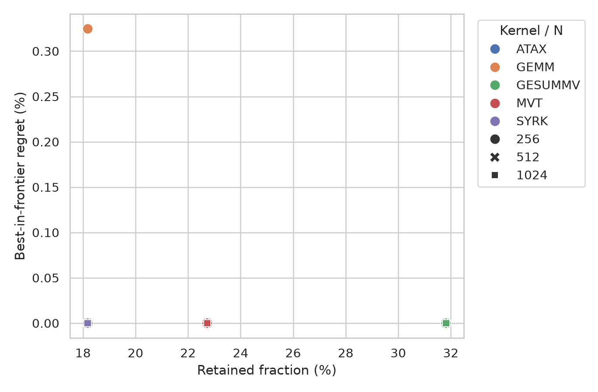
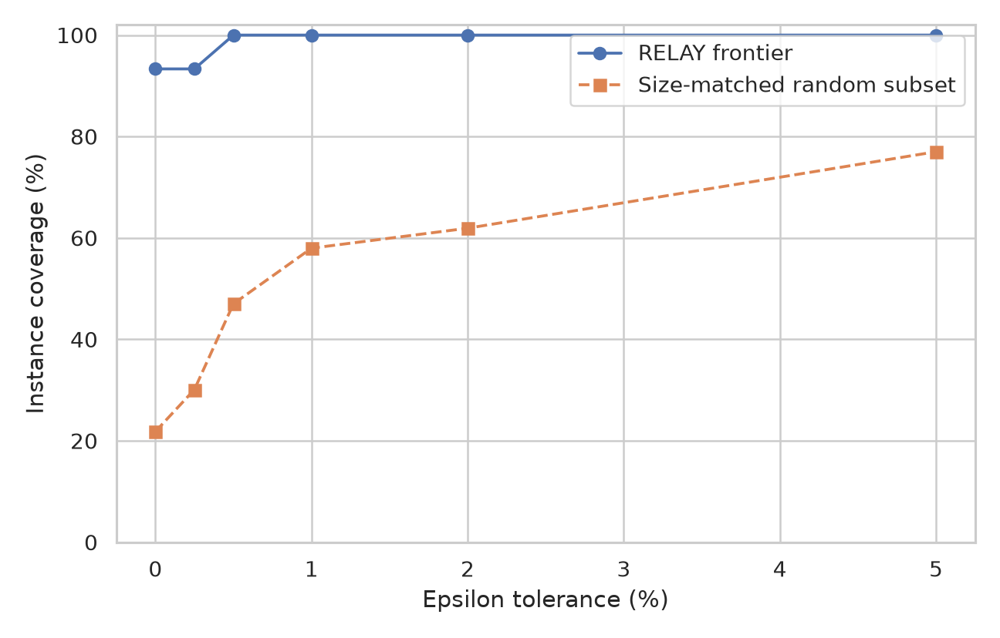
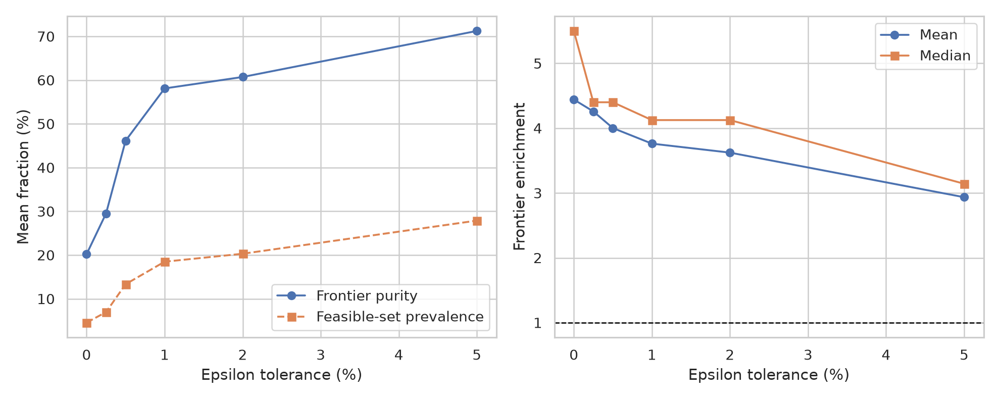
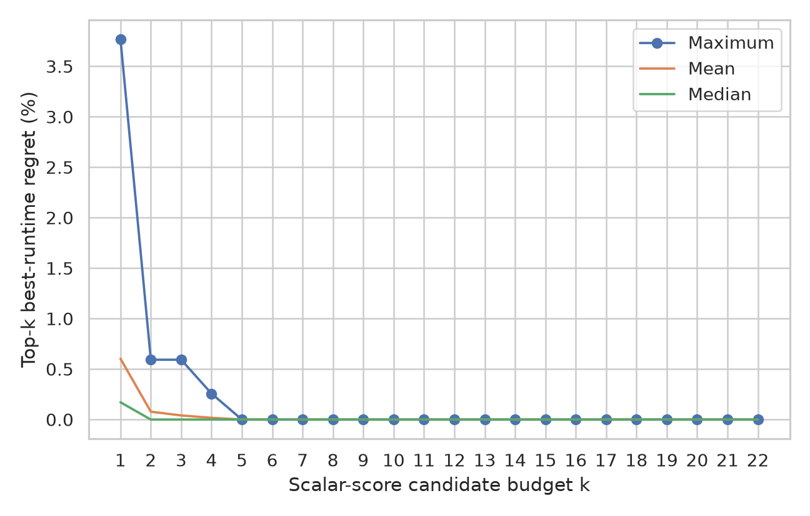

# RELAY layout score/runtime experiment

All scores, runtimes, and ranks are ascending costs; lower is better. The displayed score uses `weighted-normalized-excess`.

Runs and XORs are separate address-code generation costs. They are included in the Pareto frontier but are not folded into the scalar locality score or score rank.

Runtime rank is the raw rank of the exact sample median. Score rank is the raw rank of the exact modeled score. Timing variation does not change either rank or any table value.

The variation-aware rank metric uses each layout's observed minimum-to-maximum sample interval. An overlapping competitor can appear on either side, producing a plausible runtime-rank range. A score rank is counted accurate when it lies inside that range. This is a conservative observed-sample check, not a confidence interval.

Runtime samples were reused from `/g/g16/dnicho/record-replay/relay/results/layout_ranking_five_kernel_n256_measured.json`, `/g/g16/dnicho/record-replay/relay/results/layout_ranking_five_kernel_n512_measured.json`, `/g/g16/dnicho/record-replay/relay/results/layout_ranking_five_kernel_n1024_measured.json`; objective scores and all rank metrics were recomputed for this report.

## Summary

| Kernel | N | Layouts | Pareto layouts | Variation-aware rank accuracy | Mean rank error |
| --- | --- | --- | --- | --- | --- |
| ATAX | 256 | 22 | 4 | 0.545 | 1.318 |
| ATAX | 512 | 22 | 4 | 0.500 | 1.682 |
| ATAX | 1024 | 22 | 4 | 0.182 | 4.136 |
| GEMM | 256 | 22 | 4 | 0.864 | 0.250 |
| GEMM | 512 | 22 | 4 | 0.455 | 1.273 |
| GEMM | 1024 | 22 | 4 | 0.864 | 0.091 |
| GESUMMV | 256 | 22 | 7 | 0.727 | 0.455 |
| GESUMMV | 512 | 22 | 7 | 0.727 | 0.705 |
| GESUMMV | 1024 | 22 | 7 | 0.364 | 1.227 |
| MVT | 256 | 22 | 5 | 0.818 | 0.477 |
| MVT | 512 | 22 | 5 | 0.682 | 0.864 |
| MVT | 1024 | 22 | 5 | 0.136 | 2.909 |
| SYRK | 256 | 22 | 4 | 0.636 | 0.500 |
| SYRK | 512 | 22 | 4 | 0.227 | 1.091 |
| SYRK | 1024 | 22 | 4 | 0.864 | 0.136 |

## Frontier candidate-generation scorecard

The frontier is evaluated as a retained candidate set. Oracle regret is the best frontier median runtime divided by the best evaluated median runtime in the layout family, minus one. Runtime is not used to construct the frontier.

| Metric | Mean | Median | Minimum | Maximum |
| --- | --- | --- | --- | --- |
| Oracle regret | 0.021642% | 0.000000% | 0.000000% | 0.324626% |
| Retained fraction | 21.818% | 18.182% | 18.182% | 31.818% |
| Frontier size | 4.800 | 4.000 | 4 | 7 |

Exact-winner coverage is 14/15 (93.333%). A uniformly random subset with each frontier's size would cover 3.273 instances in expectation; its Poisson-binomial probability of at least the observed number of exact hits is 4.77302e-09.

### Retained fraction versus oracle regret

| Kernel | N | K/L | Retained | Measured optimum | Optimum ms | Best frontier | Frontier ms | Regret |
| --- | --- | --- | --- | --- | --- | --- | --- | --- |
| ATAX | 256 | 4/22 | 18.182% | `tile8_column_major` | 0.060094 | `tile8_column_major` | 0.060094 | 0.000000% |
| ATAX | 512 | 4/22 | 18.182% | `tile8_column_major` | 0.119854 | `tile8_column_major` | 0.119854 | 0.000000% |
| ATAX | 1024 | 4/22 | 18.182% | `tile8_column_major` | 0.242176 | `tile8_column_major` | 0.242176 | 0.000000% |
| GEMM | 256 | 4/22 | 18.182% | `tile32_row_major` | 0.065614 | `tile32x8_row_major` | 0.065827 | 0.324626% |
| GEMM | 512 | 4/22 | 18.182% | `tile16x8_row_major` | 0.258575 | `tile16x8_row_major` | 0.258575 | 0.000000% |
| GEMM | 1024 | 4/22 | 18.182% | `tile8_row_major` | 1.470879 | `tile8_row_major` | 1.470879 | 0.000000% |
| GESUMMV | 256 | 7/22 | 31.818% | `tile32x8_row_major` | 0.032560 | `tile32x8_row_major` | 0.032560 | 0.000000% |
| GESUMMV | 512 | 7/22 | 31.818% | `tile32x8_row_major` | 0.063427 | `tile32x8_row_major` | 0.063427 | 0.000000% |
| GESUMMV | 1024 | 7/22 | 31.818% | `tile16x8_row_major` | 0.129881 | `tile16x8_row_major` | 0.129881 | 0.000000% |
| MVT | 256 | 5/22 | 22.727% | `tile8_row_major` | 0.039894 | `tile8_row_major` | 0.039894 | 0.000000% |
| MVT | 512 | 5/22 | 22.727% | `tile8x32_column_major` | 0.077707 | `tile8x32_column_major` | 0.077707 | 0.000000% |
| MVT | 1024 | 5/22 | 22.727% | `tile8_column_major` | 0.155308 | `tile8_column_major` | 0.155308 | 0.000000% |
| SYRK | 256 | 4/22 | 18.182% | `tile8x32_column_major` | 0.065840 | `tile8x32_column_major` | 0.065840 | 0.000000% |
| SYRK | 512 | 4/22 | 18.182% | `tile8x16_column_major` | 0.258561 | `tile8x16_column_major` | 0.258561 | 0.000000% |
| SYRK | 1024 | 4/22 | 18.182% | `tile8x32_column_major` | 1.446287 | `tile8x32_column_major` | 1.446287 | 0.000000% |

### Epsilon-optimal coverage, purity, and enrichment

An epsilon-optimal layout has median runtime no greater than `(1 + epsilon)` times the measured optimum. Purity is the epsilon-optimal fraction of the frontier; enrichment divides that purity by the epsilon-optimal fraction of the full layout set.

| Epsilon | Covered | Coverage | Random coverage | Mean purity | Median purity | Mean enrichment | Median enrichment |
| --- | --- | --- | --- | --- | --- | --- | --- |
| 0.00% | 14/15 | 93.333% | 21.818% | 20.190% | 25.000% | 4.442x | 5.500x |
| 0.25% | 14/15 | 93.333% | 30.104% | 29.524% | 25.000% | 4.259x | 4.400x |
| 0.50% | 15/15 | 100.000% | 47.015% | 46.143% | 50.000% | 4.002x | 4.400x |
| 1.00% | 15/15 | 100.000% | 57.986% | 58.095% | 75.000% | 3.762x | 4.125x |
| 2.00% | 15/15 | 100.000% | 61.921% | 60.714% | 75.000% | 3.623x | 4.125x |
| 5.00% | 15/15 | 100.000% | 77.003% | 71.238% | 75.000% | 2.935x | 3.143x |

### Top-k scalar-score regret

For an exact candidate budget `k`, layouts are ordered by the selected scalar score and then by layout name to break exact ties deterministically. The reported regret uses the fastest measured layout among those `k` candidates.

| k | Median regret | Mean regret | Maximum regret |
| --- | --- | --- | --- |
| 1 | 0.171156% | 0.603345% | 3.768428% |
| 2 | 0.000000% | 0.077902% | 0.592775% |
| 4 | 0.000000% | 0.017160% | 0.257397% |
| 8 | 0.000000% | 0.000000% | 0.000000% |
| 16 | 0.000000% | 0.000000% | 0.000000% |
| 22 | 0.000000% | 0.000000% | 0.000000% |

## ATAX — N=256

Workgroup: `128`.

### Objective model

`grounded` scopes come from traced memory instructions. `hypothesis` scopes encode proposed reuse or cache-locality neighborhoods.

| Objective | Provenance | Region B | Tau | Meaning |
| --- | --- | --- | --- | --- |
| `wave_load.64B` | grounded | 64 | 0 | logical A addresses issued by one traced wave load in either pass |
| `stage1_wave_load.64B` | grounded | 64 | 0.25 | logical A addresses issued by one traced first-stage wave load |
| `output_store.64B` | grounded | 64 | 0 | logical addresses issued by the tmp and y wave stores |
| `wave_lane_group.lane8.64B` | hypothesis | 64 | 0 | contiguous groups of 8 lanes |
| `wave_lane_group.lane16.128B` | hypothesis | 128 | 4 | contiguous groups of 16 lanes |
| `wave_lane_group.lane32.256B` | hypothesis | 256 | 0 | contiguous groups of 32 lanes |
| `wave_lane_group.lane64.512B` | hypothesis | 512 | 0 | contiguous groups of 64 lanes |
| `stage1_wave_neighborhood.256B` | hypothesis | 256 | 1 | first-stage A wave values in a 256-byte neighborhood; the stage asymmetry is an empirically calibrated cache hypothesis |
| `lane_reuse.128B.window16` | hypothesis | 128 | 0 | sixteen consecutive reduction values used by one lane in either pass |
| `wave_neighborhood.512B` | hypothesis | 512 | 0 | one wave's A values in a broader locality region |
| `workgroup_step_panel.1024B` | hypothesis | 1024 | 0 | A row or column panel shared by all waves at one reduction step |
| `wave_phase.4096B` | hypothesis | 4096 | 2 | one wave's complete row-wise or column-wise A pass in a cache-scale region |

### Score Pareto frontier

This is the exact non-dominated set over the notes-aligned locality vector plus separate codegen run and XOR costs. Runtime is not a Pareto objective.

| Layout | Q fine | J peak | J area | Runs | XORs |
| --- | --- | --- | --- | --- | --- |
| `tile16_interleaved` | 24576 | 7 | 19.75 | 8 | 0 |
| `tile8_column_major` | 36864 | 4 | 19 | 2 | 0 |
| `tile8x16_column_major` | 36864 | 4 | 19 | 2 | 0 |
| `tile8x32_column_major` | 36864 | 4 | 19 | 2 | 0 |

### Layout ranks

| Score rank | Runtime rank | Layout | Word (low→high) | Score | Runs | XORs | Median ms | Mean ms | SD ms | Observed range ms | GFLOP/s | Rank delta |
| --- | --- | --- | --- | --- | --- | --- | --- | --- | --- | --- | --- | --- |
| 2 | 1 | `tile8_column_major` | `iiijjj` | 19 | 2 | 0 | 0.060094 | 0.060048 | 0.000178 | 0.059827–0.060253 | 4.36 | +1.0 |
| 2 | 3 | `tile8x16_column_major` | `iiijjjj` | 19 | 2 | 0 | 0.061453 | 0.061683 | 0.000344 | 0.061347–0.062160 | 4.27 | -1.0 |
| 2 | 2 | `tile8x32_column_major` | `iiijjjjj` | 19 | 2 | 0 | 0.060281 | 0.060235 | 0.000300 | 0.059894–0.060694 | 4.35 | +0.0 |
| 4.5 | 7 | `tile16_interleaved` | `jijijiji` | 19.75 | 8 | 0 | 0.065080 | 0.065041 | 0.000151 | 0.064814–0.065201 | 4.03 | -2.5 |
| 4.5 | 13 | `tile32_interleaved` | `jijijijiji` | 19.75 | 10 | 0 | 0.071561 | 0.071550 | 0.000188 | 0.071307–0.071827 | 3.66 | -8.5 |
| 7 | 4 | `tile16x8_row_major` | `jjjiiii` | 24.75 | 2 | 0 | 0.062107 | 0.062096 | 0.000216 | 0.061827–0.062347 | 4.22 | +3.0 |
| 7 | 5 | `tile32x8_row_major` | `jjjiiiii` | 24.75 | 2 | 0 | 0.062761 | 0.062787 | 0.000127 | 0.062627–0.063001 | 4.18 | +2.0 |
| 7 | 6 | `tile8_row_major` | `jjjiii` | 24.75 | 2 | 0 | 0.064413 | 0.064299 | 0.000163 | 0.064040–0.064440 | 4.07 | +1.0 |
| 10 | 12 | `tile32_column_major` | `iiiiijjjjj` | 30 | 2 | 0 | 0.071201 | 0.071192 | 0.000241 | 0.070854–0.071587 | 3.68 | -2.0 |
| 10 | 8 | `tile32x16_column_major` | `iiiiijjjj` | 30 | 2 | 0 | 0.070534 | 0.070539 | 0.000229 | 0.070254–0.070934 | 3.72 | +2.0 |
| 10 | 14 | `tile32x8_column_major` | `iiiiijjj` | 30 | 2 | 0 | 0.071667 | 0.071569 | 0.000229 | 0.071121–0.071747 | 3.66 | -4.0 |
| 13 | 9 | `tile16_column_major` | `iiiijjjj` | 31 | 2 | 0 | 0.070600 | 0.070467 | 0.000374 | 0.069894–0.070987 | 3.71 | +4.0 |
| 13 | 18 | `tile16x32_column_major` | `iiiijjjjj` | 31 | 2 | 0 | 0.072720 | 0.072584 | 0.000370 | 0.072054–0.073027 | 3.60 | -5.0 |
| 13 | 10 | `tile16x8_column_major` | `iiiijjj` | 31 | 2 | 0 | 0.071187 | 0.070680 | 0.000876 | 0.069454–0.071587 | 3.68 | +3.0 |
| 15 | 21 | `column_major` | `iiiiiiiijjjjjjjj` | 33 | 2 | 0 | 0.084480 | 0.084475 | 0.000516 | 0.083614–0.085001 | 3.10 | -6.0 |
| 17 | 17 | `tile16_row_major` | `jjjjiiii` | 46.75 | 2 | 0 | 0.072467 | 0.072347 | 0.000296 | 0.071987–0.072680 | 3.62 | +0.0 |
| 17 | 20 | `tile32x16_row_major` | `jjjjiiiii` | 46.75 | 2 | 0 | 0.073294 | 0.073174 | 0.000380 | 0.072427–0.073467 | 3.58 | -3.0 |
| 17 | 15 | `tile8x16_row_major` | `jjjjiii` | 46.75 | 2 | 0 | 0.071707 | 0.071422 | 0.000361 | 0.070960–0.071734 | 3.66 | +2.0 |
| 20 | 11 | `tile16x32_row_major` | `jjjjjiiii` | 62.75 | 2 | 0 | 0.071200 | 0.070787 | 0.000840 | 0.069693–0.071827 | 3.68 | +9.0 |
| 20 | 16 | `tile32_row_major` | `jjjjjiiiii` | 62.75 | 2 | 0 | 0.072120 | 0.071952 | 0.000613 | 0.071040–0.072574 | 3.63 | +4.0 |
| 20 | 19 | `tile8x32_row_major` | `jjjjjiii` | 62.75 | 2 | 0 | 0.073227 | 0.073056 | 0.000469 | 0.072334–0.073667 | 3.58 | +1.0 |
| 22 | 22 | `row_major` | `jjjjjjjjiiiiiiii` | 65.75 | 2 | 0 | 0.086108 | 0.086417 | 0.001080 | 0.085094–0.087827 | 3.04 | +0.0 |

### Variation-aware metrics

| Score mode | Ranks within variation | Accuracy | Mean rank error | Max rank error |
| --- | --- | --- | --- | --- |
| `weighted-region-count` | 10/22 | 0.455 | 1.864 | 9.000 |
| `peak-normalized-excess` | 10/22 | 0.455 | 1.364 | 9.000 |
| `weighted-normalized-excess` (selected) | 12/22 | 0.545 | 1.318 | 6.000 |

## ATAX — N=512

Workgroup: `128`.

### Objective model

`grounded` scopes come from traced memory instructions. `hypothesis` scopes encode proposed reuse or cache-locality neighborhoods.

| Objective | Provenance | Region B | Tau | Meaning |
| --- | --- | --- | --- | --- |
| `wave_load.64B` | grounded | 64 | 0 | logical A addresses issued by one traced wave load in either pass |
| `stage1_wave_load.64B` | grounded | 64 | 0.25 | logical A addresses issued by one traced first-stage wave load |
| `output_store.64B` | grounded | 64 | 0 | logical addresses issued by the tmp and y wave stores |
| `wave_lane_group.lane8.64B` | hypothesis | 64 | 0 | contiguous groups of 8 lanes |
| `wave_lane_group.lane16.128B` | hypothesis | 128 | 4 | contiguous groups of 16 lanes |
| `wave_lane_group.lane32.256B` | hypothesis | 256 | 0 | contiguous groups of 32 lanes |
| `wave_lane_group.lane64.512B` | hypothesis | 512 | 0 | contiguous groups of 64 lanes |
| `stage1_wave_neighborhood.256B` | hypothesis | 256 | 1 | first-stage A wave values in a 256-byte neighborhood; the stage asymmetry is an empirically calibrated cache hypothesis |
| `lane_reuse.128B.window16` | hypothesis | 128 | 0 | sixteen consecutive reduction values used by one lane in either pass |
| `wave_neighborhood.512B` | hypothesis | 512 | 0 | one wave's A values in a broader locality region |
| `workgroup_step_panel.1024B` | hypothesis | 1024 | 0 | A row or column panel shared by all waves at one reduction step |
| `wave_phase.4096B` | hypothesis | 4096 | 2 | one wave's complete row-wise or column-wise A pass in a cache-scale region |

### Score Pareto frontier

This is the exact non-dominated set over the notes-aligned locality vector plus separate codegen run and XOR costs. Runtime is not a Pareto objective.

| Layout | Q fine | J peak | J area | Runs | XORs |
| --- | --- | --- | --- | --- | --- |
| `tile16_interleaved` | 49152 | 7 | 19.75 | 8 | 0 |
| `tile8_column_major` | 73728 | 4 | 19 | 2 | 0 |
| `tile8x16_column_major` | 73728 | 4 | 19 | 2 | 0 |
| `tile8x32_column_major` | 73728 | 4 | 19 | 2 | 0 |

### Layout ranks

| Score rank | Runtime rank | Layout | Word (low→high) | Score | Runs | XORs | Median ms | Mean ms | SD ms | Observed range ms | GFLOP/s | Rank delta |
| --- | --- | --- | --- | --- | --- | --- | --- | --- | --- | --- | --- | --- |
| 2 | 1 | `tile8_column_major` | `iiijjj` | 19 | 2 | 0 | 0.119854 | 0.119830 | 0.000296 | 0.119280–0.120120 | 8.75 | +1.0 |
| 2 | 2 | `tile8x16_column_major` | `iiijjjj` | 19 | 2 | 0 | 0.120081 | 0.120209 | 0.000388 | 0.119801–0.120947 | 8.73 | +0.0 |
| 2 | 3 | `tile8x32_column_major` | `iiijjjjj` | 19 | 2 | 0 | 0.121187 | 0.121168 | 0.000451 | 0.120507–0.121787 | 8.65 | -1.0 |
| 4.5 | 7 | `tile16_interleaved` | `jijijiji` | 19.75 | 8 | 0 | 0.130707 | 0.130694 | 0.000149 | 0.130480–0.130854 | 8.02 | -2.5 |
| 4.5 | 10 | `tile32_interleaved` | `jijijijiji` | 19.75 | 10 | 0 | 0.139947 | 0.140038 | 0.000312 | 0.139720–0.140627 | 7.49 | -5.5 |
| 7 | 5 | `tile16x8_row_major` | `jjjiiii` | 24.75 | 2 | 0 | 0.124427 | 0.124336 | 0.000512 | 0.123387–0.124867 | 8.43 | +2.0 |
| 7 | 6 | `tile32x8_row_major` | `jjjiiiii` | 24.75 | 2 | 0 | 0.125801 | 0.125782 | 0.000235 | 0.125347–0.126040 | 8.34 | +1.0 |
| 7 | 4 | `tile8_row_major` | `jjjiii` | 24.75 | 2 | 0 | 0.121960 | 0.122064 | 0.000368 | 0.121600–0.122574 | 8.60 | +3.0 |
| 10 | 12 | `tile32_column_major` | `iiiiijjjjj` | 30 | 2 | 0 | 0.140494 | 0.140547 | 0.000635 | 0.139613–0.141387 | 7.46 | -2.0 |
| 10 | 16 | `tile32x16_column_major` | `iiiiijjjj` | 30 | 2 | 0 | 0.142014 | 0.141905 | 0.000554 | 0.140934–0.142547 | 7.38 | -6.0 |
| 10 | 13 | `tile32x8_column_major` | `iiiiijjj` | 30 | 2 | 0 | 0.140560 | 0.140390 | 0.000416 | 0.139720–0.140827 | 7.46 | -3.0 |
| 13 | 9 | `tile16_column_major` | `iiiijjjj` | 31 | 2 | 0 | 0.138040 | 0.137918 | 0.000246 | 0.137534–0.138200 | 7.60 | +4.0 |
| 13 | 8 | `tile16x32_column_major` | `iiiijjjjj` | 31 | 2 | 0 | 0.137748 | 0.137694 | 0.000369 | 0.137067–0.138214 | 7.61 | +5.0 |
| 13 | 14 | `tile16x8_column_major` | `iiiijjj` | 31 | 2 | 0 | 0.140667 | 0.140589 | 0.000295 | 0.140067–0.140880 | 7.45 | -1.0 |
| 15 | 21 | `column_major` | `iiiiiiiiijjjjjjjjj` | 37 | 2 | 0 | 0.166880 | 0.167451 | 0.000914 | 0.166534–0.169014 | 6.28 | -6.0 |
| 17 | 20 | `tile16_row_major` | `jjjjiiii` | 46.75 | 2 | 0 | 0.143841 | 0.143992 | 0.000522 | 0.143214–0.144600 | 7.29 | -3.0 |
| 17 | 11 | `tile32x16_row_major` | `jjjjiiiii` | 46.75 | 2 | 0 | 0.140054 | 0.140006 | 0.000540 | 0.139041–0.140708 | 7.49 | +6.0 |
| 17 | 18 | `tile8x16_row_major` | `jjjjiii` | 46.75 | 2 | 0 | 0.143027 | 0.142982 | 0.000322 | 0.142400–0.143347 | 7.33 | -1.0 |
| 20 | 15 | `tile16x32_row_major` | `jjjjjiiii` | 62.75 | 2 | 0 | 0.141640 | 0.141736 | 0.000417 | 0.141307–0.142467 | 7.40 | +5.0 |
| 20 | 19 | `tile32_row_major` | `jjjjjiiiii` | 62.75 | 2 | 0 | 0.143281 | 0.143534 | 0.000567 | 0.142814–0.144267 | 7.32 | +1.0 |
| 20 | 17 | `tile8x32_row_major` | `jjjjjiii` | 62.75 | 2 | 0 | 0.143001 | 0.142907 | 0.000911 | 0.141507–0.144121 | 7.33 | +3.0 |
| 22 | 22 | `row_major` | `jjjjjjjjjiiiiiiiii` | 69.75 | 2 | 0 | 0.169107 | 0.169094 | 0.000436 | 0.168521–0.169574 | 6.20 | +0.0 |

### Variation-aware metrics

| Score mode | Ranks within variation | Accuracy | Mean rank error | Max rank error |
| --- | --- | --- | --- | --- |
| `weighted-region-count` | 9/22 | 0.409 | 2.318 | 9.000 |
| `peak-normalized-excess` | 9/22 | 0.409 | 1.455 | 9.000 |
| `weighted-normalized-excess` (selected) | 11/22 | 0.500 | 1.682 | 6.000 |

## ATAX — N=1024

Workgroup: `128`.

### Objective model

`grounded` scopes come from traced memory instructions. `hypothesis` scopes encode proposed reuse or cache-locality neighborhoods.

| Objective | Provenance | Region B | Tau | Meaning |
| --- | --- | --- | --- | --- |
| `wave_load.64B` | grounded | 64 | 0 | logical A addresses issued by one traced wave load in either pass |
| `stage1_wave_load.64B` | grounded | 64 | 0.25 | logical A addresses issued by one traced first-stage wave load |
| `output_store.64B` | grounded | 64 | 0 | logical addresses issued by the tmp and y wave stores |
| `wave_lane_group.lane8.64B` | hypothesis | 64 | 0 | contiguous groups of 8 lanes |
| `wave_lane_group.lane16.128B` | hypothesis | 128 | 4 | contiguous groups of 16 lanes |
| `wave_lane_group.lane32.256B` | hypothesis | 256 | 0 | contiguous groups of 32 lanes |
| `wave_lane_group.lane64.512B` | hypothesis | 512 | 0 | contiguous groups of 64 lanes |
| `stage1_wave_neighborhood.256B` | hypothesis | 256 | 1 | first-stage A wave values in a 256-byte neighborhood; the stage asymmetry is an empirically calibrated cache hypothesis |
| `lane_reuse.128B.window16` | hypothesis | 128 | 0 | sixteen consecutive reduction values used by one lane in either pass |
| `wave_neighborhood.512B` | hypothesis | 512 | 0 | one wave's A values in a broader locality region |
| `workgroup_step_panel.1024B` | hypothesis | 1024 | 0 | A row or column panel shared by all waves at one reduction step |
| `wave_phase.4096B` | hypothesis | 4096 | 2 | one wave's complete row-wise or column-wise A pass in a cache-scale region |

### Score Pareto frontier

This is the exact non-dominated set over the notes-aligned locality vector plus separate codegen run and XOR costs. Runtime is not a Pareto objective.

| Layout | Q fine | J peak | J area | Runs | XORs |
| --- | --- | --- | --- | --- | --- |
| `tile16_interleaved` | 98304 | 7 | 19.75 | 8 | 0 |
| `tile8_column_major` | 147456 | 4 | 19 | 2 | 0 |
| `tile8x16_column_major` | 147456 | 4 | 19 | 2 | 0 |
| `tile8x32_column_major` | 147456 | 4 | 19 | 2 | 0 |

### Layout ranks

| Score rank | Runtime rank | Layout | Word (low→high) | Score | Runs | XORs | Median ms | Mean ms | SD ms | Observed range ms | GFLOP/s | Rank delta |
| --- | --- | --- | --- | --- | --- | --- | --- | --- | --- | --- | --- | --- |
| 2 | 1 | `tile8_column_major` | `iiijjj` | 19 | 2 | 0 | 0.242176 | 0.241888 | 0.000925 | 0.240149–0.242709 | 17.32 | +1.0 |
| 2 | 3 | `tile8x16_column_major` | `iiijjjj` | 19 | 2 | 0 | 0.244162 | 0.244175 | 0.000717 | 0.243442–0.245468 | 17.18 | -1.0 |
| 2 | 4 | `tile8x32_column_major` | `iiijjjjj` | 19 | 2 | 0 | 0.244309 | 0.244312 | 0.000772 | 0.242989–0.245349 | 17.17 | -2.0 |
| 4.5 | 10 | `tile16_interleaved` | `jijijiji` | 19.75 | 8 | 0 | 0.295173 | 0.295114 | 0.000290 | 0.294573–0.295400 | 14.21 | -5.5 |
| 4.5 | 11 | `tile32_interleaved` | `jijijijiji` | 19.75 | 10 | 0 | 0.312400 | 0.311989 | 0.000570 | 0.311173–0.312520 | 13.43 | -6.5 |
| 7 | 12 | `tile16x8_row_major` | `jjjiiii` | 24.75 | 2 | 0 | 0.312989 | 0.312962 | 0.000438 | 0.312296–0.313589 | 13.40 | -5.0 |
| 7 | 13 | `tile32x8_row_major` | `jjjiiiii` | 24.75 | 2 | 0 | 0.316362 | 0.316353 | 0.000854 | 0.315321–0.317482 | 13.26 | -6.0 |
| 7 | 2 | `tile8_row_major` | `jjjiii` | 24.75 | 2 | 0 | 0.244122 | 0.244122 | 0.000394 | 0.243429–0.244602 | 17.18 | +5.0 |
| 10 | 14 | `tile32_column_major` | `iiiiijjjjj` | 30 | 2 | 0 | 0.327560 | 0.327046 | 0.001679 | 0.324867–0.328960 | 12.80 | -4.0 |
| 10 | 15 | `tile32x16_column_major` | `iiiiijjjj` | 30 | 2 | 0 | 0.330922 | 0.330671 | 0.001082 | 0.329295–0.332082 | 12.67 | -5.0 |
| 10 | 16 | `tile32x8_column_major` | `iiiiijjj` | 30 | 2 | 0 | 0.332189 | 0.331800 | 0.001233 | 0.330149–0.333629 | 12.63 | -6.0 |
| 13 | 6 | `tile16_column_major` | `iiiijjjj` | 31 | 2 | 0 | 0.282176 | 0.282466 | 0.001291 | 0.280989–0.284882 | 14.86 | +7.0 |
| 13 | 17 | `tile16x32_column_major` | `iiiijjjjj` | 31 | 2 | 0 | 0.338562 | 0.339189 | 0.001904 | 0.336696–0.341496 | 12.39 | -4.0 |
| 13 | 5 | `tile16x8_column_major` | `iiiijjj` | 31 | 2 | 0 | 0.280761 | 0.280980 | 0.000423 | 0.280535–0.281681 | 14.94 | +8.0 |
| 15 | 21 | `column_major` | `iiiiiiiiiijjjjjjjjjj` | 37 | 2 | 0 | 0.431041 | 0.430881 | 0.002193 | 0.427641–0.433975 | 9.73 | -6.0 |
| 17 | 7 | `tile16_row_major` | `jjjjiiii` | 46.75 | 2 | 0 | 0.282455 | 0.282305 | 0.001415 | 0.280455–0.284561 | 14.85 | +10.0 |
| 17 | 19 | `tile32x16_row_major` | `jjjjiiiii` | 46.75 | 2 | 0 | 0.426297 | 0.426329 | 0.002354 | 0.422844–0.429484 | 9.84 | -2.0 |
| 17 | 8 | `tile8x16_row_major` | `jjjjiii` | 46.75 | 2 | 0 | 0.286656 | 0.286038 | 0.002063 | 0.282696–0.288963 | 14.63 | +9.0 |
| 20 | 20 | `tile16x32_row_major` | `jjjjjiiii` | 62.75 | 2 | 0 | 0.429444 | 0.429262 | 0.001176 | 0.427817–0.431164 | 9.77 | +0.0 |
| 20 | 18 | `tile32_row_major` | `jjjjjiiiii` | 62.75 | 2 | 0 | 0.409109 | 0.408818 | 0.001453 | 0.406975–0.410469 | 10.25 | +2.0 |
| 20 | 9 | `tile8x32_row_major` | `jjjjjiii` | 62.75 | 2 | 0 | 0.291162 | 0.291071 | 0.001919 | 0.288402–0.293682 | 14.41 | +11.0 |
| 22 | 22 | `row_major` | `jjjjjjjjjjiiiiiiiiii` | 69.75 | 2 | 0 | 0.431442 | 0.431234 | 0.001440 | 0.428655–0.432682 | 9.72 | +0.0 |

### Variation-aware metrics

| Score mode | Ranks within variation | Accuracy | Mean rank error | Max rank error |
| --- | --- | --- | --- | --- |
| `weighted-region-count` | 4/22 | 0.182 | 4.682 | 11.000 |
| `peak-normalized-excess` | 4/22 | 0.182 | 3.909 | 11.500 |
| `weighted-normalized-excess` (selected) | 4/22 | 0.182 | 4.136 | 11.000 |

## GEMM — N=256

Workgroup: `[32, 32, 1]`.

### Objective model

`grounded` scopes come from traced memory instructions. `hypothesis` scopes encode proposed reuse or cache-locality neighborhoods.

| Objective | Provenance | Region B | Tau | Meaning |
| --- | --- | --- | --- | --- |
| `wave_load.64B` | grounded | 64 | 4 | logical addresses issued by one traced wave load |
| `output_store.64B` | grounded | 64 | 0 | logical addresses issued by the traced C wave store |
| `B.wave_lane_group.lane8.64B` | hypothesis | 64 | 2 | contiguous groups of 8 lanes |
| `B.wave_lane_group.lane16.128B` | hypothesis | 128 | 2 | contiguous groups of 16 lanes |
| `B.wave_lane_group.lane32.256B` | hypothesis | 256 | 0 | contiguous groups of 32 lanes |
| `B.wave_lane_group.lane64.512B` | hypothesis | 512 | 0 | contiguous groups of 64 lanes |
| `lane_reuse.128B.window16` | hypothesis | 128 | 1 | sixteen consecutive k-loop values used by one lane; a temporal-reuse neighborhood hypothesis |
| `wave_neighborhood.512B` | hypothesis | 512 | 1 | one inner-loop wave load at a broader locality scale |
| `workgroup_k_panel.256B` | hypothesis | 256 | 0 | unique A or B values reused across a workgroup at one k step |
| `wave_k_window.4096B` | hypothesis | 4096 | 0 | sixteen consecutive A/B load pairs in a cache-scale region |
| `wave_inner_phase.32768B` | hypothesis | 32768 | 0 | one wave's complete k-loop working set in a broad cache-scale region |

### Score Pareto frontier

This is the exact non-dominated set over the notes-aligned locality vector plus separate codegen run and XOR costs. Runtime is not a Pareto objective.

| Layout | Q fine | J peak | J area | Runs | XORs |
| --- | --- | --- | --- | --- | --- |
| `tile16x8_row_major` | 24704 | 4 | 8.29503 | 6 | 0 |
| `tile32x8_row_major` | 24704 | 4 | 8.29503 | 6 | 0 |
| `tile8_row_major` | 24704 | 4 | 8.29503 | 6 | 0 |
| `tile16_interleaved` | 36992 | 3 | 15.6801 | 24 | 0 |

### Layout ranks

| Score rank | Runtime rank | Layout | Word (low→high) | Score | Runs | XORs | Median ms | Mean ms | SD ms | Observed range ms | GFLOP/s | Rank delta |
| --- | --- | --- | --- | --- | --- | --- | --- | --- | --- | --- | --- | --- |
| 3.5 | 7 | `tile16x32_row_major` | `jjjjjiiii` | 8.29503 | 6 | 0 | 0.065894 | 0.065894 | 0.000037 | 0.065854–0.065947 | 509.22 | -3.5 |
| 3.5 | 5.5 | `tile16x8_row_major` | `jjjiiii` | 8.29503 | 6 | 0 | 0.065854 | 0.065867 | 0.000066 | 0.065787–0.065987 | 509.53 | -2.0 |
| 3.5 | 1 | `tile32_row_major` | `jjjjjiiiii` | 8.29503 | 6 | 0 | 0.065614 | 0.065630 | 0.000047 | 0.065587–0.065720 | 511.39 | +2.5 |
| 3.5 | 4 | `tile32x8_row_major` | `jjjiiiii` | 8.29503 | 6 | 0 | 0.065827 | 0.065979 | 0.000338 | 0.065774–0.066653 | 509.74 | -0.5 |
| 3.5 | 10 | `tile8_row_major` | `jjjiii` | 8.29503 | 6 | 0 | 0.065934 | 0.065920 | 0.000043 | 0.065867–0.065987 | 508.91 | -6.5 |
| 3.5 | 2 | `tile8x32_row_major` | `jjjjjiii` | 8.29503 | 6 | 0 | 0.065734 | 0.065769 | 0.000083 | 0.065681–0.065880 | 510.46 | +1.5 |
| 8.5 | 9 | `row_major` | `jjjjjjjjiiiiiiii` | 8.79503 | 6 | 0 | 0.065920 | 0.065910 | 0.000013 | 0.065894–0.065920 | 509.01 | -0.5 |
| 8.5 | 3 | `tile16_row_major` | `jjjjiiii` | 8.79503 | 6 | 0 | 0.065787 | 0.065758 | 0.000060 | 0.065667–0.065827 | 510.04 | +5.5 |
| 8.5 | 8 | `tile32x16_row_major` | `jjjjiiiii` | 8.79503 | 6 | 0 | 0.065907 | 0.065878 | 0.000129 | 0.065694–0.066054 | 509.12 | +0.5 |
| 8.5 | 5.5 | `tile8x16_row_major` | `jjjjiii` | 8.79503 | 6 | 0 | 0.065854 | 0.065998 | 0.000267 | 0.065814–0.066520 | 509.53 | +3.0 |
| 11.5 | 11 | `tile16_interleaved` | `jijijiji` | 15.6801 | 24 | 0 | 0.085947 | 0.085947 | 0.000125 | 0.085734–0.086120 | 390.41 | +0.5 |
| 11.5 | 15 | `tile32_interleaved` | `jijijijiji` | 15.6801 | 30 | 0 | 0.102734 | 0.102800 | 0.000231 | 0.102613–0.103253 | 326.62 | -3.5 |
| 14 | 13 | `tile8_column_major` | `iiijjj` | 55.8354 | 6 | 0 | 0.097014 | 0.097038 | 0.000039 | 0.097000–0.097107 | 345.87 | +1.0 |
| 14 | 12 | `tile8x16_column_major` | `iiijjjj` | 55.8354 | 6 | 0 | 0.096881 | 0.096945 | 0.000127 | 0.096787–0.097121 | 346.35 | +2.0 |
| 14 | 14 | `tile8x32_column_major` | `iiijjjjj` | 55.8354 | 6 | 0 | 0.097067 | 0.097150 | 0.000204 | 0.096948–0.097534 | 345.68 | +0.0 |
| 17 | 18 | `tile16_column_major` | `iiiijjjj` | 77.3354 | 6 | 0 | 0.159668 | 0.159673 | 0.000046 | 0.159601–0.159735 | 210.15 | -1.0 |
| 17 | 16 | `tile16x32_column_major` | `iiiijjjjj` | 77.3354 | 6 | 0 | 0.159588 | 0.159604 | 0.000037 | 0.159562–0.159655 | 210.26 | +1.0 |
| 17 | 17 | `tile16x8_column_major` | `iiiijjj` | 77.3354 | 6 | 0 | 0.159627 | 0.159681 | 0.000159 | 0.159494–0.159974 | 210.20 | +0.0 |
| 20 | 20 | `tile32_column_major` | `iiiiijjjjj` | 81.3354 | 6 | 0 | 0.159814 | 0.159822 | 0.000034 | 0.159774–0.159867 | 209.96 | +0.0 |
| 20 | 19 | `tile32x16_column_major` | `iiiiijjjj` | 81.3354 | 6 | 0 | 0.159787 | 0.159742 | 0.000066 | 0.159628–0.159801 | 209.99 | +1.0 |
| 20 | 21 | `tile32x8_column_major` | `iiiiijjj` | 81.3354 | 6 | 0 | 0.159867 | 0.159872 | 0.000056 | 0.159814–0.159974 | 209.89 | -1.0 |
| 22 | 22 | `column_major` | `iiiiiiiijjjjjjjj` | 89.3354 | 6 | 0 | 0.169321 | 0.169337 | 0.000098 | 0.169201–0.169508 | 198.17 | +0.0 |

### Variation-aware metrics

| Score mode | Ranks within variation | Accuracy | Mean rank error | Max rank error |
| --- | --- | --- | --- | --- |
| `weighted-region-count` | 17/22 | 0.773 | 0.341 | 3.500 |
| `peak-normalized-excess` | 9/22 | 0.409 | 2.841 | 13.500 |
| `weighted-normalized-excess` (selected) | 19/22 | 0.864 | 0.250 | 3.500 |

## GEMM — N=512

Workgroup: `[32, 32, 1]`.

### Objective model

`grounded` scopes come from traced memory instructions. `hypothesis` scopes encode proposed reuse or cache-locality neighborhoods.

| Objective | Provenance | Region B | Tau | Meaning |
| --- | --- | --- | --- | --- |
| `wave_load.64B` | grounded | 64 | 4 | logical addresses issued by one traced wave load |
| `output_store.64B` | grounded | 64 | 0 | logical addresses issued by the traced C wave store |
| `B.wave_lane_group.lane8.64B` | hypothesis | 64 | 2 | contiguous groups of 8 lanes |
| `B.wave_lane_group.lane16.128B` | hypothesis | 128 | 2 | contiguous groups of 16 lanes |
| `B.wave_lane_group.lane32.256B` | hypothesis | 256 | 0 | contiguous groups of 32 lanes |
| `B.wave_lane_group.lane64.512B` | hypothesis | 512 | 0 | contiguous groups of 64 lanes |
| `lane_reuse.128B.window16` | hypothesis | 128 | 1 | sixteen consecutive k-loop values used by one lane; a temporal-reuse neighborhood hypothesis |
| `wave_neighborhood.512B` | hypothesis | 512 | 1 | one inner-loop wave load at a broader locality scale |
| `workgroup_k_panel.256B` | hypothesis | 256 | 0 | unique A or B values reused across a workgroup at one k step |
| `wave_k_window.4096B` | hypothesis | 4096 | 0 | sixteen consecutive A/B load pairs in a cache-scale region |
| `wave_inner_phase.32768B` | hypothesis | 32768 | 0 | one wave's complete k-loop working set in a broad cache-scale region |

### Score Pareto frontier

This is the exact non-dominated set over the notes-aligned locality vector plus separate codegen run and XOR costs. Runtime is not a Pareto objective.

| Layout | Q fine | J peak | J area | Runs | XORs |
| --- | --- | --- | --- | --- | --- |
| `tile16x8_row_major` | 49280 | 4 | 8.29751 | 6 | 0 |
| `tile32x8_row_major` | 49280 | 4 | 8.29751 | 6 | 0 |
| `tile8_row_major` | 49280 | 4 | 8.29751 | 6 | 0 |
| `tile16_interleaved` | 73856 | 3 | 15.69 | 24 | 0 |

### Layout ranks

| Score rank | Runtime rank | Layout | Word (low→high) | Score | Runs | XORs | Median ms | Mean ms | SD ms | Observed range ms | GFLOP/s | Rank delta |
| --- | --- | --- | --- | --- | --- | --- | --- | --- | --- | --- | --- | --- |
| 3.5 | 2 | `tile16x32_row_major` | `jjjjjiiii` | 8.29751 | 6 | 0 | 0.258882 | 0.258890 | 0.000029 | 0.258855–0.258935 | 1036.90 | +1.5 |
| 3.5 | 1 | `tile16x8_row_major` | `jjjiiii` | 8.29751 | 6 | 0 | 0.258575 | 0.258564 | 0.000113 | 0.258375–0.258722 | 1038.13 | +2.5 |
| 3.5 | 7 | `tile32_row_major` | `jjjjjiiiii` | 8.29751 | 6 | 0 | 0.286815 | 0.288943 | 0.006566 | 0.280775–0.299401 | 935.92 | -3.5 |
| 3.5 | 10 | `tile32x8_row_major` | `jjjiiiii` | 8.29751 | 6 | 0 | 0.310402 | 0.310488 | 0.000875 | 0.309136–0.311709 | 864.80 | -6.5 |
| 3.5 | 5 | `tile8_row_major` | `jjjiii` | 8.29751 | 6 | 0 | 0.259868 | 0.260020 | 0.000451 | 0.259468–0.260815 | 1032.97 | -1.5 |
| 3.5 | 6 | `tile8x32_row_major` | `jjjjjiii` | 8.29751 | 6 | 0 | 0.260121 | 0.260038 | 0.000585 | 0.259321–0.260975 | 1031.96 | -2.5 |
| 8.5 | 11 | `row_major` | `jjjjjjjjjiiiiiiiii` | 8.79751 | 6 | 0 | 0.320228 | 0.320247 | 0.000727 | 0.319188–0.321375 | 838.26 | -2.5 |
| 8.5 | 3 | `tile16_row_major` | `jjjjiiii` | 8.79751 | 6 | 0 | 0.259321 | 0.259340 | 0.000095 | 0.259241–0.259481 | 1035.15 | +5.5 |
| 8.5 | 8 | `tile32x16_row_major` | `jjjjiiiii` | 8.79751 | 6 | 0 | 0.290041 | 0.289761 | 0.001881 | 0.286841–0.292308 | 925.51 | +0.5 |
| 8.5 | 4 | `tile8x16_row_major` | `jjjjiii` | 8.79751 | 6 | 0 | 0.259720 | 0.259934 | 0.000352 | 0.259627–0.260574 | 1033.56 | +4.5 |
| 11.5 | 9 | `tile16_interleaved` | `jijijiji` | 15.69 | 24 | 0 | 0.303495 | 0.303719 | 0.000448 | 0.303375–0.304575 | 884.48 | +2.5 |
| 11.5 | 12 | `tile32_interleaved` | `jijijijiji` | 15.69 | 30 | 0 | 0.379027 | 0.379024 | 0.000538 | 0.378240–0.379854 | 708.22 | -0.5 |
| 14 | 15 | `tile8_column_major` | `iiijjj` | 55.8676 | 6 | 0 | 0.384174 | 0.384183 | 0.000071 | 0.384068–0.384281 | 698.73 | -1.0 |
| 14 | 13 | `tile8x16_column_major` | `iiijjjj` | 55.8676 | 6 | 0 | 0.383174 | 0.383134 | 0.000096 | 0.383014–0.383255 | 700.56 | +1.0 |
| 14 | 14 | `tile8x32_column_major` | `iiijjjjj` | 55.8676 | 6 | 0 | 0.384081 | 0.384038 | 0.000074 | 0.383895–0.384094 | 698.90 | +0.0 |
| 17 | 16 | `tile16_column_major` | `iiiijjjj` | 77.3676 | 6 | 0 | 0.632856 | 0.632822 | 0.000197 | 0.632550–0.633043 | 424.16 | +1.0 |
| 17 | 17 | `tile16x32_column_major` | `iiiijjjjj` | 77.3676 | 6 | 0 | 0.632881 | 0.632812 | 0.000250 | 0.632362–0.633122 | 424.15 | +0.0 |
| 17 | 18 | `tile16x8_column_major` | `iiiijjj` | 77.3676 | 6 | 0 | 0.633216 | 0.633123 | 0.000260 | 0.632683–0.633403 | 423.92 | -1.0 |
| 20 | 19 | `tile32_column_major` | `iiiiijjjjj` | 81.3676 | 6 | 0 | 0.634718 | 0.634715 | 0.000051 | 0.634625–0.634784 | 422.92 | +1.0 |
| 20 | 20 | `tile32x16_column_major` | `iiiiijjjj` | 81.3676 | 6 | 0 | 0.635002 | 0.635039 | 0.000073 | 0.634975–0.635175 | 422.73 | +0.0 |
| 20 | 21 | `tile32x8_column_major` | `iiiiijjj` | 81.3676 | 6 | 0 | 0.635162 | 0.635098 | 0.000150 | 0.634855–0.635295 | 422.63 | -1.0 |
| 22 | 22 | `column_major` | `iiiiiiiiijjjjjjjjj` | 89.3676 | 6 | 0 | 0.646683 | 0.647165 | 0.000999 | 0.645976–0.648376 | 415.10 | +0.0 |

### Variation-aware metrics

| Score mode | Ranks within variation | Accuracy | Mean rank error | Max rank error |
| --- | --- | --- | --- | --- |
| `weighted-region-count` | 9/22 | 0.409 | 1.318 | 8.000 |
| `peak-normalized-excess` | 2/22 | 0.091 | 4.091 | 10.500 |
| `weighted-normalized-excess` (selected) | 10/22 | 0.455 | 1.273 | 6.500 |

## GEMM — N=1024

Workgroup: `[32, 32, 1]`.

### Objective model

`grounded` scopes come from traced memory instructions. `hypothesis` scopes encode proposed reuse or cache-locality neighborhoods.

| Objective | Provenance | Region B | Tau | Meaning |
| --- | --- | --- | --- | --- |
| `wave_load.64B` | grounded | 64 | 4 | logical addresses issued by one traced wave load |
| `output_store.64B` | grounded | 64 | 0 | logical addresses issued by the traced C wave store |
| `B.wave_lane_group.lane8.64B` | hypothesis | 64 | 2 | contiguous groups of 8 lanes |
| `B.wave_lane_group.lane16.128B` | hypothesis | 128 | 2 | contiguous groups of 16 lanes |
| `B.wave_lane_group.lane32.256B` | hypothesis | 256 | 0 | contiguous groups of 32 lanes |
| `B.wave_lane_group.lane64.512B` | hypothesis | 512 | 0 | contiguous groups of 64 lanes |
| `lane_reuse.128B.window16` | hypothesis | 128 | 1 | sixteen consecutive k-loop values used by one lane; a temporal-reuse neighborhood hypothesis |
| `wave_neighborhood.512B` | hypothesis | 512 | 1 | one inner-loop wave load at a broader locality scale |
| `workgroup_k_panel.256B` | hypothesis | 256 | 0 | unique A or B values reused across a workgroup at one k step |
| `wave_k_window.4096B` | hypothesis | 4096 | 0 | sixteen consecutive A/B load pairs in a cache-scale region |
| `wave_inner_phase.32768B` | hypothesis | 32768 | 0 | one wave's complete k-loop working set in a broad cache-scale region |

### Score Pareto frontier

This is the exact non-dominated set over the notes-aligned locality vector plus separate codegen run and XOR costs. Runtime is not a Pareto objective.

| Layout | Q fine | J peak | J area | Runs | XORs |
| --- | --- | --- | --- | --- | --- |
| `tile16x8_row_major` | 98432 | 4 | 8.29875 | 6 | 0 |
| `tile32x8_row_major` | 98432 | 4 | 8.29875 | 6 | 0 |
| `tile8_row_major` | 98432 | 4 | 8.29875 | 6 | 0 |
| `tile16_interleaved` | 147584 | 3 | 15.695 | 24 | 0 |

### Layout ranks

| Score rank | Runtime rank | Layout | Word (low→high) | Score | Runs | XORs | Median ms | Mean ms | SD ms | Observed range ms | GFLOP/s | Rank delta |
| --- | --- | --- | --- | --- | --- | --- | --- | --- | --- | --- | --- | --- |
| 3.5 | 4 | `tile16x32_row_major` | `jjjjjiiii` | 8.29875 | 6 | 0 | 1.500441 | 1.527058 | 0.047914 | 1.476628–1.611349 | 1431.23 | -0.5 |
| 3.5 | 3 | `tile16x8_row_major` | `jjjiiii` | 8.29875 | 6 | 0 | 1.479598 | 1.481179 | 0.040568 | 1.420117–1.547945 | 1451.40 | +0.5 |
| 3.5 | 6 | `tile32_row_major` | `jjjjjiiiii` | 8.29875 | 6 | 0 | 1.502328 | 1.527725 | 0.055677 | 1.470861–1.622008 | 1429.44 | -2.5 |
| 3.5 | 2 | `tile32x8_row_major` | `jjjiiiii` | 8.29875 | 6 | 0 | 1.474665 | 1.485404 | 0.041822 | 1.442372–1.559080 | 1456.25 | +1.5 |
| 3.5 | 1 | `tile8_row_major` | `jjjiii` | 8.29875 | 6 | 0 | 1.470879 | 1.478437 | 0.042057 | 1.420892–1.551853 | 1460.00 | +2.5 |
| 3.5 | 5 | `tile8x32_row_major` | `jjjjjiii` | 8.29875 | 6 | 0 | 1.502222 | 1.512731 | 0.046112 | 1.475715–1.601662 | 1429.54 | -1.5 |
| 8.5 | 11 | `row_major` | `jjjjjjjjjjiiiiiiiiii` | 8.79875 | 6 | 0 | 1.542228 | 1.533806 | 0.048121 | 1.461774–1.602282 | 1392.46 | -2.5 |
| 8.5 | 8 | `tile16_row_major` | `jjjjiiii` | 8.79875 | 6 | 0 | 1.516713 | 1.519966 | 0.053702 | 1.426339–1.584047 | 1415.88 | +0.5 |
| 8.5 | 7 | `tile32x16_row_major` | `jjjjiiiii` | 8.79875 | 6 | 0 | 1.515885 | 1.514610 | 0.064313 | 1.413138–1.603965 | 1416.65 | +1.5 |
| 8.5 | 10 | `tile8x16_row_major` | `jjjjiii` | 8.79875 | 6 | 0 | 1.534253 | 1.530496 | 0.051328 | 1.440439–1.597880 | 1399.69 | -1.5 |
| 11.5 | 9 | `tile16_interleaved` | `jijijiji` | 15.695 | 24 | 0 | 1.531586 | 1.546013 | 0.032645 | 1.513640–1.605440 | 1402.13 | +2.5 |
| 11.5 | 12 | `tile32_interleaved` | `jijijijiji` | 15.695 | 30 | 0 | 1.789896 | 1.797234 | 0.019603 | 1.780616–1.834816 | 1199.78 | -0.5 |
| 14 | 13 | `tile8_column_major` | `iiijjj` | 55.8838 | 6 | 0 | 1.924484 | 1.973996 | 0.096457 | 1.921084–2.166579 | 1115.88 | +1.0 |
| 14 | 14 | `tile8x16_column_major` | `iiijjjj` | 55.8838 | 6 | 0 | 2.043809 | 2.023654 | 0.052272 | 1.920569–2.066262 | 1050.73 | +0.0 |
| 14 | 15 | `tile8x32_column_major` | `iiijjjjj` | 55.8838 | 6 | 0 | 2.170326 | 2.190654 | 0.090148 | 2.042871–2.287100 | 989.48 | -1.0 |
| 17 | 18 | `tile16_column_major` | `iiiijjjj` | 77.3838 | 6 | 0 | 3.164535 | 3.164623 | 0.000439 | 3.164001–3.165282 | 678.61 | -1.0 |
| 17 | 16 | `tile16x32_column_major` | `iiiijjjjj` | 77.3838 | 6 | 0 | 3.164165 | 3.164122 | 0.000192 | 3.163884–3.164391 | 678.69 | +1.0 |
| 17 | 17 | `tile16x8_column_major` | `iiiijjj` | 77.3838 | 6 | 0 | 3.164506 | 3.164498 | 0.000291 | 3.164026–3.164866 | 678.62 | +0.0 |
| 20 | 21 | `tile32_column_major` | `iiiiijjjjj` | 81.3838 | 6 | 0 | 3.166775 | 3.166772 | 0.000266 | 3.166401–3.167108 | 678.13 | -1.0 |
| 20 | 20 | `tile32x16_column_major` | `iiiiijjjj` | 81.3838 | 6 | 0 | 3.165083 | 3.165110 | 0.000355 | 3.164643–3.165736 | 678.49 | +0.0 |
| 20 | 19 | `tile32x8_column_major` | `iiiiijjj` | 81.3838 | 6 | 0 | 3.165010 | 3.164954 | 0.000307 | 3.164543–3.165436 | 678.51 | +1.0 |
| 22 | 22 | `column_major` | `iiiiiiiiiijjjjjjjjjj` | 89.3838 | 6 | 0 | 3.449688 | 3.453203 | 0.013007 | 3.437101–3.476128 | 622.52 | +0.0 |

### Variation-aware metrics

| Score mode | Ranks within variation | Accuracy | Mean rank error | Max rank error |
| --- | --- | --- | --- | --- |
| `weighted-region-count` | 19/22 | 0.864 | 0.091 | 1.000 |
| `peak-normalized-excess` | 9/22 | 0.409 | 1.750 | 10.500 |
| `weighted-normalized-excess` (selected) | 19/22 | 0.864 | 0.091 | 1.000 |

## GESUMMV — N=256

Workgroup: `128`.

### Objective model

`grounded` scopes come from traced memory instructions. `hypothesis` scopes encode proposed reuse or cache-locality neighborhoods.

| Objective | Provenance | Region B | Tau | Meaning |
| --- | --- | --- | --- | --- |
| `wave_load.64B` | grounded | 64 | 0 | logical addresses issued by one traced wave load |
| `output_store.64B` | grounded | 64 | 0 | logical addresses issued by the traced wave store |
| `wave_lane_group.lane8.64B` | hypothesis | 64 | 0 | contiguous groups of 8 lanes |
| `wave_lane_group.lane16.128B` | hypothesis | 128 | 0 | contiguous groups of 16 lanes |
| `wave_lane_group.lane32.256B` | hypothesis | 256 | 0 | contiguous groups of 32 lanes |
| `wave_lane_group.lane64.512B` | hypothesis | 512 | 0.5 | contiguous groups of 64 lanes |
| `lane_reuse.128B.window16` | hypothesis | 128 | 1 | sixteen consecutive inner-loop values used by one lane; a temporal-reuse neighborhood hypothesis |
| `wave_neighborhood.512B` | hypothesis | 512 | 0.5 | one wave's 64 FP64 matrix values in a broader locality region |
| `workgroup_step_panel.1024B` | hypothesis | 1024 | 0 | the 128-row A or B panel used by both waves at one loop step |
| `wave_phase.4096B` | hypothesis | 4096 | 4 | one wave's complete matrix-read phase in a cache-scale region |

### Score Pareto frontier

This is the exact non-dominated set over the notes-aligned locality vector plus separate codegen run and XOR costs. Runtime is not a Pareto objective.

| Layout | Q fine | J peak | J area | Runs | XORs |
| --- | --- | --- | --- | --- | --- |
| `tile8_column_major` | 8192 | 7 | 14 | 4 | 0 |
| `tile8x16_column_major` | 8192 | 7 | 14 | 4 | 0 |
| `tile8x32_column_major` | 8192 | 7 | 14 | 4 | 0 |
| `tile16_interleaved` | 32768 | 7 | 10 | 16 | 0 |
| `tile16x8_row_major` | 65536 | 7 | 8 | 4 | 0 |
| `tile32x8_row_major` | 65536 | 7 | 8 | 4 | 0 |
| `tile8_row_major` | 65536 | 7 | 8 | 4 | 0 |

### Layout ranks

| Score rank | Runtime rank | Layout | Word (low→high) | Score | Runs | XORs | Median ms | Mean ms | SD ms | Observed range ms | GFLOP/s | Rank delta |
| --- | --- | --- | --- | --- | --- | --- | --- | --- | --- | --- | --- | --- |
| 2 | 3 | `tile16x8_row_major` | `jjjiiii` | 8 | 4 | 0 | 0.033787 | 0.033824 | 0.000102 | 0.033733–0.034014 | 7.78 | -1.0 |
| 2 | 1 | `tile32x8_row_major` | `jjjiiiii` | 8 | 4 | 0 | 0.032560 | 0.032525 | 0.000285 | 0.032080–0.032894 | 8.07 | +1.0 |
| 2 | 2 | `tile8_row_major` | `jjjiii` | 8 | 4 | 0 | 0.033587 | 0.033643 | 0.000167 | 0.033467–0.033907 | 7.83 | +0.0 |
| 4.5 | 4 | `tile16_interleaved` | `jijijiji` | 10 | 16 | 0 | 0.034293 | 0.034320 | 0.000110 | 0.034173–0.034454 | 7.67 | +0.5 |
| 4.5 | 8 | `tile32_interleaved` | `jijijijiji` | 10 | 20 | 0 | 0.038547 | 0.038736 | 0.000280 | 0.038480–0.039147 | 6.82 | -3.5 |
| 7 | 5 | `tile8_column_major` | `iiijjj` | 14 | 4 | 0 | 0.034787 | 0.034787 | 0.000117 | 0.034587–0.034947 | 7.56 | +2.0 |
| 7 | 7 | `tile8x16_column_major` | `iiijjjj` | 14 | 4 | 0 | 0.035347 | 0.035389 | 0.000316 | 0.035107–0.035987 | 7.44 | +0.0 |
| 7 | 6 | `tile8x32_column_major` | `iiijjjjj` | 14 | 4 | 0 | 0.035294 | 0.035358 | 0.000161 | 0.035214–0.035667 | 7.45 | +1.0 |
| 10 | 10 | `tile16_row_major` | `jjjjiiii` | 15 | 4 | 0 | 0.039560 | 0.039659 | 0.000161 | 0.039480–0.039853 | 6.65 | +0.0 |
| 10 | 9 | `tile32x16_row_major` | `jjjjiiiii` | 15 | 4 | 0 | 0.039294 | 0.039288 | 0.000074 | 0.039187–0.039387 | 6.69 | +1.0 |
| 10 | 16 | `tile8x16_row_major` | `jjjjiii` | 15 | 4 | 0 | 0.040387 | 0.040296 | 0.000171 | 0.040014–0.040454 | 6.51 | -6.0 |
| 13 | 14 | `tile32_column_major` | `iiiiijjjjj` | 16 | 4 | 0 | 0.039880 | 0.039776 | 0.000209 | 0.039373–0.039947 | 6.59 | -1.0 |
| 13 | 11 | `tile32x16_column_major` | `iiiiijjjj` | 16 | 4 | 0 | 0.039640 | 0.039736 | 0.000200 | 0.039520–0.040054 | 6.63 | +2.0 |
| 13 | 12 | `tile32x8_column_major` | `iiiiijjj` | 16 | 4 | 0 | 0.039667 | 0.039803 | 0.000217 | 0.039587–0.040080 | 6.63 | +1.0 |
| 16 | 15 | `tile16_column_major` | `iiiijjjj` | 18 | 4 | 0 | 0.040040 | 0.040019 | 0.000152 | 0.039787–0.040240 | 6.57 | +1.0 |
| 16 | 13 | `tile16x32_column_major` | `iiiijjjjj` | 18 | 4 | 0 | 0.039800 | 0.039752 | 0.000374 | 0.039347–0.040347 | 6.61 | +3.0 |
| 16 | 17 | `tile16x8_column_major` | `iiiijjj` | 18 | 4 | 0 | 0.040440 | 0.040451 | 0.000197 | 0.040267–0.040814 | 6.50 | -1.0 |
| 18 | 18 | `column_major` | `iiiiiiiijjjjjjjj` | 27 | 4 | 0 | 0.041240 | 0.041320 | 0.000266 | 0.041027–0.041787 | 6.38 | +0.0 |
| 20 | 20 | `tile16x32_row_major` | `jjjjjiiii` | 31 | 4 | 0 | 0.056600 | 0.056643 | 0.000200 | 0.056400–0.056894 | 4.65 | +0.0 |
| 20 | 21 | `tile32_row_major` | `jjjjjiiiii` | 31 | 4 | 0 | 0.056653 | 0.056699 | 0.000647 | 0.055867–0.057600 | 4.64 | -1.0 |
| 20 | 19 | `tile8x32_row_major` | `jjjjjiii` | 31 | 4 | 0 | 0.053894 | 0.054150 | 0.000562 | 0.053601–0.055068 | 4.88 | +1.0 |
| 22 | 22 | `row_major` | `jjjjjjjjiiiiiiii` | 63 | 4 | 0 | 0.063427 | 0.063123 | 0.000865 | 0.061827–0.064347 | 4.15 | +0.0 |

### Variation-aware metrics

| Score mode | Ranks within variation | Accuracy | Mean rank error | Max rank error |
| --- | --- | --- | --- | --- |
| `weighted-region-count` | 5/22 | 0.227 | 3.818 | 10.000 |
| `peak-normalized-excess` | 10/22 | 0.455 | 1.068 | 4.500 |
| `weighted-normalized-excess` (selected) | 16/22 | 0.727 | 0.455 | 3.500 |

## GESUMMV — N=512

Workgroup: `128`.

### Objective model

`grounded` scopes come from traced memory instructions. `hypothesis` scopes encode proposed reuse or cache-locality neighborhoods.

| Objective | Provenance | Region B | Tau | Meaning |
| --- | --- | --- | --- | --- |
| `wave_load.64B` | grounded | 64 | 0 | logical addresses issued by one traced wave load |
| `output_store.64B` | grounded | 64 | 0 | logical addresses issued by the traced wave store |
| `wave_lane_group.lane8.64B` | hypothesis | 64 | 0 | contiguous groups of 8 lanes |
| `wave_lane_group.lane16.128B` | hypothesis | 128 | 0 | contiguous groups of 16 lanes |
| `wave_lane_group.lane32.256B` | hypothesis | 256 | 0 | contiguous groups of 32 lanes |
| `wave_lane_group.lane64.512B` | hypothesis | 512 | 0.5 | contiguous groups of 64 lanes |
| `lane_reuse.128B.window16` | hypothesis | 128 | 1 | sixteen consecutive inner-loop values used by one lane; a temporal-reuse neighborhood hypothesis |
| `wave_neighborhood.512B` | hypothesis | 512 | 0.5 | one wave's 64 FP64 matrix values in a broader locality region |
| `workgroup_step_panel.1024B` | hypothesis | 1024 | 0 | the 128-row A or B panel used by both waves at one loop step |
| `wave_phase.4096B` | hypothesis | 4096 | 4 | one wave's complete matrix-read phase in a cache-scale region |

### Score Pareto frontier

This is the exact non-dominated set over the notes-aligned locality vector plus separate codegen run and XOR costs. Runtime is not a Pareto objective.

| Layout | Q fine | J peak | J area | Runs | XORs |
| --- | --- | --- | --- | --- | --- |
| `tile8_column_major` | 16384 | 7 | 14 | 4 | 0 |
| `tile8x16_column_major` | 16384 | 7 | 14 | 4 | 0 |
| `tile8x32_column_major` | 16384 | 7 | 14 | 4 | 0 |
| `tile16_interleaved` | 65536 | 7 | 10 | 16 | 0 |
| `tile16x8_row_major` | 131072 | 7 | 8 | 4 | 0 |
| `tile32x8_row_major` | 131072 | 7 | 8 | 4 | 0 |
| `tile8_row_major` | 131072 | 7 | 8 | 4 | 0 |

### Layout ranks

| Score rank | Runtime rank | Layout | Word (low→high) | Score | Runs | XORs | Median ms | Mean ms | SD ms | Observed range ms | GFLOP/s | Rank delta |
| --- | --- | --- | --- | --- | --- | --- | --- | --- | --- | --- | --- | --- |
| 2 | 3 | `tile16x8_row_major` | `jjjiiii` | 8 | 4 | 0 | 0.063813 | 0.063848 | 0.000541 | 0.063320–0.064827 | 16.46 | -1.0 |
| 2 | 1 | `tile32x8_row_major` | `jjjiiiii` | 8 | 4 | 0 | 0.063427 | 0.063512 | 0.000176 | 0.063293–0.063734 | 16.56 | +1.0 |
| 2 | 2 | `tile8_row_major` | `jjjiii` | 8 | 4 | 0 | 0.063693 | 0.063632 | 0.000239 | 0.063227–0.063960 | 16.49 | +0.0 |
| 4.5 | 4 | `tile16_interleaved` | `jijijiji` | 10 | 16 | 0 | 0.067801 | 0.067849 | 0.000134 | 0.067707–0.068014 | 15.49 | +0.5 |
| 4.5 | 8 | `tile32_interleaved` | `jijijijiji` | 10 | 20 | 0 | 0.076267 | 0.076328 | 0.000146 | 0.076160–0.076587 | 13.77 | -3.5 |
| 7 | 7 | `tile8_column_major` | `iiijjj` | 14 | 4 | 0 | 0.068853 | 0.068741 | 0.000287 | 0.068214–0.069013 | 15.25 | +0.0 |
| 7 | 6 | `tile8x16_column_major` | `iiijjjj` | 14 | 4 | 0 | 0.068534 | 0.068494 | 0.000247 | 0.068160–0.068880 | 15.32 | +1.0 |
| 7 | 5 | `tile8x32_column_major` | `iiijjjjj` | 14 | 4 | 0 | 0.068320 | 0.068368 | 0.000530 | 0.067867–0.069360 | 15.37 | +2.0 |
| 10 | 11 | `tile16_row_major` | `jjjjiiii` | 15 | 4 | 0 | 0.076693 | 0.076661 | 0.000080 | 0.076507–0.076733 | 13.69 | -1.0 |
| 10 | 9 | `tile32x16_row_major` | `jjjjiiiii` | 15 | 4 | 0 | 0.076280 | 0.076272 | 0.000090 | 0.076134–0.076374 | 13.77 | +1.0 |
| 10 | 10 | `tile8x16_row_major` | `jjjjiii` | 15 | 4 | 0 | 0.076347 | 0.076430 | 0.000198 | 0.076280–0.076814 | 13.75 | +0.0 |
| 13 | 18 | `tile32_column_major` | `iiiiijjjjj` | 16 | 4 | 0 | 0.081654 | 0.081523 | 0.000458 | 0.080760–0.082067 | 12.86 | -5.0 |
| 13 | 12 | `tile32x16_column_major` | `iiiiijjjj` | 16 | 4 | 0 | 0.078133 | 0.078176 | 0.000231 | 0.077854–0.078574 | 13.44 | +1.0 |
| 13 | 13 | `tile32x8_column_major` | `iiiiijjj` | 16 | 4 | 0 | 0.078134 | 0.077990 | 0.000304 | 0.077427–0.078307 | 13.44 | +0.0 |
| 16 | 14 | `tile16_column_major` | `iiiijjjj` | 18 | 4 | 0 | 0.078254 | 0.078219 | 0.000499 | 0.077694–0.079040 | 13.42 | +2.0 |
| 16 | 17 | `tile16x32_column_major` | `iiiijjjjj` | 18 | 4 | 0 | 0.081120 | 0.081035 | 0.000225 | 0.080747–0.081334 | 12.95 | -1.0 |
| 16 | 16 | `tile16x8_column_major` | `iiiijjj` | 18 | 4 | 0 | 0.078907 | 0.078734 | 0.000493 | 0.078013–0.079347 | 13.31 | +0.0 |
| 19 | 20 | `tile16x32_row_major` | `jjjjjiiii` | 31 | 4 | 0 | 0.113027 | 0.113257 | 0.000541 | 0.112614–0.114081 | 9.29 | -1.0 |
| 19 | 21 | `tile32_row_major` | `jjjjjiiiii` | 31 | 4 | 0 | 0.113107 | 0.113187 | 0.000433 | 0.112627–0.113920 | 9.28 | -2.0 |
| 19 | 19 | `tile8x32_row_major` | `jjjjjiii` | 31 | 4 | 0 | 0.109000 | 0.108960 | 0.000164 | 0.108720–0.109214 | 9.63 | +0.0 |
| 21 | 15 | `column_major` | `iiiiiiiiijjjjjjjjj` | 43 | 4 | 0 | 0.078294 | 0.078459 | 0.000295 | 0.078267–0.079041 | 13.41 | +6.0 |
| 22 | 22 | `row_major` | `jjjjjjjjjiiiiiiiii` | 63 | 4 | 0 | 0.124387 | 0.124883 | 0.001036 | 0.123640–0.126574 | 8.44 | +0.0 |

### Variation-aware metrics

| Score mode | Ranks within variation | Accuracy | Mean rank error | Max rank error |
| --- | --- | --- | --- | --- |
| `weighted-region-count` | 5/22 | 0.227 | 3.545 | 10.000 |
| `peak-normalized-excess` | 10/22 | 0.455 | 1.159 | 3.500 |
| `weighted-normalized-excess` (selected) | 16/22 | 0.727 | 0.705 | 5.000 |

## GESUMMV — N=1024

Workgroup: `128`.

### Objective model

`grounded` scopes come from traced memory instructions. `hypothesis` scopes encode proposed reuse or cache-locality neighborhoods.

| Objective | Provenance | Region B | Tau | Meaning |
| --- | --- | --- | --- | --- |
| `wave_load.64B` | grounded | 64 | 0 | logical addresses issued by one traced wave load |
| `output_store.64B` | grounded | 64 | 0 | logical addresses issued by the traced wave store |
| `wave_lane_group.lane8.64B` | hypothesis | 64 | 0 | contiguous groups of 8 lanes |
| `wave_lane_group.lane16.128B` | hypothesis | 128 | 0 | contiguous groups of 16 lanes |
| `wave_lane_group.lane32.256B` | hypothesis | 256 | 0 | contiguous groups of 32 lanes |
| `wave_lane_group.lane64.512B` | hypothesis | 512 | 0.5 | contiguous groups of 64 lanes |
| `lane_reuse.128B.window16` | hypothesis | 128 | 1 | sixteen consecutive inner-loop values used by one lane; a temporal-reuse neighborhood hypothesis |
| `wave_neighborhood.512B` | hypothesis | 512 | 0.5 | one wave's 64 FP64 matrix values in a broader locality region |
| `workgroup_step_panel.1024B` | hypothesis | 1024 | 0 | the 128-row A or B panel used by both waves at one loop step |
| `wave_phase.4096B` | hypothesis | 4096 | 4 | one wave's complete matrix-read phase in a cache-scale region |

### Score Pareto frontier

This is the exact non-dominated set over the notes-aligned locality vector plus separate codegen run and XOR costs. Runtime is not a Pareto objective.

| Layout | Q fine | J peak | J area | Runs | XORs |
| --- | --- | --- | --- | --- | --- |
| `tile8_column_major` | 32768 | 7 | 14 | 4 | 0 |
| `tile8x16_column_major` | 32768 | 7 | 14 | 4 | 0 |
| `tile8x32_column_major` | 32768 | 7 | 14 | 4 | 0 |
| `tile16_interleaved` | 131072 | 7 | 10 | 16 | 0 |
| `tile16x8_row_major` | 262144 | 7 | 8 | 4 | 0 |
| `tile32x8_row_major` | 262144 | 7 | 8 | 4 | 0 |
| `tile8_row_major` | 262144 | 7 | 8 | 4 | 0 |

### Layout ranks

| Score rank | Runtime rank | Layout | Word (low→high) | Score | Runs | XORs | Median ms | Mean ms | SD ms | Observed range ms | GFLOP/s | Rank delta |
| --- | --- | --- | --- | --- | --- | --- | --- | --- | --- | --- | --- | --- |
| 2 | 1 | `tile16x8_row_major` | `jjjiiii` | 8 | 4 | 0 | 0.129881 | 0.129807 | 0.000274 | 0.129295–0.130121 | 32.32 | +1.0 |
| 2 | 2 | `tile32x8_row_major` | `jjjiiiii` | 8 | 4 | 0 | 0.132214 | 0.132230 | 0.000585 | 0.131561–0.133121 | 31.75 | +0.0 |
| 2 | 3 | `tile8_row_major` | `jjjiii` | 8 | 4 | 0 | 0.136107 | 0.136046 | 0.000470 | 0.135387–0.136734 | 30.84 | -1.0 |
| 4.5 | 4 | `tile16_interleaved` | `jijijiji` | 10 | 16 | 0 | 0.141481 | 0.141505 | 0.000499 | 0.140921–0.142281 | 29.67 | +0.5 |
| 4.5 | 9 | `tile32_interleaved` | `jijijijiji` | 10 | 20 | 0 | 0.160121 | 0.160145 | 0.000099 | 0.160054–0.160321 | 26.21 | -4.5 |
| 7 | 10 | `tile8_column_major` | `iiijjj` | 14 | 4 | 0 | 0.163161 | 0.163313 | 0.001438 | 0.161521–0.165321 | 25.73 | -3.0 |
| 7 | 7 | `tile8x16_column_major` | `iiijjjj` | 14 | 4 | 0 | 0.158868 | 0.158710 | 0.000414 | 0.157921–0.159121 | 26.42 | +0.0 |
| 7 | 11 | `tile8x32_column_major` | `iiijjjjj` | 14 | 4 | 0 | 0.172521 | 0.172657 | 0.000572 | 0.172067–0.173548 | 24.33 | -4.0 |
| 10 | 6 | `tile16_row_major` | `jjjjiiii` | 15 | 4 | 0 | 0.154868 | 0.154881 | 0.000247 | 0.154455–0.155175 | 27.10 | +4.0 |
| 10 | 5 | `tile32x16_row_major` | `jjjjiiiii` | 15 | 4 | 0 | 0.154775 | 0.154807 | 0.000173 | 0.154601–0.155121 | 27.12 | +5.0 |
| 10 | 8 | `tile8x16_row_major` | `jjjjiii` | 15 | 4 | 0 | 0.159800 | 0.159838 | 0.000377 | 0.159320–0.160494 | 26.27 | +2.0 |
| 13 | 12 | `tile32_column_major` | `iiiiijjjjj` | 16 | 4 | 0 | 0.177388 | 0.177538 | 0.000610 | 0.177042–0.178722 | 23.66 | +1.0 |
| 13 | 13 | `tile32x16_column_major` | `iiiiijjjj` | 16 | 4 | 0 | 0.182227 | 0.182059 | 0.000574 | 0.181227–0.182694 | 23.03 | +0.0 |
| 13 | 14 | `tile32x8_column_major` | `iiiiijjj` | 16 | 4 | 0 | 0.183894 | 0.184046 | 0.001139 | 0.182840–0.186174 | 22.83 | -1.0 |
| 16 | 16 | `tile16_column_major` | `iiiijjjj` | 18 | 4 | 0 | 0.190762 | 0.190380 | 0.001726 | 0.188095–0.192842 | 22.00 | +0.0 |
| 16 | 15 | `tile16x32_column_major` | `iiiijjjjj` | 18 | 4 | 0 | 0.189242 | 0.189428 | 0.001273 | 0.187322–0.191122 | 22.18 | +1.0 |
| 16 | 17 | `tile16x8_column_major` | `iiiijjj` | 18 | 4 | 0 | 0.194854 | 0.194070 | 0.001690 | 0.191401–0.195974 | 21.54 | -1.0 |
| 19 | 18 | `tile16x32_row_major` | `jjjjjiiii` | 31 | 4 | 0 | 0.211309 | 0.211426 | 0.000891 | 0.210375–0.212869 | 19.86 | +1.0 |
| 19 | 20 | `tile32_row_major` | `jjjjjiiiii` | 31 | 4 | 0 | 0.213402 | 0.213498 | 0.000474 | 0.212882–0.214042 | 19.67 | -1.0 |
| 19 | 19 | `tile8x32_row_major` | `jjjjjiii` | 31 | 4 | 0 | 0.212148 | 0.212212 | 0.000307 | 0.211788–0.212668 | 19.79 | +0.0 |
| 21 | 22 | `column_major` | `iiiiiiiiiijjjjjjjjjj` | 43 | 4 | 0 | 0.298963 | 0.298672 | 0.000767 | 0.297189–0.299403 | 14.04 | -1.0 |
| 22 | 21 | `row_major` | `jjjjjjjjjjiiiiiiiiii` | 63 | 4 | 0 | 0.266695 | 0.264639 | 0.003878 | 0.258602–0.268949 | 15.74 | +1.0 |

### Variation-aware metrics

| Score mode | Ranks within variation | Accuracy | Mean rank error | Max rank error |
| --- | --- | --- | --- | --- |
| `weighted-region-count` | 4/22 | 0.182 | 2.955 | 10.000 |
| `peak-normalized-excess` | 1/22 | 0.045 | 2.955 | 8.500 |
| `weighted-normalized-excess` (selected) | 8/22 | 0.364 | 1.227 | 4.000 |

## MVT — N=256

Workgroup: `128`.

### Objective model

`grounded` scopes come from traced memory instructions. `hypothesis` scopes encode proposed reuse or cache-locality neighborhoods.

| Objective | Provenance | Region B | Tau | Meaning |
| --- | --- | --- | --- | --- |
| `wave_load.64B` | grounded | 64 | 0 | logical A addresses issued by one traced row or transpose wave load |
| `output_store.64B` | grounded | 64 | 0 | logical addresses issued by a traced x1 or x2 wave store |
| `A.wave_lane_group.lane8.64B` | hypothesis | 64 | 0 | contiguous groups of 8 lanes |
| `A.wave_lane_group.lane16.128B` | hypothesis | 128 | 0 | contiguous groups of 16 lanes |
| `A.wave_lane_group.lane32.256B` | hypothesis | 256 | 0 | contiguous groups of 32 lanes |
| `A.wave_lane_group.lane64.512B` | hypothesis | 512 | 0.25 | contiguous groups of 64 lanes |
| `row_lane_stream.128B.window16` | hypothesis | 128 | 0 | sixteen consecutive A[i,j] values used by one lane; a row-stream reuse hypothesis |
| `transpose_lane_stream.128B.window16` | hypothesis | 128 | 0 | sixteen consecutive A[j,i] values used by one lane; a column-stream reuse hypothesis |
| `wave_neighborhood.512B` | hypothesis | 512 | 0.25 | one row or transpose wave load in a broader locality region |
| `transpose_wave_neighborhood.1024B` | hypothesis | 1024 | 0.0625 | one transpose-stream wave load in a 1024-byte cache neighborhood; an empirically calibrated hypothesis |
| `transpose_wave_neighborhood.4096B` | hypothesis | 4096 | 0.0625 | one transpose-stream wave load in a 4096-byte cache neighborhood; an empirically calibrated hypothesis |
| `transpose_wave_neighborhood.8192B` | hypothesis | 8192 | 0.0625 | one transpose-stream wave load in an 8192-byte cache neighborhood; an empirically calibrated hypothesis |
| `workgroup_step_cross.2048B` | hypothesis | 2048 | 0 | the row and column arms touched by a workgroup at one inner step; a cross-direction cache-reuse hypothesis |
| `wave_pattern_window.4096B` | hypothesis | 4096 | 0 | sixteen consecutive loads from one directional matrix stream |
| `wave_pattern_phase.32768B` | hypothesis | 32768 | 0 | one wave's complete row or transpose stream in a broad cache-scale region |

### Score Pareto frontier

This is the exact non-dominated set over the notes-aligned locality vector plus separate codegen run and XOR costs. Runtime is not a Pareto objective.

| Layout | Q fine | J peak | J area | Runs | XORs |
| --- | --- | --- | --- | --- | --- |
| `tile16_interleaved` | 24576 | 7 | 3.75 | 8 | 0 |
| `tile8_column_major` | 36864 | 7 | 3.6875 | 2 | 0 |
| `tile8_row_major` | 36864 | 7 | 3.6875 | 2 | 0 |
| `tile8x16_column_major` | 36864 | 7 | 3.6875 | 2 | 0 |
| `tile8x32_column_major` | 36864 | 7 | 3.6875 | 2 | 0 |

### Layout ranks

| Score rank | Runtime rank | Layout | Word (low→high) | Score | Runs | XORs | Median ms | Mean ms | SD ms | Observed range ms | GFLOP/s | Rank delta |
| --- | --- | --- | --- | --- | --- | --- | --- | --- | --- | --- | --- | --- |
| 2.5 | 4 | `tile8_column_major` | `iiijjj` | 3.6875 | 2 | 0 | 0.040253 | 0.040264 | 0.000108 | 0.040093–0.040427 | 6.55 | -1.5 |
| 2.5 | 1 | `tile8_row_major` | `jjjiii` | 3.6875 | 2 | 0 | 0.039894 | 0.039856 | 0.000075 | 0.039707–0.039907 | 6.61 | +1.5 |
| 2.5 | 3 | `tile8x16_column_major` | `iiijjjj` | 3.6875 | 2 | 0 | 0.040054 | 0.040219 | 0.000257 | 0.040027–0.040707 | 6.58 | -0.5 |
| 2.5 | 2 | `tile8x32_column_major` | `iiijjjjj` | 3.6875 | 2 | 0 | 0.040053 | 0.040141 | 0.000129 | 0.040014–0.040347 | 6.58 | +0.5 |
| 5 | 5 | `tile16_interleaved` | `jijijiji` | 3.75 | 8 | 0 | 0.042427 | 0.042368 | 0.000195 | 0.042014–0.042547 | 6.21 | +0.0 |
| 6 | 11 | `tile32_interleaved` | `jijijijiji` | 3.8125 | 10 | 0 | 0.048013 | 0.047987 | 0.000658 | 0.046867–0.048854 | 5.49 | -5.0 |
| 7 | 7 | `tile16x8_row_major` | `jjjiiii` | 4 | 2 | 0 | 0.043347 | 0.043531 | 0.000291 | 0.043254–0.044014 | 6.08 | +0.0 |
| 8 | 6 | `tile32x8_row_major` | `jjjiiiii` | 4.1875 | 2 | 0 | 0.042907 | 0.043038 | 0.000262 | 0.042827–0.043520 | 6.15 | +2.0 |
| 9 | 9 | `tile8x16_row_major` | `jjjjiii` | 4.6875 | 2 | 0 | 0.044987 | 0.044846 | 0.000254 | 0.044494–0.045107 | 5.86 | +0.0 |
| 10 | 10 | `tile16_row_major` | `jjjjiiii` | 4.75 | 2 | 0 | 0.045547 | 0.045571 | 0.000215 | 0.045241–0.045854 | 5.79 | +0.0 |
| 11 | 8 | `tile32x16_row_major` | `jjjjiiiii` | 4.9375 | 2 | 0 | 0.043573 | 0.043566 | 0.000172 | 0.043347–0.043787 | 6.05 | +3.0 |
| 13 | 14 | `tile16_column_major` | `iiiijjjj` | 5 | 2 | 0 | 0.050667 | 0.050603 | 0.000357 | 0.049934–0.051000 | 5.20 | -1.0 |
| 13 | 12 | `tile16x32_column_major` | `iiiijjjjj` | 5 | 2 | 0 | 0.049147 | 0.049147 | 0.000311 | 0.048827–0.049694 | 5.37 | +1.0 |
| 13 | 13 | `tile16x8_column_major` | `iiiijjj` | 5 | 2 | 0 | 0.049507 | 0.049435 | 0.000315 | 0.048840–0.049774 | 5.33 | +0.0 |
| 15 | 15 | `tile8x32_row_major` | `jjjjjiii` | 8.0625 | 2 | 0 | 0.052294 | 0.052358 | 0.000310 | 0.052027–0.052934 | 5.04 | +0.0 |
| 16 | 16 | `tile16x32_row_major` | `jjjjjiiii` | 8.125 | 2 | 0 | 0.054507 | 0.054537 | 0.000382 | 0.054000–0.054974 | 4.84 | +0.0 |
| 17 | 17 | `tile32_row_major` | `jjjjjiiiii` | 8.1875 | 2 | 0 | 0.054826 | 0.054864 | 0.000520 | 0.054360–0.055800 | 4.81 | +0.0 |
| 19 | 21 | `tile32_column_major` | `iiiiijjjjj` | 9.1875 | 2 | 0 | 0.055627 | 0.055598 | 0.000178 | 0.055387–0.055880 | 4.74 | -2.0 |
| 19 | 19 | `tile32x16_column_major` | `iiiiijjjj` | 9.1875 | 2 | 0 | 0.054920 | 0.054958 | 0.000120 | 0.054774–0.055120 | 4.80 | +0.0 |
| 19 | 18 | `tile32x8_column_major` | `iiiiijjj` | 9.1875 | 2 | 0 | 0.054854 | 0.054816 | 0.000338 | 0.054373–0.055347 | 4.81 | +1.0 |
| 21 | 22 | `row_major` | `jjjjjjjjiiiiiiii` | 15.75 | 2 | 0 | 0.055654 | 0.055966 | 0.000516 | 0.055400–0.056774 | 4.74 | -1.0 |
| 22 | 20 | `column_major` | `iiiiiiiijjjjjjjj` | 22.5625 | 2 | 0 | 0.055373 | 0.055312 | 0.000324 | 0.054800–0.055640 | 4.76 | +2.0 |

### Variation-aware metrics

| Score mode | Ranks within variation | Accuracy | Mean rank error | Max rank error |
| --- | --- | --- | --- | --- |
| `weighted-region-count` | 18/22 | 0.818 | 0.477 | 5.000 |
| `peak-normalized-excess` | 8/22 | 0.364 | 1.318 | 6.500 |
| `weighted-normalized-excess` (selected) | 18/22 | 0.818 | 0.477 | 5.000 |

## MVT — N=512

Workgroup: `128`.

### Objective model

`grounded` scopes come from traced memory instructions. `hypothesis` scopes encode proposed reuse or cache-locality neighborhoods.

| Objective | Provenance | Region B | Tau | Meaning |
| --- | --- | --- | --- | --- |
| `wave_load.64B` | grounded | 64 | 0 | logical A addresses issued by one traced row or transpose wave load |
| `output_store.64B` | grounded | 64 | 0 | logical addresses issued by a traced x1 or x2 wave store |
| `A.wave_lane_group.lane8.64B` | hypothesis | 64 | 0 | contiguous groups of 8 lanes |
| `A.wave_lane_group.lane16.128B` | hypothesis | 128 | 0 | contiguous groups of 16 lanes |
| `A.wave_lane_group.lane32.256B` | hypothesis | 256 | 0 | contiguous groups of 32 lanes |
| `A.wave_lane_group.lane64.512B` | hypothesis | 512 | 0.25 | contiguous groups of 64 lanes |
| `row_lane_stream.128B.window16` | hypothesis | 128 | 0 | sixteen consecutive A[i,j] values used by one lane; a row-stream reuse hypothesis |
| `transpose_lane_stream.128B.window16` | hypothesis | 128 | 0 | sixteen consecutive A[j,i] values used by one lane; a column-stream reuse hypothesis |
| `wave_neighborhood.512B` | hypothesis | 512 | 0.25 | one row or transpose wave load in a broader locality region |
| `transpose_wave_neighborhood.1024B` | hypothesis | 1024 | 0.0625 | one transpose-stream wave load in a 1024-byte cache neighborhood; an empirically calibrated hypothesis |
| `transpose_wave_neighborhood.4096B` | hypothesis | 4096 | 0.0625 | one transpose-stream wave load in a 4096-byte cache neighborhood; an empirically calibrated hypothesis |
| `transpose_wave_neighborhood.8192B` | hypothesis | 8192 | 0.0625 | one transpose-stream wave load in an 8192-byte cache neighborhood; an empirically calibrated hypothesis |
| `workgroup_step_cross.2048B` | hypothesis | 2048 | 0 | the row and column arms touched by a workgroup at one inner step; a cross-direction cache-reuse hypothesis |
| `wave_pattern_window.4096B` | hypothesis | 4096 | 0 | sixteen consecutive loads from one directional matrix stream |
| `wave_pattern_phase.32768B` | hypothesis | 32768 | 0 | one wave's complete row or transpose stream in a broad cache-scale region |

### Score Pareto frontier

This is the exact non-dominated set over the notes-aligned locality vector plus separate codegen run and XOR costs. Runtime is not a Pareto objective.

| Layout | Q fine | J peak | J area | Runs | XORs |
| --- | --- | --- | --- | --- | --- |
| `tile16_interleaved` | 49152 | 7 | 3.75 | 8 | 0 |
| `tile8_column_major` | 73728 | 7 | 3.6875 | 2 | 0 |
| `tile8_row_major` | 73728 | 7 | 3.6875 | 2 | 0 |
| `tile8x16_column_major` | 73728 | 7 | 3.6875 | 2 | 0 |
| `tile8x32_column_major` | 73728 | 7 | 3.6875 | 2 | 0 |

### Layout ranks

| Score rank | Runtime rank | Layout | Word (low→high) | Score | Runs | XORs | Median ms | Mean ms | SD ms | Observed range ms | GFLOP/s | Rank delta |
| --- | --- | --- | --- | --- | --- | --- | --- | --- | --- | --- | --- | --- |
| 2.5 | 3 | `tile8_column_major` | `iiijjj` | 3.6875 | 2 | 0 | 0.077840 | 0.077840 | 0.000301 | 0.077493–0.078307 | 13.51 | -0.5 |
| 2.5 | 2 | `tile8_row_major` | `jjjiii` | 3.6875 | 2 | 0 | 0.077721 | 0.077699 | 0.000216 | 0.077414–0.078067 | 13.53 | +0.5 |
| 2.5 | 4 | `tile8x16_column_major` | `iiijjjj` | 3.6875 | 2 | 0 | 0.078267 | 0.078091 | 0.000308 | 0.077587–0.078373 | 13.44 | -1.5 |
| 2.5 | 1 | `tile8x32_column_major` | `iiijjjjj` | 3.6875 | 2 | 0 | 0.077707 | 0.077688 | 0.000353 | 0.077147–0.078254 | 13.53 | +1.5 |
| 5 | 5 | `tile16_interleaved` | `jijijiji` | 3.75 | 8 | 0 | 0.082147 | 0.082195 | 0.000120 | 0.082080–0.082414 | 12.80 | +0.0 |
| 6 | 11 | `tile32_interleaved` | `jijijijiji` | 3.8125 | 10 | 0 | 0.095747 | 0.095830 | 0.000167 | 0.095667–0.096120 | 10.98 | -5.0 |
| 7 | 7 | `tile16x8_row_major` | `jjjiiii` | 4 | 2 | 0 | 0.084187 | 0.084312 | 0.000267 | 0.083974–0.084654 | 12.49 | +0.0 |
| 8 | 6 | `tile32x8_row_major` | `jjjiiiii` | 4.1875 | 2 | 0 | 0.083987 | 0.083845 | 0.000282 | 0.083387–0.084174 | 12.52 | +2.0 |
| 9 | 9 | `tile8x16_row_major` | `jjjjiii` | 4.6875 | 2 | 0 | 0.087160 | 0.087190 | 0.000219 | 0.086880–0.087467 | 12.07 | +0.0 |
| 10 | 10 | `tile16_row_major` | `jjjjiiii` | 4.75 | 2 | 0 | 0.089347 | 0.089144 | 0.000407 | 0.088494–0.089640 | 11.77 | +0.0 |
| 11 | 8 | `tile32x16_row_major` | `jjjjiiiii` | 4.9375 | 2 | 0 | 0.084947 | 0.084776 | 0.000478 | 0.083894–0.085320 | 12.38 | +3.0 |
| 13 | 14 | `tile16_column_major` | `iiiijjjj` | 5 | 2 | 0 | 0.097987 | 0.098001 | 0.000473 | 0.097254–0.098747 | 10.73 | -1.0 |
| 13 | 13 | `tile16x32_column_major` | `iiiijjjjj` | 5 | 2 | 0 | 0.096227 | 0.096360 | 0.000221 | 0.096174–0.096760 | 10.93 | +0.0 |
| 13 | 12 | `tile16x8_column_major` | `iiiijjj` | 5 | 2 | 0 | 0.096107 | 0.096217 | 0.000296 | 0.095827–0.096667 | 10.94 | +1.0 |
| 15 | 15 | `tile8x32_row_major` | `jjjjjiii` | 8.0625 | 2 | 0 | 0.103200 | 0.103243 | 0.000461 | 0.102534–0.103947 | 10.19 | +0.0 |
| 16 | 19 | `tile16x32_row_major` | `jjjjjiiii` | 8.125 | 2 | 0 | 0.107627 | 0.107643 | 0.000506 | 0.107094–0.108427 | 9.77 | -3.0 |
| 17 | 22 | `tile32_row_major` | `jjjjjiiiii` | 8.1875 | 2 | 0 | 0.110147 | 0.109880 | 0.000691 | 0.108787–0.110814 | 9.55 | -5.0 |
| 19 | 20 | `tile32_column_major` | `iiiiijjjjj` | 9.1875 | 2 | 0 | 0.109360 | 0.109342 | 0.000325 | 0.108760–0.109734 | 9.62 | -1.0 |
| 19 | 17 | `tile32x16_column_major` | `iiiiijjjj` | 9.1875 | 2 | 0 | 0.106707 | 0.106725 | 0.000344 | 0.106333–0.107267 | 9.86 | +2.0 |
| 19 | 18 | `tile32x8_column_major` | `iiiiijjj` | 9.1875 | 2 | 0 | 0.107546 | 0.107402 | 0.000297 | 0.106973–0.107746 | 9.78 | +1.0 |
| 21 | 21 | `row_major` | `jjjjjjjjjiiiiiiiii` | 15.75 | 2 | 0 | 0.109854 | 0.109750 | 0.000596 | 0.108694–0.110454 | 9.57 | +0.0 |
| 22 | 16 | `column_major` | `iiiiiiiiijjjjjjjjj` | 25.5625 | 2 | 0 | 0.106374 | 0.106123 | 0.000570 | 0.105040–0.106641 | 9.89 | +6.0 |

### Variation-aware metrics

| Score mode | Ranks within variation | Accuracy | Mean rank error | Max rank error |
| --- | --- | --- | --- | --- |
| `weighted-region-count` | 15/22 | 0.682 | 0.864 | 5.000 |
| `peak-normalized-excess` | 5/22 | 0.227 | 1.591 | 6.500 |
| `weighted-normalized-excess` (selected) | 15/22 | 0.682 | 0.864 | 5.000 |

## MVT — N=1024

Workgroup: `128`.

### Objective model

`grounded` scopes come from traced memory instructions. `hypothesis` scopes encode proposed reuse or cache-locality neighborhoods.

| Objective | Provenance | Region B | Tau | Meaning |
| --- | --- | --- | --- | --- |
| `wave_load.64B` | grounded | 64 | 0 | logical A addresses issued by one traced row or transpose wave load |
| `output_store.64B` | grounded | 64 | 0 | logical addresses issued by a traced x1 or x2 wave store |
| `A.wave_lane_group.lane8.64B` | hypothesis | 64 | 0 | contiguous groups of 8 lanes |
| `A.wave_lane_group.lane16.128B` | hypothesis | 128 | 0 | contiguous groups of 16 lanes |
| `A.wave_lane_group.lane32.256B` | hypothesis | 256 | 0 | contiguous groups of 32 lanes |
| `A.wave_lane_group.lane64.512B` | hypothesis | 512 | 0.25 | contiguous groups of 64 lanes |
| `row_lane_stream.128B.window16` | hypothesis | 128 | 0 | sixteen consecutive A[i,j] values used by one lane; a row-stream reuse hypothesis |
| `transpose_lane_stream.128B.window16` | hypothesis | 128 | 0 | sixteen consecutive A[j,i] values used by one lane; a column-stream reuse hypothesis |
| `wave_neighborhood.512B` | hypothesis | 512 | 0.25 | one row or transpose wave load in a broader locality region |
| `transpose_wave_neighborhood.1024B` | hypothesis | 1024 | 0.0625 | one transpose-stream wave load in a 1024-byte cache neighborhood; an empirically calibrated hypothesis |
| `transpose_wave_neighborhood.4096B` | hypothesis | 4096 | 0.0625 | one transpose-stream wave load in a 4096-byte cache neighborhood; an empirically calibrated hypothesis |
| `transpose_wave_neighborhood.8192B` | hypothesis | 8192 | 0.0625 | one transpose-stream wave load in an 8192-byte cache neighborhood; an empirically calibrated hypothesis |
| `workgroup_step_cross.2048B` | hypothesis | 2048 | 0 | the row and column arms touched by a workgroup at one inner step; a cross-direction cache-reuse hypothesis |
| `wave_pattern_window.4096B` | hypothesis | 4096 | 0 | sixteen consecutive loads from one directional matrix stream |
| `wave_pattern_phase.32768B` | hypothesis | 32768 | 0 | one wave's complete row or transpose stream in a broad cache-scale region |

### Score Pareto frontier

This is the exact non-dominated set over the notes-aligned locality vector plus separate codegen run and XOR costs. Runtime is not a Pareto objective.

| Layout | Q fine | J peak | J area | Runs | XORs |
| --- | --- | --- | --- | --- | --- |
| `tile16_interleaved` | 98304 | 7 | 3.75 | 8 | 0 |
| `tile8_column_major` | 147456 | 7 | 3.6875 | 2 | 0 |
| `tile8_row_major` | 147456 | 7 | 3.6875 | 2 | 0 |
| `tile8x16_column_major` | 147456 | 7 | 3.6875 | 2 | 0 |
| `tile8x32_column_major` | 147456 | 7 | 3.6875 | 2 | 0 |

### Layout ranks

| Score rank | Runtime rank | Layout | Word (low→high) | Score | Runs | XORs | Median ms | Mean ms | SD ms | Observed range ms | GFLOP/s | Rank delta |
| --- | --- | --- | --- | --- | --- | --- | --- | --- | --- | --- | --- | --- |
| 2.5 | 1 | `tile8_column_major` | `iiijjj` | 3.6875 | 2 | 0 | 0.155308 | 0.155327 | 0.000736 | 0.154095–0.156375 | 27.05 | +1.5 |
| 2.5 | 4 | `tile8_row_major` | `jjjiii` | 3.6875 | 2 | 0 | 0.162828 | 0.163025 | 0.000279 | 0.162761–0.163468 | 25.80 | -1.5 |
| 2.5 | 2 | `tile8x16_column_major` | `iiijjjj` | 3.6875 | 2 | 0 | 0.155761 | 0.155897 | 0.000527 | 0.155055–0.156481 | 26.97 | +0.5 |
| 2.5 | 7 | `tile8x32_column_major` | `iiijjjjj` | 3.6875 | 2 | 0 | 0.176948 | 0.177327 | 0.001313 | 0.176108–0.179828 | 23.74 | -4.5 |
| 5 | 3 | `tile16_interleaved` | `jijijiji` | 3.75 | 8 | 0 | 0.161441 | 0.161473 | 0.000288 | 0.161081–0.161908 | 26.02 | +2.0 |
| 6 | 10 | `tile32_interleaved` | `jijijijiji` | 3.8125 | 10 | 0 | 0.217495 | 0.217055 | 0.000622 | 0.216188–0.217655 | 19.31 | -4.0 |
| 7 | 5 | `tile16x8_row_major` | `jjjiiii` | 4 | 2 | 0 | 0.165347 | 0.165065 | 0.000605 | 0.163987–0.165707 | 25.40 | +2.0 |
| 8 | 11 | `tile32x8_row_major` | `jjjiiiii` | 4.1875 | 2 | 0 | 0.233522 | 0.233653 | 0.000537 | 0.232842–0.234402 | 17.99 | -3.0 |
| 9 | 6 | `tile8x16_row_major` | `jjjjiii` | 4.6875 | 2 | 0 | 0.173455 | 0.177612 | 0.008983 | 0.172148–0.195548 | 24.22 | +3.0 |
| 10 | 19 | `tile16_row_major` | `jjjjiiii` | 4.75 | 2 | 0 | 0.334522 | 0.333887 | 0.001088 | 0.332415–0.335148 | 12.56 | -9.0 |
| 11 | 18 | `tile32x16_row_major` | `jjjjiiiii` | 4.9375 | 2 | 0 | 0.329883 | 0.329403 | 0.001063 | 0.327336–0.330309 | 12.73 | -7.0 |
| 13 | 14 | `tile16_column_major` | `iiiijjjj` | 5 | 2 | 0 | 0.260067 | 0.259686 | 0.002464 | 0.256000–0.262747 | 16.15 | -1.0 |
| 13 | 8 | `tile16x32_column_major` | `iiiijjjjj` | 5 | 2 | 0 | 0.197294 | 0.197123 | 0.000730 | 0.196014–0.198067 | 21.29 | +5.0 |
| 13 | 13 | `tile16x8_column_major` | `iiiijjj` | 5 | 2 | 0 | 0.254654 | 0.254636 | 0.002194 | 0.251774–0.258028 | 16.49 | +0.0 |
| 15 | 9 | `tile8x32_row_major` | `jjjjjiii` | 8.0625 | 2 | 0 | 0.204907 | 0.204561 | 0.000709 | 0.203574–0.205321 | 20.50 | +6.0 |
| 16 | 20 | `tile16x32_row_major` | `jjjjjiiii` | 8.125 | 2 | 0 | 0.341908 | 0.342337 | 0.000875 | 0.341374–0.343668 | 12.29 | -4.0 |
| 17 | 17 | `tile32_row_major` | `jjjjjiiiii` | 8.1875 | 2 | 0 | 0.328214 | 0.327619 | 0.001611 | 0.325147–0.329587 | 12.80 | +0.0 |
| 19 | 12 | `tile32_column_major` | `iiiiijjjjj` | 9.1875 | 2 | 0 | 0.244416 | 0.244776 | 0.000590 | 0.244229–0.245736 | 17.19 | +7.0 |
| 19 | 16 | `tile32x16_column_major` | `iiiiijjjj` | 9.1875 | 2 | 0 | 0.264109 | 0.264085 | 0.001686 | 0.261456–0.266763 | 15.90 | +3.0 |
| 19 | 15 | `tile32x8_column_major` | `iiiiijjj` | 9.1875 | 2 | 0 | 0.261442 | 0.262311 | 0.002632 | 0.258695–0.266509 | 16.07 | +4.0 |
| 21 | 22 | `row_major` | `jjjjjjjjjjiiiiiiiiii` | 15.75 | 2 | 0 | 0.371387 | 0.371339 | 0.000539 | 0.370694–0.372268 | 11.31 | -1.0 |
| 22 | 21 | `column_major` | `iiiiiiiiiijjjjjjjjjj` | 27.5625 | 2 | 0 | 0.369683 | 0.368742 | 0.001262 | 0.366790–0.369817 | 11.36 | +1.0 |

### Variation-aware metrics

| Score mode | Ranks within variation | Accuracy | Mean rank error | Max rank error |
| --- | --- | --- | --- | --- |
| `weighted-region-count` | 3/22 | 0.136 | 2.909 | 9.000 |
| `peak-normalized-excess` | 1/22 | 0.045 | 3.023 | 8.500 |
| `weighted-normalized-excess` (selected) | 3/22 | 0.136 | 2.909 | 9.000 |

## SYRK — N=256

Workgroup: `[32, 32, 1]`.

### Objective model

`grounded` scopes come from traced memory instructions. `hypothesis` scopes encode proposed reuse or cache-locality neighborhoods.

| Objective | Provenance | Region B | Tau | Meaning |
| --- | --- | --- | --- | --- |
| `wave_load.64B` | grounded | 64 | 1 | logical addresses issued by one traced wave load |
| `output_store.64B` | grounded | 64 | 0 | logical addresses issued by the traced C wave store |
| `A.row_j_lane_group.lane8.64B` | hypothesis | 64 | 4 | contiguous groups of 8 lanes |
| `A.row_j_lane_group.lane16.128B` | hypothesis | 128 | 0.25 | contiguous groups of 16 lanes |
| `A.row_j_lane_group.lane32.256B` | hypothesis | 256 | 0 | contiguous groups of 32 lanes |
| `A.row_j_lane_group.lane64.512B` | hypothesis | 512 | 0 | contiguous groups of 64 lanes |
| `A.paired_row_reuse.128B.window16` | hypothesis | 128 | 0.25 | eight consecutive k steps from both A row streams used by one lane; a temporal-reuse neighborhood hypothesis |
| `A.wave_neighborhood.512B` | hypothesis | 512 | 0 | one A wave load at a broader locality scale |
| `A.workgroup_k_column.256B` | hypothesis | 256 | 0 | unique A rows used across the workgroup at one k step |
| `A.wave_k_window.4096B` | hypothesis | 4096 | 0 | sixteen consecutive k steps from both A row streams in a cache-scale region |
| `A.wave_inner_phase.32768B` | hypothesis | 32768 | 1 | one wave's complete pair of A row streams in a broad cache-scale region |

### Score Pareto frontier

This is the exact non-dominated set over the notes-aligned locality vector plus separate codegen run and XOR costs. Runtime is not a Pareto objective.

| Layout | Q fine | J peak | J area | Runs | XORs |
| --- | --- | --- | --- | --- | --- |
| `tile8_column_major` | 20992 | 6 | 1.76863 | 4 | 0 |
| `tile8x16_column_major` | 20992 | 6 | 1.76863 | 4 | 0 |
| `tile8x32_column_major` | 20992 | 6 | 1.76863 | 4 | 0 |
| `tile16_interleaved` | 69760 | 3 | 15.8226 | 16 | 0 |

### Layout ranks

| Score rank | Runtime rank | Layout | Word (low→high) | Score | Runs | XORs | Median ms | Mean ms | SD ms | Observed range ms | GFLOP/s | Rank delta |
| --- | --- | --- | --- | --- | --- | --- | --- | --- | --- | --- | --- | --- |
| 2 | 2 | `tile8_column_major` | `iiijjj` | 1.76863 | 4 | 0 | 0.065920 | 0.065925 | 0.000040 | 0.065880–0.066000 | 509.02 | +0.0 |
| 2 | 3 | `tile8x16_column_major` | `iiijjjj` | 1.76863 | 4 | 0 | 0.065960 | 0.065971 | 0.000041 | 0.065907–0.066027 | 508.71 | -1.0 |
| 2 | 1 | `tile8x32_column_major` | `iiijjjjj` | 1.76863 | 4 | 0 | 0.065840 | 0.065875 | 0.000099 | 0.065801–0.066067 | 509.63 | +1.0 |
| 6.5 | 8 | `tile16_column_major` | `iiiijjjj` | 2.76863 | 4 | 0 | 0.066387 | 0.066371 | 0.000049 | 0.066280–0.066427 | 505.44 | -1.5 |
| 6.5 | 4 | `tile16x32_column_major` | `iiiijjjjj` | 2.76863 | 4 | 0 | 0.066120 | 0.066115 | 0.000020 | 0.066094–0.066147 | 507.48 | +2.5 |
| 6.5 | 6 | `tile16x8_column_major` | `iiiijjj` | 2.76863 | 4 | 0 | 0.066267 | 0.066267 | 0.000030 | 0.066227–0.066307 | 506.35 | +0.5 |
| 6.5 | 7 | `tile32_column_major` | `iiiiijjjjj` | 2.76863 | 4 | 0 | 0.066360 | 0.066405 | 0.000102 | 0.066294–0.066587 | 505.64 | -0.5 |
| 6.5 | 5 | `tile32x16_column_major` | `iiiiijjjj` | 2.76863 | 4 | 0 | 0.066241 | 0.066246 | 0.000047 | 0.066174–0.066321 | 506.55 | +1.5 |
| 6.5 | 9 | `tile32x8_column_major` | `iiiiijjj` | 2.76863 | 4 | 0 | 0.066400 | 0.066414 | 0.000030 | 0.066387–0.066467 | 505.34 | -2.5 |
| 10 | 10 | `column_major` | `iiiiiiiijjjjjjjj` | 9.76863 | 4 | 0 | 0.067267 | 0.067254 | 0.000043 | 0.067200–0.067320 | 498.82 | +0.0 |
| 11.5 | 11 | `tile16_interleaved` | `jijijiji` | 15.8226 | 16 | 0 | 0.069867 | 0.069899 | 0.000068 | 0.069827–0.069987 | 480.26 | +0.5 |
| 11.5 | 12 | `tile32_interleaved` | `jijijijiji` | 15.8226 | 20 | 0 | 0.070107 | 0.070213 | 0.000137 | 0.070093–0.070400 | 478.62 | -0.5 |
| 14 | 13 | `tile16x8_row_major` | `jjjiiii` | 35.7484 | 4 | 0 | 0.096654 | 0.096652 | 0.000023 | 0.096614–0.096681 | 347.16 | +1.0 |
| 14 | 14.5 | `tile32x8_row_major` | `jjjiiiii` | 35.7484 | 4 | 0 | 0.096787 | 0.096800 | 0.000028 | 0.096774–0.096854 | 346.68 | -0.5 |
| 14 | 14.5 | `tile8_row_major` | `jjjiii` | 35.7484 | 4 | 0 | 0.096787 | 0.096779 | 0.000034 | 0.096734–0.096827 | 346.68 | -0.5 |
| 19 | 22 | `row_major` | `jjjjjjjjiiiiiiii` | 37.7562 | 4 | 0 | 0.160468 | 0.160497 | 0.000066 | 0.160455–0.160628 | 209.10 | -3.0 |
| 19 | 16 | `tile16_row_major` | `jjjjiiii` | 37.7562 | 4 | 0 | 0.158774 | 0.158804 | 0.000094 | 0.158721–0.158988 | 211.33 | +3.0 |
| 19 | 17 | `tile16x32_row_major` | `jjjjjiiii` | 37.7562 | 4 | 0 | 0.158975 | 0.158953 | 0.000058 | 0.158868–0.159028 | 211.07 | +2.0 |
| 19 | 19 | `tile32_row_major` | `jjjjjiiiii` | 37.7562 | 4 | 0 | 0.159094 | 0.159089 | 0.000018 | 0.159054–0.159108 | 210.91 | +0.0 |
| 19 | 21 | `tile32x16_row_major` | `jjjjiiiii` | 37.7562 | 4 | 0 | 0.159121 | 0.159134 | 0.000071 | 0.159068–0.159267 | 210.87 | -2.0 |
| 19 | 18 | `tile8x16_row_major` | `jjjjiii` | 37.7562 | 4 | 0 | 0.159068 | 0.159105 | 0.000077 | 0.159041–0.159254 | 210.94 | +1.0 |
| 19 | 20 | `tile8x32_row_major` | `jjjjjiii` | 37.7562 | 4 | 0 | 0.159095 | 0.159124 | 0.000108 | 0.159028–0.159335 | 210.91 | -1.0 |

### Variation-aware metrics

| Score mode | Ranks within variation | Accuracy | Mean rank error | Max rank error |
| --- | --- | --- | --- | --- |
| `weighted-region-count` | 14/22 | 0.636 | 0.500 | 3.000 |
| `peak-normalized-excess` | 4/22 | 0.182 | 3.455 | 10.500 |
| `weighted-normalized-excess` (selected) | 14/22 | 0.636 | 0.500 | 3.000 |

## SYRK — N=512

Workgroup: `[32, 32, 1]`.

### Objective model

`grounded` scopes come from traced memory instructions. `hypothesis` scopes encode proposed reuse or cache-locality neighborhoods.

| Objective | Provenance | Region B | Tau | Meaning |
| --- | --- | --- | --- | --- |
| `wave_load.64B` | grounded | 64 | 1 | logical addresses issued by one traced wave load |
| `output_store.64B` | grounded | 64 | 0 | logical addresses issued by the traced C wave store |
| `A.row_j_lane_group.lane8.64B` | hypothesis | 64 | 4 | contiguous groups of 8 lanes |
| `A.row_j_lane_group.lane16.128B` | hypothesis | 128 | 0.25 | contiguous groups of 16 lanes |
| `A.row_j_lane_group.lane32.256B` | hypothesis | 256 | 0 | contiguous groups of 32 lanes |
| `A.row_j_lane_group.lane64.512B` | hypothesis | 512 | 0 | contiguous groups of 64 lanes |
| `A.paired_row_reuse.128B.window16` | hypothesis | 128 | 0.25 | eight consecutive k steps from both A row streams used by one lane; a temporal-reuse neighborhood hypothesis |
| `A.wave_neighborhood.512B` | hypothesis | 512 | 0 | one A wave load at a broader locality scale |
| `A.workgroup_k_column.256B` | hypothesis | 256 | 0 | unique A rows used across the workgroup at one k step |
| `A.wave_k_window.4096B` | hypothesis | 4096 | 0 | sixteen consecutive k steps from both A row streams in a cache-scale region |
| `A.wave_inner_phase.32768B` | hypothesis | 32768 | 1 | one wave's complete pair of A row streams in a broad cache-scale region |

### Score Pareto frontier

This is the exact non-dominated set over the notes-aligned locality vector plus separate codegen run and XOR costs. Runtime is not a Pareto objective.

| Layout | Q fine | J peak | J area | Runs | XORs |
| --- | --- | --- | --- | --- | --- |
| `tile8_column_major` | 41472 | 6 | 1.75935 | 4 | 0 |
| `tile8x16_column_major` | 41472 | 6 | 1.75935 | 4 | 0 |
| `tile8x32_column_major` | 41472 | 6 | 1.75935 | 4 | 0 |
| `tile16_interleaved` | 139392 | 3 | 15.83 | 16 | 0 |

### Layout ranks

| Score rank | Runtime rank | Layout | Word (low→high) | Score | Runs | XORs | Median ms | Mean ms | SD ms | Observed range ms | GFLOP/s | Rank delta |
| --- | --- | --- | --- | --- | --- | --- | --- | --- | --- | --- | --- | --- |
| 2 | 5 | `tile8_column_major` | `iiijjj` | 1.75935 | 4 | 0 | 0.259973 | 0.260052 | 0.000121 | 0.259933–0.260212 | 1032.55 | -3.0 |
| 2 | 1 | `tile8x16_column_major` | `iiijjjj` | 1.75935 | 4 | 0 | 0.258561 | 0.258582 | 0.000076 | 0.258481–0.258708 | 1038.19 | +1.0 |
| 2 | 3 | `tile8x32_column_major` | `iiijjjjj` | 1.75935 | 4 | 0 | 0.259388 | 0.259363 | 0.000091 | 0.259227–0.259481 | 1034.88 | -1.0 |
| 6.5 | 2 | `tile16_column_major` | `iiiijjjj` | 2.75935 | 4 | 0 | 0.259255 | 0.259252 | 0.000093 | 0.259108–0.259402 | 1035.41 | +4.5 |
| 6.5 | 4 | `tile16x32_column_major` | `iiiijjjjj` | 2.75935 | 4 | 0 | 0.259654 | 0.259726 | 0.000149 | 0.259614–0.260014 | 1033.82 | +2.5 |
| 6.5 | 7 | `tile16x8_column_major` | `iiiijjj` | 2.75935 | 4 | 0 | 0.260307 | 0.260603 | 0.000379 | 0.260280–0.261067 | 1031.23 | -0.5 |
| 6.5 | 9 | `tile32_column_major` | `iiiiijjjjj` | 2.75935 | 4 | 0 | 0.262173 | 0.261744 | 0.000643 | 0.260920–0.262360 | 1023.89 | -2.5 |
| 6.5 | 6 | `tile32x16_column_major` | `iiiiijjjj` | 2.75935 | 4 | 0 | 0.260268 | 0.260281 | 0.000204 | 0.259974–0.260535 | 1031.38 | +0.5 |
| 6.5 | 8 | `tile32x8_column_major` | `iiiiijjj` | 2.75935 | 4 | 0 | 0.261747 | 0.261520 | 0.000614 | 0.260773–0.262240 | 1025.55 | -1.5 |
| 10.5 | 11 | `tile16_interleaved` | `jijijiji` | 15.83 | 16 | 0 | 0.275842 | 0.275965 | 0.000345 | 0.275602–0.276615 | 973.15 | -0.5 |
| 10.5 | 12 | `tile32_interleaved` | `jijijijiji` | 15.83 | 20 | 0 | 0.282854 | 0.282854 | 0.001447 | 0.281200–0.284640 | 949.03 | -1.5 |
| 12 | 10 | `column_major` | `iiiiiiiiijjjjjjjjj` | 17.7593 | 4 | 0 | 0.262654 | 0.262702 | 0.000229 | 0.262440–0.263120 | 1022.01 | +2.0 |
| 14 | 14 | `tile16x8_row_major` | `jjjiiii` | 35.7663 | 4 | 0 | 0.382308 | 0.382318 | 0.000115 | 0.382174–0.382521 | 702.15 | +0.0 |
| 14 | 15 | `tile32x8_row_major` | `jjjiiiii` | 35.7663 | 4 | 0 | 0.383281 | 0.383302 | 0.000096 | 0.383187–0.383414 | 700.36 | -1.0 |
| 14 | 13 | `tile8_row_major` | `jjjiii` | 35.7663 | 4 | 0 | 0.381855 | 0.381837 | 0.000096 | 0.381709–0.381989 | 702.98 | +1.0 |
| 19 | 22 | `row_major` | `jjjjjjjjjiiiiiiiii` | 37.7741 | 4 | 0 | 0.638697 | 0.638899 | 0.000702 | 0.638150–0.640230 | 420.29 | -3.0 |
| 19 | 17 | `tile16_row_major` | `jjjjiiii` | 37.7741 | 4 | 0 | 0.631697 | 0.631732 | 0.000079 | 0.631630–0.631830 | 424.94 | +2.0 |
| 19 | 18 | `tile16x32_row_major` | `jjjjjiiii` | 37.7741 | 4 | 0 | 0.631723 | 0.631760 | 0.000146 | 0.631549–0.631990 | 424.93 | +1.0 |
| 19 | 20 | `tile32_row_major` | `jjjjjiiiii` | 37.7741 | 4 | 0 | 0.633198 | 0.633278 | 0.000181 | 0.633024–0.633518 | 423.94 | -1.0 |
| 19 | 19 | `tile32x16_row_major` | `jjjjiiiii` | 37.7741 | 4 | 0 | 0.632748 | 0.632711 | 0.000067 | 0.632601–0.632788 | 424.24 | +0.0 |
| 19 | 21 | `tile8x16_row_major` | `jjjjiii` | 37.7741 | 4 | 0 | 0.633309 | 0.633291 | 0.000041 | 0.633230–0.633336 | 423.86 | -2.0 |
| 19 | 16 | `tile8x32_row_major` | `jjjjjiii` | 37.7741 | 4 | 0 | 0.631176 | 0.631198 | 0.000150 | 0.631003–0.631416 | 425.29 | +3.0 |

### Variation-aware metrics

| Score mode | Ranks within variation | Accuracy | Mean rank error | Max rank error |
| --- | --- | --- | --- | --- |
| `weighted-region-count` | 6/22 | 0.273 | 0.955 | 3.500 |
| `peak-normalized-excess` | 1/22 | 0.045 | 4.091 | 10.500 |
| `weighted-normalized-excess` (selected) | 5/22 | 0.227 | 1.091 | 3.500 |

## SYRK — N=1024

Workgroup: `[32, 32, 1]`.

### Objective model

`grounded` scopes come from traced memory instructions. `hypothesis` scopes encode proposed reuse or cache-locality neighborhoods.

| Objective | Provenance | Region B | Tau | Meaning |
| --- | --- | --- | --- | --- |
| `wave_load.64B` | grounded | 64 | 1 | logical addresses issued by one traced wave load |
| `output_store.64B` | grounded | 64 | 0 | logical addresses issued by the traced C wave store |
| `A.row_j_lane_group.lane8.64B` | hypothesis | 64 | 4 | contiguous groups of 8 lanes |
| `A.row_j_lane_group.lane16.128B` | hypothesis | 128 | 0.25 | contiguous groups of 16 lanes |
| `A.row_j_lane_group.lane32.256B` | hypothesis | 256 | 0 | contiguous groups of 32 lanes |
| `A.row_j_lane_group.lane64.512B` | hypothesis | 512 | 0 | contiguous groups of 64 lanes |
| `A.paired_row_reuse.128B.window16` | hypothesis | 128 | 0.25 | eight consecutive k steps from both A row streams used by one lane; a temporal-reuse neighborhood hypothesis |
| `A.wave_neighborhood.512B` | hypothesis | 512 | 0 | one A wave load at a broader locality scale |
| `A.workgroup_k_column.256B` | hypothesis | 256 | 0 | unique A rows used across the workgroup at one k step |
| `A.wave_k_window.4096B` | hypothesis | 4096 | 0 | sixteen consecutive k steps from both A row streams in a cache-scale region |
| `A.wave_inner_phase.32768B` | hypothesis | 32768 | 1 | one wave's complete pair of A row streams in a broad cache-scale region |

### Score Pareto frontier

This is the exact non-dominated set over the notes-aligned locality vector plus separate codegen run and XOR costs. Runtime is not a Pareto objective.

| Layout | Q fine | J peak | J area | Runs | XORs |
| --- | --- | --- | --- | --- | --- |
| `tile8_column_major` | 82432 | 6 | 1.75468 | 4 | 0 |
| `tile8x16_column_major` | 82432 | 6 | 1.75468 | 4 | 0 |
| `tile8x32_column_major` | 82432 | 6 | 1.75468 | 4 | 0 |
| `tile16_interleaved` | 278656 | 3 | 15.8338 | 16 | 0 |

### Layout ranks

| Score rank | Runtime rank | Layout | Word (low→high) | Score | Runs | XORs | Median ms | Mean ms | SD ms | Observed range ms | GFLOP/s | Rank delta |
| --- | --- | --- | --- | --- | --- | --- | --- | --- | --- | --- | --- | --- |
| 2 | 3 | `tile8_column_major` | `iiijjj` | 1.75468 | 4 | 0 | 1.451772 | 1.464145 | 0.034972 | 1.426998–1.526799 | 1479.22 | -1.0 |
| 2 | 2 | `tile8x16_column_major` | `iiijjjj` | 1.75468 | 4 | 0 | 1.447306 | 1.466060 | 0.037485 | 1.436252–1.537573 | 1483.78 | +0.0 |
| 2 | 1 | `tile8x32_column_major` | `iiijjjjj` | 1.75468 | 4 | 0 | 1.446287 | 1.462303 | 0.027305 | 1.439980–1.512781 | 1484.83 | +1.0 |
| 6.5 | 10 | `tile16_column_major` | `iiiijjjj` | 2.75468 | 4 | 0 | 1.537720 | 1.524485 | 0.050581 | 1.468226–1.604254 | 1396.54 | -3.5 |
| 6.5 | 7 | `tile16x32_column_major` | `iiiijjjjj` | 2.75468 | 4 | 0 | 1.511713 | 1.514502 | 0.029814 | 1.471019–1.564380 | 1420.56 | -0.5 |
| 6.5 | 9 | `tile16x8_column_major` | `iiiijjj` | 2.75468 | 4 | 0 | 1.517269 | 1.517819 | 0.037958 | 1.469015–1.578683 | 1415.36 | -2.5 |
| 6.5 | 8 | `tile32_column_major` | `iiiiijjjjj` | 2.75468 | 4 | 0 | 1.512161 | 1.512030 | 0.045588 | 1.447640–1.588842 | 1420.14 | -1.5 |
| 6.5 | 6 | `tile32x16_column_major` | `iiiiijjjj` | 2.75468 | 4 | 0 | 1.509210 | 1.518456 | 0.047729 | 1.455597–1.591797 | 1422.92 | +0.5 |
| 6.5 | 11 | `tile32x8_column_major` | `iiiiijjj` | 2.75468 | 4 | 0 | 1.539654 | 1.530784 | 0.038644 | 1.485866–1.587201 | 1394.78 | -4.5 |
| 10.5 | 5 | `tile16_interleaved` | `jijijiji` | 15.8338 | 16 | 0 | 1.491786 | 1.504823 | 0.036892 | 1.468146–1.570853 | 1439.54 | +5.5 |
| 10.5 | 4 | `tile32_interleaved` | `jijijijiji` | 15.8338 | 20 | 0 | 1.483428 | 1.500725 | 0.044813 | 1.468002–1.588136 | 1447.65 | +6.5 |
| 12 | 12 | `column_major` | `iiiiiiiiiijjjjjjjjjj` | 33.7547 | 4 | 0 | 1.548802 | 1.529941 | 0.046756 | 1.461708–1.593736 | 1386.54 | +0.0 |
| 14 | 14 | `tile16x8_row_major` | `jjjiiii` | 35.7753 | 4 | 0 | 1.918150 | 1.967366 | 0.098966 | 1.917336–2.165297 | 1119.56 | +0.0 |
| 14 | 15 | `tile32x8_row_major` | `jjjiiiii` | 35.7753 | 4 | 0 | 1.928400 | 1.967425 | 0.058310 | 1.915734–2.038908 | 1113.61 | -1.0 |
| 14 | 13 | `tile8_row_major` | `jjjiii` | 35.7753 | 4 | 0 | 1.915254 | 1.917547 | 0.004824 | 1.914854–1.927187 | 1121.25 | +1.0 |
| 19 | 16 | `row_major` | `jjjjjjjjjjiiiiiiiiii` | 37.7831 | 4 | 0 | 3.284211 | 3.284870 | 0.008622 | 3.270318–3.293758 | 653.88 | +3.0 |
| 19 | 22 | `tile16_row_major` | `jjjjiiii` | 37.7831 | 4 | 0 | 3.783623 | 3.703076 | 0.165119 | 3.372914–3.790277 | 567.57 | -3.0 |
| 19 | 19 | `tile16x32_row_major` | `jjjjjiiii` | 37.7831 | 4 | 0 | 3.373616 | 3.373750 | 0.131741 | 3.165576–3.582177 | 636.55 | +0.0 |
| 19 | 18 | `tile32_row_major` | `jjjjjiiiii` | 37.7831 | 4 | 0 | 3.367745 | 3.447964 | 0.100797 | 3.362225–3.574253 | 637.66 | +1.0 |
| 19 | 21 | `tile32x16_row_major` | `jjjjiiiii` | 37.7831 | 4 | 0 | 3.781051 | 3.781227 | 0.001261 | 3.779838–3.783318 | 567.96 | -2.0 |
| 19 | 20 | `tile8x16_row_major` | `jjjjiii` | 37.7831 | 4 | 0 | 3.779926 | 3.780195 | 0.000537 | 3.779686–3.781179 | 568.13 | -1.0 |
| 19 | 17 | `tile8x32_row_major` | `jjjjjiii` | 37.7831 | 4 | 0 | 3.365267 | 3.365954 | 0.130221 | 3.160891–3.572681 | 638.13 | +2.0 |

### Variation-aware metrics

| Score mode | Ranks within variation | Accuracy | Mean rank error | Max rank error |
| --- | --- | --- | --- | --- |
| `weighted-region-count` | 19/22 | 0.864 | 0.136 | 1.000 |
| `peak-normalized-excess` | 16/22 | 0.727 | 1.455 | 10.000 |
| `weighted-normalized-excess` (selected) | 19/22 | 0.864 | 0.136 | 1.000 |
